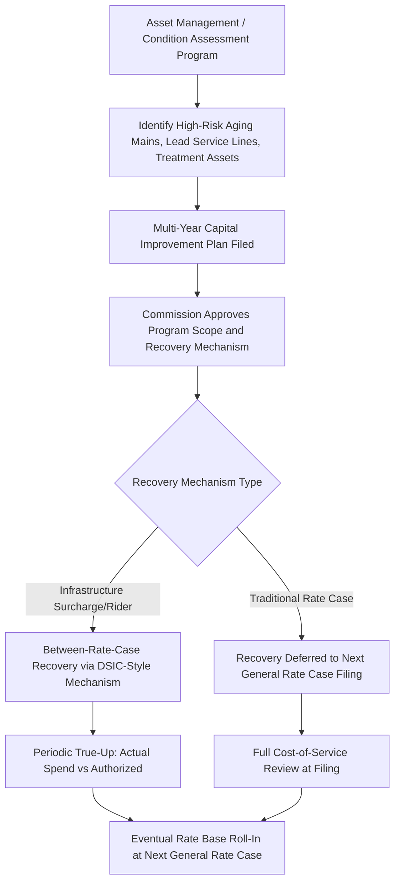

## Water and Wastewater Utility Rate Base and Infrastructure Charges

### Definition and Sector-Specific Context

Water and wastewater utility rate base follows the core cost-of-service ratemaking framework shared with electric and gas utilities, but is distinguished by extremely long-lived, capital-intensive, largely buried infrastructure (often with service lives exceeding 75–100 years for pipe), a comparatively small customer base per utility relative to electric/gas peers, and a regulatory landscape shaped significantly by aging infrastructure replacement needs, water quality compliance mandates, and — for many systems — municipal or investor-owned ownership structures that affect which entities fall under commission jurisdiction at all.

### Core Water/Wastewater Rate Base Components

**Key Points**

- **Source of supply**: Wells, intakes, reservoirs, and raw water rights/infrastructure.
- **Treatment plant**: Water treatment facilities (filtration, disinfection) and wastewater treatment facilities (primary, secondary, tertiary treatment processes).
- **Transmission and distribution mains**: The pipe network moving treated water to customers or wastewater to treatment facilities — typically the largest single rate base category by dollar value, given extensive buried infrastructure.
- **Storage facilities**: Elevated tanks, ground storage reservoirs, and standpipes providing pressure stability and emergency/fire flow capacity.
- **Collection system (wastewater-specific)**: Gravity and force main sewers, lift stations, and related conveyance infrastructure.
- **General plant**: Administrative, meter, and operational support assets.

$$\text{Water/Wastewater Rate Base} = \text{Gross Utility Plant} - \text{Accumulated Depreciation} + \text{Working Capital} - \text{ADIT} - \text{CIAC/Developer Contributions}$$

### Contributions in Aid of Construction: An Outsized Role

**Key Points**

- CIAC plays a substantially larger role in water/wastewater rate base than in electric or gas utilities, because new real estate development frequently requires the developer to construct or fund mains, lift stations, and treatment capacity expansions as a condition of service extension.
- **Developer-contributed assets**: Water and sewer lines built by developers and subsequently dedicated to the utility are recorded at their fair value but typically excluded from rate base (since the utility did not finance them), while still requiring the utility to operate, maintain, and eventually replace them at ratepayer expense once they age.
- **Impact fees / system development charges**: One-time charges assessed on new connections to fund capacity expansion, distinct from CIAC in that they are typically cash payments to the utility rather than constructed assets, and are generally netted against rate base additions similarly to CIAC.

$$\text{Net Rate Base Addition} = \text{Utility-Funded Capital} + (\text{Developer-Contributed Assets} \times 0)$$

[Inference] The zero rate base treatment of developer-contributed assets reflects standard ratemaking practice to avoid the utility earning a return on capital it did not finance, though the exact accounting and disclosure treatment (including whether contributed assets affect depreciation expense calculations even without earning a return) can vary by jurisdiction and should be verified against applicable state commission rules.

### Aging Infrastructure and Replacement Cost Recovery

**Key Points**

- **Distribution System Improvement Charges (DSIC)** or state-equivalent mechanisms: Many states have authorized water-utility-specific infrastructure surcharge mechanisms — conceptually parallel to gas utility infrastructure replacement riders — allowing recovery of aging pipe replacement, lead service line replacement, and similar capital categories between general rate cases.
- **Lead service line replacement**: A significant and federally-driven capital category following EPA's Lead and Copper Rule Improvements, requiring utilities nationwide to inventory and, in many cases, fully replace lead service lines within a federally mandated timeline — creating a large, largely non-discretionary capital program with distinctive prudence review characteristics similar to gas pipeline safety replacement (compelled by federal mandate, generally afforded a presumption of prudence for well-documented, compliant spending, subject to unit cost and pacing scrutiny).
- **Non-revenue water (leak/loss) reduction**: Capital investment in leak detection and main replacement to reduce water loss, increasingly justified both on infrastructure integrity and resource conservation/drought resilience grounds.

$$\text{Non-Revenue Water \%} = \frac{\text{Water Produced} - \text{Water Billed}}{\text{Water Produced}} \times 100$$

### Fire Protection and Public Fire Flow Allocation

**Key Points**

- Water systems are typically sized with substantial excess capacity beyond average or even peak customer demand to provide public fire protection (hydrant flow and pressure), a cost causation category distinct from electric/gas utilities.
- Cost-of-service studies for water utilities commonly include a specific "fire protection" or "public fire" cost allocation category, assigning a share of oversized transmission, storage, and pumping capacity costs to fire protection service — recovered either through general rates, a specific fire protection charge to the municipality, or a blended approach depending on jurisdiction.
- This creates a distinctive rate base sizing consideration: portions of distribution main capacity may be "used and useful" for fire protection purposes even though they exceed what customer demand alone would require, generally accepted as prudent given public safety requirements rather than triggering a used-and-useful exclusion.

### Rate Structure and Infrastructure Charge Interaction

**Example**

Water/wastewater rates typically combine a fixed monthly base charge (recovering meter, billing, and capacity-related fixed costs) with a volumetric usage charge (recovering variable costs and providing conservation price signals), plus — where authorized — a separate infrastructure surcharge line item:

| Rate Component | Cost Recovery Purpose | Rate Base Connection |
| --- | --- | --- |
| Fixed base/meter charge | Customer-related costs, base capacity | Reflects embedded rate base allocated on a customer basis |
| Volumetric/commodity charge | Variable treatment and pumping costs, conservation signal | Reflects marginal operating cost, less directly tied to rate base |
| Infrastructure surcharge (DSIC-style) | Between-rate-case recovery of aging infrastructure replacement | Pre-rate-base recovery mechanism; rolls into rate base at next general rate case |
| Impact/connection fee | New capacity expansion funded by growth | Typically excluded from rate base (CIAC-equivalent treatment) |

### Conservation Rate Design and Revenue Stability Tension

A distinctive tension in water utility ratemaking, less pronounced in electric/gas sectors, arises from the interaction between conservation policy goals and rate base cost recovery:

**Key Points**

- **Declining block or inverted (increasing) block rate structures**: Common water rate designs where per-unit price changes with usage tier — inverted block rates rising with usage to encourage conservation, but creating revenue volatility risk since much of the utility's cost structure is fixed (rate base-driven) while revenue collection remains partly volumetric.
- **Revenue decoupling / water loss adjustment mechanisms**: Some jurisdictions have adopted decoupling mechanisms (conceptually similar to electric utility decoupling) allowing water utilities to true up actual revenue against an authorized revenue requirement, reducing the utility's disincentive to promote conservation and stabilizing recovery of the largely fixed cost structure underlying rate base.
- This tension is structurally similar to (but generally more pronounced than) the gas utility "managed decline" tension discussed in Natural Gas Utility Rate Base and Pipeline Safety Cost Recovery, since water utilities face a persistent conflict between promoting conservation (a widely shared public policy goal, particularly in drought-prone regions) and maintaining stable cost recovery for fixed, rate-base-driven costs.

### Jurisdictional Fragmentation: Municipal, Investor-Owned, and Special District Ownership

**Key Points**

- Unlike electric and gas utilities, which are predominantly regulated investor-owned or cooperative/municipal entities under fairly consistent state commission or federal oversight, water and wastewater service is provided by a highly fragmented mix of investor-owned utilities (subject to full state commission rate regulation), municipal utilities (typically outside state commission jurisdiction, governed instead by local government rate-setting processes), and special districts or authorities (governance varies by state).
- This fragmentation means "rate base" as a formal regulatory ratemaking concept applies most directly to investor-owned water utilities under state commission jurisdiction; municipal systems often use analogous but less formally standardized capital cost recovery and rate-setting approaches, without the same prudence review and used-and-useful evidentiary framework applied in commission proceedings.
- [Unverified — the precise prevalence split between investor-owned, municipal, and special district water/wastewater service nationally, and the specific rate-setting standards applied by municipal utilities in the absence of commission jurisdiction, vary substantially by state and should be verified against current state-specific data rather than assumed uniform.]

### Consolidation and Fair Market Value Acquisition Statutes

**Example**

Many states have adopted "fair market value" (FMV) water/wastewater acquisition statutes, allowing investor-owned utilities acquiring smaller (often struggling or municipally-owned) water/wastewater systems to include the acquisition price — rather than the seller's original cost basis — in rate base, subject to commission approval and public interest review. This departs from the traditional original-cost rate base principle applied elsewhere in utility ratemaking, reflecting a policy judgment that facilitating consolidation of small, undercapitalized systems (which often face compliance and infrastructure challenges) justifies a distinct valuation approach.

[Inference] FMV acquisition premiums approved under these statutes are typically amortized into rate base over an extended period rather than recognized immediately at full acquisition cost, though specific amortization treatment and commission review standards vary by state and should be confirmed against the applicable statute and commission precedent.

### Water Quality Compliance as a Capital Driver

Beyond lead service line replacement, water utilities face ongoing capital investment driven by evolving EPA drinking water standards (e.g., PFAS/"forever chemicals" treatment requirements) and Clean Water Act-driven wastewater treatment upgrade mandates, creating a capital investment profile with similarities to gas pipeline safety cost recovery: substantially compelled by federal/state regulatory mandate, generally afforded prudence deference for compliant spending, but subject to unit cost, technology selection, and pacing scrutiny in rate proceedings.

**Related Topics**

- Electric Utility Rate Base Characteristics
- Natural Gas Utility Rate Base and Pipeline Safety Cost Recovery
- Lead Service Line Replacement and EPA Lead and Copper Rule Compliance
- Distribution System Improvement Charge (DSIC) Mechanisms
- Revenue Decoupling and Conservation Rate Design
- Fair Market Value Acquisition Statutes for Utility Consolidation
- Contributions in Aid of Construction and Developer-Funded Infrastructure
- Non-Revenue Water Reduction Capital Programs