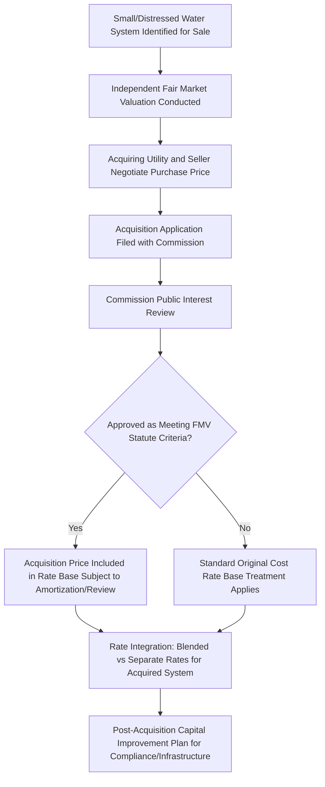

## Consolidation and Acquisition Adjustments in Water Utilities

### Definition and Purpose

Consolidation and acquisition adjustments in water utilities refer to the ratemaking mechanisms governing how the purchase price of an acquired water or wastewater system is reflected in the acquiring utility's rate base, and how the associated costs and benefits are allocated between the acquiring utility's existing ratepayers and the newly acquired system's ratepayers. These adjustments sit at the center of a broader industry trend toward consolidating small, often financially and technically distressed water/wastewater systems into larger investor-owned utilities better positioned to fund compliance, infrastructure replacement, and professional operation.

### The Traditional Original Cost Problem

**Key Points**

- Under traditional original-cost ratemaking, an acquiring utility's rate base for purchased assets would ordinarily be limited to the seller's original, depreciated cost basis — not the price actually paid to acquire the system.
- This creates a structural disincentive to consolidation: if a small, distressed system is acquired for a price exceeding its depreciated original cost (common where the seller's infrastructure has significant unrecorded deferred maintenance needs, or where acquisition price reflects going-concern and compliance value rather than historical book value), the acquiring utility cannot recover the premium through rates under strict original-cost principles.
- Small systems facing this disincentive to attract a willing, capable acquirer often continue operating with inadequate capital investment, water quality violations, or financial distress — the precise outcome consolidation policy seeks to avoid.

$$\text{Acquisition Premium} = \text{Purchase Price} - \text{Seller's Depreciated Original Cost Basis}$$

### Fair Market Value (FMV) Acquisition Statutes

**Key Points**

- Many states have adopted specific statutory frameworks — commonly termed "Fair Market Value" or "Act 12"-style statutes (following Pennsylvania's influential early adoption) — authorizing commissions to include the acquisition price, rather than strict original cost, in the acquiring utility's rate base for qualifying water/wastewater system purchases.
- These statutes typically apply to acquisitions of small, often municipally-owned or investor-owned systems meeting specified size thresholds, reflecting a policy judgment that facilitating consolidation of undercapitalized small systems justifies departing from strict original-cost ratemaking principles.
- FMV treatment is usually conditioned on commission review and approval of the acquisition as being in the public interest, rather than being automatic upon any qualifying transaction.

### Valuation Methodology

**Example**

Fair market value determinations typically rely on one or more of three standard valuation approaches, often reconciled through an independent appraisal required or encouraged under the applicable statute:

1. **Cost approach**: Estimated replacement cost new, less depreciation — often produces a higher value than original cost for older systems given inflation in construction costs over time.
2. **Income approach**: Present value of the acquired system's projected future cash flows under anticipated post-acquisition rates.
3. **Market/comparable sales approach**: Value derived from recent comparable water/wastewater system transactions, where sufficient comparable transaction data exists.

[Inference] The specific weighting among these three approaches, and whether a single independent appraiser or multiple competing appraisals are required, varies by state statute and commission rule, and the applicable methodology should be verified against the specific state's FMV acquisition statute and implementing regulations rather than assumed uniform.

### Acquisition Adjustment and Amortization Treatment

The "acquisition adjustment" is the ratemaking term for the difference between the approved fair market value and the seller's original cost basis once included in rate base — distinct from a simple one-time inclusion, because most FMV statutes require the premium to be treated as a separate, trackable regulatory asset:

$$\text{Rate Base Treatment} = \text{Seller's Original Cost Basis (standard depreciation)} + \text{Acquisition Adjustment (separately amortized)}$$

**Key Points**

- **Amortization period**: The acquisition adjustment (premium) is typically amortized over an extended period specified by statute or commission order, rather than recovered immediately, spreading the ratepayer cost impact over time.
- **Return treatment on the adjustment**: Some jurisdictions allow the acquiring utility to earn a return on the unamortized acquisition adjustment balance in addition to amortization expense recovery; others limit recovery to amortization only, without an accompanying return — a materially different economic outcome for the acquiring utility that affects the attractiveness of pursuing FMV-eligible acquisitions.
- **Negative acquisition adjustments**: Where purchase price is below original cost basis (less common but possible for certain distressed system acquisitions), the adjustment reduces rather than increases rate base, with corresponding ratepayer benefit.

### Rate Integration: Blended vs. Separate Rate Treatment

A central post-acquisition ratemaking question is how the acquired system's customers and the acquiring utility's pre-existing customers are rate-integrated:

**Example**

| Approach | Mechanism | Effect |
| --- | --- | --- |
| Single tariff / full consolidation | Acquired system customers immediately transition to the acquiring utility's existing rate schedule | Acquired system customers may see significant rate changes (often increases, given typically higher-quality but higher-cost service); existing customers may see modest rate base dilution effects |
| Phased-in rate integration | Acquired system rates gradually converge toward the acquiring utility's system-wide rates over a multi-year transition period | Smooths rate impact for acquired customers; delays full single-tariff pricing benefits |
| Separate rate zone (long-term) | Acquired system remains a distinct rate zone indefinitely, priced based on its own cost-of-service | Preserves cost-causation alignment between the acquired system's specific costs and its customers, but forgoes economies of scale/system-wide rate averaging benefits |

[Unverified — the prevalence of each rate integration approach and any statutory preference for one method over another varies by state, and several states' FMV statutes explicitly address (or leave to commission discretion) the rate integration methodology; this should be checked against the specific state's statute and commission precedent.]

### Post-Acquisition Capital Improvement Obligations

**Key Points**

- FMV acquisition approvals frequently include, or are conditioned upon, a commitment by the acquiring utility to a defined post-acquisition capital improvement plan addressing the deferred maintenance, compliance deficiencies, or infrastructure condition issues that often motivated the sale in the first place.
- This capital improvement obligation is distinct from, but closely related to, the acquisition adjustment itself — the acquiring utility may seek separate rate base recovery for genuinely new capital investment made after acquisition, following standard used-and-useful and prudence review, layered on top of the acquisition adjustment for the purchase price premium itself.
- Commission review of acquisition applications often weighs the acquiring utility's demonstrated technical, financial, and managerial capacity to remediate the acquired system's condition as a public interest factor, particularly for systems with documented water quality violations or regulatory compliance history.

### Policy Rationale and Ratepayer Protection Tension

**Key Points**

- **Consolidation benefit rationale**: Proponents argue FMV acquisition statutes enable struggling small systems — often lacking economies of scale, technical expertise, or capital access — to be absorbed into larger, better-capitalized utilities, improving long-term service quality and compliance for the acquired system's customers.
- **Existing ratepayer protection concern**: Consumer advocates and existing ratepayers of the acquiring utility may raise concerns that FMV-based rate base inclusion effectively socializes acquisition costs (and the premium above original cost) across a broader customer base, diluting the direct cost-causation link between specific infrastructure and the customers it serves.
- **New (acquired) ratepayer protection concern**: Customers of the acquired system may face rate increases upon transition to the acquiring utility's rate structure, particularly where the acquired system's previous rates were held artificially low (contributing to the deferred maintenance and financial distress that motivated the sale) — creating a distinct ratepayer protection question for the acquired system's customer base specifically.

This dual ratepayer-protection tension mirrors, structurally, the cost-shifting concerns addressed in Cost Shifting Analysis and Ratepayer Protection Studies for large electric loads, though applied to a different sector-specific consolidation context: in both cases, regulators must evaluate whether a specific customer group's rate treatment appropriately reflects cost causation rather than either subsidizing or being subsidized by another customer group.

### Contrast with Developer-Contributed Asset Treatment

FMV acquisition adjustment treatment stands in notable contrast to the standard treatment of developer-contributed assets discussed in Water and Wastewater Utility Rate Base and Infrastructure Charges, where contributed infrastructure is generally excluded from rate base entirely since the utility did not finance it. FMV acquisitions, by contrast, involve the acquiring utility actually paying a purchase price (even if above original cost basis), providing the underlying economic justification — actual capital outlay by the utility — for rate base inclusion that developer contributions lack.

**Related Topics**

- Water and Wastewater Utility Rate Base and Infrastructure Charges
- Used and Useful Standard and Prudence Review
- Cost Shifting Analysis and Ratepayer Protection Studies
- Rate Integration Methodology for Merged Utility Systems
- Regulatory Asset Amortization Treatment and Return Allowance
- Public Interest Standard in Utility Acquisition Approval Proceedings
- Small System Compliance and Capital Access Challenges