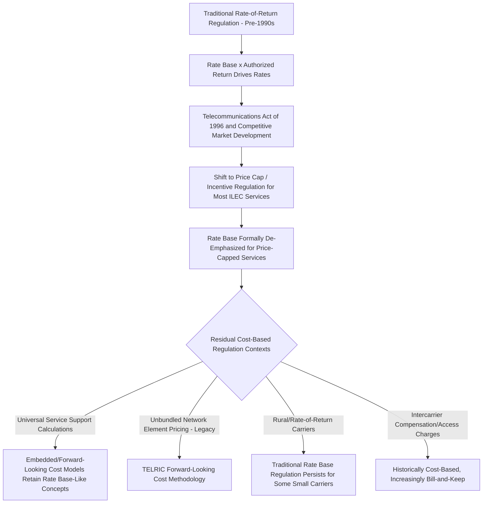

## Telecommunications Rate Base Legacy Considerations

### Definition and Historical Context

Telecommunications rate base legacy considerations refer to the distinctive ratemaking issues arising from the telecommunications sector's transition away from traditional rate-of-return, cost-of-service regulation toward price cap and incentive regulation, and the residual rate base concepts that persist for the shrinking subset of services and carriers still subject to some form of cost-based regulation. Unlike electric, gas, and water utilities — which remain predominantly rate-base/rate-of-return regulated — the telecommunications sector underwent a fundamental regulatory paradigm shift beginning in the 1980s-1990s, making "rate base" a substantially legacy concept in this sector rather than the primary ongoing ratemaking mechanism.

### The Shift from Rate-of-Return to Price Cap Regulation

**Key Points**

- **Traditional rate-of-return regulation**: Historically, local exchange carriers (LECs) were regulated similarly to electric/gas utilities — rate base valued at original cost less depreciation, earning a commission-authorized rate of return, with revenue requirement flowing through to regulated rates.
- **Price cap regulation**: Beginning in the late 1980s and accelerating through the 1990s, both the FCC (for interstate services) and most state commissions (for intrastate services) shifted incumbent local exchange carriers (ILECs) to price cap regulation, which caps the rate of change in prices (often indexed to inflation minus a productivity offset) rather than directly regulating earnings or rate base.
- **Rationale for the shift**: Price cap regulation was intended to incentivize efficiency (since a carrier could retain earnings above the rate-of-return-implied level by controlling costs, unlike traditional cost-of-service regulation which provided limited efficiency incentive) and to reduce the regulatory burden of detailed rate base and cost allocation litigation in an increasingly competitive market.
- Under price cap regulation, rate base as a formal, actively-litigated ratemaking input largely disappears from the ongoing rate-setting process, since rates are set by formula/index rather than derived from a current cost-of-service calculation.

### Residual Rate-of-Return Regulation for Rural Carriers

**Key Points**

- A meaningful subset of smaller, primarily rural incumbent local exchange carriers remained under traditional rate-of-return regulation even as larger ILECs transitioned to price caps, reflecting a policy judgment that rural carriers serving low-density areas with limited competitive pressure warranted continued cost-based oversight and universal service support tied to actual cost recovery.
- For these carriers, rate base concepts analogous to electric/gas/water utility ratemaking persist, including original cost valuation, accumulated depreciation, and a commission or FCC-authorized rate of return — though FCC rate-of-return regulation for rural carriers has itself undergone significant reform, including a shift toward increased use of the Alternative Connect America Cost Model (A-CAM) for universal service support calculation rather than embedded (actual historical) cost-based support for many participating carriers.
- [Inference] The specific mix of carriers remaining under traditional embedded-cost rate-of-return regulation versus those electing model-based (A-CAM-style) support calculation has continued to shift over time as FCC universal service reform proceedings evolve, and the current landscape should be verified against current FCC universal service fund rules rather than assumed static.

### TELRIC and Forward-Looking Cost Methodology

**Key Points**

- A historically significant and analytically distinctive telecommunications ratemaking concept is Total Element Long-Run Incremental Cost (TELRIC) methodology, developed under the Telecommunications Act of 1996's unbundled network element (UNE) pricing framework, requiring incumbent carriers to lease specific network elements to competitors at cost-based rates.
- TELRIC diverges fundamentally from traditional embedded/original-cost rate base valuation: rather than valuing the carrier's actual historical investment, TELRIC prices network elements based on the forward-looking cost of building an efficient, hypothetical network using current technology to provide the same functionality — a "what would it cost to build this most efficiently today" standard rather than "what did it actually cost historically."
- This forward-looking cost framework generated extensive litigation and Supreme Court review (notably *Verizon Communications Inc. v. FCC*, 2002, upholding the FCC's authority to use forward-looking cost methodology), given the significant divergence forward-looking costs could produce relative to embedded costs, particularly for legacy copper-based infrastructure being priced as if built with current, often lower-cost technology.
- [Unverified — the practical scope of ongoing TELRIC-based UNE pricing has narrowed substantially as competitive dynamics, technology migration away from legacy copper/TDM infrastructure, and subsequent FCC deregulation of certain UNE categories have evolved; the current applicability of TELRIC pricing to specific network elements should be checked against current FCC rules rather than assumed to reflect the framework's original 1996-era scope.]

### Copper-to-Fiber Transition and Legacy Asset Retirement

**Example**

A significant legacy rate base consideration for incumbent carriers still subject to any form of cost-based regulation involves the treatment of legacy copper plant being retired and replaced with fiber infrastructure:

- **Accelerated depreciation of legacy copper assets**: Some carriers have sought (and in some cases received) regulatory approval for accelerated depreciation schedules for copper plant facing near-term retirement due to fiber overbuild, reducing potential stranded cost exposure by recovering remaining book value faster than originally scheduled depreciation would allow.
- **Retirement and removal cost treatment**: Costs associated with physically retiring copper infrastructure (removal, disposal) versus simply abandoning it in place raise distinct cost recovery questions, with treatment varying based on whether the carrier remains under any residual rate base regulation for the relevant service.
- **FCC copper retirement notification rules**: Separate from ratemaking treatment, FCC rules govern the process and customer notification requirements for copper network retirement, reflecting both competitive and service-continuity policy concerns distinct from the cost recovery question itself.

$$\text{Legacy Asset Stranded Cost Exposure} = \text{Net Book Value of Retired Copper Plant} - \text{Accelerated Recovery Achieved Pre-Retirement}$$

### Universal Service Fund Support and Cost Model-Based Calculations

**Key Points**

- Federal and state Universal Service Fund (USF) mechanisms provide subsidy support to carriers serving high-cost areas, historically calculated in some contexts using embedded cost data (a rate-base-adjacent concept) but increasingly transitioning toward forward-looking cost model calculations (such as the Connect America Cost Model / A-CAM framework) that estimate the cost of an efficient network build rather than relying on each carrier's actual historical costs.
- This shift parallels, conceptually, the broader telecommunications sector movement away from embedded/original-cost regulatory concepts toward forward-looking, model-based, or incentive-based mechanisms — reinforcing that "rate base" in the traditional utility ratemaking sense is a substantially legacy concept for most telecommunications services, persisting meaningfully only in narrower residual contexts (certain rural rate-of-return carriers, and historically for UNE pricing).

### Intercarrier Compensation and Access Charge Reform

**Key Points**

- Historically, interstate and intrastate access charges (paid by long-distance/interexchange carriers to local exchange carriers for originating/terminating calls) were calculated using cost-based methodologies with rate-base-like characteristics.
- The FCC's intercarrier compensation reform (particularly the 2011 USF/ICC Transformation Order) initiated a substantial, multi-year transition of access charges toward "bill-and-keep" arrangements — where carriers generally do not charge each other for terminating traffic — further diminishing the ongoing relevance of cost-based/rate-base ratemaking concepts in this sector.
- [Unverified — the current status and remaining scope of any transitional or residual access charge cost-based mechanisms should be verified against current FCC rules, given the extended, multi-year transition timeline originally established and subsequent rule modifications.]

### Comparative Sector Positioning

**Example**

| Sector | Primary Regulatory Model | Rate Base Relevance Today |
| --- | --- | --- |
| Electric | Rate-of-return / cost-of-service (with growing formula rate use for transmission) | Central, actively litigated ongoing concept |
| Natural Gas | Rate-of-return / cost-of-service, with infrastructure replacement riders | Central, actively litigated ongoing concept |
| Water/Wastewater | Rate-of-return / cost-of-service | Central, actively litigated ongoing concept |
| Telecommunications (large ILECs) | Price cap / incentive regulation | Largely legacy; not the primary ongoing ratemaking input |
| Telecommunications (rural rate-of-return carriers) | Residual rate-of-return regulation, increasingly model-based USF support | Persists for a narrowing carrier subset |

### Why This Matters for Comparative Ratemaking Study

**Key Points**

- Telecommunications rate base legacy considerations serve as an instructive contrast case within a broader regulatory ratemaking curriculum: the sector illustrates what happens to rate base as a regulatory concept once a formerly monopoly utility service becomes subject to meaningful competitive pressure and policy determinations that direct cost-based regulation is no longer the optimal regulatory tool.
- This contrast is analytically relevant to ongoing debates in other utility sectors (e.g., electric utility restructuring/deregulation of generation in some states, discussed implicitly in Electric Utility Rate Base Characteristics' generation segment) about when and whether cost-of-service rate base regulation remains the appropriate model versus alternative approaches such as price caps, performance-based ratemaking, or fully competitive market structures.

**Related Topics**

- Electric Utility Rate Base Characteristics
- Price Cap and Incentive Regulation Design
- TELRIC Forward-Looking Cost Methodology and Legal History
- Universal Service Fund Support Mechanisms and A-CAM
- Copper-to-Fiber Network Transition and Stranded Asset Treatment
- Intercarrier Compensation and Access Charge Reform
- Performance-Based Ratemaking as an Alternative to Traditional Rate Base Regulation