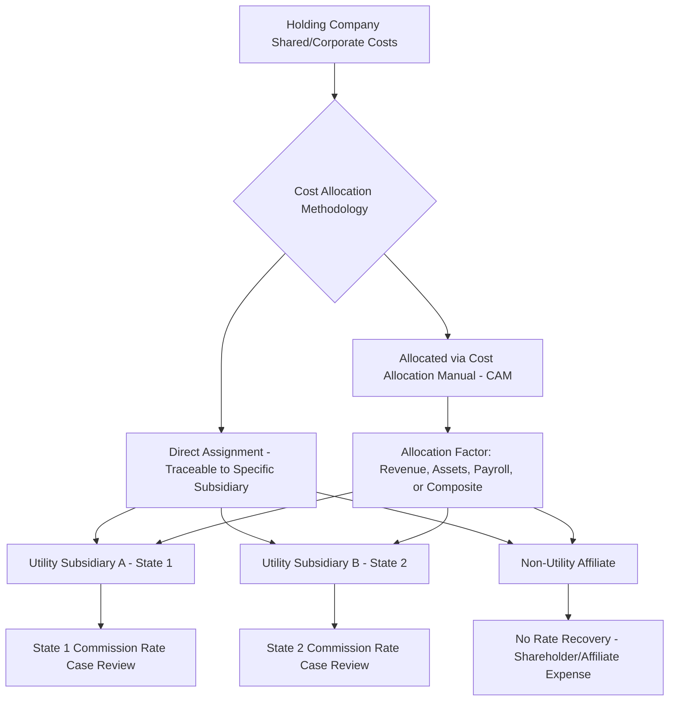

## Multi Jurisdictional and Holding Company Allocation Issues

### Definition and Regulatory Context

Multi-jurisdictional and holding company allocation issues arise when a utility, or a holding company with multiple utility and non-utility subsidiaries, incurs shared costs that must be divided among several regulatory jurisdictions (multiple state commissions, and/or state versus FERC jurisdiction) or between regulated and unregulated business lines. These allocation determinations directly affect rate base and revenue requirement in each affected jurisdiction, since a cost misallocated toward a regulated jurisdiction inappropriately shifts what should be shareholder or unregulated-affiliate expense onto captive ratepayers, while under-allocation to a jurisdiction can deny the utility legitimate cost recovery.

### Sources of Multi-Jurisdictional Cost Sharing

**Key Points**

- **Multi-state utility operations**: A single utility operating company serving customers across state lines (common for gas and electric utilities with service territories that don't respect state boundaries) must allocate its total cost of service between each state's jurisdiction.
- **State vs. federal (FERC) jurisdiction**: For electric utilities, generation and distribution are generally state-jurisdictional while wholesale transmission and wholesale power sales are FERC-jurisdictional, requiring a jurisdictional cost split even within a single vertically integrated utility operating in one state.
- **Holding company shared services**: A parent holding company with multiple utility subsidiaries (potentially in different states) and non-utility affiliates (unregulated generation, telecommunications ventures, or other diversified businesses) typically centralizes certain functions — executive management, IT, HR, accounting, legal, procurement — in a shared services organization, requiring cost allocation to each subsidiary and business line.

### Cost Allocation Manuals (CAMs)

**Key Points**

- Most multi-jurisdictional utilities and holding companies operate under a formal Cost Allocation Manual, typically filed with and subject to approval or review by relevant regulators, documenting the methodology used to assign shared and common costs across affiliates and jurisdictions.
- **Direct assignment (preferred where feasible)**: Costs specifically traceable to a single subsidiary or jurisdiction are assigned directly rather than allocated via a formula, since direct assignment most precisely reflects actual cost causation.
- **Allocated (indirect) costs**: Costs genuinely shared across multiple entities (e.g., a centralized customer service call center serving multiple state utility subsidiaries) require an allocation factor or formula, since no direct tracing is feasible.
- **Common allocation factors**: Revenue-based, asset-based (net plant or total assets), payroll/headcount-based, or a composite ("Massachusetts formula"-style blend of multiple factors) allocator, chosen to reasonably approximate the relative cost-causation share attributable to each entity.

$$\text{Allocated Cost}_{i} = \text{Total Shared Cost} \times \frac{\text{Allocation Factor}_i}{\sum_{j} \text{Allocation Factor}_j}$$

### Affiliate Transaction Rules and Cross-Subsidization Prevention

**Key Points**

- **Affiliate transaction rules**: Most state commissions maintain specific rules governing transactions between a regulated utility and its non-utility affiliates, requiring transactions to occur at cost or fair market value (whichever is lower, from the ratepayer-protective perspective, depending on whether the utility is buying from or selling to the affiliate) to prevent the regulated utility from subsidizing an unregulated affiliate's operations.
- **Cross-subsidization risk**: The core ratepayer protection concern underlying all multi-jurisdictional and affiliate cost allocation regulation — that costs properly belonging to an unregulated business line, or to a different state's jurisdiction, are inappropriately loaded onto a captive regulated ratepayer base that lacks the competitive market discipline to reject unreasonable costs.
- **Code of conduct requirements**: Many jurisdictions require holding companies to maintain formal codes of conduct governing interactions between regulated utility personnel and non-utility affiliate personnel, including restrictions on information sharing, shared branding costs, and cross-marketing arrangements, to reinforce the structural separation underlying cost allocation integrity.

### Jurisdictional Cost Allocation for Multi-State Utility Operations

**Example**

A gas or electric utility operating company serving customers in two states must allocate its total system cost of service (generation/supply, transmission, common distribution infrastructure, and corporate overhead) between the two states' rate base and revenue requirement calculations. Common allocation approaches include:

1. **Demand-based allocation**: Allocating capacity-related costs based on each state's contribution to coincident system peak demand.
2. **Energy-based allocation**: Allocating variable/energy-related costs based on each state's share of total energy sales or throughput.
3. **Customer-based allocation**: Allocating customer-related costs (metering, billing, service connections) based on each state's share of total customer count.
4. **Composite/blended allocators**: Combining demand, energy, and customer factors (weighted) for costs that don't cleanly fit a single causation category.

[Inference] The specific allocator or combination of allocators used for a given multi-state utility's jurisdictional cost split is typically established through negotiated settlement or litigated determination in each state's rate case process, and does not follow a single uniform national standard — different states served by the same utility may even apply differing allocation methodologies to the same shared cost pool, reflecting each state commission's independent jurisdiction over the allocation question as it affects that state's ratepayers.

### Interaction with FERC Jurisdiction

**Key Points**

- For vertically integrated electric utilities, the state/FERC jurisdictional boundary itself requires an allocation methodology, since generation and transmission plant may serve both retail (state-jurisdictional) and wholesale (FERC-jurisdictional) customers from shared physical assets.
- FERC's jurisdiction over wholesale transmission service and wholesale power sales, combined with state jurisdiction over retail generation and distribution rates, means a single piece of shared infrastructure (e.g., a generating plant serving both retail native load and wholesale power sale obligations) requires a jurisdictional separation methodology to determine what share of its rate base and costs are recovered through FERC-jurisdictional wholesale rates versus state-jurisdictional retail rates.
- This jurisdictional separation exercise has direct relevance to the transmission rate base and cost allocation topics covered elsewhere in this curriculum (see the "Transmission Rate Base and Cost Allocation" chapter), since transmission-specific formula rates under FERC OATT tariffs represent one segment of this broader jurisdictional allocation framework.

### Holding Company Diversification and Ring-Fencing

**Example**

Holding companies with significant unregulated business lines (competitive generation, energy trading, telecommunications, or unrelated diversified ventures) face heightened regulatory scrutiny regarding whether the regulated utility subsidiary's financial and operational integrity is adequately protected — "ring-fenced" — from risks in the unregulated businesses:

- **Financial ring-fencing conditions**: Commission-imposed conditions (often attached to holding company formation or merger approvals) limiting the regulated utility's ability to guarantee unregulated affiliate debt, restricting dividend upstreaming that could impair the utility's financial health, or requiring separate capital structure maintenance for the regulated subsidiary.
- **Credit rating and cost of capital implications**: A holding company's overall risk profile — including unregulated business line risk — can affect the regulated utility subsidiary's cost of debt and equity even where ring-fencing is nominally in place, creating an ongoing rate case dispute area regarding whether the utility's authorized cost of capital appropriately reflects only the regulated utility's own risk profile rather than the consolidated holding company's broader risk.
- This financial ring-fencing concept is analytically related to, but operationally distinct from, the cost ring-fencing discussed in Collateral Requirements and Cost Ring Fencing for large electric loads — both use "ring-fencing" terminology to describe structural isolation of financial risk from the general ratepayer base, but one addresses affiliate/holding-company risk while the other addresses individual large-customer default risk.

### Multi-Jurisdictional Rate Case Coordination Challenges

**Key Points**

- **Inconsistent test years and cost allocation timing**: Different states served by the same multi-state utility may operate on different rate case filing schedules and test year conventions, creating practical challenges in presenting a consistent, defensible jurisdictional cost allocation across simultaneous or near-simultaneous proceedings in different states.
- **Single-issue vs. comprehensive allocation litigation**: Some states may accept a utility's holding-company-level cost allocation manual as presumptively reasonable absent specific objection, while others require the utility to affirmatively justify the allocation methodology and resulting cost assignment in each rate case — creating materially different evidentiary burdens depending on jurisdiction.
- **Audit and true-up mechanisms**: Given the complexity and ongoing nature of shared cost allocation, some jurisdictions require periodic audits of holding company cost allocation practices, separate from the standard rate case cycle, to verify that actual allocated costs continue to reasonably reflect the approved CAM methodology over time.

### Regulatory Asset and Rate Base Segregation Requirements

**Key Points**

- Beyond operating cost allocation, jurisdictional and holding company issues extend to rate base itself: shared assets (particularly IT systems, corporate headquarters facilities, or centralized service center infrastructure) must have their capital cost — and resulting rate base inclusion — allocated across the jurisdictions and entities benefiting from the asset, following the same direct assignment vs. allocated cost principles applied to operating expenses.
- Segregated regulatory accounting, similar to the mechanisms discussed for large-load ring fencing, is frequently required for multi-jurisdictional utilities to demonstrate ongoing compliance with approved jurisdictional and affiliate allocation methodologies, supporting each jurisdiction's independent audit and rate case review authority over the portion of shared costs allocated to it.

**Related Topics**

- Electric Utility Rate Base Characteristics
- Transmission Rate Base and Cost Allocation (State vs. Regional Disputes)
- Collateral Requirements and Cost Ring Fencing
- Affiliate Transaction Rules and Code of Conduct Requirements
- Cost of Capital Determination for Multi-Business Holding Companies
- Used and Useful Standard and Prudence Review
- Formula Rate Design for FERC-Jurisdictional Transmission