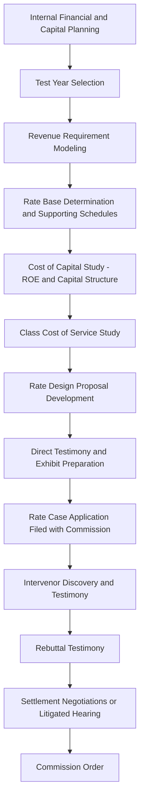

## Utility Rate Case Preparation and Strategy

### Definition and Strategic Framing

Utility rate case preparation and strategy encompasses the internal analytical, procedural, and advocacy planning a utility undertakes before and during a general rate case filing — the formal regulatory proceeding in which a utility seeks commission approval of its revenue requirement, rate base, cost of capital, and resulting rate design. Effective rate case strategy integrates financial planning, regulatory policy positioning, and litigation readiness, since a rate case functions simultaneously as a quasi-judicial evidentiary proceeding and a multi-stakeholder negotiation.

### Pre-Filing Planning Phase

**Key Points**

- **Test year selection**: Determining whether to use a historical, current, or future/forecast test year (see Electric Utility Rate Base Characteristics), a foundational strategic choice affecting how recent capital additions, load growth, and cost trends are reflected in the filed revenue requirement.
- **Rate case timing**: Utilities weigh regulatory lag, capital investment cycles, anticipated cost pressures (fuel, purchased power, inflation), and political/rate-shock sensitivity in choosing when to file, since filing too early may leave legitimate costs unrecovered while filing too late compounds regulatory lag.
- **Attrition and interim rate relief considerations**: In jurisdictions with significant regulatory lag between test year and rate effectiveness, utilities may evaluate attrition adjustments or interim rate mechanisms to bridge the gap between the test year snapshot and actual conditions when new rates take effect.
- **Multi-year rate plans**: Some utilities pursue multi-year rate plans (MYRPs) rather than single-test-year cases, trading a longer commitment period and formulaic annual adjustments for reduced rate case frequency and more predictable capital cost recovery — a strategic choice with significant implications for both administrative burden and earnings predictability.

### Revenue Requirement and Rate Base Documentation

**Key Points**

- **Supporting schedules and workpapers**: Rate case filings require extensive, auditable documentation supporting every component of the proposed rate base and revenue requirement — plant additions, depreciation calculations, working capital, ADIT, and operating expense forecasts — since intervenors and commission staff will scrutinize the calculation methodology and underlying data.
- **Known and measurable adjustments**: For historical test years, utilities must identify and support adjustments for changes occurring after the test year but reasonably certain to affect costs by the time new rates take effect, a frequent area of litigation regarding what qualifies as sufficiently "known and measurable."
- **Pro forma adjustments**: Normalizing test year data for non-recurring items, weather effects, and other anomalies to present a representative ongoing cost level, requiring careful justification to withstand intervenor challenge that an adjustment inappropriately excludes a cost the utility will actually incur or inappropriately includes a cost that won't recur.

### Cost of Capital and Return on Equity Strategy

$$\text{Weighted Average Cost of Capital} = (w_{debt} \times r_{debt}) + (w_{equity} \times r_{equity})$$

**Key Points**

- **Capital structure proposal**: Utilities typically propose an actual or hypothetical capital structure (debt/equity ratio) supporting the requested rate of return, balancing the higher cost of equity against the financial stability benefits of a stronger equity ratio.
- **ROE benchmarking studies**: Utilities commission expert testimony presenting comparable-company analyses (Discounted Cash Flow, Capital Asset Pricing Model, risk premium, and comparable earnings methodologies) to support a proposed return on equity, anticipating that commission staff and intervenors will present competing analyses often recommending a lower ROE.
- **Risk factor documentation**: Utilities strategically document company-specific and industry risk factors (regulatory lag, commodity exposure, capital intensity, credit metrics) supporting their requested ROE and capital structure, since ROE determinations are inherently comparative and judgment-laden rather than mechanically calculated.

### Class Cost of Service and Rate Design Strategy

**Key Points**

- **Class cost of service study (CCOSS) methodology selection**: The choice of demand allocation methodology (e.g., coincident peak, non-coincident peak, average and excess demand) can materially shift cost responsibility between customer classes, making CCOSS methodology itself a frequent point of litigation distinct from the underlying revenue requirement determination.
- **Gradualism and rate shock mitigation**: Utilities often propose phased rate increases or moderation mechanisms for classes facing disproportionate cost-of-service-indicated increases, balancing cost-causation accuracy against political and customer-relations sensitivity to sudden large rate changes.
- **Large load and special class considerations**: Where applicable, rate case strategy must account for dedicated large-load tariff classes (see Dedicated Large Load and Data Center Tariff Design) and their distinct minimum take-or-pay, collateral, and cost allocation treatment, ensuring consistency between the general rate case's overall revenue requirement and any separately-approved large-load tariff mechanisms.

### Testimony and Witness Strategy

**Example**

A typical utility rate case testimony panel includes distinct subject-matter witnesses, each responsible for a discrete portion of the case:

| Witness Role | Subject Matter | Strategic Function |
| --- | --- | --- |
| Policy/Overview witness | Overall case rationale, revenue requirement summary | Frames the narrative for the commission and public |
| Rate base/accounting witness | Plant additions, depreciation, working capital | Supports the quantitative rate base determination |
| Cost of capital witness | ROE, capital structure | Defends the return components against intervenor rebuttal |
| Class cost of service witness | Cost allocation methodology and results | Supports proposed rate design and class allocation |
| Rate design witness | Specific tariff and rate schedule proposals | Translates approved revenue requirement into customer-facing rates |
| Operational/technical witnesses | System reliability, safety programs, specific capital programs | Supports prudence of specific investment categories under scrutiny |

Testimony sequencing (direct, intervenor, rebuttal) requires strategic coordination to ensure the utility's witnesses adequately address anticipated intervenor criticisms without appearing reactive or under-prepared in initial direct filings.

### Discovery and Evidentiary Process Management

**Key Points**

- **Discovery response management**: Rate cases generate extensive data requests from commission staff and intervenors; efficient, complete, and consistent discovery responses are both a procedural obligation and a strategic credibility factor — inconsistent or evasive responses can undermine the utility's overall case credibility even on unrelated issues.
- **Settlement negotiation posture**: Many rate cases resolve via negotiated settlement rather than full litigation; utilities must strategically calibrate initial filed positions (revenue requirement ask, ROE request) anticipating settlement dynamics, since an aggressive initial ask may provide negotiating room but risks credibility and public relations costs if perceived as unreasonable.
- **Selective litigation of contested issues**: Even within a broader settlement framework, certain issues (e.g., a specific large capital program's prudence, or a contested cost allocation methodology) may be carved out for continued litigation while other elements settle, requiring strategic issue prioritization.

### Stakeholder and Public Engagement Strategy

**Key Points**

- **Public comment and hearing management**: Rate cases often include public comment hearings where residential customers and community stakeholders voice concerns; utility strategy typically includes proactive public communication explaining the rationale for requested increases, particularly for cases involving significant capital programs (e.g., pipeline safety replacement, grid modernization, or large-load-driven infrastructure).
- **Coalition and intervenor relationship management**: Utilities frequently engage proactively with anticipated intervenors (consumer advocates, industrial customer groups, environmental organizations, low-income advocates) prior to or during filing, seeking early alignment on less-contested issues to narrow the scope of full litigation to genuinely disputed matters.
- **Legislative and policy alignment**: Where a rate case implicates broader policy questions (large-load cost shifting, decarbonization-driven capital investment, affordability), utility strategy often coordinates rate case positioning with parallel legislative or policy advocacy to present a consistent narrative across venues.

### Post-Order Compliance and Implementation

**Key Points**

- **Compliance filing preparation**: Following a commission order, utilities must prepare detailed compliance filings translating the approved revenue requirement and cost allocation into specific tariff sheets and rate schedules, subject to further commission review for consistency with the underlying order.
- **Appeal considerations**: Utilities (and intervenors) evaluate whether specific unfavorable determinations warrant appeal to state courts, weighing litigation cost and duration against the financial significance of the disputed issue and the likelihood of success on appeal given the deferential standard of review typically applied to commission rate determinations.
- **Next-cycle planning**: Rate case strategy is inherently iterative — outcomes, commission commentary, and unresolved issues from one case inform planning for the utility's next filing, including whether specific methodological disputes (ROE methodology, CCOSS allocation factors, large-load treatment) require additional evidentiary development before the next proceeding.

**Related Topics**

- Electric Utility Rate Base Characteristics
- Cost of Capital and Return on Equity Determination Methodology
- Class Cost-of-Service Studies and Rate Design Methodology
- Multi-Year Rate Plans and Performance-Based Ratemaking
- Intervenor Roles: Consumer Advocates, Industrial Groups, and Public Interest Organizations
- Settlement Negotiation Dynamics in Regulatory Proceedings
- Dedicated Large Load and Data Center Tariff Design