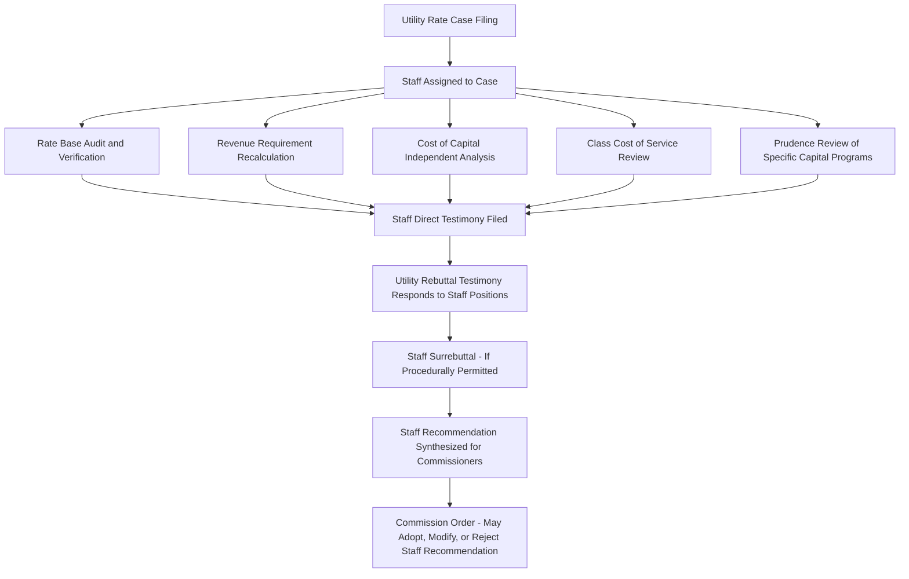

## Commission Staff Analysis and Recommendations

### Definition and Institutional Role

Commission staff analysis and recommendations refer to the independent technical, financial, and policy review conducted by a public utility commission's own professional staff — analysts, accountants, engineers, and economists employed by or contracted to the commission — as a distinct party or advisory function within a rate case or other regulatory proceeding. Staff occupies a structurally unique position: neither advocating for the utility nor formally representing ratepayer interests in the same manner as a consumer advocate intervenor, but instead providing the commissioners with independent technical analysis intended to inform their ultimate decision-making.

### Staff's Institutional Position Relative to Other Parties

**Key Points**

- **Independent technical reviewer**: Staff's core function is to independently verify, test, and where warranted, challenge the utility's filed revenue requirement, rate base, cost of capital, and rate design proposals using the commission's own analytical resources rather than relying solely on the utility's or intervenors' presented evidence.
- **Party status variation by jurisdiction**: In some states, commission staff formally participates as a party to the proceeding (filing testimony, participating in discovery, subject to cross-examination) with recommendations that carry evidentiary weight but are not binding on the commissioners; in other jurisdictions, staff functions in a more advisory capacity to the commissioners directly, with a different procedural relationship to the evidentiary record.
- **Separation from commissioners' decision-making**: Even where staff formally participates as a party, most jurisdictions maintain procedural and ethical separation (ex parte communication rules) between staff's advocacy role in the proceeding and any separate advisory role staff may have directly to the commissioners, to preserve the integrity of the commissioners' independent decision-making function.

[Inference] The precise institutional structure — whether staff functions as a formal litigating party, a neutral technical advisor to the commission, or some hybrid arrangement — varies significantly across states and should be verified against each specific commission's procedural rules rather than assumed uniform.

### Core Areas of Staff Technical Review

**Key Points**

- **Rate base audit**: Staff independently verifies plant addition documentation, depreciation calculations, working capital allowances, and ADIT computations, often identifying calculation errors, unsupported adjustments, or classification disputes (e.g., whether an asset is properly used-and-useful) distinct from issues raised by other intervenors.
- **Revenue requirement recalculation**: Staff typically builds its own independent revenue requirement model rather than simply auditing the utility's model, enabling staff to test the sensitivity of the overall result to specific contested assumptions and present the commission with a clear staff-recommended revenue requirement figure as an alternative to the utility's ask.
- **Cost of capital analysis**: Staff frequently presents its own ROE benchmarking analysis (using DCF, CAPM, and comparable methodologies similar to those discussed in Utility Rate Case Preparation and Strategy), often — though not universally — recommending a lower authorized ROE than the utility's requested figure, reflecting the structurally different incentive position staff occupies relative to the utility.
- **Prudence and used-and-useful review**: For specific large capital programs under scrutiny, staff conducts targeted prudence analysis, examining whether the utility's investment decisions were reasonable given information available at the time, distinct from a pure accounting verification exercise.

### Staff Recommendations in Settlement Processes

**Key Points**

- **Settlement facilitation role**: In many jurisdictions, staff's independent analysis and resulting position serves as a critical anchor point around which multi-party settlement negotiations coalesce, since staff's recommendation is often perceived by all parties as a relatively neutral benchmark compared to the utility's initial ask or an aggressive intervenor counter-position.
- **Settlement participation and sign-off**: Staff frequently participates directly in settlement negotiations and may formally join (or decline to join) a proposed settlement, with staff's position on settlement terms carrying particular weight with commissioners given staff's independent technical credibility.
- **Partial settlement dynamics**: Where a case settles only certain issues while others remain contested, staff's testimony and recommendations on the unresolved issues continue to inform the commission's decision on those specific matters even after a partial settlement is approved.

### Staff Data Requests and Discovery

**Key Points**

- **Formal discovery authority**: Staff typically has authority to issue data requests to the utility (and sometimes to intervenors) with a similar procedural standing to other parties' discovery rights, though staff may also have informal access channels to utility personnel and data that other intervenors lack, reflecting staff's ongoing regulatory relationship with the utility outside the specific rate case.
- **Technical conferences**: Many jurisdictions use staff-facilitated technical conferences — less formal than evidentiary hearings — allowing staff, the utility, and other parties to work through complex technical or accounting issues collaboratively before positions harden into formal testimony, often narrowing the scope of genuinely contested issues.

### Staff Analysis of Emerging and Sector-Specific Issues

**Example**

Commission staff analysis extends beyond core revenue requirement mechanics to sector-specific and emerging policy issues covered elsewhere in this curriculum, including:

- **Large load and data center cost allocation**: Staff frequently conducts or reviews cost-shifting analysis (see Cost Shifting Analysis and Ratepayer Protection Studies) as part of evaluating proposed dedicated large-load tariffs, providing independent verification of whether proposed minimum take-or-pay percentages, collateral requirements, and contract terms adequately protect general ratepayers.
- **Pipeline safety and infrastructure replacement programs**: Staff reviews infrastructure replacement rider filings (see Natural Gas Utility Rate Base and Pipeline Safety Cost Recovery) for compliance with authorized spending caps and program scope, and evaluates whether replacement pacing appropriately balances safety urgency against ratepayer cost impact.
- **Multi-jurisdictional and holding company allocation**: Staff reviews cost allocation manual compliance and affiliate transaction filings (see Multi Jurisdictional and Holding Company Allocation Issues) to verify that allocated costs reaching the state's rate base and revenue requirement calculation reflect appropriate methodology rather than inappropriate cost-shifting from other jurisdictions or unregulated affiliates.

### Staff Resource Constraints and Analytical Limitations

**Key Points**

- **Resource asymmetry**: Commission staff typically operates with more limited analytical and financial resources than the utility itself (which can dedicate substantial internal and outside expert resources to case preparation), creating an inherent asymmetry that staff's institutional expertise and ongoing case experience partially offsets but does not fully eliminate.
- **Case volume and prioritization**: Staff analysts frequently manage multiple concurrent proceedings across different utilities and issue types, requiring prioritization of analytical depth toward the most financially significant or novel issues in a given case rather than exhaustive review of every filed schedule.
- **Reliance on utility-provided data**: Despite independent verification efforts, staff analysis necessarily relies substantially on data provided by the utility itself (through discovery responses and workpapers), meaning staff's ability to identify errors or unsupported assumptions depends significantly on the completeness and accuracy of the utility's underlying data production.

### Weight Given to Staff Recommendations by Commissioners

**Key Points**

- **Not binding, but influential**: Commissioners retain full independent decision-making authority and are not obligated to adopt staff's recommended positions; however, staff's perceived independence and technical credibility often gives staff recommendations substantial practical influence on final commission orders relative to positions advocated by parties with more clearly aligned financial or advocacy interests.
- **Written order treatment**: Commission final orders frequently explicitly address staff's position on contested issues, whether adopting, modifying, or rejecting it, with the order's reasoning providing insight into how commissioners weigh staff's independent analysis against competing utility and intervenor positions in reaching final determinations.
- **Precedential value**: Staff positions and methodologies developed in one case (particularly on recurring issues like ROE benchmarking methodology or CCOSS allocation approach) often carry forward as staff's baseline position in subsequent cases, contributing to methodological consistency across a commission's docket over time even as specific case outcomes vary.

**Related Topics**

- Utility Rate Case Preparation and Strategy
- Intervenor Roles: Consumer Advocates, Industrial Groups, and Public Interest Organizations
- Settlement Negotiation Dynamics in Regulatory Proceedings
- Cost of Capital and Return on Equity Determination Methodology
- Cost Shifting Analysis and Ratepayer Protection Studies
- Used and Useful Standard and Prudence Review
- Ex Parte Communication Rules in Administrative Proceedings