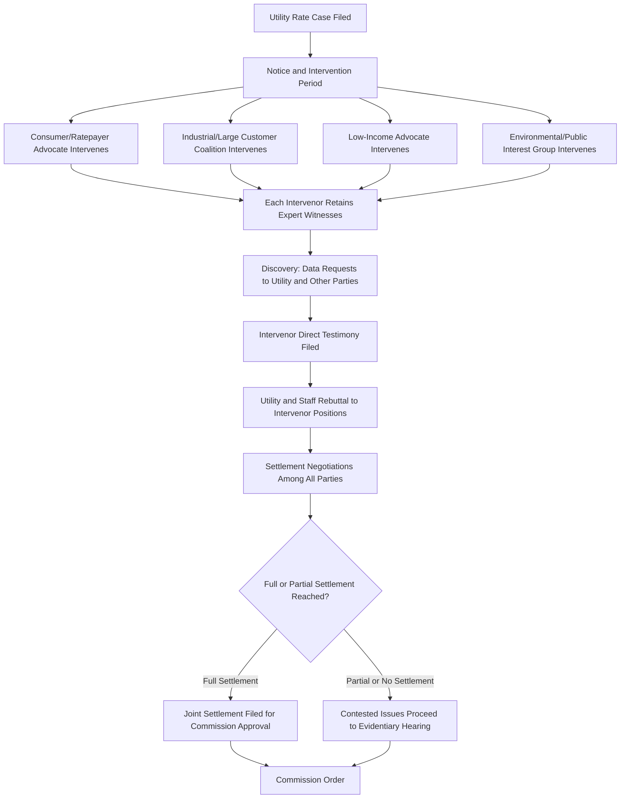

## Consumer and Industrial Intervenor Advocacy

### Definition and Role in the Regulatory Process

Consumer and industrial intervenor advocacy refers to the formal participation of parties other than the utility and commission staff in a rate case or regulatory proceeding, representing distinct customer class interests through testimony, discovery, cross-examination, and settlement negotiation. Intervenors provide the commission with perspectives and analysis specific to particular ratepayer constituencies — perspectives that neither the utility (advocating for its own revenue requirement and shareholder interests) nor commission staff (providing generalized independent technical review) are structurally positioned to fully represent.

### Categories of Intervenors

**Key Points**

- **Consumer/ratepayer advocates**: State-created offices (often called the Office of Consumer Advocate, Public Counsel, or similar) or independent consumer organizations representing residential and small commercial ratepayer interests broadly, typically with statutory standing to intervene as of right in utility proceedings.
- **Industrial and large commercial customer groups**: Associations or ad hoc coalitions of large energy-consuming customers (manufacturing facilities, large commercial operations, and increasingly large-load/data center interests) advocating for cost allocation and rate design outcomes favorable to their specific class, often retaining specialized rate design and cost-of-service expert witnesses.
- **Low-income and vulnerable customer advocates**: Organizations specifically representing low-income ratepayer interests, frequently focused on affordability programs, disconnection policies, and the distributional impact of proposed rate design changes across income levels.
- **Environmental and public interest organizations**: Intervenors focused on the environmental, climate, and clean energy policy dimensions of utility investment and rate design, increasingly active in proceedings involving generation resource decisions, decarbonization-driven capital investment, and demand-side management program design.
- **Competitive market participants**: In restructured states, competitive retail suppliers, independent power producers, or other market participants may intervene where a proceeding affects competitive market rules or the utility's role relative to competitive alternatives.

### Standing and Intervention Procedure

**Key Points**

- **Statutory intervention rights**: Many states grant automatic or streamlined intervention rights to designated consumer advocate offices, reflecting a legislative judgment that residential ratepayers require institutionalized representation given the practical difficulty of individual residential customers meaningfully participating in complex rate case litigation.
- **Discretionary intervention**: Other parties (industrial groups, environmental organizations, ad hoc coalitions) typically must petition to intervene, demonstrating a sufficient interest in the proceeding's outcome, subject to commission approval and potentially subject to procedural limitations (e.g., restricted issues, no independent discovery rights) if intervention is granted on a limited basis.
- **Intervenor coalition formation**: Given the cost of expert witness testimony and case participation, similarly situated customers frequently form ad hoc coalitions (e.g., a joint industrial customer group) to share litigation costs and present a unified position, rather than each individual large customer intervening separately.

### Industrial Intervenor Focus Areas

**Example**

Industrial and large commercial customer intervenors typically concentrate advocacy on issues with disproportionate financial impact on their specific class, including:

- **Class cost-of-service methodology**: Advocating for demand allocation methodologies (e.g., coincident peak vs. non-coincident peak, or specific treatment of high-load-factor customers) that appropriately reflect their class's actual cost causation, often opposing allocation approaches perceived to overstate their class's capacity cost responsibility.
- **Rate design structure**: Advocating for rate structures (e.g., real-time or time-of-use pricing, demand ratchet design, standby/backup service rates for customers with onsite generation) that align with their operational flexibility and cost-management capabilities.
- **Large-load-specific tariff terms**: For data center and other large-load intervenors specifically, advocacy frequently centers on minimum take-or-pay percentages, collateral requirements, and contract term length (see Minimum Demand and Take-or-Pay Contract Provisions and Collateral Requirements and Cost Ring Fencing), given the direct and substantial financial impact these terms have on large-load customers' cost of service.
- **Interruptible and curtailable service options**: Advocating for rate discounts or preferential tariff treatment in exchange for accepting curtailment risk, particularly relevant given emerging large-load interconnection queue reform proposals favoring flexible load (see Interconnection Queue Reform for Large Loads).

### Consumer Advocate Focus Areas

**Example**

Consumer/ratepayer advocates typically concentrate on issues with broad residential and small commercial impact:

- **Overall revenue requirement reasonableness**: Challenging the utility's requested rate base, operating expenses, and cost of capital where evidence suggests the request exceeds a reasonable, prudently-incurred cost level.
- **Cost-shifting prevention**: Advocating against cost allocation approaches that shift disproportionate cost responsibility onto residential classes, including active engagement in large-load cost-shifting analysis (see Cost Shifting Analysis and Ratepayer Protection Studies) to ensure dedicated large-load tariffs adequately protect general ratepayers.
- **Affordability and rate design equity**: Advocating for rate structures, low-income discount programs, and gradualism/rate-shock mitigation mechanisms that protect vulnerable and fixed-income customers from sudden or disproportionate bill impacts.
- **Return on equity and capital structure**: Frequently presenting independent ROE benchmarking analysis, often — though not invariably — advocating for a lower authorized ROE than the utility's request, similar in substance to (but procedurally distinct from) commission staff's own independent cost of capital analysis.

### Expert Witness Retention and Testimony Development

**Key Points**

- **Specialized expert retention**: Intervenors, particularly well-resourced industrial coalitions and state consumer advocate offices, typically retain outside expert witnesses with specific subject-matter expertise (cost of capital, class cost-of-service methodology, rate design, or specific technical/engineering issues) to develop and present testimony supporting their advocacy positions.
- **Discovery-driven testimony development**: Intervenor testimony is typically developed iteratively through the discovery process, as data requests to the utility reveal the underlying support (or lack thereof) for specific filed positions, shaping which issues an intervenor ultimately chooses to contest in formal testimony versus concede.
- **Coordination among aligned intervenors**: Where multiple intervenors share substantially similar positions on a given issue, informal coordination (shared data requests, complementary rather than duplicative testimony scope) is common to reduce redundant litigation burden and present a more unified record on shared concerns.

### Settlement Participation and Signatory Dynamics

**Key Points**

- **Multi-party settlement negotiation**: Rate case settlements frequently involve negotiation among the utility, commission staff, and multiple intervenors simultaneously, requiring intervenors to weigh trade-offs across issues (e.g., accepting a specific ROE outcome in exchange for favorable rate design treatment) rather than evaluating each issue in isolation.
- **Non-unanimous or partial settlements**: Not all intervenors necessarily join a proposed settlement; a settlement may be presented to the commission as supported by some parties while other intervenors continue to litigate specific contested issues, with the commission ultimately deciding whether to approve the settlement as filed, modify it, or reject it in favor of a fully litigated outcome.
- **Precedent and "black box" settlement concerns**: Some jurisdictions scrutinize settlements (particularly "black box" settlements that specify an overall revenue requirement or rate change without detailing the specific methodological agreements underlying it) for whether they establish problematic precedent on contested methodological issues, even where the immediate financial outcome is broadly acceptable to signatories.

### Intervenor Funding and Resource Considerations

**Key Points**

- **Intervenor compensation mechanisms**: Some jurisdictions authorize commissions to award reasonable expert witness and legal costs to certain intervenors (typically consumer or public interest advocates, sometimes with specific statutory eligibility criteria) from utility ratepayer funds or the utility's own shareholder funds, recognizing that under-resourced intervenor participation can undermine the overall quality and balance of the evidentiary record.
- **Resource asymmetry relative to the utility**: Similar to the resource asymmetry noted for commission staff (see Commission Staff Analysis and Recommendations), intervenors — particularly smaller consumer or public interest organizations — typically operate with materially less analytical and financial capacity than the utility itself, an enduring structural feature of rate case litigation that intervenor compensation mechanisms and coalition-building partially, but not fully, offset.

### Interaction with Legislative and Policy Advocacy

**Key Points**

- Intervenor advocacy in individual rate cases frequently operates alongside parallel legislative advocacy on the same underlying policy questions — for example, industrial and consumer advocates active in large-load cost-shifting rate case disputes are frequently the same organizations engaged in the state legislative processes establishing large-load tariff statutory frameworks (see Dedicated Large Load and Data Center Tariff Design), creating a multi-venue advocacy strategy rather than treating individual rate cases as isolated proceedings.
- This dual-track dynamic means rate case outcomes and legislative developments mutually inform each other over time, with unresolved rate case disputes sometimes prompting subsequent legislative action, and new legislative mandates in turn reshaping the scope of issues litigated in future rate cases.

**Related Topics**

- Utility Rate Case Preparation and Strategy
- Commission Staff Analysis and Recommendations
- Settlement Negotiation Dynamics in Regulatory Proceedings
- Cost Shifting Analysis and Ratepayer Protection Studies
- Class Cost-of-Service Studies and Rate Design Methodology
- Dedicated Large Load and Data Center Tariff Design
- Low-Income Ratepayer Protection Mechanisms in Rate Design