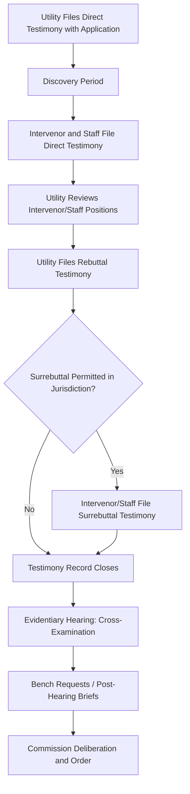

## Expert Witness Testimony: Direct and Rebuttal Practice

### Definition and Procedural Framework

Expert witness testimony practice in utility rate cases refers to the written and oral evidence presented by subject-matter experts on behalf of the utility, commission staff, and intervenors, organized into a structured sequence of filings — typically direct, rebuttal, and in some jurisdictions surrebuttal — culminating in cross-examination at an evidentiary hearing. This structured testimony process is the primary mechanism through which the technical, financial, and policy positions discussed throughout this curriculum (rate base valuation, cost of capital, cost allocation, prudence review) are formally entered into the evidentiary record a commission relies upon in issuing its order.

### The Direct-Rebuttal-Surrebuttal Sequence

**Key Points**

- **Utility direct testimony**: Filed with (or shortly after) the initial rate case application, presenting the utility's affirmative case for its proposed revenue requirement, rate base, cost of capital, cost allocation, and rate design — the foundational evidentiary filing all subsequent testimony responds to.
- **Intervenor and staff direct testimony**: Filed after a discovery period allowing intervenors and staff to review the utility's filing and supporting workpapers, presenting each party's independent analysis and recommended adjustments or alternative positions.
- **Utility rebuttal testimony**: Filed in response to intervenor and staff direct testimony, defending the utility's original positions against specific criticisms and, where warranted, conceding points or offering modified positions in light of issues raised.
- **Surrebuttal testimony**: Where procedurally permitted, allows intervenors and staff a final opportunity to respond to the utility's rebuttal before the written record closes — not universally available, and where absent, the utility's rebuttal effectively has the "last word" in written testimony before cross-examination.

### Structure of Direct Testimony

**Key Points**

- **Question-and-answer format**: Regulatory testimony is conventionally structured as a series of numbered questions (posed by the witness's own counsel, though the witness answers as if under oath) and answers, distinct from narrative report formats common in other litigation contexts — a formatting convention specific to utility regulatory practice.
- **Qualifications and purpose section**: Opening testimony establishes the witness's professional qualifications, employer, and the specific scope of subject matter the testimony addresses, framing the witness's expertise boundary for cross-examination purposes.
- **Summary of recommendations**: Direct testimony typically opens (after qualifications) with a concise summary of the witness's ultimate recommendations, allowing commissioners and other parties to quickly identify the witness's bottom-line position before working through supporting analysis.
- **Supporting exhibits and schedules**: Testimony is accompanied by numbered exhibits (financial schedules, calculations, comparative data, workpapers) that the testimony narrative explains and relies upon, with exhibits typically subject to the same discovery and cross-examination scrutiny as the narrative testimony itself.

### Subject-Matter Testimony Categories

**Example**

Consistent with the witness panel structure discussed in Utility Rate Case Preparation and Strategy, expert testimony in a typical rate case spans several distinct technical domains, each requiring subject-specific expertise:

| Testimony Category | Typical Expert Background | Common Contested Issues |
| --- | --- | --- |
| Rate base / accounting | CPA, regulatory accountant | Plant addition support, depreciation methodology, ADIT calculation |
| Cost of capital | Finance professor, financial analyst | ROE methodology, capital structure, risk premium assumptions |
| Class cost of service | Rate design economist/engineer | Demand allocation methodology, class-specific cost causation |
| Rate design | Rate design specialist | Rate structure, gradualism, large-load tariff terms |
| Prudence / engineering | Utility engineer, industry consultant | Specific capital program reasonableness, alternative approaches foregone |
| Load forecasting | Econometrician, load forecasting specialist | Forecast methodology, large-load inclusion criteria (see Load Growth Forecasting and System Planning Implications) |

### Rebuttal Testimony Strategy

**Key Points**

- **Selective response prioritization**: Given resource and time constraints, rebuttal testimony strategically prioritizes responding to the most financially significant or legally consequential criticisms rather than exhaustively addressing every point raised in opposing direct testimony, since not all issues carry equal weight in the ultimate commission decision.
- **Concession versus defense calculus**: Utilities (and other parties) must strategically evaluate which contested points to continue defending versus concede in rebuttal, since continuing to litigate a weak position can undermine overall witness credibility on stronger, genuinely contested issues — a dynamic connecting directly to the settlement negotiation strategy discussed in Utility Rate Case Preparation and Strategy.
- **New evidence versus responsive argument**: Rebuttal testimony is generally expected to respond to positions raised in opposing direct testimony rather than introduce substantially new affirmative claims, and procedural rules in most jurisdictions restrict the scope of rebuttal accordingly — a frequent source of procedural objection where a party's rebuttal testimony is perceived as exceeding permissible scope.
- **Cross-witness consistency**: Because rebuttal often responds to multiple intervenors' and staff's differing analyses on the same issue, utility witnesses must ensure their rebuttal responses remain internally consistent with positions taken by the utility's other witnesses on related issues.

### Discovery's Role in Shaping Testimony

**Key Points**

- **Data requests as testimony preparation**: The discovery process (data requests and responses) directly shapes what each party's testimony ultimately addresses, since discovery responses reveal the granular support (or absence of support) for specific filed positions, informing which issues intervenors and staff choose to formally contest in testimony.
- **Deposition practice**: Some jurisdictions permit formal depositions of expert witnesses prior to hearing, allowing more extensive pre-hearing testing of a witness's positions than written discovery alone provides, though deposition practice is less universal in utility regulatory proceedings than in general civil litigation.
- **Workpaper production disputes**: Disputes over the completeness or timeliness of underlying workpaper production supporting testimony are a recurring procedural friction point, since inadequate workpaper access can materially limit other parties' ability to meaningfully test a witness's analysis before testimony deadlines.

### Cross-Examination at Evidentiary Hearing

**Key Points**

- **Live testimony adoption**: At hearing, witnesses typically affirm or "adopt" their pre-filed written testimony as if given live, after which opposing counsel conducts cross-examination — meaning the hearing itself functions primarily as a testing mechanism for pre-filed testimony rather than a venue for new direct testimony development.
- **Bench questions**: Commissioners (or a presiding administrative law judge) may pose their own questions to witnesses beyond party-conducted cross-examination, often probing issues of particular concern to the ultimate decision-makers that party questioning may not have fully addressed.
- **Settlement witness treatment**: Where a party has joined a settlement, that party's witnesses may still be required to testify in support of the settlement's reasonableness, subject to cross-examination by parties who did not join the settlement — a distinct testimony posture from fully litigating a contested position.

### Testimony Admissibility and Evidentiary Standards

**Key Points**

- **Relaxed evidentiary standards relative to court litigation**: Utility commission proceedings typically apply more relaxed evidentiary admissibility standards than formal court litigation (reflecting their administrative/quasi-judicial rather than purely judicial character), though hearsay, relevance, and foundation objections remain available and are actively used to shape the record.
- **Expert qualification challenges**: Opposing parties may challenge a witness's qualification to offer opinion testimony on a specific subject, though such challenges are somewhat less common in utility regulatory practice than in general civil litigation given the specialized, credentialed nature of most utility rate case expert witnesses.
- **Weight versus admissibility**: Commissions frequently address contested testimony reliability through the weight given to it in the final order's reasoning, rather than excluding testimony outright — reflecting the commission's dual role as both evidentiary gatekeeper and ultimate fact-finder in a single body.

### Post-Hearing Briefing and Testimony Synthesis

**Key Points**

- **Initial and reply briefs**: Following the evidentiary hearing, parties typically file post-hearing briefs synthesizing the testimonial and documentary record into legal and policy argument, connecting specific witness testimony and cross-examination outcomes to the party's requested commission determination.
- **Record citation practice**: Effective post-hearing briefs precisely cite specific testimony, exhibit, and transcript pages supporting each argument, since the brief's persuasive function depends on demonstrating the argument is genuinely grounded in the evidentiary record rather than restating pre-hearing positions without regard to what the hearing record actually established.
- **Commission order reliance on testimony record**: Final commission orders typically cite specific witness testimony directly in explaining the basis for adopting, modifying, or rejecting particular positions, making the quality, clarity, and hearing performance of expert testimony a direct driver of specific case outcomes rather than a purely formal procedural requirement.

**Related Topics**

- Utility Rate Case Preparation and Strategy
- Commission Staff Analysis and Recommendations
- Consumer and Industrial Intervenor Advocacy
- Settlement Negotiation Dynamics in Regulatory Proceedings
- Discovery Practice and Workpaper Production Standards
- Cost of Capital and Return on Equity Determination Methodology
- Prudence Review Standards for Capital Investment