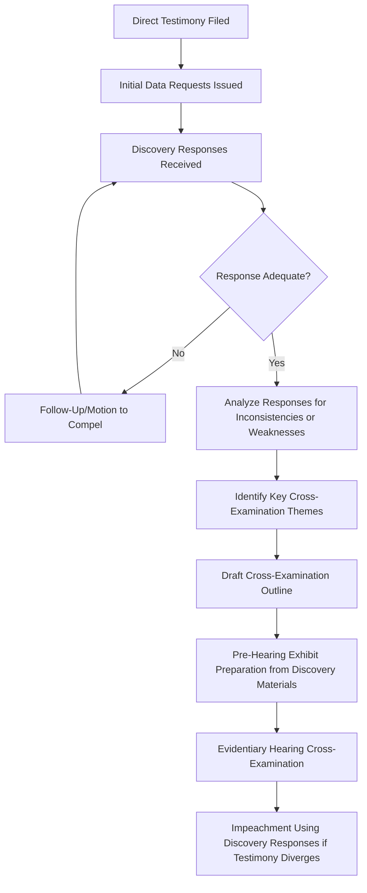

## Cross Examination Technique and Discovery Strategy

### Definition and Strategic Purpose

Cross-examination technique and discovery strategy encompass the pre-hearing evidence-gathering process and the live hearing questioning methodology used by parties in a utility rate case to test, challenge, and expose weaknesses in opposing witnesses' testimony and underlying analysis. While direct and rebuttal testimony (see Expert Witness Testimony: Direct and Rebuttal Practice) establish each party's affirmative case, discovery and cross-examination are the primary adversarial tools for testing whether that case withstands scrutiny — directly shaping what ultimately reaches the commission's evidentiary record and, by extension, the final order.

### Discovery as the Foundation for Cross-Examination

**Key Points**

- **Data requests as the primary discovery tool**: Formal written data requests (interrogatories) are the dominant discovery mechanism in utility rate case practice, typically permitting broader scope than general civil litigation discovery given the technical complexity and public interest nature of rate proceedings.
- **Iterative discovery rounds**: Discovery frequently proceeds in multiple rounds — initial requests following direct testimony, follow-up requests probing gaps or ambiguities in initial responses, and further requests following rebuttal testimony — with each round narrowing toward the genuinely contested issues.
- **Discovery disputes and motions to compel**: Where a party believes a response is incomplete, evasive, or improperly withheld (e.g., on claimed confidentiality or privilege grounds), formal motions to compel or protective order disputes may require commission or presiding officer resolution before the discovery record is complete.
- **Confidentiality and protective order practice**: Utility filings often contain competitively sensitive or customer-specific data (particularly relevant to large-load customer-specific contract terms discussed in Minimum Demand and Take-or-Pay Contract Provisions), requiring protective order frameworks that balance discovery access for parties against legitimate confidentiality interests.

### Building the Cross-Examination Record Through Discovery

**Key Points**

- **Documenting admissions and inconsistencies**: A primary discovery objective is securing written admissions or identifying internal inconsistencies (between a witness's testimony and the utility's own workpapers, prior filings, or other witnesses' testimony) that can be used to impeach or undermine testimony at hearing.
- **Establishing foundation for hearing exhibits**: Discovery responses frequently become hearing exhibits themselves, particularly where a response reveals a calculation error, an unsupported assumption, or a comparison to prior case positions that the cross-examining party wishes to formally enter into the record.
- **Testing sensitivity of key assumptions**: Discovery requests often ask a witness to recalculate their recommendation under alternative assumptions (e.g., "what would your recommended ROE be if you used X comparable group instead of Y"), creating pre-built material for cross-examination demonstrating how sensitive a witness's ultimate conclusion is to specific, contestable methodological choices.

### Cross-Examination Technique Fundamentals

**Key Points**

- **Leading question structure**: Effective cross-examination relies predominantly on leading, closed-ended questions (yes/no or short factual answers) rather than open-ended questions, minimizing the witness's opportunity to elaborate, explain away, or redirect toward favorable framing.
- **Sequencing toward a conclusion**: Skilled cross-examination builds a sequence of individually unobjectionable factual admissions that cumulatively lead the witness (and the commission) toward a specific conclusion, rather than directly asking the witness to concede the ultimate contested point.
- **Impeachment by prior inconsistent statement**: Where discovery has revealed a prior statement, filing, or testimony inconsistent with the witness's current position, cross-examination technique typically involves first securing the witness's current position clearly on the record, then confronting the witness with the prior inconsistent material.
- **Avoiding the "one question too many"**: A well-established cross-examination discipline of stopping once a favorable admission or concession has been secured, rather than continuing to press the point and risking the witness recovering, explaining, or reframing the admission in a way that dilutes its impact.

### Subject-Matter-Specific Cross-Examination Strategies

**Example**

Cross-examination technique varies meaningfully depending on the technical subject matter, reflecting the distinct testimony categories discussed in Expert Witness Testimony: Direct and Rebuttal Practice:

| Testimony Subject | Common Cross-Examination Approach |
| --- | --- |
| Cost of capital / ROE | Testing sensitivity of recommended ROE to comparable company selection, market condition assumptions, and methodology weighting; probing consistency with the witness's positions in other recent cases |
| Rate base / accounting | Confronting specific unsupported or inadequately documented plant additions; testing depreciation methodology consistency with prior commission-approved rates |
| Class cost of service | Challenging the chosen demand allocation methodology's alignment with actual cost causation; probing why a different, commission-precedent-supported methodology was not used |
| Prudence / capital program review | Testing whether alternative approaches were genuinely considered at the time of the investment decision, using contemporaneous documents obtained through discovery rather than hindsight reconstruction |
| Load forecasting | Probing forecast assumption sensitivity, particularly around large-load inclusion criteria and confidence-level classification (see Load Growth Forecasting and System Planning Implications) |

### Discovery Strategy for Large-Load and Novel Cost Allocation Issues

**Example**

Given the emerging, fast-evolving nature of large-load and data center cost allocation disputes covered elsewhere in this curriculum, discovery strategy in these specific contexts frequently focuses on:

- **Forecast confidence documentation**: Requesting all underlying documentation (contracts, letters of intent, deposit records, site control evidence) supporting a utility's classification of specific large-load additions as "high confidence" versus speculative in its load forecast, directly testing the forecast discipline concepts discussed in Load Growth Forecasting and System Planning Implications.
- **Comparable jurisdiction benchmarking**: Requesting the utility's analysis (or lack thereof) of comparable large-load tariff terms approved in other jurisdictions, testing whether proposed minimum take percentages, collateral levels, and contract terms are genuinely calibrated to this utility's specific circumstances or are more loosely benchmarked against other states' approved tariffs.
- **Cost allocation workpaper granularity**: Requesting the specific engineering or financial basis for classifying a given network upgrade or capacity addition as directly assignable to the large-load class versus rolled into general rate base, testing the ring-fencing determinations discussed in Collateral Requirements and Cost Ring Fencing.

### Strategic Use of Commission Staff Discovery

**Key Points**

- **Leveraging staff's discovery access**: Because commission staff (see Commission Staff Analysis and Recommendations) often has broader or more informal access to utility data given its ongoing regulatory relationship, other intervenors may strategically monitor and build upon staff's discovery record rather than duplicating discovery efforts already covering similar ground.
- **Coordinated discovery among aligned intervenors**: Similarly situated intervenors (as discussed in Consumer and Industrial Intervenor Advocacy) frequently coordinate discovery requests to avoid redundant data requests burdening the utility while ensuring comprehensive coverage of issues relevant to their shared interests.

### Hearing Preparation and Witness Panel Coordination

**Key Points**

- **Pre-hearing witness preparation**: Parties typically conduct internal preparation sessions with their own witnesses anticipating likely cross-examination lines, ensuring witnesses can confidently and consistently defend their testimony without appearing evasive or unprepared under adversarial questioning.
- **Anticipating opposing cross-examination strategy**: Effective hearing preparation includes anticipating the specific documents and prior statements opposing counsel is likely to use for impeachment, based on the discovery record, allowing witnesses to prepare thoughtful, non-defensive responses rather than being caught unprepared.
- **Panel testimony coordination**: Where multiple witnesses from the same party will testify on related or overlapping subjects, coordination ensures consistency across the panel, since cross-examination frequently exploits inconsistencies between different witnesses from the same party as effectively as inconsistencies within a single witness's own testimony.

### Ethical and Procedural Boundaries

**Key Points**

- **Scope limitations**: Cross-examination is generally bounded by the scope of the witness's direct/rebuttal testimony, with objections available where questioning strays into subject matter outside a witness's filed testimony or professional qualification.
- **Presiding officer control**: A presiding commissioner or administrative law judge retains authority to limit unduly repetitive, argumentative, or harassing questioning, balancing thorough adversarial testing of testimony against efficient hearing management.
- **Good-faith discovery obligations**: Both requesting and responding parties operate under good-faith obligations — discovery requests should be reasonably calculated to lead to relevant evidence rather than serving as a burden or delay tactic, while responses should be complete and not evasively narrow in interpreting request scope.

**Related Topics**

- Expert Witness Testimony: Direct and Rebuttal Practice
- Utility Rate Case Preparation and Strategy
- Commission Staff Analysis and Recommendations
- Consumer and Industrial Intervenor Advocacy
- Settlement Negotiation Dynamics in Regulatory Proceedings
- Protective Order and Confidentiality Practice in Regulatory Discovery
- Prudence Review Standards for Capital Investment