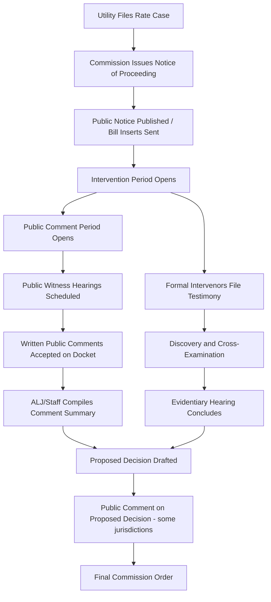

## Public Comment and Participation Processes

### Overview

Public comment and participation processes are the formal mechanisms by which non-party stakeholders — residential ratepayers, community organizations, municipalities, and unrepresented small businesses — provide input into regulatory rate-basing proceedings without undertaking full party status (formal intervention). These processes exist alongside, and are distinct from, the formal evidentiary track (testimony, discovery, cross-examination) reserved for intervenors and parties of record.

### Purpose Within Rate-Basing Proceedings

- **Key Points**
  - Satisfies statutory and constitutional due-process requirements that ratepayers have a meaningful opportunity to be heard before rates are changed
  - Builds an administrative record that supports (or undermines) the reasonableness of a commission's final order
  - Surfaces qualitative, service-level, and equity concerns that engineering/accounting testimony from utilities and intervenors may not capture
  - Creates political and reputational accountability for commissioners, since public comment is often the only visible, non-technical part of a rate case for the general public
  - Functions as an early-warning system, alerting commission staff and intervenor groups to issues (billing errors, service quality complaints, affordability concerns) that may warrant formal discovery

### Legal and Procedural Basis

Most U.S. state public utility commissions (PUCs) derive public participation requirements from a combination of:

- Administrative Procedure Acts (APA) at the state level, which generally require notice-and-comment procedures for rulemaking-adjacent proceedings
- State PUC enabling statutes, which frequently mandate a specific public comment period or public hearing for rate cases above a materiality threshold
- Commission-specific procedural rules (e.g., California's Rules of Practice and Procedure, New York's Public Service Law §66, Texas's PURA §36.101–36.111)
- Federal analogs for FERC-jurisdictional matters (wholesale power, interstate pipelines) under the Administrative Procedure Act, 5 U.S.C. §553, and FERC's own regulations at 18 C.F.R. Part 385

[Inference] The specific triggering thresholds (e.g., rate increase percentage, dollar magnitude, or customer class affected) that mandate a public comment period vary significantly by state and are not standardized; practitioners should verify against the specific state's PUC rules of practice.

### Core Mechanisms of Public Participation

#### 1. Written Public Comments

- Submitted via commission e-filing portals, mail, or dedicated comment forms
- Typically not sworn testimony and not subject to cross-examination
- Entered into the case docket and made part of the record, though weight given varies by commission and is often described as "informational" rather than "evidentiary"
- May trigger a formal commission response requirement in some jurisdictions (e.g., a summary of comment themes in the final order)

#### 2. Public Comment Hearings (Public Witness Hearings)

- In-person or virtual sessions, often held in the utility's service territory (sometimes multiple locations for large territories)
- Presided over by an Administrative Law Judge (ALJ) or commissioner, but conducted informally
- Members of the public may speak for a limited time (commonly 3–5 minutes), without being sworn or cross-examined in most jurisdictions
- Distinguished from **evidentiary hearings**, where testimony is sworn, subject to cross-examination, and directly weighted in the decision

#### 3. Written Intervenor/Party Comments vs. Public Comments

| Feature | Public Comment | Intervenor Testimony |
| --- | --- | --- |
| Party status required | No | Yes (formal motion to intervene) |
| Sworn | Typically no | Yes |
| Subject to cross-examination | Typically no | Yes |
| Standing to appeal | Typically no | Yes |
| Formal discovery rights | No | Yes |
| Evidentiary weight | Informational/contextual | Direct evidentiary weight |

#### 4. Online Dockets and E-Comment Portals

- State PUCs increasingly operate structured web portals (e.g., NY DPS's Document and Matter Management (DMM) system, CPUC's public comment portal) allowing direct submission tied to a specific docket number
- [Unverified] Portal-specific features such as automated acknowledgment, character limits, or required fields vary by commission and platform version; verify against the current live system rather than prior documentation, since these portals are periodically re-platformed.

#### 5. Consumer Advocate and Ombudsman Channels

- Many states have a statutorily created Office of the Public Advocate / Consumer Counsel / Ratepayer Advocate that formally intervenes on behalf of residential ratepayers as a party, distinct from but informed by public comment volume and content
- This office often aggregates informal public comment into formal testimony, effectively converting public sentiment into evidentiary-weight input

### Notice Requirements

Adequate notice is the procedural predicate for meaningful participation. Typical mechanisms include:

- Bill inserts or bill messages to affected customers
- Newspaper publication (legal notices) in the utility's service area
- Direct mail to a subset or all affected customers for larger rate changes
- Posting on the commission's and utility's websites
- Notice in languages other than English where mandated (e.g., California requires multilingual notice in certain circumstances)

[Inference] Notice defects (inadequate reach, untimely publication, or failure to use required languages) are a common basis for procedural challenges to final rate orders, though outcomes of such challenges are fact- and jurisdiction-specific.

### Typical Procedural Timeline in a Rate Case

### Roles of Key Participants

- **Commissioners/ALJs**: Preside over hearings, determine procedural schedule, ultimately weigh (or formally disregard) public comment in the final order
- **Commission Staff**: Often compile and summarize public comment themes for the decision-making body; in some commissions, staff may formally intervene as a party
- **Utility**: Required to provide notice, sometimes required to respond to public comment themes in rebuttal testimony
- **Formal Intervenors** (advocacy groups, large customers, environmental organizations): May use public comment volume/content to support motions or as context for their own testimony, but their own participation is governed by intervention rules, not the public comment process
- **Unrepresented Public**: The primary audience/user of this process; participation does not require legal representation

### Practical Example: Structuring a Public Comment Submission

A well-structured public comment, even though informal, is more likely to be read into the record accurately and referenced in a decision summary:

1. Docket number citation (e.g., "Re: Case No. 24-E-0567")
2. Clear statement of position (support/oppose/conditional)
3. Specific, concrete impact statement (e.g., bill impact, service area, customer class)
4. Any supporting data the commenter can offer (even anecdotal, e.g., number of outages experienced)
5. A specific request (e.g., "phase in the increase over three years" rather than only "this is too expensive")

**Example** (illustrative language, not a template mandated by any specific commission):

> "Re: Case No. 24-E-0567 — I am a residential customer in [service territory]. The proposed 18% increase in the customer charge disproportionately affects low-usage households like mine, who conserve energy but would see limited benefit from the higher fixed charge. I request the Commission consider a smaller fixed-charge increase paired with a larger volumetric rate adjustment to preserve conservation price signals."

### Interaction With Rate-Basing Substance

Public comment often concentrates on categories that map onto specific rate-basing cost components, even though commenters rarely use technical terminology:

- **Return on Equity (ROE) / Rate of Return** — commenters describe this as "utility profits are too high" without referencing the specific ROE percentage under review
- **Rate Base inclusions** (e.g., contested capital projects) — commenters describe specific infrastructure concerns (e.g., "why are we paying for a plant that isn't providing better service")
- **Rate Design** (fixed vs. volumetric charges) — commenters frequently address bill structure even when unfamiliar with the term "rate design"
- **Cost Allocation** among customer classes — commenters may argue that a particular class (e.g., residential vs. industrial) is bearing a disproportionate share

Practitioners drafting testimony or briefs often cross-reference public comment themes to ensure formal evidentiary arguments address the concerns most salient to the affected public, even where public comment itself carries no direct evidentiary weight.

### Distinguishing Jurisdictional Variants

- **State PUC rate cases**: Public comment hearings are common and often mandatory above a materiality threshold
- **FERC proceedings**: Public participation is generally structured through formal intervention and comment periods under Rule 211 (18 C.F.R. §385.211), with less emphasis on live public witness hearings compared to state retail rate cases, since FERC's jurisdiction is predominantly wholesale
- **Municipal/cooperative utilities**: Often governed by open-meetings laws rather than PUC-style rate case procedures, with public comment occurring at board meetings

[Inference] The degree to which municipal or cooperative utility rate-setting is subject to formal public-comment procedural requirements analogous to investor-owned utility rate cases depends heavily on state enabling statutes and the specific governance structure of the entity.

### Limitations and Criticisms

- Public comment is frequently non-binding and carries no formal evidentiary weight, which can create a perception gap between participation and influence
- Comment periods may not align well with the technical complexity of rate cases, limiting substantive engagement
- Notice reach can be uneven across demographic and linguistic groups, raising equity concerns about who effectively participates
- Volume of comment does not necessarily correlate with representativeness of the broader customer base (organized campaigns can skew apparent sentiment)

### Diagram: Participation Track Comparison (svg_diagram)

<svg xmlns="http://www.w3.org/2000/svg" viewBox="0 0 800 420">
<text x="400" y="30" text-anchor="middle" font-size="18" font-weight="bold">Public Participation vs. Formal Party Track (svg_diagram)</text>
<rect x="40" y="60" width="330" height="320" rx="10" fill="none" stroke="#333" stroke-width="2" />
<text x="205" y="90" text-anchor="middle" font-size="15" font-weight="bold">Public Comment Track</text>
<text x="60" y="125" font-size="13">• No formal intervention required</text>
<text x="60" y="150" font-size="13">• Written comment or public hearing</text>
<text x="60" y="175" font-size="13">• Not sworn testimony</text>
<text x="60" y="200" font-size="13">• No cross-examination</text>
<text x="60" y="225" font-size="13">• No discovery rights</text>
<text x="60" y="250" font-size="13">• Informational weight only</text>
<text x="60" y="275" font-size="13">• No standing to appeal order</text>
<text x="60" y="300" font-size="13">• Low barrier to entry</text>
<text x="60" y="325" font-size="13">• Aggregated into staff summary</text>
<rect x="430" y="60" width="330" height="320" rx="10" fill="none" stroke="#333" stroke-width="2" />
<text x="595" y="90" text-anchor="middle" font-size="15" font-weight="bold">Formal Party/Intervenor Track</text>
<text x="450" y="125" font-size="13">• Requires motion to intervene</text>
<text x="450" y="150" font-size="13">• Pre-filed written testimony</text>
<text x="450" y="175" font-size="13">• Sworn under oath</text>
<text x="450" y="200" font-size="13">• Subject to cross-examination</text>
<text x="450" y="225" font-size="13">• Full discovery rights</text>
<text x="450" y="250" font-size="13">• Direct evidentiary weight</text>
<text x="450" y="275" font-size="13">• Standing to appeal order</text>
<text x="450" y="300" font-size="13">• Higher barrier (often counsel)</text>
<text x="450" y="325" font-size="13">• Cited directly in final order</text>
<line x1="370" y1="220" x2="430" y2="220" stroke="#333" stroke-width="2" marker-end="url(#arrow)" />
<text x="400" y="210" text-anchor="middle" font-size="11">informs</text>
</svg>

### Related Topics

- Intervention and Party Status in Rate Cases
- Discovery Procedures in Regulatory Proceedings
- Drafting and Filing Direct/Rebuttal Testimony
- Cross-Examination Techniques for Rate Case Witnesses
- Settlement Negotiations and Stipulations in Rate Cases
- Consumer/Ratepayer Advocate Offices: Structure and Authority
- Environmental Justice and Equity in Utility Rate Design
- FERC Rule 211 Intervention Procedures
- Administrative Law Judge Role in Utility Rate Proceedings
- Notice Requirements and Due Process Challenges to Rate Orders