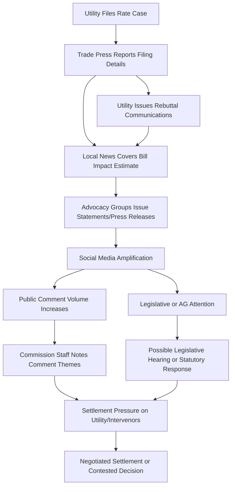

## Media Coverage and Affordability Narratives

### Overview

Media coverage and affordability narratives refer to the ways news outlets, trade press, advocacy organizations, and social media shape public and political understanding of utility rate cases — particularly framing around whether proposed rate increases are "fair," "necessary," or "burdensome." Unlike formal testimony or public comment, media narratives operate outside the evidentiary record but exert significant indirect influence on commissioners (who are often elected or politically appointed), legislative oversight bodies, and settlement dynamics among parties.

### Why Media Framing Matters in Rate-Basing Proceedings

- **Key Points**
  - Commissioners in many states are elected officials or gubernatorial appointees sensitive to public/political pressure, making media narratives a de facto (if informal) input channel
  - Affordability narratives can accelerate settlement negotiations, as utilities may prefer resolving politically sensitive cases before adverse press cycles intensify
  - Media coverage often shapes which issues intervenors prioritize in testimony, since public salience can affect a case's political stakes
  - Persistent negative coverage can trigger legislative hearings, gubernatorial statements, or attorney general involvement independent of the formal PUC docket
  - Affordability framing is distinct from, but often conflated with, the technical determination of "just and reasonable" rates under the governing legal standard

### Key Actors in Media Coverage of Rate Cases

- **Local and regional news outlets**: Often the primary channel through which residential ratepayers learn about a pending rate case; coverage typically emphasizes dollar-and-cents bill impact over rate-base or ROE mechanics
- **Trade and industry press** (e.g., Utility Dive, RTO Insider, S&P Global Market Intelligence): Covers proceedings with more technical depth, targeting regulatory professionals, investors, and utility management
- **Consumer and environmental advocacy organizations**: Frequently serve as media sources, providing quotes, data points, or framing that positions rate increases within broader affordability or equity narratives
- **Utility communications/public affairs departments**: Proactively shape narrative through press releases, op-eds, and direct outreach, typically emphasizing infrastructure investment, reliability, and cost drivers outside the utility's control (e.g., fuel costs, storm recovery, grid modernization mandates)
- **Elected officials**: Governors, state legislators, and attorneys general may amplify or counter narratives, sometimes filing formal comments or requesting investigations
- **Social media and online forums**: Increasingly a vector for rapid narrative formation, particularly around bill spikes, service outages, or high-profile capital projects (e.g., nuclear cost overruns, wildfire liability)

### Common Affordability Narrative Frames

| Frame | Typical Emphasis | Common Source |
| --- | --- | --- |
| "Rate shock" | Sudden, large percentage bill increases | Local news, consumer advocates |
| "Corporate greed" | Utility profits, executive compensation, shareholder dividends | Advocacy groups, opinion media |
| "Aging infrastructure crisis" | Necessity of capital investment for reliability/safety | Utility communications, trade press |
| "Energy burden" | Percentage of household income spent on utility bills, disproportionate impact on low-income households | Academic/advocacy research, consumer advocates |
| "Green transition costs" | Renewable energy mandates or grid modernization driving costs | Varies — used by both pro- and anti-regulation narratives |
| "Storm/disaster recovery" | Extraordinary cost recovery following major weather events | Utility communications, local news |
| "Regulatory capture" | Perception that commissions favor utility interests over ratepayers | Advocacy groups, investigative journalism |

[Inference] The relative prevalence of these frames shifts by region, political environment, and the specific cost drivers at issue in a given case; no single frame dominates uniformly across jurisdictions.

### The "Energy Burden" Metric in Affordability Narratives

A commonly cited quantitative anchor in affordability coverage is the energy burden ratio:

$$\text{Energy Burden} = \frac{\text{Annual Household Energy Expenditure}}{\text{Annual Household Income}}$$

- Federal and academic sources (e.g., U.S. Department of Energy's LEAD tool, ACEEE) commonly reference a threshold around 6% as indicating a "high" energy burden, though thresholds vary by source and methodology
- [Unverified] Specific numeric thresholds cited in media coverage should be independently verified against the primary source (DOE, ACEEE, or a specific state's low-income program eligibility criteria) since figures are sometimes rounded, dated, or applied inconsistently by secondary reporting.
- Media narratives frequently cite average or median energy burden figures without distinguishing between overall averages and burden concentrated in low-income deciles, which can materially change the framing's accuracy

### Interaction Between Media Narrative and the Formal Record

### Utility Communications Strategy in Response to Negative Coverage

Utilities typically respond to adverse affordability narratives through a combination of:

1. **Bill impact reframing** — presenting the increase as a monthly dollar amount rather than a percentage (e.g., "$4.50 more per month" rather than "12% increase")
2. **Cost driver attribution** — emphasizing externally imposed cost drivers (fuel prices, federal mandates, storm damage, inflation in materials/labor)
3. **Comparative framing** — positioning current rates relative to regional or national averages
4. **Investment justification** — linking rate increases to reliability metrics (e.g., SAIDI/SAIFI improvements) or safety outcomes (e.g., wildfire mitigation)
5. **Low-income program promotion** — highlighting bill assistance, budget billing, or percentage-of-income payment plans to counter "burden" framing

[Inference] The effectiveness of these communications strategies in shifting media or public sentiment is not systematically measurable within a single case and varies by market, utility reputation, and the severity of underlying cost drivers.

### Media Coverage as an Indirect Input to Commission Decision-Making

While media narratives are not part of the formal evidentiary record and commissions are generally required to base decisions on record evidence under the "just and reasonable" standard, several indirect pathways exist:

- **Legislative oversight**: Sustained negative coverage can prompt legislative hearings that influence a commission's statutory mandate or budget, indirectly affecting institutional incentives
- **Commissioner reappointment/election dynamics**: In states with elected commissioners, media narrative directly affects electoral outcomes; in appointed systems, it can affect gubernatorial reappointment decisions
- **Settlement incentives**: Parties (including the utility) may be more inclined to settle a case favorably for ratepayers to avoid prolonged negative coverage, independent of the case's technical merits
- **Timing pressure**: High-profile coverage can compress or extend procedural schedules as commissions respond to public attention

[Inference] The degree to which media narrative measurably shifts final rate case outcomes (as opposed to settlement timing or public relations posture) is difficult to isolate empirically and is not consistently quantified in the available literature.

### Practical Example: Contrasting Narrative Framing of the Same Rate Case

**Example**

> Trade press headline: "Utility X Requests 8.4% Revenue Increase to Fund $2.1B Grid Modernization Plan"
>
> Local news headline: "Your Electric Bill Could Jump $14 a Month Under New Proposal"
>
> Advocacy group press release: "Utility X Seeks Third Rate Hike in Five Years as Families Struggle to Pay Bills"
>
> Utility press release: "Utility X Proposes Investment to Strengthen Grid Reliability and Prevent Future Outages"

Each framing is factually consistent with the same underlying filing but emphasizes different aspects (capital plan, bill impact, cumulative burden, reliability benefit), illustrating how the same rate-basing filing generates materially different public narratives depending on the outlet and its audience.

### Distinguishing Affordability Narrative From Formal Affordability Analysis

It is important to distinguish media/public affordability narratives from the formal, quantitative affordability analyses sometimes required or submitted in rate cases:

| Aspect | Media/Public Narrative | Formal Affordability Analysis (Testimony) |
| --- | --- | --- |
| Data rigor | Often illustrative, anecdotal, or high-level averages | Requires defined methodology (e.g., energy burden by income decile) |
| Evidentiary status | None | Part of the record, subject to cross-examination |
| Audience | General public, policymakers | ALJ, commissioners, parties |
| Timeframe | Real-time, reactive to filing/news cycle | Prepared in advance per procedural schedule |
| Typical author | Journalists, advocacy communications staff | Expert witnesses (economists, rate analysts) |

### Risks and Criticisms of Media-Driven Framing

- Percentage-based headlines can overstate or understate actual bill impact depending on the baseline (e.g., a large percentage increase on a small line-item charge vs. a small percentage increase on total bill)
- Coverage often lacks technical context distinguishing rate base growth, cost of capital, and rate design components, conflating distinct regulatory concepts under a single "rate hike" narrative
- Selective framing (by any actor — utility, advocacy group, or press) can omit offsetting factors, such as concurrent rate reductions in other rate elements or expiring surcharges
- Rapid social media narrative formation can outpace the procedural timeline of the case itself, creating pressure before the evidentiary record is complete

### Related Topics

- Public Comment and Participation Processes
- Low-Income and Affordability Programs in Rate Design
- Settlement Negotiations and Stipulations in Rate Cases
- Utility Public Affairs and Regulatory Communications Strategy
- "Just and Reasonable" Rate Standard: Legal Basis and Application
- Energy Burden Metrics and Low-Income Rate Assistance Program Design
- Legislative Oversight of Public Utility Commissions
- Cost Driver Attribution: Fuel, Storm Recovery, and Capital Investment
- Reliability Metrics (SAIDI/SAIFI) as Rate Justification Evidence
- Commissioner Selection Methods: Elected vs. Appointed Models