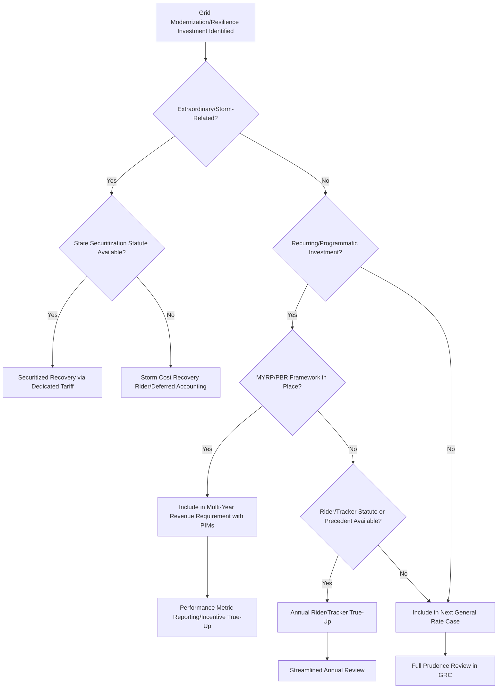

## Grid Modernization and Resilience Investment Recovery

### Overview

Grid modernization and resilience investment recovery refers to the regulatory mechanisms, rate-basing methodologies, and cost recovery structures that allow utilities to recoup capital and operating expenditures for upgrading electric (and in some cases gas) infrastructure to improve reliability, cybersecurity, climate resilience, and integration of distributed energy resources (DERs). This is an emerging area because traditional rate-basing methods (test-year cost-of-service, prudence review) are increasingly viewed as poorly matched to the pace, uncertainty, and scale of modernization investment.

### Why This Is an Emerging Rate-Basing Issue

- **Key Points**
  - Traditional rate case cycles (12–24+ months, tied to historical test years) are often too slow relative to the rate of technology change and climate-driven risk (wildfires, storms, extreme heat/cold)
  - Grid modernization spending is frequently front-loaded and capital-intensive, straining conventional single-issue rate case review
  - Resilience investments (undergrounding, vegetation management, hardening) often lack directly observable "output" metrics comparable to traditional generation/transmission assets, complicating prudence review
  - Multiple overlapping cost categories (physical hardening, cyber, DER integration, advanced metering) increasingly compete for the same rate-basing "room" within allowed revenue requirements
  - Federal funding streams (e.g., Infrastructure Investment and Jobs Act (IIJA) grid resilience grants) interact with state rate-basing in ways that require careful cost-of-service coordination to avoid double recovery

### Categories of Grid Modernization Investment

| Category | Representative Investments | Primary Recovery Challenge |
| --- | --- | --- |
| Physical hardening/resilience | Undergrounding, pole hardening, vegetation management, flood/fire mitigation | Prudence review of large capital outlays against uncertain future event avoidance |
| Advanced metering infrastructure (AMI) | Smart meters, two-way communication networks | Stranded cost of legacy meters, cybersecurity cost allocation |
| Distribution automation | Reclosers, fault location/isolation/restoration (FLISR), SCADA expansion | Benefit quantification (reliability improvement vs. cost) |
| DER integration/grid edge | Advanced distribution management systems (ADMS), hosting capacity analysis, interconnection upgrades | Cost causation — who benefits (DER adopters vs. all ratepayers) |
| Cybersecurity | Network segmentation, monitoring, NERC CIP compliance | Confidentiality of specifics limiting normal prudence transparency |
| Grid-enhancing technologies (GETs) | Dynamic line ratings, advanced power flow control, topology optimization | Often lower-cost alternatives to traditional capacity investment; recovery mechanism sometimes underdeveloped relative to capital-intensive alternatives |

### Traditional vs. Emerging Recovery Mechanisms

#### Traditional Mechanism: General Rate Case (GRC) Inclusion

- Capital additions included in rate base via the standard formula:

$$\text{Revenue Requirement} = (RB \times r) + D + O\&M + T$$

Where $RB$ is rate base, $r$ is the allowed rate of return, $D$ is depreciation, $O\&M$ is operating and maintenance expense, and $T$ is taxes.

- Requires full prudence review, test-year alignment, and is subject to regulatory lag between spending and recovery

#### Emerging Mechanism 1: Riders and Trackers (Cost Recovery Mechanisms, CRMs)

- Allow more frequent (often annual) true-up of specific capital categories outside a full GRC
- Common examples: Storm Cost Recovery Riders, Grid Modernization Riders, Vegetation Management Trackers, Cyber Security Cost Recovery Mechanisms
- [Inference] Riders reduce regulatory lag for the utility but are frequently criticized by consumer advocates as reducing the intensity of prudence scrutiny compared to a full base rate case, since riders are typically reviewed on a more streamlined or expedited basis.

#### Emerging Mechanism 2: Multi-Year Rate Plans (MYRPs) / Performance-Based Ratemaking (PBR)

- Sets revenue requirements or price caps over a 3–5+ year period, often indexed to inflation and productivity offsets (similar in structure to the formula below)

$$\text{Allowed Revenue}_t = \text{Allowed Revenue}_{t-1} \times (1 + I - X) \pm Z$$

Where $I$ is an inflation index, $X$ is a productivity offset, and $Z$ represents exogenous cost adjustments (e.g., major storm events)

- Frequently paired with performance incentive mechanisms (PIMs) tied to reliability metrics (SAIDI, SAIFI), resilience metrics, or DER integration milestones
- [Inference] PBR/MYRP structures are increasingly adopted as a policy response to grid modernization's pace-mismatch with traditional rate cases, though the specific metrics, incentive magnitudes, and penalty structures vary widely by jurisdiction and are still evolving in most states that have adopted them.

#### Emerging Mechanism 3: Securitization for Resilience and Storm Recovery

- Utility-issued, ratepayer-backed bonds secured by a dedicated tariff charge, used to recover extraordinary storm costs or, in some states, pre-approved resilience capital programs
- Lowers the effective cost of capital relative to traditional equity-heavy recovery (since securitized debt typically carries a lower coupon than the utility's blended cost of capital), which can reduce total ratepayer cost for the same infrastructure
- Requires specific enabling legislation in most states (e.g., Texas, Louisiana, Florida storm securitization statutes)

#### Emerging Mechanism 4: Federal Funding Coordination (IIJA/DOE Grants)

- Grid Resilience and Innovation Partnerships (GRIP) program and related DOE grid resilience formula grants provide partial capital funding
- Regulatory treatment issue: whether federal grant dollars reduce rate base (as a capital contribution) or are treated as an offset to revenue requirement, and how matching-fund requirements interact with state cost-of-service calculations
- [Unverified] Specific accounting treatment (rate base reduction vs. below-the-line contribution accounting) for IIJA-funded grid resilience projects varies by state commission guidance and, in some cases, has not yet been fully litigated or standardized as of this writing; verify against the specific state commission's current orders or guidance documents before relying on a particular treatment.

### Recovery Mechanism Selection Logic

### Prudence Review Challenges Specific to Modernization Investment

- **Uncertainty of avoided-cost benefits**: Wildfire mitigation or storm hardening benefits are probabilistic (avoided future costs), making cost-benefit prudence review inherently forward-looking and estimate-dependent, unlike traditional used-and-useful review of completed generation assets
- **Technology obsolescence risk**: AMI, cybersecurity, and DER integration technologies may require replacement before full depreciation, raising stranded asset recovery questions
- **Benefit allocation across customer classes**: DER-related grid investments may disproportionately benefit DER-adopting customers, raising cost causation and cross-subsidization concerns in rate design (distinct from, but linked to, rate-basing decisions)
- **Cybersecurity confidentiality**: Standard prudence review relies on public evidentiary transparency; cybersecurity investment review often requires protective orders or in-camera review, limiting the normal adversarial testing of costs

### Practical Example: Comparative Recovery Paths for a Wildfire Mitigation Program

**Example**

> A utility proposes a $500M, 5-year undergrounding and vegetation management program in a wildfire-prone service territory. Three plausible recovery paths:
>
> 1. **General Rate Case inclusion**: Full $500M reviewed in a single rate case, included in rate base, full prudence review, standard ROI recovery — high regulatory lag, high transparency
> 2. **Wildfire Mitigation Rider**: Annual filings recovering incremental spend as incurred, subject to an annual reasonableness (not full prudence) review — lower regulatory lag, reduced per-dollar scrutiny intensity
> 3. **Securitized Resilience Bond** (if state statute permits): Program capital raised via ratepayer-backed bond at a lower cost of capital than equity-weighted rate base treatment, amortized via a dedicated non-bypassable charge — lowest ratepayer cost of capital, but requires enabling legislation and typically a pre-approval proceeding

Commissions increasingly favor hybrid approaches — statutory pre-approval of the program scope combined with rider-based annual true-up — to balance regulatory lag against prudence oversight.

### Interaction With Cost of Capital

Grid modernization investment recovery intersects directly with the broader rate-basing cost-of-capital determination:

- Riders and trackers are sometimes authorized at a reduced or capped return relative to the utility's base ROE, as a policy tool to limit "rider proliferation" incentives
- MYRP structures may embed a modestly different (often slightly lower) allowed ROE in exchange for reduced regulatory lag and more predictable revenue, reflecting a risk-return tradeoff recognized in some jurisdictions' PBR frameworks
- [Inference] The specific ROE adjustment (if any) associated with PBR/MYRP adoption is jurisdiction-specific and is a frequently litigated element of PBR proceedings rather than a settled, standardized offset.

### Distinguishing Resilience From Reliability Investment (Terminology Note)

- **Reliability** investment traditionally targets routine service continuity metrics (SAIDI, SAIFI, CAIDI) under normal operating conditions
- **Resilience** investment specifically targets recovery from and reduced impact of low-probability, high-consequence events (major storms, wildfires, extreme temperature events, cyberattacks)
- [Inference] Some jurisdictions use these terms interchangeably in statute or commission orders, while others (particularly post-major-storm-event states) have begun formally distinguishing "resilience" as a separate investment and recovery category with its own metrics; terminology should be verified against the specific state's current regulatory framework rather than assumed to be standardized nationally.

### Related Topics

- Performance-Based Ratemaking (PBR) and Multi-Year Rate Plans
- Storm Cost Recovery and Securitization Mechanisms
- Used and Useful Standard in Rate Base Determination
- Distributed Energy Resource (DER) Cost Causation and Rate Design
- Cybersecurity Cost Recovery and Confidential Prudence Review
- Federal Infrastructure Funding Coordination (IIJA/DOE GRIP Program)
- Wildfire Mitigation Plans and Utility Liability Frameworks
- Reliability Metrics (SAIDI/SAIFI/CAIDI) as Regulatory Benchmarks
- Regulatory Lag and Its Effect on Capital Investment Incentives
- Stranded Asset Recovery for Obsolete Grid Technology