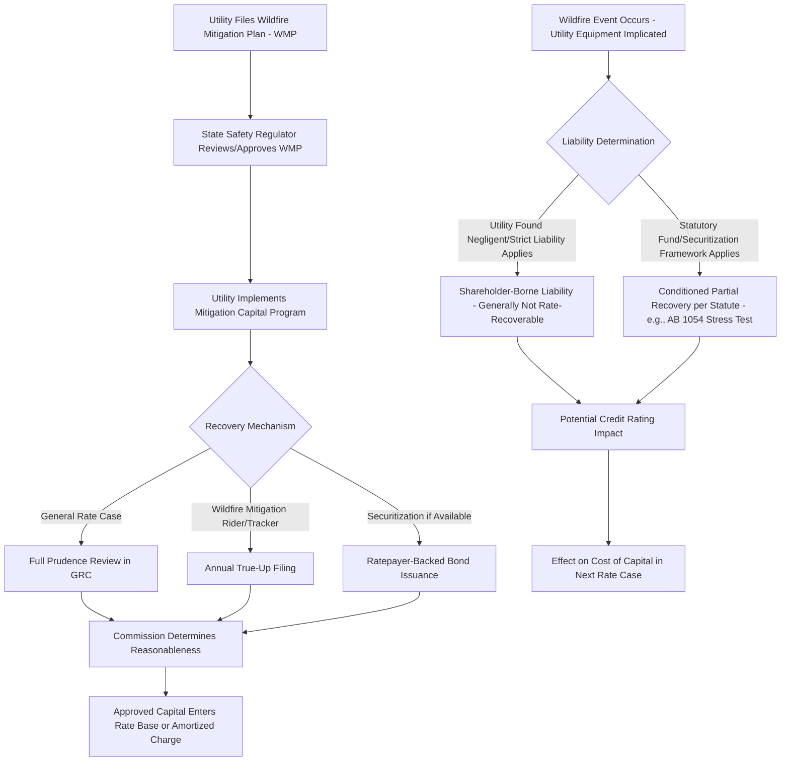

## Climate Risk, Wildfire Mitigation, and Hardening Costs

### Overview

Climate risk, wildfire mitigation, and hardening costs represent an emerging and increasingly contentious category of rate-basing activity in which utilities seek recovery of capital and operating expenditures aimed at reducing utility-caused wildfire ignition risk, adapting infrastructure to intensifying climate hazards (extreme heat, flooding, hurricanes, freeze events), and managing the associated liability, insurance, and capital market consequences. This area combines traditional cost-of-service ratemaking with novel liability-cost recovery mechanisms, catastrophe risk pricing, and climate adaptation planning that did not historically feature prominently in rate cases.

### Why This Is an Emerging Rate-Basing Issue

- **Key Points**
  - Utility equipment (downed lines, arcing, vegetation contact) has been identified as a causal factor in a number of catastrophic wildfires over the past decade, creating multibillion-dollar liability exposure that intersects with rate-basing through both mitigation cost recovery and liability cost treatment
  - Wildfire risk has materially affected utility credit ratings and cost of capital in several states, directly influencing the allowed rate of return determination in rate cases
  - Mitigation capital programs (undergrounding, covered conductor, enhanced vegetation management) are large, multi-year, and often exceed the scale of a single traditional rate case cycle
  - Liability cost recovery (for damages arising from utility-caused fires) is legally and politically distinct from prudent mitigation investment recovery, but the two are frequently discussed together and sometimes conflated in public and media discourse
  - Insurance market contraction and premium increases for utility wildfire liability coverage have become a rate case cost category in their own right

### Categories of Cost Within This Topic

| Category | Description | Rate-Basing Treatment |
| --- | --- | --- |
| Capital hardening investment | Undergrounding, covered/insulated conductor, pole replacement, weather stations, fast-trip settings | Generally rate base eligible subject to prudence review |
| Enhanced vegetation management | Increased trimming cycles, defensible space clearing | Typically O&M expense, sometimes trackable/recoverable via rider |
| Public Safety Power Shutoff (PSPS) program costs | Situational awareness systems, meteorology staff, customer notification systems | Mixed capital/O&M; increasingly reviewed for both cost and reliability-impact tradeoffs |
| Wildfire liability/damages | Settlements, judgments, third-party claims from utility-caused fires | Generally NOT includable in rate base under standard prudence principles; recovery (if any) typically requires specific statutory mechanism |
| Insurance premiums | Liability and property insurance for wildfire risk | Increasingly treated as a recoverable O&M cost category, sometimes via dedicated rider given premium volatility |
| Wildfire mitigation plan compliance costs | State-mandated wildfire mitigation plan (WMP) preparation, safety certification, third-party audits | Generally recoverable as compliance-driven O&M/capital |

### Legal Distinction: Mitigation Cost Recovery vs. Liability Cost Recovery

This distinction is central to the topic and frequently a point of contested testimony:

- **Prospective mitigation investment** (hardening, vegetation management) is evaluated under standard prudence review — was the spending reasonable and necessary given information available at the time — and is broadly analogous to other capital rate-basing decisions
- **Retrospective liability costs** (damages from fires already caused by utility equipment) raise a fundamentally different question: whether shareholders or ratepayers should bear the cost of harm caused by utility operations, which implicates tort law, statutory liability standards (including strict liability doctrines like California's inverse condemnation), and public policy about risk allocation — not ordinary prudence review
- [Inference] Commissions and courts generally resist including adjudicated liability/damages costs directly in rate base or revenue requirement absent specific enabling legislation, treating this as a shareholder-borne risk under traditional regulatory principles; however, several states have enacted specific statutory frameworks (discussed below) that create limited, conditioned pathways for partial liability cost recovery, so this is not a uniform rule across jurisdictions.

### State-Specific Statutory Frameworks (Illustrative, Not Exhaustive)

- **California**: AB 1054 (2019) created a Wildfire Fund and a "stress test" mechanism allowing eligible utilities to seek limited liability cost recovery if they demonstrate reasonable conduct and maintain safety certification; also mandates annual Wildfire Mitigation Plans reviewed by the Office of Energy Infrastructure Safety (OEIS, formerly housed within CPUC)
- **Texas**: Securitization statutes (e.g., following Winter Storm Uri) allow ratepayer-backed bond recovery of extraordinary storm-related costs, a mechanism structurally similar to wildfire cost securitization used elsewhere
- **Oregon, Colorado, and other Western states**: Have adopted or are developing wildfire mitigation plan requirements and related cost recovery riders following major wildfire events, with frameworks still evolving

[Unverified] The precise current status, thresholds, and procedural requirements of these statutory frameworks change frequently as legislatures and commissions respond to new wildfire events; verify against the specific state's current statute and implementing commission decisions rather than relying on a static summary, since this is an active and fast-moving area of law.

### Cost of Capital Impact

Wildfire risk affects rate-basing not only through direct mitigation cost recovery but through its effect on the utility's overall cost of capital determination:

$$\text{WACC} = \left(\frac{E}{V}\right) \times r_e + \left(\frac{D}{V}\right) \times r_d \times (1 - T_c)$$

Where $E$ and $D$ are equity and debt weights, $V = E + D$, $r_e$ is the cost of equity, $r_d$ is the cost of debt, and $T_c$ is the corporate tax rate.

- Elevated wildfire liability risk has been associated with credit rating downgrades for several utilities in wildfire-prone regions, increasing $r_d$ (cost of debt) directly
- Equity investors may demand a higher risk premium for utilities with material uninsured or underinsured wildfire exposure, which is a contested element in ROE testimony (utilities often argue for upward ROE adjustments citing this risk; consumer advocates often argue such risk should not be socialized into ratepayer-funded returns)
- [Inference] The degree to which wildfire risk should be reflected in allowed ROE (as opposed to being managed through liability caps, insurance, or securitization mechanisms) remains an actively litigated question without a uniform, settled resolution across jurisdictions.

### Wildfire Mitigation Cost Recovery Process Flow

### Practical Example: Reviewing a Covered Conductor Program

**Example**

> A utility proposes replacing 2,000 miles of bare overhead conductor with covered (insulated) conductor in high fire-threat districts, at an estimated cost of $1.2M per mile ($2.4B total), phased over 8 years.
>
> Prudence review typically examines:
>
> - Whether the utility's fire-threat mapping and prioritization methodology reasonably targeted the highest-risk circuits first
> - Cost benchmarking against comparable programs at peer utilities (cost per mile reasonableness)
> - Alternative mitigation options considered (e.g., targeted undergrounding vs. covered conductor vs. enhanced PSPS protocols) and the utility's justification for the chosen approach
> - Pace of deployment relative to risk reduction achieved (i.e., whether phasing appropriately prioritizes the highest-risk areas early)
>
> A consumer advocate intervenor might argue for a lower per-mile cost benchmark based on other jurisdictions' completed programs, or challenge the sequencing/prioritization methodology — this is a common site of contested expert testimony in wildfire mitigation rate cases.

### Insurance Cost Recovery as a Distinct Sub-Issue

- Wildfire liability insurance premiums for utilities in high-risk areas have risen substantially industry-wide in recent years, and in some cases availability itself has become constrained
- Commissions increasingly review insurance procurement prudence (coverage adequacy, market timing, broker selection) similarly to other major cost categories, sometimes via a dedicated insurance cost recovery rider given premium volatility between rate cases
- [Inference] Insurance cost recovery riders are a relatively recent regulatory innovation in several wildfire-affected states and are not yet uniformly adopted; some jurisdictions still handle insurance costs solely within general rate case O&M review.

### PSPS Programs: A Reliability-Resilience Tradeoff

Public Safety Power Shutoffs (de-energization during extreme fire-weather conditions) illustrate a unique rate-basing tension:

- PSPS reduces ignition risk (a resilience/safety benefit) but directly reduces reliability metrics (SAIDI/SAIFI) during shutoff events, creating an apparent conflict with traditional reliability-based performance incentive mechanisms
- Some jurisdictions have adopted PSPS-specific reporting and cost recovery treatment that excludes PSPS-related outage minutes from standard reliability penalty calculations, recognizing the deliberate safety tradeoff
- [Unverified] The specific treatment of PSPS events within reliability performance metrics and any associated financial incentive mechanisms varies by state and utility-specific settlement terms; verify against the applicable jurisdiction's current PIM framework.

### Interaction With Grid Modernization Investment (Cross-Reference)

Wildfire mitigation and hardening investment substantially overlaps with, but is analytically distinct from, broader grid modernization and resilience investment: wildfire mitigation is risk-specific and often geographically targeted (high fire-threat districts), while grid modernization is typically broader in scope (AMI, DER integration, general hardening). The two frequently share recovery mechanisms (riders, MYRPs, securitization) but are evaluated against different risk and benefit criteria in prudence review.

### Related Topics

- Grid Modernization and Resilience Investment Recovery
- Cost of Capital and Return on Equity Determination
- Storm Cost Recovery and Securitization Mechanisms
- Performance-Based Ratemaking and Reliability Incentive Mechanisms
- Prudence Review Standards in Capital Cost Recovery
- Utility Credit Ratings and Their Effect on Allowed Return
- Public Safety Power Shutoff (PSPS) Program Design and Oversight
- Inverse Condemnation and Strict Liability Frameworks for Utilities
- Wildfire Mitigation Plan (WMP) Regulatory Review Processes
- Insurance Market Dynamics for Utility Liability Coverage