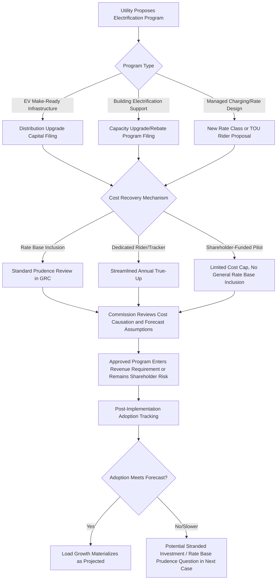

## Beneficial Electrification and Rate Base Growth

### Overview

Beneficial electrification refers to the policy-driven shift of end uses traditionally served by fossil fuels (space heating, water heating, transportation, industrial processes) to electricity, where doing so reduces overall emissions, improves efficiency, or lowers total societal cost, even if not always immediately cost-reducing for the individual adopting customer. In rate-basing terms, beneficial electrification is an emerging driver of load growth and associated capital investment — creating both opportunities (load growth spreading fixed costs over more kWh sold) and new categories of contested rate-basing questions (who pays for the grid upgrades that enable electrification, and how utilities recover the associated capital).

### Why This Is an Emerging Rate-Basing Issue

- **Key Points**
  - After roughly two decades of flat or declining load growth in many U.S. utility territories, electrification (particularly electric vehicles (EVs) and building electrification) is a primary driver of renewed forecasted load growth, directly affecting revenue requirement and rate base forecasting methodology
  - Load growth changes the traditional rate-basing dynamic: historically, rate cases often addressed cost recovery amid flat/declining sales (raising per-unit rates to cover fixed costs); electrification-driven growth potentially allows fixed costs to be spread over a larger sales base, a dynamic utilities and advocates both reference but interpret differently
  - Electrification requires targeted distribution and sometimes transmission capital investment (transformer upgrades, service upgrades, EV charging infrastructure) that raises novel cost causation and cost allocation questions distinct from traditional generation-driven capital additions
  - Test-year based rate cases may systematically understate or overstate near-term load growth if electrification adoption accelerates faster (or slower) than forecast, creating forecasting risk that intersects with rate-basing accuracy
  - Electrification intersects with decarbonization policy mandates in many states, meaning rate-basing decisions in this area often have both economic and policy/legal dimensions beyond conventional prudence review

### Categories of Electrification-Driven Investment

| Category | Representative Investment | Primary Rate-Basing Question |
| --- | --- | --- |
| EV charging infrastructure (utility-owned) | Make-ready infrastructure, utility-owned chargers, distribution upgrades for charging depots | Cost allocation between EV owners and general ratepayers; competitive neutrality vs. private charging providers |
| Building electrification | Distribution capacity upgrades for heat pump adoption, transformer resizing | Timing/sequencing of capital ahead of confirmed adoption ("build ahead of need") |
| Fleet/transit electrification | Utility-side upgrades for bus depots, commercial fleet charging | Large point-load interconnection cost allocation |
| Industrial electrification | Process heat electrification, large new industrial load interconnection | Cost causation for large, discrete loads vs. broad ratepayer base |
| Grid capacity/planning tools | Hosting capacity analysis, integrated distribution planning, forecasting model upgrades | Recovery of planning/analytical costs as O&M vs. capital |

### The "Chicken-and-Egg" Capital Timing Problem

A recurring, largely unresolved tension in this area:

- Utilities argue that enabling infrastructure (make-ready electrical capacity, distribution upgrades) must often be built **ahead of** confirmed customer adoption to avoid deterring electrification (e.g., a customer won't buy an EV or heat pump if the grid can't support it)
- Consumer and ratepayer advocates often argue that pre-emptive capital spending ahead of demonstrated need shifts risk to all ratepayers for the benefit of a subset of (often higher-income, early-adopter) customers, raising cost causation and equity concerns
- [Inference] Resolving this tension typically requires either (a) accepting some forecast risk in exchange for policy-driven electrification goals, or (b) developing more granular cost allocation mechanisms (e.g., contribution-in-aid-of-construction requirements, EV-specific rate classes) — different states have adopted different balances, and no single approach is standardized nationally.

### Rate Base Growth Dynamics Under Electrification

Traditional rate base growth is driven primarily by generation, transmission, and general distribution investment. Electrification introduces a distinct dynamic:

$$\text{Revenue Requirement} = (RB \times r) + D + O\&M + T$$

Under load growth scenarios, the same revenue requirement can be spread over a larger sales denominator:

$$\text{Average Rate per kWh} = \frac{\text{Revenue Requirement}}{\text{Total kWh Sales}}$$

- If electrification increases $\text{Total kWh Sales}$ faster than it increases $RB$ (rate base) and associated revenue requirement, the theoretical result is downward pressure on the average per-kWh rate — a dynamic frequently cited by utilities and electrification advocates as a benefit to all ratepayers ("low-income and non-adopting customers benefit from a larger sales base")
- [Inference] Whether this benefit materializes in practice depends heavily on whether the incremental capital investment required to serve new electric load is proportionally smaller than the incremental revenue it generates — a case-specific empirical question rather than a guaranteed outcome, and one that is frequently contested in rate case testimony through competing load forecast and marginal cost studies.

### Cost Causation and Allocation Approaches

| Approach | Description | Typical Advocate |
| --- | --- | --- |
| Socialized cost recovery | Electrification-enabling infrastructure recovered through general rate base, spread across all customer classes | Utilities, some electrification advocates (lowers adoption barrier) |
| Cost causer-pays / contribution-in-aid-of-construction (CIAC) | Customer or developer pays some/all of the incremental interconnection or upgrade cost | Traditional ratepayer/cost-causation advocates |
| Special EV/electrification rate classes | Time-of-use or managed charging rates specifically for EV load, sometimes with dedicated cost recovery riders | Utilities seeking to manage load shape; some consumer advocates (transparency) |
| Hybrid/phased approaches | Utility funds initial "make-ready" infrastructure via rate base; customer funds behind-the-meter equipment | Increasingly common compromise position in recent proceedings |

### Utility Electrification Program Cost Recovery Process

### Load Forecasting as a Rate-Basing Risk Point

- Electrification materially increases the difficulty and stakes of load forecasting within a rate case, since forecast errors directly affect both revenue requirement adequacy and the justification for enabling capital investment
- Common forecasting inputs specific to electrification include EV adoption curve assumptions, heat pump conversion rates, building code/mandate timelines, and manufacturer/OEM production forecasts
- [Unverified] Forecasting methodologies and their accuracy track records vary significantly by utility and are actively debated in testimony; no single forecasting approach has been established as an industry-wide standard for electrification load growth, and utilities frequently use materially different methodologies (econometric, adoption-curve, survey-based) across jurisdictions.

### Practical Example: EV Make-Ready Program Cost Recovery Debate

**Example**

> A utility proposes a $150M, 5-year "make-ready" program to upgrade distribution infrastructure supporting anticipated EV charging demand at multifamily housing and workplace sites, to be recovered through general rate base.
>
> - **Utility position**: Program lowers barriers to EV adoption, supports state decarbonization mandates, and ultimately benefits all ratepayers through future load growth and reduced per-kWh fixed cost allocation
> - **Consumer advocate position**: Program costs are being borne by all ratepayers (including non-EV-owning, often lower-income customers) for infrastructure that primarily benefits a specific, currently smaller subset of adopters; proposes a lower initial capital allocation tied to demonstrated (rather than forecast) demand, or a CIAC-based cost-sharing structure
> - **Compromise outcome (illustrative)**: Commission approves a reduced initial capital allocation with a formal tracking mechanism and a future prudence review checkpoint tied to actual adoption rates achieved

This structure — phased approval with adoption-tracking checkpoints — is an increasingly common regulatory response to the forecast-risk problem inherent in electrification-driven capital investment.

### Equity Considerations

- Electrification program costs and benefits are not uniformly distributed: EV ownership and home electrification adoption have historically skewed toward higher-income households in many markets, raising distributional equity questions when program costs are socialized across the full customer base
- Some jurisdictions have responded by directing a portion of electrification program funding specifically toward low- and moderate-income (LMI) electrification access (e.g., subsidized make-ready infrastructure at affordable multifamily housing, targeted heat pump rebate programs)
- [Inference] The degree to which electrification program design successfully addresses these equity concerns varies substantially by program structure and is a frequent subject of intervenor testimony and settlement negotiation rather than a resolved policy question.

### Interaction With Rate Design (Distinct From Rate-Basing)

While rate base growth is a cost-of-service/revenue-requirement question, electrification's rate design implications (time-of-use structures, demand charges for EV charging, managed charging programs) are analytically distinct but closely linked, since rate design determines how the revenue requirement approved through rate-basing is ultimately collected from electrifying customers.

### Related Topics

- Grid Modernization and Resilience Investment Recovery
- Load Forecasting Methodologies in Rate Case Proceedings
- Cost Causation and Cost Allocation Principles in Rate Design
- Time-of-Use and Managed Charging Rate Design for EVs
- Low- and Moderate-Income (LMI) Program Design in Electrification
- Contribution-in-Aid-of-Construction (CIAC) Policy Frameworks
- Decarbonization Mandates and Their Interaction With Rate-Basing
- Distributed Energy Resource (DER) Cost Causation and Rate Design
- Stranded Asset Risk From Forecast-Driven Capital Investment
- Multi-Year Rate Plans and Performance-Based Ratemaking