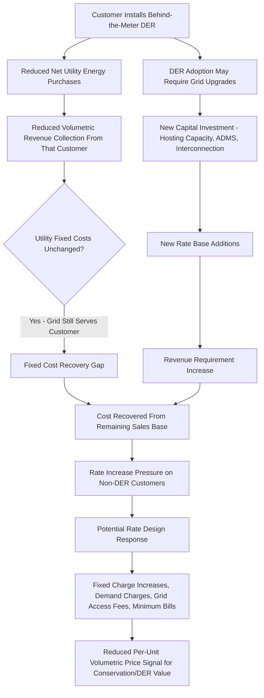

## Distributed Energy Resources and Rate Base Disintermediation

<syllabon_broad_topic/>

### Overview

Distributed energy resources (DERs) — rooftop solar, behind-the-meter battery storage, community solar, demand response, electric vehicle batteries used bidirectionally, and other customer-sited generation/storage — pose a structural challenge to the traditional rate-basing model. Rate-basing has historically assumed a relatively predictable relationship between utility-owned capital investment and the customer load it serves. DER adoption "disintermediates" part of this relationship by allowing customers to meet a portion of their own energy needs outside the utility's owned infrastructure, while often remaining connected to (and dependent on) the grid for backup, export, and balancing services. This creates emerging rate-basing questions about fixed cost recovery, cost shifting, and the utility's evolving role as a platform rather than sole supplier.

### Why This Is an Emerging Rate-Basing Issue

- **Key Points**
  - DER adoption can reduce a customer's net utility energy purchases without proportionally reducing the utility's fixed cost obligation to maintain grid infrastructure serving that customer, raising a cost-shift concern from DER adopters to non-adopters
  - Traditional volumetric rate design (recovering fixed costs through per-kWh charges) becomes structurally strained as more load is served behind the meter, since fixed costs designed to be recovered over total kWh sales are recovered over a shrinking effective sales base
  - DERs simultaneously create new capital investment needs (grid modernization to accommodate two-way power flow, hosting capacity upgrades) that themselves require rate-basing treatment, creating a feedback loop between DER adoption and rate base growth
  - The utility's traditional role as the vertically integrated owner of generation/delivery infrastructure is increasingly supplemented (in some visions, partially displaced) by a role as a distribution system platform operator coordinating third-party-owned DERs — a role not fully contemplated by traditional cost-of-service rate-basing frameworks
  - Compensation mechanisms for exported DER energy (net metering, net billing, value-of-DER tariffs) are a related but analytically distinct rate design issue that directly interacts with, and is frequently confused with, rate-basing/cost-of-service questions

### The Core Disintermediation Mechanism

### Distinguishing Rate-Basing Effects From Rate Design Effects

This topic sits at the intersection of two related but distinct regulatory domains:

| Dimension | Rate-Basing / Cost-of-Service Question | Rate Design Question |
| --- | --- | --- |
| Core issue | How much total revenue requirement does the utility need, and what capital counts toward rate base? | How is that revenue requirement collected from different customers/classes? |
| DER-specific version | Does DER-driven grid investment (hosting capacity, ADMS) belong in rate base, and is it prudent? | How should exported DER energy be compensated (net metering vs. net billing vs. value-of-DER)? |
| Typical forum | General rate case, integrated distribution planning proceedings | Rate design phase of a rate case, separate net metering/tariff proceedings |

[Inference] These two domains are analytically separable but are frequently litigated together or in close procedural sequence, since DER-related capital investment decisions in the rate-basing phase often directly inform assumptions used in the subsequent rate design phase of the same case.

### Categories of DER-Driven Rate Base Investment

| Investment Category | Purpose | Prudence Review Complexity |
| --- | --- | --- |
| Hosting capacity analysis and grid modeling | Determine how much DER a given circuit can accommodate | Relatively low cost, increasingly viewed as baseline planning necessity |
| Advanced Distribution Management Systems (ADMS) | Real-time visibility/control of two-way power flow | Moderate — benefit quantification across DER and non-DER customers is contested |
| Interconnection queue infrastructure upgrades | Circuit/substation upgrades to accommodate DER interconnection requests | High — cost causation question of whether costs are DER-specific or general grid benefit |
| Smart inverter and grid-edge communication infrastructure | Enable DER curtailment, voltage support, and grid services | Emerging category with limited established prudence precedent |
| Non-wires alternatives (NWA) programs | Using DERs/demand response instead of traditional capital investment to defer or avoid infrastructure upgrades | Evaluated on cost-effectiveness vs. traditional "wires" alternative |

### Non-Wires Alternatives: A Counter-Dynamic to Disintermediation

An important nuance often underemphasized in "cost shift" framing: DERs are not purely a rate-basing challenge — they can also substitute for traditional rate base growth through non-wires alternatives (NWA):

- Utilities in several jurisdictions have used targeted DER procurement (demand response, batteries, distributed solar) to defer or avoid substation and feeder upgrades that would otherwise require significant capital additions
- This reframes DERs from a purely disintermediating force to a potential rate base **substitute**, aligning utility and DER-adopter interests where NWA proves cost-effective
- [Inference] The scale at which NWA programs have measurably reduced traditional capital rate base growth varies significantly by utility and program maturity, and is not yet a dominant driver of overall rate base trends industry-wide, though it is an actively expanding practice area.

### Cost-Shift Quantification Methodologies (Contested)

A central technical battleground in DER rate-basing/rate-design proceedings is the methodology used to quantify (or refute) the cost shift from DER adopters to non-adopters:

- **Cost-of-service based approaches**: Attempt to calculate the actual avoided cost to the utility from a customer's DER (avoided energy, capacity, and sometimes avoided T&D costs) versus the compensation the customer receives
- **Societal/value-of-DER approaches**: Incorporate broader externalities (avoided emissions, resilience value, deferred infrastructure value) into the calculation, often producing more favorable DER valuations
- **Simple volumetric bill-impact approaches**: Compare bill changes for DER vs. non-DER customers without fully accounting for avoided cost complexity — frequently criticized by DER advocates as overstating cost shift

[Unverified] No single cost-shift quantification methodology has achieved consensus acceptance among state commissions; specific studies (including those funded by utilities, DER industry groups, or independent research organizations) produce materially different cost-shift magnitude estimates for the same underlying market, and the methodology chosen is often outcome-determinative and actively litigated.

### Practical Example: Hosting Capacity Investment Prudence Review

**Example**

> A utility requests $80M in rate base for distribution circuit upgrades explicitly justified by rising DER interconnection requests in a high-solar-adoption region.
>
> Contested issues typically include:
>
> - Whether the upgrades are driven primarily by DER interconnection (arguably cost-causer-specific) or by general load growth and aging infrastructure needs (arguably general ratepayer benefit)
> - Whether a non-wires alternative (e.g., targeted battery storage or managed DER curtailment) could achieve comparable grid capacity at lower cost than the proposed "wires" solution
> - Whether costs should be allocated specifically to the DER-interconnecting customer class or socialized across the full customer base, given that hosting capacity upgrades also often improve general grid reliability
>
> A typical negotiated outcome allocates a portion of costs to general rate base (recognizing shared reliability benefit) and a portion to a DER-specific interconnection cost rider (recognizing DER-specific cost causation), though the precise split is case-specific and heavily negotiated.

### The Utility as Distribution System Platform: An Emerging Framework

Some states and academic/policy frameworks have proposed reconceiving the utility's role under high DER penetration as a **Distribution System Platform (DSP)** or **Distribution System Operator (DSO)** — coordinating third-party DERs, providing grid services markets, and potentially earning returns on platform/coordination functions rather than solely on owned physical infrastructure.

- [Speculation] Whether DSP/DSO models will become a widely adopted rate-basing framework (as opposed to a still-largely-conceptual or pilot-stage policy proposal in most jurisdictions) is uncertain and depends on regulatory, legislative, and technological developments that have not yet converged on a standard model as of this writing.
- New York's Reforming the Energy Vision (REV) initiative and California's Distribution Resources Plan (DRP) proceedings are frequently cited as early, partial implementations of DSP-adjacent concepts, though neither represents a fully realized alternative rate-basing framework at this time.

### Related Topics

- Beneficial Electrification and Rate Base Growth
- Grid Modernization and Resilience Investment Recovery
- Net Metering, Net Billing, and Value-of-DER Compensation Design
- Non-Wires Alternatives and Integrated Distribution Planning
- Fixed Charges, Demand Charges, and Minimum Bill Rate Design
- Cost Causation and Cost Allocation Principles in Rate Design
- Hosting Capacity Analysis and Interconnection Queue Reform
- Distribution System Platform and Distribution System Operator Models
- Performance-Based Ratemaking and Multi-Year Rate Plans
- Equity Implications of DER Adoption and Cost-Shift Debates