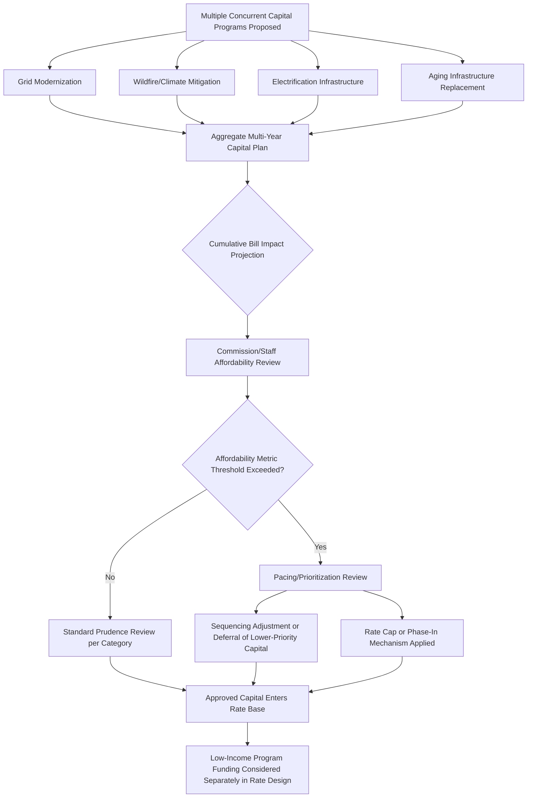

## Affordability Pressures and Rising Capital Expenditure Trends

### Overview

This topic addresses the structural tension between accelerating utility capital expenditure (driven by grid modernization, wildfire/climate resilience, electrification-enabling infrastructure, and replacement of aging assets) and the growing concern — among regulators, consumer advocates, and legislators — that cumulative rate increases are outpacing customer income growth and inflation. Unlike single-issue cost categories, affordability pressure is a cross-cutting rate-basing concern that increasingly shapes how commissions evaluate prudence, pacing, and capital structure decisions across all categories of utility investment.

### Why This Is an Emerging Rate-Basing Issue

- **Key Points**
  - Multiple simultaneous capital demand drivers (grid modernization, wildfire mitigation, electrification, decarbonization mandates, cybersecurity) are converging in many jurisdictions at the same time, creating cumulative rate pressure beyond what any single rate case traditionally addressed in isolation
  - Traditional rate-basing methodology evaluates each capital investment largely on its own prudence merits, with limited structural mechanism to weigh cumulative affordability impact across multiple concurrent investment categories
  - Rising interest rates in recent years have increased the cost of debt-financed capital programs, compounding the effect of capital expenditure growth on revenue requirements
  - Several state legislatures and commissions have begun exploring affordability-specific regulatory tools (rate caps, affordability metrics as formal decision criteria, capital expenditure pacing reviews) that represent a departure from purely cost-of-service-driven rate-basing
  - Affordability concerns intersect with, but are analytically distinct from, both media/public narrative framing (covered separately) and low-income assistance program design (a rate design and social policy tool, not a rate-basing capital treatment)

### Structural Drivers of Rising Capital Expenditure

| Driver Category | Representative Investment | Typical Multi-Year Trend Direction |
| --- | --- | --- |
| Grid modernization/resilience | AMI, ADMS, hardening, cybersecurity | Increasing |
| Wildfire/climate mitigation | Undergrounding, covered conductor, vegetation management | Increasing, concentrated in high-risk regions |
| Electrification-enabling infrastructure | EV make-ready, distribution capacity upgrades | Increasing, still early-stage in most territories |
| Aging infrastructure replacement | Pipe/pole/transformer replacement programs | Steady to increasing, varies by system age |
| Decarbonization/generation transition | Renewable interconnection, generation retirement/replacement | Increasing, policy-dependent |
| Inflation in materials/labor | General construction cost escalation | Increasing (macroeconomic, not utility-specific) |

[Inference] The relative weight of each driver in total capital expenditure growth varies substantially by utility, region, and system age, and no single driver dominates uniformly across the industry; aggregate industry-wide capital expenditure trend figures should be sourced from current industry data (e.g., EEI, S&P Global, or utility-specific integrated resource/capital plans) rather than assumed static.

### Cumulative Rate Impact vs. Single-Case Prudence Review

A central emerging tension addressed by this topic:

$$\text{Cumulative Bill Impact} = \prod_{i=1}^{n} (1 + \Delta_i) - 1$$

Where $\Delta_i$ represents the percentage rate impact of each sequential rate case, rider adjustment, or fuel cost pass-through over a multi-year period.

- Traditional rate-basing review evaluates each rate case (or rider filing) largely in isolation against the prudence and used-and-useful standards applicable to that specific request
- Cumulative affordability concerns arise because a sequence of individually "reasonable" rate actions can compound into a bill impact that significantly outpaces inflation or income growth over a multi-year period, even where no single case would be considered imprudent in isolation
- [Inference] Some commissions have begun requesting or requiring utilities to present multi-year cumulative bill impact projections alongside individual rate case filings, reflecting an emerging (though not universally adopted) procedural response to this compounding effect.

### Emerging Regulatory Tools Responding to Affordability Pressure

#### 1. Formal Affordability Metrics as Decision Criteria

- Some jurisdictions have begun incorporating explicit affordability metrics (e.g., energy burden by income decile, bill-to-income ratios) as formal or quasi-formal considerations in rate case review, rather than treating affordability solely as a public comment or political consideration
- [Unverified] The degree to which affordability metrics carry binding decisional weight (as opposed to informational/contextual consideration) varies by jurisdiction and is not standardized; some states' statutes explicitly list affordability as a factor commissions must consider, while others treat it as an implicit consideration within the "just and reasonable" standard.

#### 2. Capital Expenditure Pacing and Prioritization Review

- Rather than evaluating each capital category independently, some commissions and consumer advocates have pushed for integrated, multi-year capital planning review that explicitly prioritizes and sequences investment categories against affordability constraints
- This is procedurally distinct from traditional single-issue rate case review and more closely resembles integrated resource planning (IRP) methodology extended to distribution capital planning

#### 3. Rate Caps and Multi-Year Price Controls

- Some multi-year rate plans (MYRPs) incorporate explicit affordability-oriented caps on annual bill increases, independent of the underlying cost-of-service calculation, effectively smoothing rate impact over time even if it creates timing mismatches with actual cost incurrence
- [Inference] Rate caps that diverge from strict cost-of-service alignment create their own regulatory tension (potential underrecovery or deferred cost accumulation) and are typically paired with true-up or deferral mechanisms to reconcile the gap over a longer time horizon.

#### 4. Low-Income Program Expansion (Rate Design, Not Rate-Basing)

- Percentage-of-income payment plans (PIPPs), targeted bill assistance, and low-income rate discounts address affordability at the customer bill level rather than at the capital investment/rate-basing level
- These programs do not reduce underlying revenue requirement but redistribute its collection; their cost is typically recovered from the broader customer base, which itself can become a contested rate design and equity question

### Affordability-Driven Capital Review Process

### Interaction With Cost of Capital

Affordability pressure indirectly intersects with cost-of-capital determinations:

- Consumer advocates sometimes argue that elevated capital expenditure combined with affordability concerns warrants closer scrutiny of allowed ROE, capital structure (debt/equity ratio), and cost of debt assumptions, since a lower allowed return directly reduces revenue requirement
- Utilities generally argue that credit rating maintenance (which depends partly on adequate, timely cost recovery and a reasonable allowed return) is itself an affordability-protective measure, since credit deterioration raises the cost of debt-financed capital and ultimately increases long-run ratepayer cost
- [Inference] This creates a genuine analytical tension rather than a one-directional relationship: aggressive rate suppression in the name of near-term affordability can, in some circumstances, increase long-run costs through higher financing costs, while unconstrained capital approval can strain near-term affordability — the appropriate balance is a recurring, unresolved point of contention rather than a settled formula.

### Practical Example: Multi-Program Affordability Tension

**Example**

> A utility simultaneously requests, across separate proceedings within an 18-month period: (1) a general rate case reflecting aging infrastructure replacement and AMI deployment, (2) a wildfire mitigation rider increase, (3) an EV make-ready capital tracker, and (4) a fuel cost pass-through adjustment.
>
> Individually, commission staff may find each request prudent and reasonably justified. Cumulatively, a residential customer's bill could increase by a combined percentage significantly exceeding regional inflation over the same period.
>
> An increasingly common regulatory response is to require the utility to present a consolidated, cumulative bill impact analysis across all pending and recently approved proceedings at each new filing, allowing the commission to weigh sequencing and pacing decisions (e.g., delaying a discretionary portion of the EV make-ready program) even where each individual request would otherwise be approved on its own prudence merits.

### Distinguishing Affordability Review From Traditional Prudence Review

| Aspect | Traditional Prudence Review | Affordability-Oriented Review |
| --- | --- | --- |
| Unit of analysis | Individual capital project/category | Cumulative, multi-program, multi-year bill impact |
| Primary question | Was this specific spending reasonable and necessary? | Can customers reasonably absorb the combined rate impact? |
| Legal basis | "Used and useful" / prudent investment standards | Increasingly explicit statutory affordability factors in some states; otherwise implicit within "just and reasonable" standard |
| Typical outcome tool | Disallowance of imprudent costs | Pacing, phase-in, rate caps, or programmatic prioritization |

### Related Topics

- Grid Modernization and Resilience Investment Recovery
- Climate Risk, Wildfire Mitigation, and Hardening Costs
- Beneficial Electrification and Rate Base Growth
- Media Coverage and Affordability Narratives
- Cost of Capital and Return on Equity Determination
- Multi-Year Rate Plans and Performance-Based Ratemaking
- Low-Income and Percentage-of-Income Payment Plan (PIPP) Design
- Integrated Distribution Planning and Capital Prioritization
- Utility Credit Ratings and Financing Cost Implications
- Public Comment and Participation Processes