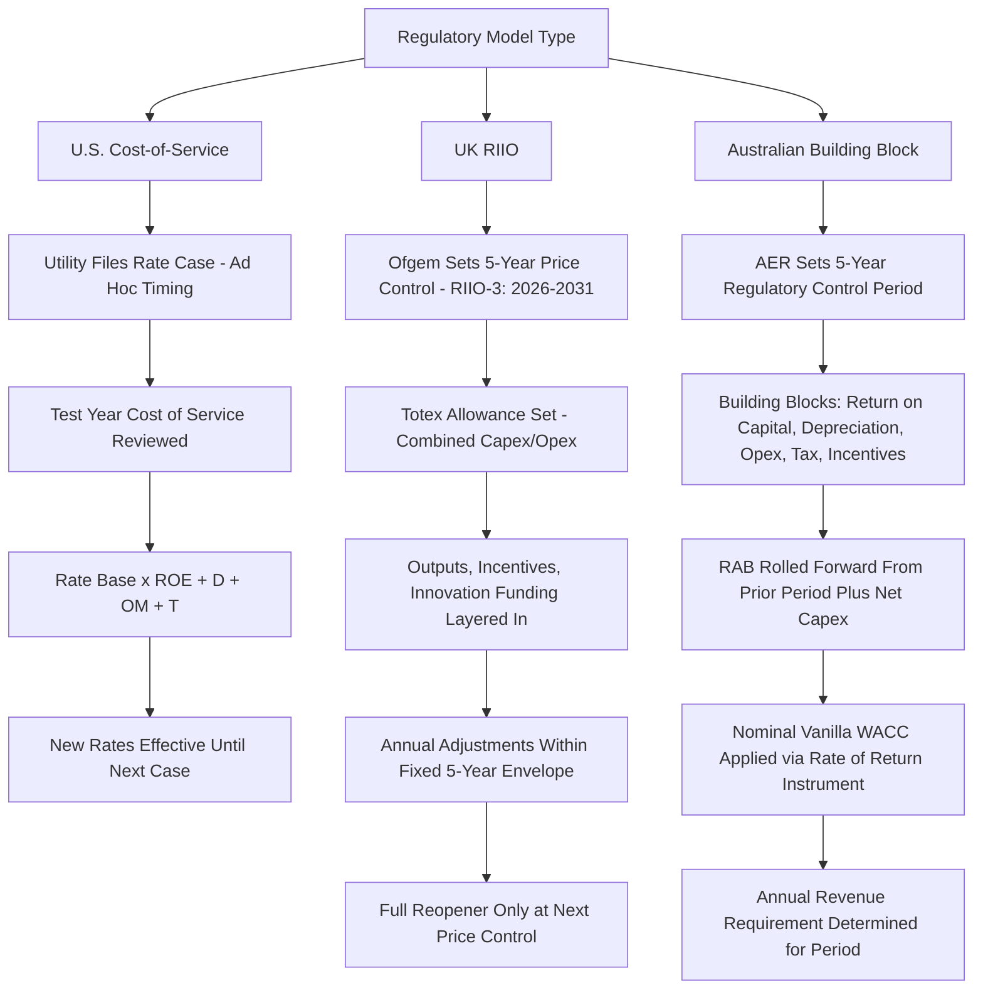

## Comparative International Models: UK RIIO and Australian Frameworks

### Overview

While U.S. utility rate-basing is dominated by cost-of-service ratemaking with periodic general rate cases, two international regulatory models — the UK's RIIO framework (administered by Ofgem) and Australia's building block model (administered by the Australian Energy Regulator, AER) — represent mature, alternative approaches built around multi-year price controls, explicit incentive mechanisms, and formulaic revenue-setting. Both are increasingly referenced in U.S. policy discussions of performance-based ratemaking (PBR) and multi-year rate plans (MYRPs), making comparative understanding useful for practitioners assessing emerging U.S. regulatory reform proposals.

### UK RIIO Framework: Structure and Current Status

RIIO stands for **Revenue = Incentives + Innovation + Outputs**, reflecting its core design philosophy: setting network company revenue based on a formula that rewards efficiency, innovation, and delivery of outputs customers value, rather than purely reimbursing cost-of-service inputs.

- **Key Points**
  - RIIO price controls apply to Great Britain's gas and electricity transmission and distribution network monopolies, regulated by Ofgem (the Office of Gas and Electricity Markets)
  - The framework has evolved through successive multi-year periods: RIIO-1 ran from 2013 to 2023 for the relevant sectors
  - The current active period, RIIO-3, runs from 1 April 2026 to 31 March 2031, replacing RIIO-2 (which ended 31 March 2026) for the electricity transmission, gas transmission, and gas distribution sectors
  - Electricity distribution follows a separate, offset schedule: RIIO-ED2 runs until 2028, with RIIO-ED3 to follow from 2028 to 2033
  - Ofgem published its RIIO-3 Final Determinations on 4 December 2025, approving £28.1 billion of upfront funding for investment within a wider investment pipeline of around £90 billion over the RIIO-3 period

[Inference] The offset timing between transmission/gas distribution (RIIO-3, starting 2026) and electricity distribution (RIIO-ED3, starting 2028) reflects Ofgem's staggered review cycle design, which allows regulatory resources and stakeholder attention to be sequenced across sectors rather than reviewing all network types simultaneously — a structural choice with no direct U.S. rate-basing analog, where most state commissions review each utility's rate case independently regardless of sector-wide timing.

### RIIO Revenue-Setting Mechanics

The RIIO framework sets a total allowed revenue for each five-year period based on:

1. **Totex (total expenditure) allowance** — a single combined allowance covering both capital expenditure (capex) and operating expenditure (opex), rather than the U.S. model's more rigid separation between rate-base capital treatment and expensed O&M
2. **Outputs and incentives** — specific performance commitments (reliability, safety, environmental, customer satisfaction) tied to financial rewards or penalties
3. **Innovation funding** — dedicated allowances for innovation projects; in RIIO-2, funding is available through the Network Innovation Allowance (NIA) and the Strategic Innovation Fund (SIF), succeeding the Network Innovation Competition (NIC) used in RIIO-1
4. **Cost of capital (WACC) determination** — set for the full price control period, reducing (though not eliminating) the frequency of contested rate-of-return litigation compared to a system with rate cases every 1–3 years

The totex approach is a structurally significant departure from U.S. rate-basing: by blending capex and opex into a single efficiency-incentivized allowance, RIIO reduces (though does not eliminate) the incentive for utilities to prefer capital solutions over operating solutions purely because capital earns a return under rate base treatment — a dynamic sometimes called the "capital bias" or "Averch-Johnson effect" in U.S. rate-basing literature.

### Australian Building Block Model: Structure and Current Status

The Australian building block model, administered by the AER under the National Electricity Law and National Electricity Rules, more closely resembles traditional U.S. cost-of-service ratemaking than RIIO does, while incorporating multi-year regulatory periods and explicit incentive schemes.

- **Key Points**
  - The AER regulates the revenues of transmission and distribution network service providers by establishing revenue caps or price caps, typically for five-year regulatory control periods
  - The annual revenue requirement is determined using a defined set of building blocks — including return on capital, regulatory depreciation (return of capital), forecast operating expenditure, tax allowances, and incentive scheme adjustments — an approach structurally analogous to the U.S. revenue requirement formula ($RB \times r + D + O\&M + T$)
  - The Regulatory Asset Base (RAB) — Australia's rate base equivalent — is rolled forward each period based on actual and forecast capital expenditure net of disposals and capital contributions
  - Multiple Australian distribution networks (e.g., Powercor, AusNet Services, Jemena) received final determinations for the 2026–31 regulatory control period during 2026, reflecting the AER's standard five-year determination cycle
  - The AER became a standalone agency on 1 July 2026, a governance change from its prior structure as a constituent part of the Australian Competition and Consumer Commission (ACCC)

[Unverified] The precise institutional and procedural implications of the AER's 1 July 2026 transition to standalone agency status — including whether this affects appeal rights, determination procedures, or its relationship to the ACCC going forward — were not detailed in the sources reviewed for this content; practitioners should consult current AER governance documentation for specifics.

### Comparative Structure: RIIO vs. Building Block Model vs. U.S. Cost-of-Service

| Dimension | UK RIIO | Australian Building Block | U.S. Cost-of-Service (Traditional) |
| --- | --- | --- | --- |
| Regulatory period length | 5 years | 5 years | Typically indefinite between rate cases (test year based) |
| Capex/opex treatment | Combined "totex" allowance | Separated (capex → RAB; opex → separate allowance) | Separated (capex → rate base; O&M → expensed) |
| Cost of capital determination | Set for full price control period | Set for full regulatory control period (AER Rate of Return Instrument, reviewed periodically) | Typically re-litigated each rate case |
| Incentive mechanism intensity | High — central design principle (Incentives is literally in the acronym) | Moderate to high — explicit incentive schemes (e.g., efficiency benefit sharing) | Traditionally low; increasing under emerging U.S. PBR/MYRP adoption |
| Primary regulator | Ofgem (national) | AER (national, under National Electricity Rules) | State-by-state PUCs (no national ratemaking body) |
| Rate base equivalent | Regulatory Asset Value (RAV), rolled forward under totex framework | Regulatory Asset Base (RAB), rolled forward under building blocks | Rate Base, established per rate case |

### AER Rate of Return Framework

A structurally notable feature of the Australian model relevant to U.S. cost-of-capital comparison is the AER's use of a **nominal vanilla WACC** — a weighted average cost of capital formulation that excludes tax-related matters, combining a post-tax return on equity and a pre-tax return on debt, for consistency across the other building blocks in the revenue determination.

$$\text{Nominal Vanilla WACC} = \left(\frac{E}{V}\right) \times r_e^{post\text{-}tax} + \left(\frac{D}{V}\right) \times r_d^{pre\text{-}tax}$$

This differs structurally from the standard U.S. after-tax WACC formulation (which applies a $(1-T_c)$ adjustment to the debt component within the WACC itself), because the Australian building block model instead handles corporate income tax as its own separate, explicit building block in the revenue requirement calculation — an architectural difference in how the same underlying financial concept (tax-adjusted return) is incorporated into the revenue-setting formula, rather than a difference in the substance of what is ultimately recovered.

- The AER periodically reviews and publishes a Rate of Return Instrument (most recently referenced as the 2022 instrument) that sets the binding methodology for determining allowed returns across all regulated Australian network businesses for the following period, functioning similarly to a standardized, centrally-set cost-of-capital methodology rather than a case-by-case litigated determination

### Process Comparison Diagram

### Relevance to U.S. Emerging Rate-Basing Trends

Both international models are frequently cited as reference points in U.S. discussions of performance-based ratemaking and multi-year rate plans:

- The RIIO totex/incentive structure is often cited by U.S. PBR advocates as a model for reducing capital bias and better aligning utility incentives with customer-valued outcomes rather than capital deployment volume
- The Australian building block model's standardized, periodically-reviewed Rate of Return Instrument is sometimes cited as a potential template for reducing the frequency and cost of contested ROE litigation in U.S. rate cases, since it separates the methodology-setting process from individual utility revenue determinations
- [Inference] Direct transplantation of either model into the U.S. context faces structural obstacles not present in the UK or Australia: the U.S. lacks a single national electricity regulator equivalent to Ofgem or the AER, meaning any RIIO-style or building-block-style reform would need to be adopted state-by-state (or through federal legislation restructuring jurisdictional authority), a materially more fragmented reform pathway than exists in either comparator jurisdiction.

### Key Structural Differences Affecting Comparability

- **Jurisdictional centralization**: Both RIIO and the Australian model operate under a single national (or near-national) regulator, while U.S. rate-basing is fragmented across 50+ state commissions plus FERC for wholesale/interstate matters, limiting direct one-to-one policy transplantation
- **Ownership structure**: UK and Australian regulated network companies are generally pure "wires" or "pipes" businesses (unbundled from generation/retail in most cases), while many U.S. utilities remain vertically integrated (owning generation, transmission, and distribution), which changes the scope and complexity of what a totex or building-block revenue determination must cover
- **Legal standard**: U.S. rate-basing operates under the constitutional and statutory "just and reasonable" standard rooted in U.S. Supreme Court precedent (e.g., *Hope Natural Gas*, *Bluefield*), while RIIO and the Australian model operate under their respective national regulatory statutes (UK energy legislation and Ofgem's licence conditions; Australia's National Electricity Law and National Electricity Rules) without a directly equivalent constitutional takings-based standard

### Related Topics

- Performance-Based Ratemaking and Multi-Year Rate Plans
- Cost of Capital and Return on Equity Determination
- Regulatory Lag and Its Effect on Capital Investment Incentives
- Averch-Johnson Effect and Capital Bias in Rate-of-Return Regulation
- Totex vs. Traditional Capex/Opex Treatment in Ratemaking
- Federal vs. State Jurisdictional Fragmentation in U.S. Utility Regulation
- Grid Modernization and Resilience Investment Recovery
- Vertical Integration vs. Unbundled Utility Ownership Models
- "Just and Reasonable" Rate Standard: Legal Basis and Application
- Innovation Funding Mechanisms in Network Regulation