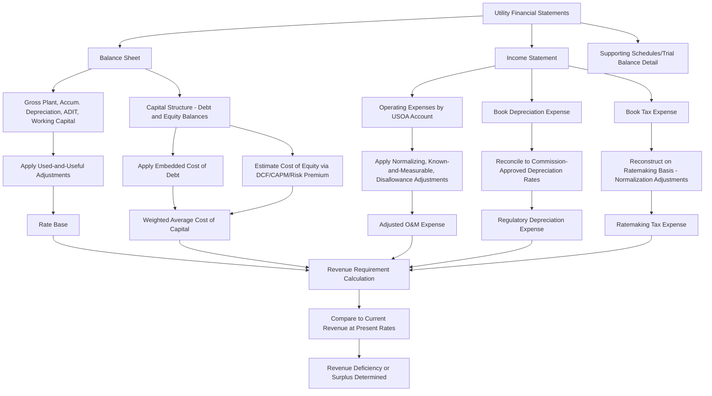

## Building a Revenue Requirement Model from Financial Statements

### Overview

Building a revenue requirement model from financial statements is the core applied modeling exercise in cost-of-service ratemaking: translating a utility's audited or test-year financial statements (balance sheet, income statement, and supporting schedules) into the components of the revenue requirement formula, adjusted for ratemaking-specific treatment. This process bridges GAAP/FERC-basis financial accounting and regulatory accounting, which diverge in important, specific ways that a practitioner must correctly identify and adjust for.

### The Core Revenue Requirement Formula

$$\text{Revenue Requirement} = (RB \times r) + D + O\&M + T - \text{Other Revenue}$$

Where:

- $RB$ = Rate Base
- $r$ = Weighted Average Cost of Capital (allowed rate of return)
- $D$ = Depreciation expense
- $O\&M$ = Operating and maintenance expense
- $T$ = Taxes (income and other)
- $\text{Other Revenue}$ = Non-base revenue credited back to ratepayers (e.g., miscellaneous service revenue)

Each component is built from a distinct part of the utility's financial statements, adjusted through a series of standard ratemaking normalizations.

### Step 1: Establishing the Test Year

- **Key Points**
  - Most U.S. jurisdictions require a defined test year — historical, fully forecasted (future), or a hybrid/partially forecasted approach — as the base period for the revenue requirement calculation
  - Historical test years use actual, audited financial statements for a defined 12-month period, then apply "known and measurable" adjustments for changes occurring after the test year but before rates take effect
  - Forecasted/future test years use pro forma projected financial statements, requiring more extensive forecasting methodology and generally facing more intensive scrutiny of forecast assumptions
  - [Inference] The choice of test year type is generally set by state statute or commission rule rather than utility discretion in most jurisdictions, though specific procedural flexibility (e.g., permitted adjustment periods) varies significantly by state.

### Step 2: Building Rate Base from the Balance Sheet

Rate base is constructed primarily from the utility's balance sheet, specifically the FERC Uniform System of Accounts (USOA) classification of utility plant and related accounts (for FERC-jurisdictional and most state-regulated utilities that follow USOA-based chart of accounts conventions).

$$RB = \text{Gross Utility Plant} - \text{Accumulated Depreciation} - \text{ADIT} + \text{Working Capital} + \text{Other Rate Base Items}$$

| Component | Source Financial Statement Line | Typical Adjustments |
| --- | --- | --- |
| Gross Utility Plant in Service | Balance sheet, Utility Plant accounts (USOA 100-series) | Exclude non-utility or unregulated property; include only "used and useful" plant |
| Accumulated Depreciation | Balance sheet, contra-asset account | Verify depreciation rates match commission-approved rates, not just book/GAAP rates |
| Construction Work in Progress (CWIP) | Balance sheet, CWIP account | Jurisdiction-specific: some states include CWIP in rate base (with AFUDC offset consideration), others exclude entirely pending completion |
| Accumulated Deferred Income Tax (ADIT) | Balance sheet, deferred tax liability/asset accounts | Verify normalization consistency (see below); distinguish protected vs. unprotected ADIT |
| Working Capital | Derived, often via lead-lag study or formula method | Two primary methodologies: balance sheet method (13-month average of specific accounts) or lead-lag study (cash conversion cycle analysis) |
| Materials & Supplies, Fuel Inventory | Balance sheet, inventory accounts | Typically averaged over test year; verify valuation methodology (FIFO, average cost) |

**Used and Useful Adjustment**: A critical, non-mechanical step — not all plant recorded on the balance sheet is automatically rate-base eligible. The utility (and, in contested cases, intervenors) must demonstrate that included plant is "used and useful" in providing utility service, which may require excluding excess capacity, abandoned projects, or non-jurisdictional property from the gross plant figure pulled directly from the balance sheet.

### Step 3: Building Operating Expenses from the Income Statement

$$O\&M = \text{Total Operating Expenses (Income Statement)} \pm \text{Pro Forma Adjustments}$$

| Adjustment Category | Purpose | Example |
| --- | --- | --- |
| Normalizing adjustments | Remove non-recurring or unusual items | Storm costs, one-time litigation settlements, extraordinary write-offs |
| Known and measurable adjustments | Reflect changes known at time of filing but not yet in test-year actuals | Recently executed labor contract wage increases, new debt issuance interest cost |
| Disallowed cost adjustments | Remove costs the utility may not recover from ratepayers | Lobbying expenses, certain executive compensation above a reasonableness threshold, charitable contributions (jurisdiction-dependent), advertising deemed promotional rather than informational |
| Affiliate transaction adjustments | Verify at-cost or arm's-length pricing for services from affiliated/parent companies | Shared services agreements, corporate allocations from a parent holding company |
| Annualization adjustments | Convert partial-year actuals to full-year equivalents | A rate increase from another jurisdiction effective mid-test-year, annualized to reflect a full 12 months |

[Inference] The specific categories and thresholds for disallowed costs (particularly executive compensation and lobbying/advocacy expense treatment) vary significantly by jurisdiction and are frequently contested in rate case testimony; no uniform national standard governs these categories, so specific treatment should be verified against the applicable state commission's precedent and rules.

### Step 4: Depreciation Expense

- Regulatory (book) depreciation expense, as reflected in the income statement, must be reconciled against the depreciation rates and methodology approved by the commission — which may differ from rates used for tax purposes (see normalization) and, in some cases, from rates used in the utility's own GAAP financial reporting for non-regulatory purposes
- Depreciation studies (typically conducted periodically, not annually) establish the approved service lives and net salvage assumptions underlying the regulatory depreciation rate applied to each plant account
- [Unverified] The specific frequency at which a given jurisdiction requires updated depreciation studies (e.g., every rate case vs. a fixed multi-year cycle) varies by commission rule and is not standardized nationally; verify against the applicable jurisdiction's procedural rules.

### Step 5: Tax Expense

Tax expense modeling draws from both the income statement (book tax expense as reported) and requires reconstruction on a ratemaking basis:

$$T = (\text{Taxable Income} \times T_c) + \text{Other Taxes} - \text{Tax Credits}$$

- **Income tax**: Computed at the current federal corporate rate (21% as of the current tax year) plus applicable state corporate income tax rate, applied to ratemaking taxable income — which differs from GAAP book income due to permanent and timing differences (see normalization discussion in the federal tax policy topic)
- **Other taxes**: Property tax, payroll tax, gross receipts tax, and other non-income taxes are typically drawn more directly from income statement expense accounts with limited ratemaking adjustment
- **Tax credits**: Investment tax credits (ITCs) and other credits require normalization treatment analogous to accelerated depreciation, spreading the benefit over time rather than flowing it through immediately

### Step 6: Cost of Capital and Capital Structure

Capital structure is drawn from the balance sheet's liabilities and equity section, typically using a test-year-end or average capital structure:

$$\text{WACC} = \left(\frac{E}{V}\right) \times r_e + \left(\frac{D}{V}\right) \times r_d \times (1 - T_c)$$

| Input | Source | Typical Method |
| --- | --- | --- |
| Capital structure weights ($E/V$, $D/V$) | Balance sheet, long-term debt and equity accounts | Often capped at a "hypothetical" capital structure if actual structure is imprudently leveraged (or under-leveraged) relative to industry norms |
| Cost of debt ($r_d$) | Embedded cost of outstanding debt instruments | Weighted average of actual coupon rates on outstanding debt issuances, not current market rates |
| Cost of equity ($r_e$) | Not directly observable from financial statements | Estimated via DCF, CAPM, risk premium, or comparable earnings methodologies applied to proxy group data — the most heavily litigated single input in most rate cases |

### End-to-End Model Construction Flow

### Reconciling GAAP/FERC Accounting to Ratemaking Treatment

A recurring modeling challenge is that financial statements are prepared on a GAAP (or FERC USOA) basis for financial reporting purposes, while ratemaking requires a distinct, sometimes materially different, treatment:

| Item | GAAP/Financial Reporting Treatment | Ratemaking Treatment |
| --- | --- | --- |
| Pension and OPEB costs | ASC 715/ASC 960-based accounting, which can create significant income statement volatility | Often normalized/smoothed using actuarially-determined contribution levels rather than GAAP expense recognition |
| Storm costs | May be expensed immediately or reflected as incurred | Often deferred and amortized over a multi-year period via regulatory asset treatment |
| Goodwill and acquisition premium | Amortized or tested for impairment under GAAP | Typically excluded entirely from rate base as a non-utility, non-used-and-useful asset |
| Stock-based compensation | Expensed under ASC 718 | Frequently disallowed in whole or part as a ratemaking expense in many jurisdictions |
| Income tax expense | ASC 740-based, reflecting book-tax differences and deferred tax accounting | Reconstructed specifically under normalization rules (IRC §168(i)(9)) rather than simply adopting GAAP tax expense |

[Inference] The degree of divergence between GAAP and ratemaking treatment for a given cost category depends heavily on jurisdiction-specific precedent; some states have adopted more GAAP-aligned ratemaking conventions for certain cost categories (e.g., pension) than others, so a practitioner building a model for a specific jurisdiction should confirm current treatment against that state's rate case precedent rather than assuming uniform national practice.

### Practical Example: Simplified Model Walkthrough

**Example**

> Starting inputs drawn from financial statements (simplified, illustrative figures):
>
> - Gross Utility Plant in Service (balance sheet): $2,000M
> - Accumulated Depreciation (balance sheet): $600M
> - ADIT (balance sheet, deferred tax liability): $180M
> - Working Capital (lead-lag study result): $40M
> - **Rate Base** = $2,000M − $600M − $180M + $40M = **$1,260M**
> - Operating Expenses (income statement, before adjustments): $310M
> - Less: one-time litigation settlement (normalizing adjustment): −$8M
> - Plus: known labor contract wage increase (known and measurable): +$5M
> - **Adjusted O&M** = $310M − $8M + $5M = **$307M**
> - Regulatory Depreciation Expense (reconciled to approved rates): $95M
> - Ratemaking Tax Expense (reconstructed under normalization): $42M
> - Weighted Average Cost of Capital: 7.2%
>
> **Revenue Requirement** = ($1,260M × 7.2%) + $95M + $307M + $42M = $90.7M + $95M + $307M + $42M = **$534.7M**
>
> If current revenue at existing rates is $505M, the model indicates a revenue deficiency of approximately $29.7M, forming the basis for the requested rate increase — before rate design allocates this deficiency across customer classes.

### Common Modeling Pitfalls

- Pulling gross plant directly from the balance sheet without applying used-and-useful screening, overstating rate base
- Using GAAP book tax expense directly rather than reconstructing ratemaking tax expense under normalization rules, which can materially misstate the tax component and create normalization compliance risk
- Failing to distinguish protected (normalization-restricted) from unprotected ADIT when modeling rate base offsets, particularly following a federal tax law change
- Applying current market cost of debt rather than embedded (actual weighted average coupon) cost of debt for the $r_d$ input
- Omitting or mishandling CWIP treatment inconsistently with the specific jurisdiction's rules (inclusion with AFUDC offset vs. full exclusion)
- Double-counting or omitting working capital when both a formulaic balance sheet method and elements of a lead-lag study are present in supporting schedules

### Related Topics

- Rate Base Components and the Used-and-Useful Standard
- Federal Tax Policy Shifts and Normalization Implications
- Cost of Capital and Return on Equity Determination Methodologies
- Lead-Lag Studies and Working Capital Calculation Methods
- Depreciation Studies and Service Life/Net Salvage Analysis
- Test Year Selection: Historical, Forecasted, and Hybrid Approaches
- Pro Forma and Known-and-Measurable Adjustments in Rate Cases
- Affiliate Transaction Review and Cost Allocation Manuals
- Discovery and Data Request Practice in Financial Statement Review
- Multi-Year Rate Plans and Forward-Looking Test Year Methodology