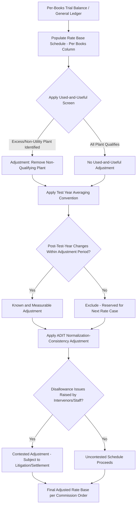

## Constructing a Rate Base Schedule with Adjustments

### Overview

Constructing a rate base schedule with adjustments is the detailed, line-item modeling exercise that produces the $RB$ component of the revenue requirement formula. While the previous topic addressed building the full revenue requirement model from financial statements, this topic focuses specifically on the mechanics, format, and adjustment methodology of the rate base schedule itself — the specific workpaper format used in testimony exhibits, direct/rebuttal schedules, and settlement negotiations across virtually all U.S. rate case proceedings.

### Standard Rate Base Schedule Format

Rate base schedules in filed testimony typically follow a standardized columnar format, showing the progression from unadjusted (as-recorded) balances to the final adjusted rate base used in the revenue requirement calculation:

| Column | Content |
| --- | --- |
| Line Description | Plant account or rate base component name |
| Per Books (Column A) | Unadjusted balance as recorded in the utility's books/trial balance |
| Adjustment 1, 2, 3... | Sequential, individually labeled and cross-referenced adjustments |
| Adjusted Total (Final Column) | Per books balance plus/minus all adjustments |

This format allows intervenors, staff, and the ALJ to trace each adjustment back to specific supporting testimony and workpapers, and allows a commission to accept some adjustments while rejecting others in its final order without needing to reconstruct the entire schedule.

### Core Rate Base Schedule Line Items

$$RB = \text{Gross Plant in Service} - \text{Accumulated Depreciation} + \text{CWIP (if included)} - \text{ADIT} + \text{Working Capital} + \text{Materials \& Supplies} - \text{Customer Advances/Contributions} + \text{Other Rate Base Items}$$

| Line Item | Typical Sign | Notes |
| --- | --- | --- |
| Gross Plant in Service | + | Organized by USOA function (production, transmission, distribution, general) |
| Accumulated Depreciation Reserve | − | Contra-asset; reduces gross plant to net plant |
| Construction Work in Progress (CWIP) | + (if included) | Jurisdiction-dependent inclusion; often paired with AFUDC treatment |
| Accumulated Deferred Income Tax (ADIT) | − | Represents ratepayer-funded, cost-free capital from tax timing differences |
| Materials & Supplies Inventory | + | Typically averaged over test year |
| Fuel Inventory (if applicable) | + | Relevant primarily for generation-owning utilities |
| Cash Working Capital | + | Derived via lead-lag study or formula method |
| Customer Advances for Construction | − | Contributed capital not funded by the utility |
| Contributions in Aid of Construction (CIAC) | − | Similar treatment to customer advances |
| Customer Deposits | − | Ratepayer-funded liability, offsets rate base |
| Accumulated Deferred Investment Tax Credits (ADITC) | − (if unamortized) | Normalization-restricted, similar treatment logic to ADIT |
| Regulatory Assets/Liabilities | + / − | Case-specific; deferred costs approved for future recovery, or deferred credits owed to ratepayers |

### Categories of Rate Base Adjustments

Adjustments to the per-books balance fall into several recurring categories, each with distinct evidentiary and methodological requirements:

#### 1. Used-and-Useful Adjustments

- Remove plant that is not currently providing utility service — excess capacity, abandoned construction projects, property held for future use beyond a reasonable planning horizon, or non-jurisdictional property
- Requires specific factual evidence (engineering testimony, capacity utilization studies) rather than a formulaic calculation
- [Inference] The evidentiary burden for used-and-useful exclusions typically falls on the party proposing the adjustment — the utility to justify inclusion, or an intervenor/staff to justify exclusion — though the specific allocation of burden varies by jurisdiction's procedural rules and the nature of the disputed asset.

#### 2. Test Year Averaging Adjustments

- Converts point-in-time (year-end) balances to test-year average balances, or vice versa, depending on jurisdictional convention
- Common methodologies: 13-month average (beginning balance plus each month-end balance, divided by 13), 2-point average (beginning and ending balance only), or 5-quarter average for forecasted test years
- [Unverified] The specific averaging convention required varies by jurisdiction and, in some cases, by rate base component within the same jurisdiction; verify against the applicable commission's rules of practice or established precedent rather than assuming a single national standard.

#### 3. Known and Measurable Post-Test-Year Adjustments

- Reflects capital additions or retirements occurring after the test year but before new rates take effect, where the amount and timing are sufficiently certain
- Typically requires a specific in-service date and cost documentation, not merely a budgeted or planned amount
- Often subject to a defined "adjustment period" or "attrition period" cutoff set by jurisdictional rule, beyond which post-test-year changes are not reflected until the next rate case

#### 4. Pro Forma Adjustments for Known Changes in Operations

- Reflects changes to the scale or nature of operations not fully captured in test-year actuals (e.g., a major new service territory annexation, a significant customer class addition)
- Distinguished from ordinary known-and-measurable adjustments by typically representing a structural change rather than a routine capital addition

#### 5. ADIT/Normalization-Consistency Adjustments

- Ensures the ADIT balance used in the rate base schedule reflects normalization-consistent treatment under IRC §168(i)(9)
- Distinguishes protected excess/deficient ADIT (subject to ARAM amortization requirements) from unprotected ADIT (subject to greater commission discretion in flow-back timing)
- Particularly significant following a federal tax law change affecting depreciation methodology or corporate tax rates

#### 6. Disallowance Adjustments

- Removes specific plant investment found imprudent, unnecessary, or otherwise ineligible for rate base inclusion
- Distinguished from used-and-useful exclusions in that disallowances often relate to prudence (was the spending decision reasonable at the time) rather than current utilization status
- Frequently the most heavily litigated category of rate base adjustment, since it directly implicates management decision-making rather than a more mechanical accounting or timing question

### Rate Base Schedule Construction Workflow

### Working Capital Sub-Schedule: Two Methodologies

Because working capital is itself often built as a supporting sub-schedule feeding into the main rate base schedule, it merits specific attention:

| Method | Approach | Typical Use Case |
| --- | --- | --- |
| Balance Sheet (Formula) Method | Applies a standardized formula (often 1/8 of O&M expense, or a specified fraction) as a simplified proxy for cash working capital need | Smaller utilities, or jurisdictions without a lead-lag study requirement |
| Lead-Lag Study | Detailed analysis of the timing gap between when the utility pays its expenses (expense lag) and when it collects revenue from customers (revenue lag) for each major expense and revenue category | Larger utilities, jurisdictions requiring detailed working capital justification |

$$\text{Cash Working Capital} = \text{Average Daily Expense} \times (\text{Revenue Lag} - \text{Expense Lag})$$

- A positive net lag (revenue collected after expenses are paid) indicates the utility must finance this gap, justifying a positive working capital rate base addition
- A negative net lag (expenses paid after revenue collected, e.g., due to favorable payment terms with vendors) can indicate the utility is effectively financed by others, potentially reducing or eliminating the working capital rate base component

### Practical Example: Annotated Rate Base Schedule Excerpt

**Example**

| Line | Description | Per Books | Adj. 1 (Used & Useful) | Adj. 2 (13-Mo. Avg) | Adj. 3 (ADIT Normalization) | Adjusted Total |
| --- | --- | --- | --- | --- | --- | --- |
| 1 | Gross Plant in Service | $2,050M | −$50M | −$15M | — | $1,985M |
| 2 | Accumulated Depreciation | ($610M) | +$12M | −$4M | — | ($602M) |
| 3 | Net Plant (Line 1 − Line 2) | $1,440M |  |  |  | $1,383M |
| 4 | ADIT | ($180M) | — | — | +$6M | ($174M) |
| 5 | Working Capital | $38M | — | — | — | $38M |
| 6 | **Total Rate Base** | **$1,298M** |  |  |  | **$1,247M** |
>
> Adjustment 1 removes $50M of gross plant determined not used-and-useful (with corresponding $12M accumulated depreciation removal on that excluded plant), reflecting engineering testimony on excess substation capacity. Adjustment 2 converts year-end balances to a 13-month average consistent with jurisdictional convention. Adjustment 3 corrects the ADIT balance for normalization-consistent treatment following updated bonus depreciation elections, adding back $6M that had been improperly excluded.

Each adjustment in an actual filed schedule would cross-reference specific supporting testimony (e.g., "See Direct Testimony of [Witness], Exhibit RB-3, p. 12") allowing the ALJ and parties to trace the basis for each figure.

### Settlement Treatment of Rate Base Schedules

- In negotiated settlements (which resolve a substantial share of U.S. rate cases rather than proceeding to full litigated decision), rate base schedules are frequently agreed to on a "black box" basis — parties agree to a final total rate base figure without necessarily agreeing on, or disclosing, the resolution of each individual contested adjustment
- [Inference] Black box settlements can create challenges for precedential value in future rate cases, since the specific reasoning behind any single adjustment's resolution is not preserved in a form other parties or future proceedings can directly cite, unlike a fully litigated commission order that typically explains its reasoning on each contested item.

### Common Errors in Rate Base Schedule Construction

- Inconsistent averaging conventions applied across different rate base components within the same schedule (e.g., 13-month average for plant but year-end balance for ADIT)
- Failing to flow a used-and-useful plant adjustment through to the corresponding accumulated depreciation line, overstating net plant
- Applying working capital formula methods inconsistently with a jurisdiction's specific requirement for a lead-lag study above a materiality threshold
- Omitting cross-references linking each adjustment column to supporting testimony, weakening the evidentiary foundation of the schedule in litigation
- Mismatched test periods between the rate base schedule and the corresponding O&M expense schedule, creating an internally inconsistent revenue requirement calculation

### Related Topics

- Building a Revenue Requirement Model from Financial Statements
- Used and Useful Standard in Rate Base Determination
- Federal Tax Policy Shifts and Normalization Implications
- Lead-Lag Studies and Working Capital Calculation Methods
- Prudence Review Standards in Capital Cost Recovery
- Settlement Negotiations and Black Box Stipulations in Rate Cases
- Test Year Selection: Historical, Forecasted, and Hybrid Approaches
- Depreciation Studies and Service Life/Net Salvage Analysis
- Discovery and Data Request Practice in Rate Case Proceedings
- Cross-Examination Techniques for Rate Case Witnesses