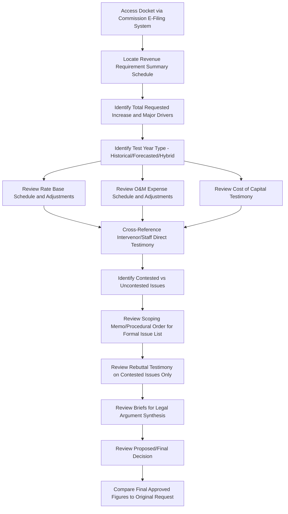

## Analyzing a Real General Rate Case Filing

### Overview

Analyzing a real general rate case (GRC) filing is the applied skill of navigating an actual utility rate case docket — the full set of testimony, exhibits, schedules, and procedural filings a utility submits to justify a requested revenue increase — and extracting the key figures, arguments, and contested issues a practitioner needs to evaluate the case. This topic addresses filing structure, navigation strategy, and analytical technique rather than the substantive ratemaking concepts covered elsewhere, which this analysis draws upon.

### Anatomy of a General Rate Case Filing

A typical GRC filing (particularly at larger state commissions such as California, New York, or Texas) consists of several standard components:

| Component | Purpose | Typical Format |
| --- | --- | --- |
| Application/Petition | Formal request initiating the case, stating the relief sought | Short legal document, often 5-20 pages |
| Direct Testimony (Utility) | Sworn statements from utility witnesses supporting each cost category | Organized by subject area (revenue requirement, cost of capital, depreciation, rate design) |
| Supporting Schedules/Exhibits | Detailed numerical workpapers underlying testimony claims | Standardized schedule formats (often "MFRs" — Minimum Filing Requirements — in some states) |
| Revenue Requirement Summary | Top-level schedule showing the overall requested increase | Typically one or two summary pages tying together all supporting schedules |
| Cost of Capital Testimony | ROE and capital structure justification, often the single most contested testimony | Frequently the longest and most technically dense testimony in the case |
| Rate Design Testimony | Proposed allocation of the revenue requirement across customer classes and rate structure | Class cost-of-service study (CCOSS) and proposed tariff sheets |
| Direct Testimony (Intervenors/Staff) | Responsive testimony proposing adjustments, often filed weeks to months after utility's direct case | Organized to rebut or adjust specific utility schedules |
| Rebuttal Testimony (Utility) | Utility response to intervenor/staff adjustments | Narrower in scope than direct testimony, focused on contested items |
| Briefs (Initial and Reply) | Legal argument synthesizing the evidentiary record | Filed after evidentiary hearings conclude |
| Proposed/Final Decision | ALJ or commission's ruling | States the approved revenue requirement and reasoning on contested issues |

### Step-by-Step Filing Navigation Strategy

- **Key Points**
  - Start with the Revenue Requirement Summary schedule (not the application) to quickly identify the total requested increase and its major components before reading detailed testimony
  - Identify the test year type (historical, forecasted, hybrid) early, since it affects how to interpret every subsequent schedule
  - Locate the cost of capital testimony early, since ROE is typically the single largest-dollar-impact contested issue and often signals the overall contentiousness of the case
  - Cross-reference intervenor testimony against the specific utility schedule it addresses — intervenor testimony is only meaningful in context of what it's adjusting
  - Check the docket for a scoping memo or procedural schedule order, which identifies which issues the commission has formally designated as contested and subject to evidentiary hearing

### Locating and Reading Key Schedules

#### Revenue Requirement Summary Schedule

Typically structured similarly to:

$$\text{Requested Increase} = \text{Proposed Revenue Requirement} - \text{Present Rate Revenue}$$

This top-line schedule usually breaks the total requested increase into major drivers (e.g., "Rate Base Growth," "O&M Increase," "Depreciation Increase," "Tax Changes"), giving an immediate sense of what is driving the case before diving into supporting detail.

#### Rate Base Schedule

Cross-reference against the rate base schedule construction principles: identify the per-books starting balance, trace each adjustment column, and note which adjustments are utility-proposed versus intervenor-proposed (in rebuttal or comparison exhibits).

#### Cost of Capital Testimony

- Identify the utility's proposed ROE and the range cited by the utility's expert witness (typically derived from DCF, CAPM, and risk premium analyses applied to a proxy group of comparable utilities)
- Identify the proxy group composition — differences in proxy group selection are a common source of dispute between competing expert witnesses
- Compare against intervenor/staff ROE testimony, which typically proposes a lower figure using overlapping but not identical methodology and proxy group assumptions

#### Class Cost-of-Service Study (CCOSS) and Rate Design

- Distinguishes the revenue requirement determination (how much total revenue) from rate design (how that revenue is collected from which customer classes) — these are sequential but analytically separate phases within the same filing
- Identify which cost allocation methodology is used (e.g., for electric utilities, common methods include the "12CP," "4CP," or "average and excess demand" methods for allocating demand-related costs among classes)

### Filing Analysis Workflow

### Distinguishing Contested from Uncontested Issues

A critical analytical skill: not every dollar in a utility's request is actually disputed. Most rate cases resolve a substantial majority of the revenue requirement through uncontested or lightly-contested stipulations, with formal litigation concentrated on a smaller set of genuinely disputed issues (often cost of capital, specific large capital projects, or particular expense categories).

- The scoping memo or procedural order issued early in the case typically formally identifies which issues remain contested and subject to evidentiary hearing, which is often the fastest way to identify where analytical attention should be concentrated
- Settled/stipulated issues are often documented in a joint stipulation filed by some or all parties, resolving specific line items without full litigation while leaving remaining issues for hearing

### Reading Intervenor Testimony Effectively

| Question to Ask | Why It Matters |
| --- | --- |
| What specific utility schedule/line item is being adjusted? | Intervenor testimony is only meaningful relative to what it modifies |
| What is the dollar magnitude of the proposed adjustment? | Distinguishes major contested issues from minor technical corrections |
| What methodology or evidentiary basis supports the adjustment? | Determines litigation strength — a well-supported adjustment with clear evidentiary basis carries more weight than an unsupported assertion |
| Is this adjustment novel or does it track prior commission precedent in this jurisdiction? | Precedent-tracking adjustments are more likely to be adopted than novel theories |

### Practical Example: Tracing a Contested Issue Through a Filing

**Example**

> A hypothetical trace through a filing addressing a contested wildfire mitigation capital program:
>
> 1. **Application**: States the utility requests a $45M annual revenue increase, including a wildfire mitigation capital component
> 2. **Utility Direct Testimony (Engineering Witness)**: Describes the $300M covered conductor program, prioritization methodology, and requested rate base inclusion
> 3. **Utility Direct Testimony (Cost of Capital Witness)**: Proposes 10.2% ROE, citing wildfire risk as a factor supporting the upper end of the DCF-derived range
> 4. **Intervenor (Consumer Advocate) Direct Testimony**: Proposes disallowing $40M of the program as insufficiently prioritized toward highest-risk circuits, and proposes 9.4% ROE using a different proxy group
> 5. **Scoping Memo**: Confirms both the $40M capital disallowance issue and the ROE range are formally contested and scheduled for evidentiary hearing
> 6. **Utility Rebuttal Testimony**: Defends the prioritization methodology with updated fire-risk mapping data
> 7. **Evidentiary Hearing**: Cross-examination of both engineering witnesses on prioritization methodology
> 8. **Initial Brief (Consumer Advocate)**: Argues the record supports the $40M disallowance based on hearing testimony
> 9. **Proposed Decision**: ALJ recommends a $15M partial disallowance (a compromise position between the parties) and a 9.7% ROE
>
> Tracing this single issue across nine distinct filing components illustrates why efficient analysis requires targeting specific contested issues (identified via the scoping memo) rather than reading every document in the docket linearly and in full.

### Common Analytical Pitfalls

- Treating the utility's requested figures as the likely outcome, rather than recognizing that litigated and settled rate cases typically result in an approved increase meaningfully below the initial request
- Failing to distinguish base rate case revenue requirement changes from concurrent rider/tracker adjustments being processed in separate, parallel dockets, leading to an incomplete picture of total bill impact
- Overweighting the dollar size of a testimony document rather than its actual contested dollar impact — some lengthy testimony addresses largely uncontested, technical items
- Missing amendments or updates filed after the initial application (e.g., updated cost of capital testimony reflecting changed market conditions, or a settlement stipulation superseding portions of direct testimony)
- Confusing a Proposed Decision (ALJ recommendation, subject to commission adoption, modification, or rejection) with the Final Decision (binding commission order)

### Related Topics

- Building a Revenue Requirement Model from Financial Statements
- Constructing a Rate Base Schedule with Adjustments
- Cost of Capital and Return on Equity Determination Methodologies
- Class Cost-of-Service Studies and Cost Allocation Methodologies
- Settlement Negotiations and Stipulations in Rate Cases
- Discovery and Data Request Practice in Rate Case Proceedings
- Cross-Examination Techniques for Rate Case Witnesses
- Public Comment and Participation Processes
- Drafting and Filing Direct/Rebuttal Testimony
- Administrative Law Judge Role in Utility Rate Proceedings