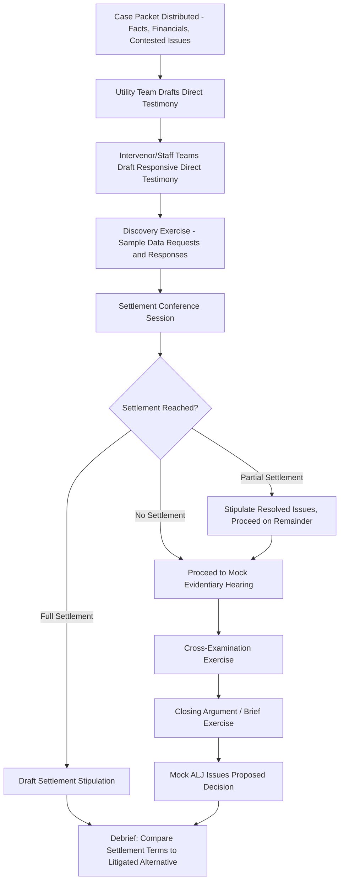

## Mock Rate Case Simulation and Settlement Negotiation

### Overview

A mock rate case simulation and settlement negotiation is a structured pedagogical exercise in which participants assume the roles of utility, intervenors, commission staff, and the ALJ/commission to work through a simplified but realistic rate case from filing through settlement or litigated decision. This exercise integrates the substantive ratemaking concepts, procedural mechanics, and negotiation dynamics covered throughout this material into a single applied simulation.

### Purpose of the Simulation Exercise

- **Key Points**
  - Builds practical familiarity with the sequence and interdependency of rate case procedural steps, which is difficult to internalize from reading individual topic summaries in isolation
  - Develops negotiation judgment specific to regulatory settlement dynamics, which differ meaningfully from general commercial negotiation due to the multi-party, quasi-public-interest nature of rate case settlements
  - Surfaces the tension between advocacy (representing a specific party's interest) and the broader public interest standard the commission itself must apply, which is a recurring professional tension for all practitioners in this field
  - Provides low-stakes practice with core skills (direct testimony drafting, cross-examination, brief writing, settlement drafting) before applying them in an actual proceeding

### Structuring the Simulation: Role Assignments

| Role | Core Responsibility in Simulation | Key Skill Practiced |
| --- | --- | --- |
| Utility Counsel/Witnesses | Present and defend the rate case filing | Direct testimony drafting, defending assumptions under cross-examination |
| Consumer/Ratepayer Advocate | Challenge specific cost items, propose adjustments | Identifying and quantifying contestable issues, cross-examination |
| Commission Staff | Independent analysis, often a moderating position between utility and advocates | Balanced analytical framing, settlement facilitation |
| Industrial/Large Customer Intervenor | Represent class-specific cost allocation and rate design interests | Class cost-of-service argument, coalition or opposition dynamics with other parties |
| Environmental/Policy Intervenor | Represent non-cost policy interests (e.g., decarbonization, equity) | Integrating policy argument into a cost-of-service framework |
| Administrative Law Judge (ALJ) | Preside over procedural schedule, rule on contested motions, issue proposed decision if settlement fails | Neutral evaluation of competing evidentiary positions, procedural management |

[Inference] The specific role set used in a given simulation exercise should be scaled to the group size and time available; smaller simulations often combine roles (e.g., a single "intervenor" role representing consolidated ratepayer interests) while larger academic or training simulations may add additional distinct party roles to reflect the fuller diversity of parties typically seen in major state rate cases.

### Simulation Case Design Elements

A well-constructed mock case should include:

1. **A defined revenue requirement model** with several genuinely contestable issues (typically 3-5 major issues, avoiding overwhelming complexity for a training exercise)
2. **At least one cost-of-capital dispute** (ROE range), since this is nearly universal in real rate cases and offers rich material for competing expert methodology arguments
3. **At least one capital investment prudence dispute** (e.g., a contested infrastructure program), allowing practice with engineering/factual testimony rather than only financial testimony
4. **A rate design component**, so the simulation doesn't stop at revenue requirement but continues through allocation and rate structure
5. **A realistic but compressed procedural schedule**, condensing what would be a 6-12+ month real proceeding into a structured multi-session exercise

### Simulation Procedural Flow

### Settlement Negotiation Dynamics: Core Concepts to Practice

#### Multi-Party, Multi-Issue Trading

Unlike a simple two-party bilateral negotiation, rate case settlements typically involve trading across multiple simultaneous issues among multiple parties:

- A party may concede ground on cost of capital in exchange for a favorable resolution on a specific capital disallowance issue
- Different intervenors may have divergent priorities (e.g., an industrial customer intervenor prioritizes rate design/cost allocation, while a residential advocate prioritizes overall revenue requirement level), creating opportunities for coalition-building or issue-specific alliances that shift depending on the topic
- [Inference] Effective settlement practice generally requires each party to internally rank its issues by priority before entering negotiation, since attempting to hold firm on every issue simultaneously typically results in impasse; this prioritization exercise is itself a valuable simulation learning objective.

#### The "Black Box" vs. "Itemized" Settlement Choice

- A black box settlement resolves the case at an agreed total revenue requirement figure without specifying agreement (or the basis for compromise) on each individual line item
- An itemized settlement specifies the resolution of each contested issue individually, preserving a clearer record for precedential purposes
- Practicing both formats in simulation illustrates the trade-off: black box settlements are often easier to reach (parties need not agree on reasoning, only the bottom line) but provide less guidance for future cases; itemized settlements require harder line-by-line agreement but create more useful precedent

#### Settlement vs. Litigation Risk Assessment

A core negotiation skill applicable to any party role: realistically assessing the range of likely litigated outcomes on each contested issue, to inform whether a proposed settlement term is favorable relative to the litigation alternative.

$$\text{Settlement Value Assessment} \approx P(\text{favorable outcome}) \times \text{Favorable Value} + P(\text{unfavorable outcome}) \times \text{Unfavorable Value} - \text{Litigation Cost}$$

[Inference] This expected-value framing is a useful pedagogical simplification for simulation purposes; in practice, parties in real rate cases often weigh additional non-monetary factors (precedential risk, ongoing relationship with the commission and other parties across multiple future cases, public/political optics of litigating versus settling) that are difficult to reduce to a single expected-value calculation, and a well-designed simulation debrief should surface this added complexity even if the core exercise uses a simplified framework.

### Practical Example: Sample Contested Issue Set for a Simulation

**Example**

> A sample mock case issue set, structured to allow meaningful negotiation practice:
>
> 1. **ROE**: Utility proposes 10.4%, Consumer Advocate proposes 9.2%, Staff proposes 9.7% — a classic three-way spread inviting a compromise landing point
> 2. **Wildfire Mitigation Capital**: Utility requests full $80M inclusion; Consumer Advocate proposes $55M citing insufficient risk-prioritization evidence
> 3. **Executive Compensation**: Staff proposes a $2M disallowance of incentive compensation tied to stock price performance rather than operational metrics — a smaller-dollar but often symbolically significant issue
> 4. **Rate Design — Fixed Charge**: Industrial Intervenor supports a higher fixed charge (favors industrial cost allocation); Residential/Consumer Advocate opposes it (favors lower fixed charge, preserving conservation price signal)
> 5. **Depreciation Rates**: A relatively technical, lower-drama issue likely to settle early, useful for illustrating how not every issue carries equal negotiation weight
>
> A well-run simulation debrief would have participants map which issues were traded against which (e.g., "Consumer Advocate conceded on depreciation rates in exchange for utility movement on the wildfire capital disallowance") to make the trading dynamic explicit and learnable.

### Debrief and Assessment Framework

Following the simulation, an effective debrief typically addresses:

- **Outcome comparison**: How did the negotiated settlement (if reached) compare to the range of plausible litigated outcomes discussed by the mock ALJ or facilitator?
- **Process reflection**: Which negotiation moves were effective? Where did a party over-concede or under-prepare its position?
- **Role-specific learning**: What did each role learn about the institutional perspective and constraints of that party type (e.g., utility counsel gaining appreciation for how a consumer advocate must balance credibility across many simultaneous cases and cannot treat every issue as maximally contested)?
- **Procedural learning**: Did participants correctly sequence discovery, testimony, and settlement conference steps in a manner reflecting real jurisdictional procedure?

### Distinguishing Simulation Practice From Real Proceeding Stakes

[Inference] A simulation, however well-designed, necessarily simplifies several dimensions of a real rate case: real proceedings involve significant sunk cost and reputational stakes for actual utility shareholders and ratepayers, multi-year relationships between recurring parties across successive cases before the same commission, and often genuine scientific/technical uncertainty (e.g., in wildfire risk modeling or load forecasting) that a simulation's case packet typically resolves by design for pedagogical tractability. Participants should treat simulation outcomes as skill-building practice rather than as directly predictive of real-world settlement dynamics, which are shaped by case-specific and jurisdiction-specific factors not fully replicable in a training exercise.

### Related Topics

- Analyzing a Real General Rate Case Filing
- Settlement Negotiations and Stipulations in Rate Cases
- Discovery and Data Request Practice in Rate Case Proceedings
- Cross-Examination Techniques for Rate Case Witnesses
- Drafting and Filing Direct/Rebuttal Testimony
- Cost of Capital and Return on Equity Determination Methodologies
- Class Cost-of-Service Studies and Cost Allocation Methodologies
- Administrative Law Judge Role in Utility Rate Proceedings
- Building a Revenue Requirement Model from Financial Statements
- Constructing a Rate Base Schedule with Adjustments