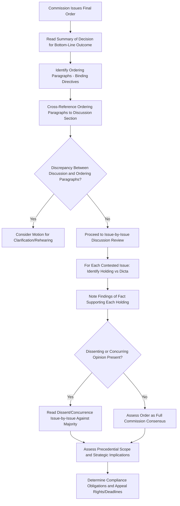

## Interpreting Commission Orders and Dissents

### Overview

Interpreting commission orders and dissents is the applied skill of reading a final regulatory decision — the document that concludes a rate case and carries binding legal effect — to extract its holdings, reasoning, and precedential scope, and to properly weigh any dissenting or concurring commissioner opinions. This is distinct from analyzing the filing itself (covered separately): the order is the outcome, not the input, and requires its own specific reading techniques given its legal and quasi-judicial character.

### Anatomy of a Commission Order

A typical final commission order (or, at the ALJ level, a Proposed Decision) generally follows a structured format:

| Section | Purpose |
| --- | --- |
| Procedural History | Summarizes the case's procedural posture — filing date, parties, hearing dates, briefing schedule |
| Summary of Decision | A brief overview of the bottom-line outcome, often at the very start of the order |
| Issue-by-Issue Discussion | The substantive core — each contested issue addressed with party positions, evidentiary discussion, and the commission's reasoning and conclusion |
| Findings of Fact | Formal factual determinations, often numbered, that the order's legal conclusions rest upon |
| Conclusions of Law | Formal legal determinations, distinguished from findings of fact, addressing whether the approved rates are "just and reasonable" or meet the applicable legal standard |
| Ordering Paragraphs | The operative, legally binding directives — the actual "order" that has legal effect, as distinct from the discussion preceding it |
| Dissenting/Concurring Opinions (if any) | Separate opinions from commissioners who disagree with all or part of the majority decision, or who agree with the outcome but for different reasoning |

### Why the Ordering Paragraphs Matter Most Legally

- **Key Points**
  - The discussion and findings sections explain the commission's reasoning, but the ordering paragraphs are what actually has binding legal force — a utility's compliance obligations, a party's appeal rights, and the effective rate schedule all derive from the ordering paragraphs specifically
  - Discrepancies between the discussion section's stated reasoning and the ordering paragraphs' actual directive occasionally occur (e.g., due to drafting error) and are a recognized basis for a motion for clarification or rehearing in most jurisdictions
  - Practitioners should always confirm the specific dollar figures, effective dates, and compliance requirements in the ordering paragraphs rather than relying solely on the narrative discussion, which may summarize or round figures differently

### Reading the Issue-by-Issue Discussion Effectively

For each contested issue, the discussion section typically follows a recognizable internal structure:

1. **Statement of the issue** — what specifically is in dispute
2. **Party positions summarized** — utility position, intervenor/staff position(s), often with citation to specific testimony
3. **Commission's analysis** — evaluation of the competing evidence and arguments against the applicable legal standard
4. **Conclusion on the issue** — the specific numerical or policy resolution

[Inference] Commissions generally address issues in the order they were framed in the scoping memo or in briefs, though the specific sequencing convention varies by commission and is not standardized nationally; a practitioner analyzing an order for the first time from a new jurisdiction should confirm the document's internal organizational logic before assuming it follows a pattern familiar from another jurisdiction's orders.

### Distinguishing Dicta from Holding

A core legal-reading skill directly applicable to commission orders, borrowed from general administrative and judicial opinion analysis:

| Concept | Definition | Precedential Weight |
| --- | --- | --- |
| Holding | The specific determination necessary to resolve the issue actually before the commission | Binding on the parties in this case; carries precedential weight in future cases before the same commission |
| Dicta | Commentary, observations, or reasoning not strictly necessary to the specific holding | Persuasive but not binding; may signal future commission thinking without committing the commission to a position |

- Commissions sometimes include broader policy commentary in an order's discussion section that goes beyond what was strictly necessary to resolve the specific contested issue — recognizing this as dicta (rather than treating it as an equally binding holding) is important for accurately assessing an order's actual precedential scope
- [Inference] The distinction between holding and dicta is sometimes genuinely ambiguous in commission orders, which (unlike many judicial opinions) are not always drafted with the same rigor toward isolating precise holdings; where ambiguous, practitioners often look to subsequent commission orders that either rely on or decline to rely on the prior language as evidence of how the commission itself later treated it.

### Understanding Dissenting and Concurring Opinions

| Type | Definition | Analytical Value |
| --- | --- | --- |
| Dissent | A commissioner's formal disagreement with the majority's outcome on one or more issues | Signals a genuine, documented split in commission reasoning; can preview arguments likely to resurface in future cases, especially if commission composition changes |
| Concurrence | A commissioner's agreement with the outcome but disagreement with (or addition to) the majority's stated reasoning | Can reveal alternative legal or policy theories that reach the same result, useful for future advocacy seeking a different reasoning path to a similar outcome |
| Partial dissent | Agreement with some issues in the order but disagreement with others | Requires careful issue-by-issue reading, since the commissioner's position may vary significantly by issue within the same order |

- Dissents are not binding, but they carry meaningful strategic value: they identify the strongest counter-arguments to the majority position, already articulated by a commission insider, which can be valuable source material for future advocacy or appeal
- [Inference] The frequency and tone of dissents vary considerably by commission and by era — some commissions historically operate with high consensus (rare dissents), while others see frequent split votes; this pattern is commission-specific and should be assessed by reviewing that commission's recent order history rather than assumed based on general expectations.

### Commission Order Interpretation Workflow

### Assessing Precedential Weight Within a Jurisdiction

- Commission orders generally carry precedential weight within their own jurisdiction (persuasive to strongly influential, depending on the specific commission's practice and whether the order was specifically issued as a "precedent-setting" decision in jurisdictions that formally distinguish such orders)
- Orders from one utility's rate case may be cited as persuasive authority in a different utility's subsequent case before the same commission, particularly on generic methodological issues (e.g., depreciation methodology, working capital calculation approach) rather than utility-specific factual findings
- [Inference] The degree of formal stare decisis-like weight given to prior commission orders varies by jurisdiction; some state commissions explicitly discuss and distinguish (or follow) prior precedent in a manner resembling judicial practice, while others treat each case more independently on its specific facts, and this practice should be assessed based on the specific commission's demonstrated citation practices rather than assumed uniformly.

### Interaction With Judicial Appeal

- Commission orders are generally subject to judicial review (appeal to a state court of appropriate jurisdiction, or in some states a specialized review process) on standards that vary by jurisdiction but commonly include whether the order is supported by substantial evidence in the record and whether it is consistent with applicable statutory and constitutional requirements
- A well-reasoned order — one that clearly ties its findings of fact to record evidence and its conclusions of law to those findings — is generally more resilient to reversal on appeal than an order with gaps in its stated reasoning
- [Inference] The specific standard of judicial review (e.g., "substantial evidence," "arbitrary and capricious," de novo on legal questions) varies by state and is typically set by that state's administrative procedure act or specific utility regulation statute; practitioners should confirm the applicable standard for the specific jurisdiction rather than assume a uniform national standard.

### Practical Example: Reading a Contested ROE Holding

**Example**

> A hypothetical order excerpt on a contested ROE issue:
>
> "The Utility proposed an ROE of 10.4%, relying on DCF, CAPM, and risk premium analyses applied to a proxy group of twelve comparable utilities. The Consumer Advocate proposed 9.2%, using an overlapping methodology but a different proxy group excluding two companies with pending merger activity. We find the Consumer Advocate's proxy group exclusions reasonable given the distorting effect of merger premiums on market-based cost of equity estimates. However, we also find the Utility's wildfire risk exposure argument persuasive as a basis for an adjustment above the pure DCF midpoint. We therefore adopt an ROE of 9.7%, reflecting the Consumer Advocate's proxy group methodology combined with a modest risk-based adjustment. **IT IS ORDERED that the Utility's authorized return on equity is set at 9.7%, effective as of the date rates become effective under Ordering Paragraph 4 below.**"
>
> Here, the discussion section explains the reasoning (proxy group methodology adopted from one party, risk adjustment concept adopted from the other), but the actual binding determination is the italicized/bolded ordering language — "IT IS ORDERED that... 9.7%" — which is what would be cited in any compliance filing or future precedent citation, even though the discussion section provides essential context for understanding why that figure was reached.

### Common Interpretation Errors

- Citing discussion-section language as if it were an ordering paragraph holding, when it may in fact be dicta or merely a summary of a party's argument the commission ultimately rejected
- Assuming a dissent reflects the "correct" legal answer being overridden by a wrongly-decided majority, rather than recognizing it as one commissioner's view carrying persuasive but non-binding weight
- Missing footnotes, which frequently contain important qualifications, exceptions, or the commission's response to specific party arguments not otherwise addressed in the main text
- Failing to check for a subsequent order on rehearing or clarification, which may modify the original order in ways not reflected if only the initial order is reviewed
- Treating findings of fact as automatically correct without recognizing they remain subject to the "substantial evidence" (or applicable) standard of review on appeal, meaning they are not necessarily immune from challenge

### Related Topics

- Analyzing a Real General Rate Case Filing
- Administrative Law Judge Role in Utility Rate Proceedings
- Settlement Negotiations and Stipulations in Rate Cases
- Judicial Review Standards for Utility Commission Decisions
- Cost of Capital and Return on Equity Determination Methodologies
- Drafting and Filing Direct/Rebuttal Testimony
- Cross-Examination Techniques for Rate Case Witnesses
- "Just and Reasonable" Rate Standard: Legal Basis and Application
- Precedent and Stare Decisis Practice in Administrative Regulatory Bodies
- Motions for Rehearing and Clarification Procedures