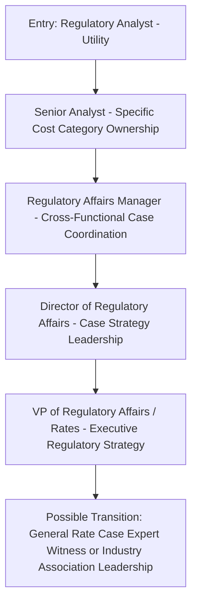
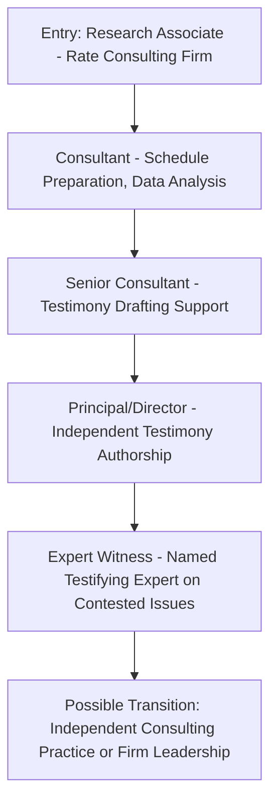
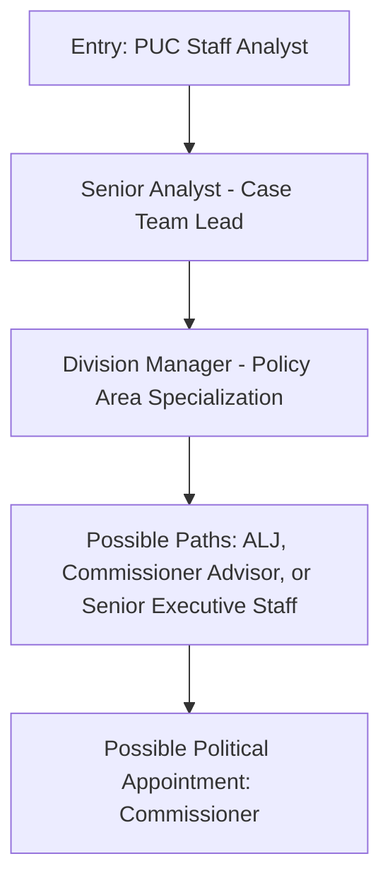

## Career Paths in Utility Regulation and Rate Consulting

### Overview

This topic surveys the professional landscape for individuals seeking to build a career in utility rate regulation — the range of institutional settings, typical entry points, required skill development, and career progression patterns across the utility, consulting, government, legal, and advocacy sectors. Unlike the more technical modeling and legal topics elsewhere in this material, this content addresses career structure and professional development rather than ratemaking substance.

### Primary Institutional Sectors

| Sector | Representative Organizations | Core Function |
| --- | --- | --- |
| Investor-owned utilities (IOUs) | Regulated electric, gas, and water utilities | Prepare and defend rate case filings; manage regulatory relationships |
| Public utility commissions (PUCs) | State PUC staff, FERC staff | Independent analysis and prudence review; issue orders |
| Consumer/ratepayer advocacy offices | State Offices of Public Advocate, Consumer Counsel | Represent residential/small business ratepayer interests as formal intervenors |
| Rate consulting firms | Independent economic/engineering consulting firms specializing in utility regulation | Expert witness testimony, cost-of-service studies, litigation support |
| Law firms (energy/utility practice) | Firms with dedicated energy regulatory practice groups | Legal representation of utilities, intervenors, or industrial customers in proceedings |
| Industrial/large customer groups | Large energy users, industrial customer coalitions | Represent specific customer class interests, particularly in rate design |
| Environmental/policy advocacy organizations | Nonprofits focused on clean energy, equity, or environmental policy | Intervene on policy-adjacent issues (DER, electrification, decarbonization) |
| Financial sector (credit rating, equity research, investment) | Rating agencies, utility-focused equity analysts, infrastructure investors | Assess utility credit and investment risk, informed by regulatory outcomes |
| Academia and research institutions | University energy policy programs, think tanks | Research, policy analysis, occasional expert testimony |

### Typical Professional Backgrounds and Entry Points

- **Key Points**
  - Common academic backgrounds include economics, finance, accounting, engineering (particularly electrical or civil for utility-side technical roles), public policy, and law — no single required credential dominates, and successful practitioners enter from diverse starting points
  - Entry-level roles commonly include regulatory analyst positions at a PUC or consumer advocate office, associate roles at rate consulting firms, or utility regulatory affairs analyst positions
  - Legal practice typically requires a J.D. and, depending on jurisdiction and role, bar admission in the relevant state(s); some practitioners combine a J.D. with an economics or engineering background for technical regulatory litigation roles
  - Expert witness roles (testifying on cost of capital, cost allocation, or engineering prudence) typically require substantial mid-to-senior career experience and specific subject-matter credibility built over multiple prior proceedings, rather than being an entry-level function

### Career Progression Patterns

#### Path 1: Utility-Side Regulatory Affairs

#### Path 2: Consulting and Expert Witness Track

#### Path 3: Regulatory/Government Track

[Inference] The commissioner appointment path is typically not a standard career progression step reachable through seniority alone — it usually involves a gubernatorial appointment (or election, in states with elected commissioners) process shaped by political as well as professional factors, distinguishing it from the more merit/tenure-based progression typical of the other steps in this path.

### Core Skill Development Areas Across All Paths

| Skill Area | Relevance | Where Typically Developed |
| --- | --- | --- |
| Financial/accounting literacy | Reading and constructing revenue requirement models, rate base schedules | Early-career analyst roles, formal accounting/finance coursework |
| Regulatory/administrative procedure | Navigating filing requirements, discovery, hearing procedure | On-the-job exposure to actual dockets, procedural rules study |
| Written advocacy | Drafting testimony, briefs, and settlement documents | Progressive testimony-drafting responsibility, legal writing training |
| Oral advocacy and cross-examination | Presenting and defending positions in evidentiary hearings | Direct hearing experience, often starting with narrower-scope witness preparation |
| Quantitative/statistical methods | Cost of capital analysis, load forecasting, cost allocation modeling | Formal economics/statistics training, applied modeling experience |
| Negotiation | Settlement conference participation and strategy | Direct settlement experience, often starting as support to a senior negotiator |
| Policy and public communication | Media narrative engagement, public comment process, legislative relations | Cross-functional exposure, often later-career as responsibilities broaden beyond pure technical analysis |

### Professional Credentials and Continuing Education

- No single universal certification governs the field (unlike, for example, the CPA for accounting or the CFA for investment analysis), though several relevant credentials and organizations support professional development:
- **NARUC** (National Association of Regulatory Utility Commissioners) offers training programs, an annual meeting, and policy resources widely used by both commission staff and industry practitioners
- **SEE** (Society of Utility and Regulatory Financial Analysts) and similar organizations offer specialized certification and continuing education specific to utility regulatory finance
- Law-focused practitioners typically pursue standard state bar admission and, often, specific CLE (continuing legal education) credits in energy/utility law where available
- [Unverified] The specific value, recognition, and prerequisites of specialized utility regulatory certifications vary and should be independently verified against the certifying body's current requirements, since these programs and their industry recognition can change over time and are not federally standardized.

### Compensation and Market Considerations

[Inference] Compensation across this field varies substantially by sector, seniority, and geography — consulting and expert witness roles at senior levels, along with utility executive regulatory affairs positions, generally command higher compensation than entry-level government or advocacy positions, reflecting broader patterns in professional services and government-versus-private-sector compensation more generally; specific current compensation figures were not verified for this content and should be researched through current industry salary surveys or job market data rather than assumed static, since compensation benchmarks change over time and vary significantly by regional cost of living and specific employer.

### Distinguishing Advocacy-Side and Neutral-Side Career Identities

A recurring professional consideration across this field: whether a practitioner builds a career primarily as an advocate for a specific party interest (utility, consumer advocate, industrial customer, environmental group) or in a more neutral/analytical capacity (commission staff, ALJ, academic researcher).

- Advocacy-side careers typically involve sustained representation of a consistent institutional perspective across many cases, building deep subject-matter and client-relationship expertise within that specific advocacy lens
- Neutral-side careers require weighing competing advocacy positions objectively, and, particularly for ALJs and commissioners, carry specific ethical obligations around impartiality and ex parte communication restrictions not applicable to advocacy-side roles
- [Inference] Career mobility between advocacy-side and neutral-side roles does occur (e.g., a former consumer advocate attorney later serving as an ALJ, or a former commission staff analyst later joining a consulting firm), though such transitions may be subject to jurisdiction-specific "revolving door" ethics rules, cooling-off periods, or recusal requirements that vary by state and role; specific applicable restrictions should be confirmed against the relevant jurisdiction's ethics rules before pursuing such a transition.

### Practical Example: Illustrative Early-Career Decision Point

**Example**

> A recent graduate with an economics degree and strong quantitative skills is choosing between two entry-level offers: (1) a Regulatory Analyst position at a state Office of Consumer Advocate, or (2) a Research Associate position at a private rate consulting firm.
>
> Considerations relevant to this decision might include:
>
> - The consumer advocate role offers earlier exposure to public testimony and direct case ownership on smaller matters, but typically with lower starting compensation and a narrower client perspective (always representing residential ratepayer interests)
> - The consulting role offers exposure to multiple client types (potentially including utilities, industrial customers, or advocacy groups across different engagements) and may offer a faster path to specialized technical expertise (e.g., cost of capital modeling), but with less early direct hearing/testimony experience and typically a more hierarchical apprenticeship structure before reaching named-witness status
>
> Neither path forecloses the other long-term — many practitioners in this field move between institutional settings over a career — but the relative near-term trade-offs (compensation, breadth of client exposure, pace of direct advocacy experience) are genuinely distinct and worth deliberate consideration rather than treating the choice as interchangeable.

### Related Topics

- Analyzing a Real General Rate Case Filing
- Drafting and Filing Direct/Rebuttal Testimony
- Cross-Examination Techniques for Rate Case Witnesses
- Settlement Negotiations and Stipulations in Rate Cases
- Administrative Law Judge Role in Utility Rate Proceedings
- Consumer/Ratepayer Advocate Offices: Structure and Authority
- Cost of Capital and Return on Equity Determination Methodologies
- Ethics and Ex Parte Communication Rules in Regulatory Proceedings
- Public Comment and Participation Processes
- Interpreting Commission Orders and Dissents