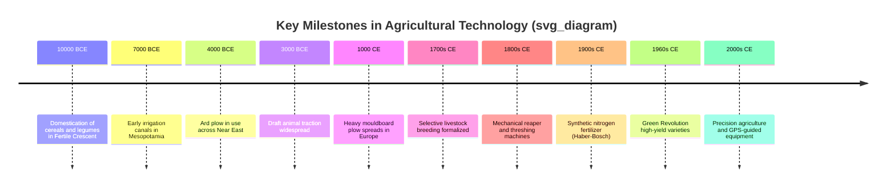

## History and Evolution of Agriculture

### Overview

Agriculture represents the deliberate cultivation of plants and domestication of animals for food, fiber, and other products, replacing or supplementing hunting and gathering as the primary mode of human subsistence. Its development is considered one of the most significant transitions in human history, fundamentally reshaping social organization, population dynamics, technology, and the environment.

### Pre-Agricultural Human Subsistence

**Key Points**

- For approximately 200,000 years, anatomically modern humans survived as hunter-gatherers.
- Subsistence relied on wild plant foraging, hunting, fishing, and scavenging.
- Populations were typically small, mobile, and organized in bands.
- Diets were broad-spectrum, drawing on whatever seasonal resources were locally available.

Hunter-gatherer societies possessed detailed ecological knowledge of plant growth cycles, animal behavior, and terrain, which later informed the transition to deliberate cultivation. [Inference] The exact cognitive and social triggers for the shift to farming remain debated among archaeologists, as no single causal factor is universally accepted.

### The Neolithic Revolution

The Neolithic Revolution refers to the transition from foraging to farming that began roughly 12,000 years ago (around 10,000 BCE) and occurred independently in multiple regions of the world.

#### Chronology of Independent Origins

| Region | Approximate Date | Key Domesticates |
| --- | --- | --- |
| Fertile Crescent (Southwest Asia) | ~10,000–9,000 BCE | Wheat, barley, lentils, sheep, goats |
| Yangtze/Yellow River Valleys (China) | ~9,000–7,000 BCE | Rice, millet, pigs |
| Mesoamerica | ~9,000–7,000 BCE | Maize, beans, squash |
| Andean Region (South America) | ~8,000–5,000 BCE | Potatoes, quinoa, llamas, alpacas |
| Sub-Saharan Africa (Sahel) | ~5,000–3,000 BCE | Sorghum, pearl millet, African rice |
| New Guinea | ~7,000 BCE | Taro, bananas, sugarcane |
| Eastern North America | ~4,000–3,000 BCE | Sunflower, goosefoot, squash |

#### Theories on the Origins of Agriculture

- **Oasis Theory**: Proposed that post-glacial climate drying forced humans and animals to congregate around shrinking water sources, intensifying interaction and eventual domestication. Largely discredited by later archaeological evidence.
- **Population Pressure Theory**: Suggests population growth outstripped the carrying capacity of foraging, compelling communities toward more intensive food production.
- **Climate Change Hypothesis**: The end of the Pleistocene and onset of the more stable Holocene climate (~11,700 years ago) created favorable conditions for the reliable growth of annual cereals.
- **Social/Feasting Hypothesis**: Argues that agriculture emerged partly from a desire to produce surplus for social feasting, status displays, or ritual purposes rather than pure subsistence necessity.
- **Coevolution/Niche Construction Theory**: Frames domestication as a gradual, often unintentional coevolutionary process between humans and certain plant/animal species, where repeated human behaviors (harvesting, discarding seeds, tending) altered selective pressures on organisms, which fed back into human behavior.

[Inference] No single theory fully explains agricultural origins across all independent regions; most contemporary scholarship favors multi-causal models combining climatic, demographic, and social factors.

### Domestication Processes

#### Plant Domestication

**Key Points**

- Domestication involved artificial selection, often unconscious at first, for traits beneficial to human use.
- Key selected traits included: non-shattering seed heads (seeds remain on the plant rather than dispersing naturally), larger seed/fruit size, reduced seed dormancy, and synchronized ripening.
- The "domestication syndrome" describes the suite of morphological and physiological changes distinguishing domesticated crops from wild ancestors.

**Example**

Wild wheat and barley have brittle rachises (the stem holding seeds), causing seed heads to shatter and scatter naturally for dispersal. Early farmers unintentionally selected for rare mutant plants with tough rachises, since these retained seeds through harvesting, and their seeds were disproportionately gathered and replanted. Over generations, this shifted a population from mostly brittle-rachis wild types to mostly tough-rachis domesticated types.

#### Animal Domestication

**Key Points**

- Domestication typically began with animals possessing certain "domestication-friendly" traits: manageable temperament, hierarchical social structures amenable to human dominance, flexible diets, and adaptable breeding cycles.
- Sequence of major domesticates: dogs (earliest, from wolves, likely 15,000+ years ago, possibly predating agriculture), followed by sheep, goats, pigs, and cattle in the Fertile Crescent context.
- Selection favored docility, reduced flight response, altered coat/wool characteristics, and increased productivity (milk, meat, or labor output).

### Development of Farming Techniques

#### Early Cultivation Methods

- **Slash-and-burn (swidden) agriculture**: Clearing vegetation by cutting and burning, releasing nutrients into soil for short-term fertility; associated with shifting cultivation and fallow periods.
- **Digging stick and hoe cultivation**: Manual tools preceding animal-drawn implements, still used in various traditional farming systems today.
- **Terracing**: Constructing stepped, level platforms on slopes to control erosion and retain water, notably developed in Andean, Southeast Asian, and Mediterranean contexts.
- **Irrigation systems**: Early canal and basin irrigation emerged in river valley civilizations (Mesopotamia, Egypt, Indus Valley, China) to manage water for cereal cultivation in arid or seasonally flooded regions.

#### The Plow and Draft Animal Power

The invention of the ard (simple scratch plow), and later the mouldboard plow, combined with the domestication of draft animals (oxen, and later horses with the horse collar), dramatically increased the land area a single farmer could cultivate and enabled deeper soil turning, improving fertility management.

### Ancient and Classical Agricultural Systems

#### Mesopotamia

Located between the Tigris and Euphrates rivers, Mesopotamian agriculture depended on artificial irrigation due to low and unpredictable rainfall. Complex canal networks, water-lifting devices (shadufs), and organized labor for canal maintenance underpinned the rise of early city-states. Soil salinization from prolonged irrigation without adequate drainage is documented as a contributing factor in the long-term decline of some Mesopotamian agricultural yields.

#### Ancient Egypt

Agriculture centered on the predictable annual flooding of the Nile, which deposited nutrient-rich silt on floodplains. The basin irrigation system captured floodwater in walled fields, allowing controlled release for crop cultivation of wheat, barley, and flax.

#### Ancient China

Rice paddy cultivation in southern China and millet/wheat farming in the north developed distinct regional systems. Chinese agricultural innovation included the multi-tube seed drill and iron plowshares, appearing centuries before comparable technologies in Europe.

#### Roman Agriculture

Roman agriculture combined Mediterranean polyculture (olives, grapes, cereals) with large-scale estate farming (latifundia), often worked by enslaved labor. Roman agronomists such as Cato, Varro, and Columella produced detailed agricultural treatises documenting crop rotation, soil management, and viticulture practices.

### Medieval Agricultural Developments

**Key Points**

- The **three-field system** replaced the two-field system in medieval Europe, improving land use efficiency by rotating crops across three fields (one for autumn-sown grain, one for spring-sown grain/legumes, one fallow), reducing fallow land from half to one-third of total acreage.
- The **heavy mouldboard plow**, suited to Northern Europe's dense clay soils, enabled cultivation of previously unworkable land.
- The **horse collar** (adapted from Chinese designs) allowed horses to pull heavy loads without choking, gradually supplementing oxen as draft animals in some regions.
- Manorial and feudal systems structured agricultural labor and land tenure across much of medieval Europe.
- In the Islamic world, the **Arab Agricultural Revolution** (roughly 8th–13th centuries) diffused crops such as sugarcane, cotton, and citrus across the Mediterranean and introduced advanced irrigation technologies and agronomic texts.

### The Columbian Exchange

Following 1492, the Columbian Exchange transferred crops, animals, diseases, and agricultural techniques between the Old World and the Americas.

| Direction | Notable Transfers |
| --- | --- |
| Americas → Old World | Maize, potatoes, tomatoes, cacao, tobacco, peppers, beans |
| Old World → Americas | Wheat, rice, sugarcane, coffee, horses, cattle, pigs |

This exchange had significant demographic and dietary consequences globally; potatoes and maize, for instance, contributed to population growth in parts of Europe, Africa, and Asia due to their high caloric yield per unit of land. [Inference] Quantifying the precise demographic impact of specific crop introductions involves substantial historical uncertainty, though the general trend of caloric and dietary diversification is well documented.

### The British Agricultural Revolution (c. 1600–1900)

**Key Points**

- Occurred prior to and overlapping with the Industrial Revolution, substantially increasing British agricultural productivity.
- Key innovations included:
  - **Norfolk four-course rotation** (wheat, turnips, barley, clover), eliminating fallow land entirely by using turnips and clover to restore soil fertility and provide livestock fodder.
  - **Selective livestock breeding**, pioneered by figures such as Robert Bakewell, systematically improving traits like meat yield and wool quality.
  - **Enclosure movement**, consolidating fragmented common lands into larger, privately managed farms, which enabled more efficient large-scale techniques but displaced smallholder and common-land users.
  - **Seed drill** (associated with Jethro Tull, early 18th century), enabling precise seed placement and spacing, improving germination rates over broadcast sowing.

The increased agricultural productivity is generally credited with freeing labor for urban industrial employment, contributing to the broader Industrial Revolution. [Inference] The relative weighting of agricultural productivity gains versus other factors (capital availability, energy sources, trade networks) in enabling industrialization is a subject of ongoing historical-economic debate.

### Mechanization and Industrialization of Agriculture (19th–20th Century)

#### Key Inventions

- **Mechanical reaper** (Cyrus McCormick, 1830s): Mechanized grain harvesting, reducing labor requirements substantially.
- **Threshing machines**: Separated grain from stalks and husks mechanically, replacing manual flailing.
- **Steel plow** (John Deere, 1837): Enabled effective cultivation of the tough prairie sod of the American Midwest.
- **Tractors**: Internal combustion tractors began replacing draft animals in the early 20th century, progressively increasing in power and versatility through the century.
- **Combine harvesters**: Integrated reaping, threshing, and cleaning into a single machine, further reducing labor and time requirements for grain harvest.

#### Synthetic Fertilizers and Chemical Inputs

The **Haber-Bosch process** (developed 1909–1913 by Fritz Haber and Carl Bosch) enabled industrial-scale synthesis of ammonia from atmospheric nitrogen, forming the basis for synthetic nitrogen fertilizers. This is widely regarded as one of the most consequential technological developments in agricultural history, as it decoupled crop yield from natural or organic nitrogen sources.

$$N_2 + 3H_2 \rightarrow 2NH_3$$

Alongside fertilizers, the development of synthetic pesticides and herbicides (notably following World War II, including compounds such as DDT and 2,4-D) further transformed pest and weed management, though later research documented significant ecological and health concerns associated with some of these compounds, leading to regulatory restrictions in many countries from the 1970s onward.

### The Green Revolution (c. 1940s–1970s)

**Key Points**

- Led substantially by agronomist Norman Borlaug, whose work on semi-dwarf, disease-resistant, high-yield wheat varieties in Mexico earned him the 1970 Nobel Peace Prize.
- Extended to rice through the International Rice Research Institute (IRRI), which developed high-yield varieties such as IR8.
- Combined high-yield crop varieties with synthetic fertilizers, irrigation expansion, and pesticide use to substantially increase cereal yields, particularly in Asia and Latin America.
- Credited with averting predicted famines in countries such as India and Mexico during the mid-20th century.

**Conclusion**

The Green Revolution significantly increased global cereal production and is credited with substantial reductions in famine risk in participating regions during the latter half of the 20th century. It also generated well-documented criticisms, including increased dependency on purchased inputs (seeds, fertilizer, irrigation infrastructure), water resource strain, reduced agrobiodiversity through monoculture emphasis, and uneven benefit distribution favoring farmers with greater capital access. [Inference] The long-term net environmental and socioeconomic balance of the Green Revolution remains actively debated among agricultural historians and policy researchers, with assessments varying by region and metric used.

### Modern and Contemporary Developments

#### Biotechnology

- **Genetically modified (GM) crops**: Commercialized beginning in the mid-1990s, incorporating traits such as herbicide tolerance and insect resistance (e.g., Bt crops expressing *Bacillus thuringiensis* toxins).
- **Marker-assisted breeding**: Uses genetic markers to accelerate conventional breeding selection without direct genetic modification.
- **CRISPR-based gene editing**: An emerging tool for precise genetic modification in crop and livestock improvement, distinct from earlier transgenic GM methods in that it can introduce targeted edits without necessarily incorporating foreign DNA. [Unverified] Regulatory classification of CRISPR-edited crops varies by jurisdiction and continues to evolve, so specific legal status should be confirmed against current regional regulations.

#### Precision Agriculture

**Key Points**

- Utilizes GPS/GNSS positioning, remote sensing (satellite and drone imagery), and variable-rate application technology to optimize input use (water, fertilizer, pesticide) at sub-field spatial resolution.
- Data-driven decision support systems integrate soil sensors, weather data, and yield monitors to inform management decisions.
- Automated and autonomous machinery (self-guided tractors, robotic harvesters) represent an ongoing extension of mechanization trends.

#### Sustainable and Alternative Agricultural Movements

- **Organic agriculture**: Formalized as a movement from the early-to-mid 20th century, emphasizing exclusion of synthetic fertilizers/pesticides, though standards and certification requirements vary by country and certifying body.
- **Agroecology**: An approach applying ecological principles to agricultural system design, emphasizing biodiversity, nutrient cycling, and reduced external input dependency.
- **Regenerative agriculture**: A more recent and less formally standardized term emphasizing soil health restoration, carbon sequestration, and ecosystem regeneration through practices such as reduced tillage, cover cropping, and diversified rotations. [Unverified] Definitions and certification standards for "regenerative agriculture" are not yet fully standardized across the industry, and specific claims should be evaluated against the source making them.
- **Vertical farming and controlled-environment agriculture (CEA)**: Emerging approaches using indoor, often hydroponic or aeroponic systems with artificial lighting to grow crops in stacked layers, primarily for urban or space-constrained contexts.

### Comparative Timeline Diagram

### Long-Term Consequences of Agricultural Development

**Key Points**

- **Population growth**: Reliable food surplus enabled larger, denser, sedentary populations compared to foraging societies.
- **Social stratification**: Surplus production supported non-farming specialists (artisans, priests, rulers, soldiers), contributing to hierarchical social structures.
- **Urbanization**: Concentrated food production near settlements facilitated the growth of towns and cities.
- **Environmental transformation**: Deforestation, soil erosion, salinization, and altered hydrology have accompanied agricultural expansion across most historical periods and regions.
- **Disease dynamics**: Close human-animal proximity in domesticated settings is associated with the emergence of several zoonotic diseases throughout agricultural history. [Inference] While the general association between animal domestication and zoonotic disease emergence is well supported, attributing specific historical disease origins to precise transmission events often involves reconstructive uncertainty.

### Related Topics

- Plant breeding and genetics fundamentals
- Soil science and soil fertility management
- Crop rotation systems and their agronomic rationale
- Irrigation engineering and water resource management in agriculture
- Livestock domestication and animal husbandry principles
- Agricultural economics and land tenure systems
- Climate change impacts on modern agricultural systems
- Genetically modified organisms (GMOs) in crop science
- Precision agriculture technologies and data systems
- Sustainable and regenerative farming practices
- Global food security and agricultural policy