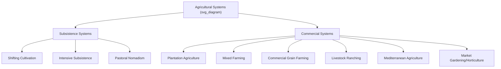
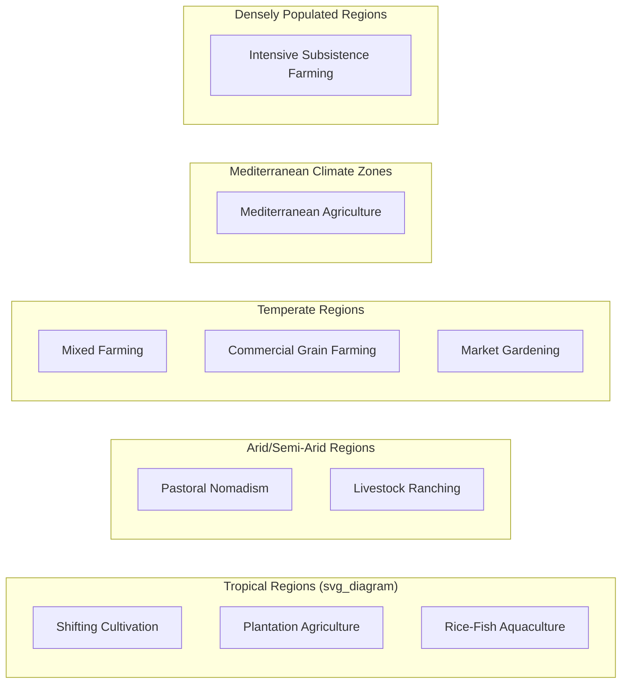

## Major Agricultural Systems Worldwide

### Overview

Agricultural systems are classified based on factors such as climate, land use intensity, labor and capital inputs, dominant crops or livestock, market orientation, and technological sophistication. No single classification scheme is universally applied; systems often overlap and vary regionally in implementation. This classification broadly follows commonly used agroecological and agricultural-geography frameworks.

### Classification Framework

**Key Points**

- Systems are typically distinguished along several axes: subsistence vs. commercial orientation, intensive vs. extensive land use, and climate/biome adaptation.
- A single farm or region may combine elements from multiple system types.
- [Inference] Precise boundaries between categories (e.g., "intensive" vs. "extensive") are relative and vary by regional context rather than fixed thresholds.

### Subsistence Agricultural Systems

#### Shifting Cultivation (Slash-and-Burn)

**Key Points**

- Practiced in tropical rainforest regions of the Amazon Basin, Central Africa, and Southeast Asia.
- Land is cleared by cutting and burning vegetation, cultivated for a few years until soil fertility declines, then abandoned for a fallow period (often 10–20 years) to regenerate.
- Also known by regional names: milpa (Mesoamerica), jhum (Northeast India), ladang (Southeast Asia), chitemene (parts of Africa).
- Typically low input, low mechanization, and organized around family or community labor.

**Example**

In milpa systems of Mesoamerica, maize, beans, and squash are often intercropped on the same cleared plot, a practice sometimes called the "Three Sisters," which provides complementary nutrient cycling (nitrogen fixation by beans) and physical support (maize stalks for bean vines).

#### Intensive Subsistence Agriculture

**Key Points**

- Common in densely populated regions of South, Southeast, and East Asia.
- Characterized by small landholdings, high labor input per unit area, and multiple cropping cycles per year on the same land.
- **Wet rice dominant type**: Paddy rice cultivation in monsoon Asia, requiring controlled flooding and significant manual or animal labor for transplanting and harvesting.
- **Non-wet-rice dominant type**: Found in areas with insufficient rainfall or unsuitable terrain for paddy rice, relying on crops such as wheat, millet, sorghum, and pulses.

#### Pastoral Nomadism

**Key Points**

- Practiced in arid and semi-arid regions (Sahel, Central Asian steppes, parts of the Middle East and East Africa).
- Involves herding of livestock (camels, goats, sheep, cattle, or yaks depending on region) across seasonal grazing routes, following available pasture and water.
- Little to no crop cultivation; diet and economy center on animal products (milk, meat, hides, wool).
- Increasingly constrained in the modern era by national border enforcement, land privatization, and climate variability affecting traditional grazing routes.

### Commercial Agricultural Systems

#### Plantation Agriculture

**Key Points**

- Large-scale, often monocultural cultivation of cash crops for export markets, historically established under colonial economic systems and frequently persisting in post-colonial economic structures.
- Common crops: rubber, oil palm, sugarcane, coffee, tea, cacao, bananas.
- Concentrated in tropical regions of Southeast Asia, West and Central Africa, and Latin America.
- Typically capital-intensive with significant reliance on hired labor; historically associated with exploitative labor practices in many regions, a legacy that remains a subject of ongoing labor and human-rights scrutiny in parts of the modern industry. [Unverified] Current labor conditions vary substantially by country, company, and certification status, and should not be generalized without region-specific verification.

#### Mixed Farming

**Key Points**

- Combines crop cultivation and livestock rearing on the same farm, with each component often supporting the other (e.g., crop residues as animal feed, manure as fertilizer).
- Common across temperate regions of Europe, North America, and parts of Asia.
- Provides a degree of risk diversification compared to specialized single-output systems.

#### Commercial Grain Farming

**Key Points**

- Large-scale, highly mechanized cultivation of cereal crops (wheat, corn, barley) for domestic and export markets.
- Characteristic of extensive farming regions such as the North American Great Plains, the Eurasian steppe (Ukraine, southern Russia, Kazakhstan), the Pampas of Argentina, and the Australian wheat belt.
- Low labor input relative to land area, heavy reliance on machinery (combines, GPS-guided equipment), and often single-crop specialization.

#### Livestock Ranching

**Key Points**

- Extensive grazing of cattle or sheep across large land areas with relatively low stocking density, common in regions such as the western United States, Australia, Argentina, and parts of southern Africa.
- Distinguished from pastoral nomadism by fixed land tenure/ranch boundaries and commercial market orientation rather than subsistence and seasonal movement.
- Increasingly integrated with feedlot finishing systems in some countries, where animals are moved to confined, high-density feeding operations before slaughter.

#### Mediterranean Agriculture

**Key Points**

- Associated with Mediterranean climate zones: the Mediterranean Basin itself, California, central Chile, southwestern Australia, and the Cape region of South Africa.
- Characterized by cultivation of olives, grapes, citrus, and various fruits and vegetables adapted to hot, dry summers and mild, wet winters.
- Often combines commercial export crops (wine, olive oil) with smaller-scale mixed cultivation.

#### Market Gardening and Horticulture (Truck Farming)

**Key Points**

- Intensive, often small-scale cultivation of fruits, vegetables, and flowers, typically located near urban markets to minimize transport time for perishable produce.
- Commonly reliant on high labor and/or capital input per unit area, including greenhouse and protected cultivation techniques in temperate regions.
- Overlaps significantly with peri-urban agriculture and, in modern contexts, controlled-environment agriculture (CEA).

### Specialized and Emerging Systems

#### Agroforestry

**Key Points**

- Integrates trees and shrubs with crop and/or livestock production on the same land unit.
- Common configurations include alley cropping, silvopasture (trees combined with grazing livestock), and homegardens (particularly in tropical smallholder contexts).
- Provides ecosystem services such as erosion control, microclimate moderation, and diversified income streams.

#### Aquaculture-Integrated Systems

**Key Points**

- Combines fish or shrimp farming with crop cultivation, notably rice-fish farming in parts of Asia, where fish are raised in flooded paddy fields alongside rice.
- Provides complementary nutrient cycling (fish waste fertilizing rice) and diversified farm output.

#### Controlled-Environment Agriculture (CEA) and Vertical Farming

**Key Points**

- Encompasses greenhouse cultivation, hydroponics, aeroponics, and vertical (stacked-layer) growing systems, typically using artificial or supplemented lighting and closed-loop nutrient delivery.
- Predominantly used for high-value, fast-cycle crops such as leafy greens, herbs, and some fruiting vegetables (tomatoes, strawberries).
- Concentrated in urban and peri-urban settings, or regions with limited arable land or extreme climates (e.g., parts of the Middle East, Northern Europe, Japan).
- [Unverified] Economic viability of vertical farming at scale varies significantly by crop type, energy cost structure, and local market conditions; broad profitability claims should be evaluated against specific operational data.

#### Organic and Regenerative Systems

**Key Points**

- **Organic agriculture** excludes synthetic fertilizers and pesticides, relying on practices such as composting, crop rotation, and biological pest control; certification standards vary by country (e.g., USDA Organic, EU Organic).
- **Regenerative agriculture** emphasizes soil health restoration, minimal tillage, cover cropping, and biodiversity, with a stated goal of net ecological improvement rather than solely input reduction. [Unverified] "Regenerative agriculture" lacks a single standardized certification framework at present, so specific practice claims under this label vary by practitioner and organization.

### Global Distribution Diagram

### Comparative Summary Table

| System | Labor Intensity | Capital Intensity | Land Use Scale | Market Orientation |
| --- | --- | --- | --- | --- |
| Shifting Cultivation | High | Low | Small, rotating plots | Subsistence |
| Intensive Subsistence | Very High | Low–Moderate | Small, fixed plots | Subsistence |
| Pastoral Nomadism | Moderate | Low | Extensive, mobile | Subsistence |
| Plantation Agriculture | High | High | Large | Commercial/Export |
| Mixed Farming | Moderate | Moderate | Small–Medium | Commercial/Mixed |
| Commercial Grain Farming | Low | Very High | Very Large | Commercial |
| Livestock Ranching | Low | Moderate–High | Very Large | Commercial |
| Mediterranean Agriculture | Moderate | Moderate | Small–Medium | Mixed |
| Market Gardening | High | Moderate–High | Small | Commercial (local/regional) |
| CEA/Vertical Farming | Low–Moderate | Very High | Minimal footprint | Commercial |

### Factors Driving System Adoption

**Key Points**

- **Climate and biome**: Temperature, precipitation patterns, and growing season length constrain viable crop and livestock choices.
- **Soil type and topography**: Influence suitability for mechanization, irrigation, and specific crop selection.
- **Population density and land availability**: Denser populations tend toward intensive systems on smaller plots; sparse populations with abundant land favor extensive systems.
- **Market access and infrastructure**: Proximity to transport networks and urban markets shapes the viability of perishable, high-value crop production versus storable commodity crops.
- **Historical and colonial legacy**: Land tenure patterns and crop specialization in many regions, particularly in the Global South, were substantially shaped by colonial-era economic structures oriented toward export commodities.
- **Government policy and subsidy structures**: National agricultural policy, trade agreements, and subsidy programs significantly influence which systems are economically viable in a given region. [Inference] The relative influence of policy versus purely biophysical factors on system distribution varies considerably by country and is difficult to generalize globally.

### Challenges Common Across Systems

**Key Points**

- **Climate change**: Shifting precipitation patterns, increased frequency of extreme weather, and changing pest/disease pressure affect the viability of established systems in many regions.
- **Water scarcity**: Particularly acute for irrigation-dependent intensive systems and livestock systems in arid regions.
- **Land degradation**: Soil erosion, nutrient depletion, and salinization affect both subsistence and commercial systems, though mechanisms and severity vary by system type.
- **Market volatility**: Commercial systems tied to global commodity markets face price fluctuation risks not present in subsistence-oriented systems.
- **Labor availability**: Rural-to-urban migration trends in many countries have reduced available agricultural labor, incentivizing mechanization even in traditionally labor-intensive systems.

### Related Topics

- Agroecological zones and climate classification for agriculture
- Land tenure systems and agrarian reform
- Crop rotation and intercropping design principles
- Irrigation methods and water management strategies
- Livestock production systems and animal husbandry
- Agricultural globalization and commodity trade
- Food security and smallholder farming challenges
- Sustainable intensification approaches
- Colonial history's influence on global agricultural patterns
- Precision agriculture applications across farming system types