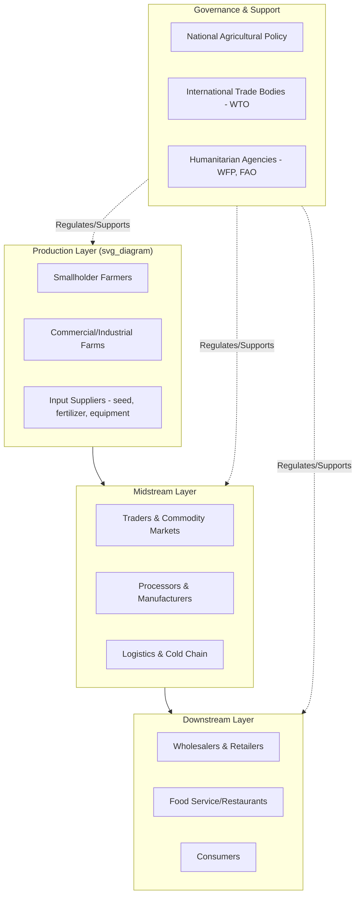

## Agriculture and the Global Food System

### Overview

The global food system encompasses the full network of activities and actors involved in producing, processing, distributing, marketing, consuming, and disposing of food. Agriculture forms the foundational production layer of this system, but the system's overall functioning depends heavily on interconnected supply chains, markets, policy frameworks, and consumer demand patterns operating across local, national, and international scales.

### Structure of the Global Food System

**Key Points**

- The food system is commonly modeled in sequential stages: production, storage, processing, distribution, marketing/retail, consumption, and waste/disposal.
- Each stage involves distinct actors: farmers, input suppliers, processors, traders, logistics providers, retailers, regulators, and consumers.
- Feedback loops exist across stages; for example, consumer demand and retail purchasing patterns influence upstream production decisions.

### Agricultural Production's Role in the System

**Key Points**

- Primary production determines the baseline volume, diversity, and nutritional composition of food entering the system.
- Global cereal production (wheat, rice, maize) forms the caloric backbone of the food system, supplying a majority of direct and indirect (via animal feed) human caloric intake.
- Production is geographically uneven; a relatively small number of countries account for a large share of globally traded staple crop exports, creating significant interdependence between food-exporting and food-importing nations. [Inference] Precise current export concentration figures fluctuate year to year with weather, policy, and market conditions, so specific percentages should be checked against current trade data rather than treated as fixed.

### Global Food Supply Chains

#### Domestic and Local Supply Chains

- Involve shorter transport distances between production and consumption, often within a single country or region.
- Include farmer's markets, community-supported agriculture (CSA) schemes, and regional distribution networks.
- Generally associated with reduced transport-related greenhouse gas emissions per unit of food, though this is not a universal rule since production-phase emissions often outweigh transport emissions for many food categories. [Inference] The net environmental comparison between local and long-distance supply chains depends heavily on specific crop, production method, and transport mode, and cannot be generalized as "local is always lower-emission."

#### International Supply Chains and Trade

**Key Points**

- Global agricultural trade allows countries with limited arable land, water, or suitable climate to access food commodities that would otherwise be unavailable domestically.
- Major global commodity trade flows include cereals (wheat, maize, rice), oilseeds (soybeans, palm oil), and select high-value goods (coffee, cocoa, seafood).
- International trade is governed by a mix of bilateral agreements, regional trade blocs, and multilateral frameworks including World Trade Organization (WTO) agricultural agreements.
- Trade dependency creates vulnerability to supply shocks; disruptions in major exporting countries (due to weather, conflict, or policy changes) can propagate price and availability effects to import-dependent countries.

**Example**

The 2007–2008 and 2010–2011 global food price crises involved simultaneous spikes in prices of key staple commodities (wheat, rice, maize), driven by a combination of factors including poor harvests in major exporting regions, export restrictions imposed by some governments in response, rising energy/fertilizer costs, and increased biofuel demand for certain crops. These episodes illustrated how interconnected global markets can transmit localized supply shocks into widespread price volatility.

### Food Processing and Value Addition

**Key Points**

- Processing ranges from minimal (washing, sorting, packaging of fresh produce) to extensive (milling, refining, formulation of packaged/processed foods).
- Processing extends shelf life, enables long-distance transport, and can improve certain nutritional or safety characteristics (e.g., pasteurization reducing pathogen load), though excessive processing is also associated in nutritional research with reduced nutrient density in some product categories. [Inference] The relationship between degree of processing and health outcomes is an active area of nutritional research, and specific claims about particular products or processing methods should be verified against current peer-reviewed literature.
- Ultra-processed food consumption has increased substantially in many countries' diets over recent decades, a trend documented in numerous national dietary surveys, though the precise magnitude and health implications continue to be studied and are subject to differing methodological approaches across studies.

### Food Storage and Loss

**Key Points**

- Post-harvest storage infrastructure (grain silos, cold chains, warehousing) significantly affects the proportion of produced food that reaches consumers versus being lost to spoilage, pest damage, or degradation.
- **Food loss** typically refers to reductions in food quantity/quality occurring from production through processing/distribution (often more prevalent in lower-income regions with limited storage/cold-chain infrastructure).
- **Food waste** typically refers to food discarded at the retail and consumer stages (often more prevalent in higher-income regions).
- The Food and Agriculture Organization (FAO) and other bodies have published estimates indicating that a substantial share of food produced globally is lost or wasted before consumption; exact percentages vary across studies depending on methodology and scope, so [Unverified] specific global aggregate figures should be checked against the most current FAO or equivalent reporting rather than treated as fixed.

### Distribution and Logistics

**Key Points**

- Cold chain infrastructure (refrigerated storage and transport) is critical for perishable goods (dairy, meat, seafood, fresh produce) and varies significantly in availability and reliability across regions.
- Transportation modes include road, rail, maritime shipping (for bulk international commodity trade), and air freight (for high-value perishables requiring rapid delivery).
- Distribution efficiency is affected by infrastructure quality (roads, ports), fuel costs, and geopolitical factors affecting shipping routes (e.g., canal transit restrictions, regional conflicts).

### Markets, Pricing, and Policy

#### Price Formation

**Key Points**

- Agricultural commodity prices are influenced by supply and demand fundamentals, weather and climate conditions, input costs (fuel, fertilizer), currency exchange rates, and speculative activity in commodity futures markets.
- Many staple commodities are traded on organized futures exchanges (e.g., Chicago Board of Trade for corn, wheat, soybeans), which serve price discovery and risk management (hedging) functions for producers and buyers.

#### Government Policy Instruments

- **Subsidies**: Direct payments or input cost reductions to producers, used in many countries to support farm incomes, encourage specific crop production, or maintain domestic food security.
- **Tariffs and trade restrictions**: Import tariffs, export bans, or quotas used to protect domestic producers or manage domestic food price stability, particularly during supply shocks.
- **Price supports and buffer stocks**: Government-held reserves or minimum price guarantees intended to stabilize prices and ensure availability during shortages.
- **Food assistance programs**: Domestic programs (e.g., SNAP in the United States) and international humanitarian food aid (coordinated by bodies such as the World Food Programme) addressing food access for vulnerable populations.

[Inference] The effectiveness and unintended consequences of specific policy instruments (e.g., whether subsidies distort global markets or export bans exacerbate price volatility) are subjects of ongoing economic debate and vary by context; broad generalizations should be treated cautiously.

### Food Security Dimensions

**Key Points**

The commonly cited framework for food security, developed by the FAO, identifies four core dimensions:

1. **Availability**: Sufficient quantities of food are physically present, whether through domestic production, imports, or stocks.
2. **Access**: Individuals and households have adequate economic and physical means to obtain food (affordability, market access, entitlements).
3. **Utilization**: Food is used effectively by the body, encompassing nutritional adequacy, food safety, and health status affecting nutrient absorption.
4. **Stability**: The other three dimensions remain consistently met over time, without disruption from shocks such as economic crises, conflict, or climate events.

A more recent addition proposed by some FAO frameworks includes **agency** (the capacity of individuals/groups to make their own food-related decisions) and **sustainability** (the long-term ecological viability of the food system), though [Unverified] the specific number and formal naming of dimensions has evolved across different FAO publications and should be checked against the most current FAO framework documentation for precise terminology.

### Nutrition Transition and Consumption Patterns

**Key Points**

- Many countries undergoing economic development have experienced a documented "nutrition transition," characterized by shifting diets from traditional staple-heavy patterns toward increased consumption of processed foods, animal products, and refined sugars and fats.
- This transition is associated in public health research with rising rates of diet-related non-communicable diseases (obesity, type 2 diabetes, cardiovascular disease) alongside, in some countries, persistent undernutrition, a pattern sometimes termed the "double burden of malnutrition."
- Urbanization, income growth, and food marketing are commonly cited contributing factors to these dietary shifts. [Inference] The relative causal weight of each factor varies by country context and is difficult to isolate precisely.

### Environmental Interactions with the Food System

**Key Points**

- Agriculture is a significant contributor to global greenhouse gas emissions, land use change (notably deforestation for cropland/pasture expansion), freshwater withdrawal, and biodiversity loss, as documented across multiple international assessments (e.g., IPCC, IPBES reports).
- The food system also faces reciprocal vulnerability to environmental change, particularly climate change impacts on crop yields, water availability, and pest/disease distribution.
- Livestock production, particularly ruminant systems, is associated with disproportionately high greenhouse gas emissions (notably methane) per unit of protein compared to most plant-based food sources, a finding broadly consistent across life-cycle assessment studies, though exact emission intensity figures vary by production system, region, and study methodology. [Inference] Specific numeric emissions comparisons should be sourced from current life-cycle assessment literature rather than treated as universally fixed values.

### Technology and Digitalization in the Food System

**Key Points**

- **Precision agriculture**: GPS-guided equipment, remote sensing, and variable-rate input application at the farm production stage.
- **Supply chain traceability**: Blockchain and other digital ledger technologies have been piloted and, in some cases, commercially deployed by major retailers and food companies to track product provenance from farm to retail shelf, intended to improve food safety response times and support origin verification claims. [Unverified] The scale and consistency of blockchain traceability adoption across the industry varies significantly by company and region, and specific implementation claims should be verified against current company/industry reporting.
- **E-commerce and digital marketplaces**: Increasing role of online grocery and direct-to-consumer digital platforms in food distribution, accelerated notably during the COVID-19 pandemic period in many markets.
- **Data analytics and AI**: Applied across yield forecasting, demand forecasting, and supply chain optimization by processors, retailers, and logistics firms.

### Global Food System Actors Diagram

### Key Challenges Facing the Global Food System

**Key Points**

- **Climate change adaptation**: Adjusting production systems, crop varieties, and supply chain infrastructure to changing climate conditions.
- **Resource constraints**: Managing finite freshwater, arable land, and phosphorus/potassium fertilizer reserves under growing demand.
- **Equity and access**: Addressing persistent hunger and malnutrition despite aggregate global food production generally being considered sufficient in caloric terms, reflecting distribution and access failures rather than absolute scarcity in many analyses. [Inference] Characterizing hunger as purely a "distribution problem" versus involving genuine regional production constraints is debated among food security researchers and varies by specific context.
- **Supply chain resilience**: Reducing vulnerability to shocks from geopolitical conflict, pandemics, extreme weather, and market speculation, as highlighted by disruptions during events such as the COVID-19 pandemic and regional conflicts affecting major grain-exporting countries.
- **Sustainability transition**: Balancing production intensification needed to meet growing demand against environmental sustainability goals, including biodiversity conservation and emissions reduction targets.

### Related Topics

- Food security frameworks and measurement methodologies
- Agricultural trade policy and international trade agreements
- Cold chain logistics and post-harvest technology
- Nutrition transition and diet-related non-communicable diseases
- Climate change impacts on agricultural production
- Food loss and waste reduction strategies
- Commodity futures markets and agricultural price risk management
- Sustainable and climate-smart agriculture practices
- Digital agriculture and supply chain traceability technologies
- Humanitarian food assistance and emergency response systems