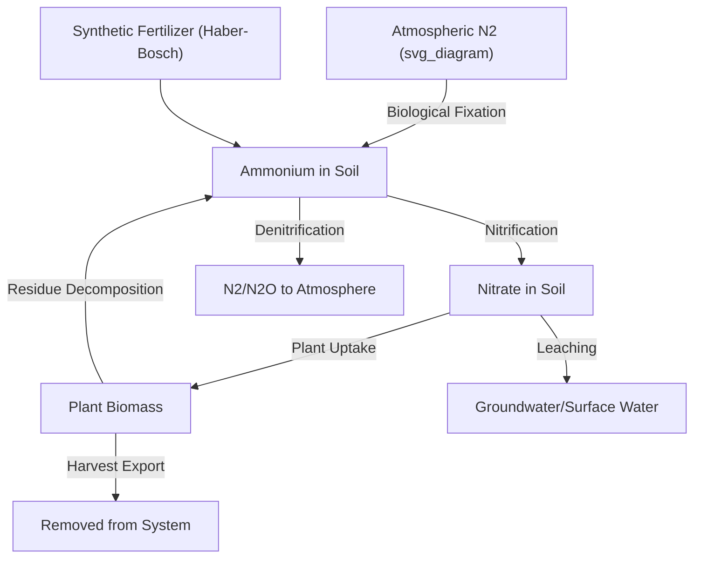
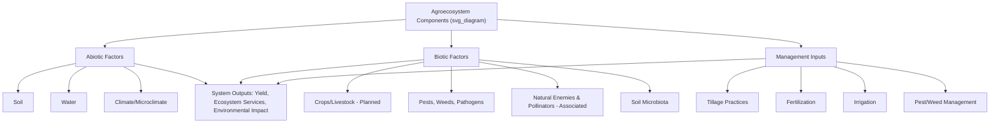

## Agroecosystems and Ecological Principles

### Overview

An agroecosystem is a biological and physical system comprising the plants, animals, microorganisms, soil, water, and atmosphere within a managed agricultural area, along with the human management practices that shape it. Agroecosystems are distinguished from natural ecosystems by deliberate human intervention aimed at maximizing specific outputs (food, fiber, fuel) while operating under the same fundamental ecological laws that govern natural systems, including energy flow, nutrient cycling, and population dynamics.

### Defining Characteristics of Agroecosystems

**Key Points**

- **Simplified species composition**: Compared to natural ecosystems, agroecosystems typically feature reduced biodiversity, often dominated by one or a few crop/livestock species.
- **External energy and material inputs**: Human-managed systems frequently rely on external inputs (fertilizer, irrigation water, fuel for machinery, supplemental feed) beyond what natural solar energy and local nutrient cycling alone provide.
- **Human-directed selection pressure**: Management decisions (planting, harvesting, breeding, pest control) replace many natural selective processes.
- **Frequent disturbance**: Tillage, harvesting, and replanting represent regular, human-induced disturbances rather than the more variable disturbance regimes of natural systems (fire, storms, herbivory).
- **Open nutrient cycles**: Harvesting exports nutrients and biomass out of the system, requiring external replenishment (fertilizer, organic amendments) to maintain productivity over time, in contrast to the more closed nutrient cycling characteristic of many natural ecosystems.

### Core Ecological Principles Applied to Agriculture

#### Energy Flow

**Key Points**

- Agroecosystems, like all ecosystems, depend fundamentally on solar energy captured through photosynthesis by primary producers (crops, pasture plants).
- Energy transfer between trophic levels follows the general ecological principle that only a fraction (commonly approximated around 10 percent, though this varies considerably by system) of energy at one trophic level is available to the next level. [Inference] The "10 percent rule" is a widely used pedagogical approximation rather than a precise universal constant; actual trophic transfer efficiencies vary substantially across different agroecosystems and organism groups.
- This principle underlies the general observation that plant-based food production typically requires substantially less land and energy input per unit of food energy or protein than livestock production, particularly for ruminant animals, though the magnitude of this difference varies by specific livestock system and production method.

$$E_{transfer} = E_{n} \times \eta$$

where $E_{n}$ represents energy at trophic level $n$ and $\eta$ represents the ecological transfer efficiency.

#### Nutrient Cycling

**Key Points**

- Major nutrient cycles relevant to agroecosystems include the nitrogen, phosphorus, potassium, and carbon cycles.
- **Nitrogen cycle**: Involves nitrogen fixation (biological, via rhizobia bacteria in legume root nodules, or industrial, via the Haber-Bosch process), mineralization/immobilization, nitrification, and denitrification. Excess nitrogen application can lead to leaching (nitrate contamination of groundwater) or volatilization (ammonia loss, nitrous oxide emissions).
- **Phosphorus cycle**: Unlike nitrogen, phosphorus has no significant atmospheric component; agricultural systems rely on mined phosphate rock reserves for most synthetic phosphorus fertilizer, a finite resource of ongoing sustainability concern in agricultural policy discussions.
- **Carbon cycle**: Agricultural soils can function as either carbon sources (through tillage-induced organic matter decomposition and oxidation) or carbon sinks (through practices that build soil organic matter, such as reduced tillage, cover cropping, and organic amendments).

**Example**

In a legume-cereal rotation, nitrogen-fixing bacteria in the root nodules of legumes (e.g., soybeans, clover) convert atmospheric nitrogen ($N_2$) into plant-available ammonium ($NH_4^+$) via the nitrogenase enzyme complex. Residual nitrogen in crop residues and root systems becomes available to the following cereal crop (e.g., corn or wheat) as residues decompose, reducing the synthetic nitrogen fertilizer requirement for that subsequent crop.

#### Water Cycling

**Key Points**

- Agricultural systems interact with the hydrological cycle through precipitation capture, soil infiltration, evapotranspiration, and runoff.
- **Evapotranspiration** (combined water loss through soil evaporation and plant transpiration) represents a major water flux in agroecosystems and is a key parameter in irrigation scheduling calculations.
- Land management practices (tillage, cover cropping, mulching) significantly affect infiltration rates and soil water retention capacity, influencing both crop water availability and downstream runoff/erosion patterns.

### Biodiversity in Agroecosystems

**Key Points**

- **Planned biodiversity**: Species deliberately introduced by the farmer (crop varieties, companion plants, livestock breeds).
- **Associated biodiversity**: Organisms that colonize the agroecosystem from surrounding environments, including soil microorganisms, pollinators, natural predators of pests, and weeds.
- Higher levels of both planned and associated biodiversity are generally associated in ecological research with improved system resilience, pest regulation via natural enemies, and pollination services, though the specific magnitude of these benefits varies considerably by crop system, region, and biodiversity metric used. [Inference] While the general positive relationship between biodiversity and certain ecosystem services is well documented in the agroecology literature, translating this into precise yield or profitability outcomes for a specific farm requires site-specific assessment.

### Trophic Interactions and Pest Regulation

**Key Points**

- Agroecosystems host multi-trophic interactions among primary producers (crops), herbivores (pest insects), and higher trophic levels (predatory and parasitoid natural enemies).
- **Natural biological control** relies on maintaining habitat and food resources (e.g., flowering field margins, reduced broad-spectrum pesticide use) that support populations of natural enemies such as ladybird beetles, parasitic wasps, and predatory mites.
- Simplification of agroecosystems (large monocultures, reduced non-crop habitat) is documented in ecological research to often reduce natural pest regulation capacity, increasing reliance on external pest control inputs. [Inference] The degree to which this holds varies by specific pest-crop-landscape combination, and outcomes should not be assumed uniform across all monoculture systems.

### Soil as an Ecological Subsystem

**Key Points**

- Soil functions as a complex, living subsystem within the broader agroecosystem, hosting bacteria, fungi (including mycorrhizal fungi that form symbiotic associations with plant roots), nematodes, earthworms, and arthropods.
- **Mycorrhizal associations**: Fungal hyphae extend plant root systems' effective surface area for water and nutrient (particularly phosphorus) uptake, in exchange for plant-derived carbohydrates.
- Soil organic matter content influences water-holding capacity, nutrient availability, structural stability (aggregate formation), and microbial habitat quality.
- Tillage practices significantly affect soil biological communities; reduced or no-till systems are generally associated with greater soil microbial biomass and earthworm populations compared to intensively tilled systems, though the magnitude of this effect varies by soil type, climate, and management duration.

### Ecological Succession and Agricultural Disturbance

**Key Points**

- Natural ecosystems undergo succession, progressing from pioneer species toward more complex, stable climax communities in the absence of disturbance.
- Conventional annual cropping systems intentionally interrupt succession through regular tillage and replanting, maintaining the system in an early-successional state favorable to fast-growing annual crop species.
- Perennial cropping systems (orchards, vineyards, agroforestry, perennial pasture) allow for greater accumulation of soil organic matter and more stable soil structure over time compared to annual systems, reflecting reduced disturbance frequency, though transition and establishment periods still involve some initial disturbance.

### Applying Ecological Principles: Agroecological Design Strategies

#### Crop Diversification

- **Intercropping**: Growing two or more crop species simultaneously in proximity, exploiting complementary resource use (light, water, nutrients) and potential pest-disruption benefits.
- **Crop rotation**: Sequential planting of different crop species on the same land over successive seasons, disrupting pest and disease life cycles tied to specific host crops and varying nutrient demand/contribution across the rotation sequence.
- **Polyculture and agroforestry**: Integrating multiple plant species, including perennial trees/shrubs, to increase structural complexity and niche differentiation within the system.

#### Integrated Pest Management (IPM)

**Key Points**

- A management approach combining biological, cultural, physical, and chemical control methods, applying ecological understanding of pest life cycles and natural enemy relationships to minimize reliance on any single control method, particularly broad-spectrum chemical pesticides.
- Emphasizes economic thresholds (pest population levels at which control action becomes economically justified) rather than calendar-based or prophylactic pesticide application.

#### Conservation Tillage and Cover Cropping

- **Conservation/no-till**: Minimizes soil disturbance, preserving soil structure, organic matter, and microbial communities while reducing erosion risk.
- **Cover cropping**: Planting non-cash crops (e.g., clover, rye, vetch) during fallow periods to protect soil from erosion, suppress weeds, fix nitrogen (in the case of legume cover crops), and add organic matter upon incorporation.

### Agroecosystem Resilience and Stability

**Key Points**

- **Resilience** refers to a system's capacity to absorb disturbance (drought, pest outbreak, market shock) and return to a functional state without collapsing.
- Ecological theory generally associates greater diversity and structural complexity with increased resilience, though the relationship is not strictly linear and depends on the specific type of disturbance and system context. [Inference] Diversity-stability relationships in agroecosystems are an active area of ecological research, and specific quantitative resilience predictions for a given farm require empirical assessment rather than general ecological theory alone.
- Simplified, highly specialized systems (large monocultures) often achieve higher short-term yield or efficiency under stable conditions but may exhibit greater vulnerability to specific shocks (a single pest, disease, or price collapse affecting the entire system).

### Agroecosystem Boundaries and Landscape Context

**Key Points**

- Agroecosystems do not function in isolation; they interact with surrounding landscape elements, including natural or semi-natural habitat patches, water bodies, and neighboring farms.
- **Landscape ecology** principles applied to agriculture examine how the spatial configuration of habitat patches, field margins, and hedgerows within a broader landscape mosaic affects pollinator movement, natural enemy populations, and pest dispersal at scales beyond an individual field or farm.
- Field margins, hedgerows, and riparian buffer strips are commonly cited landscape features that support associated biodiversity and provide ecosystem services (pollination, natural pest control, erosion/runoff mitigation) extending beyond their immediate physical footprint.

### Related Topics

- Soil science and soil microbiology fundamentals
- Nutrient cycling and fertilizer management strategies
- Integrated pest management (IPM) implementation
- Crop rotation and intercropping system design
- Agroforestry systems and design principles
- Pollinator ecology and conservation in agricultural landscapes
- Conservation tillage and soil organic matter management
- Landscape ecology applications in agricultural planning
- Agroecology as a farming systems approach
- Climate resilience and adaptive agroecosystem management