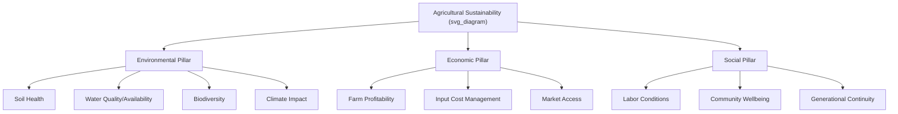

## Sustainability and Stewardship in Farming

### Overview

Agricultural sustainability refers to farming approaches designed to meet current food, fiber, and fuel production needs without compromising the capacity of future generations to meet their own needs. Stewardship extends this concept to encompass the ethical and practical responsibility of land managers to protect and enhance the natural resources (soil, water, biodiversity, air quality) under their care. Sustainability is commonly analyzed across three interconnected pillars: environmental, economic, and social.

### The Three Pillars of Agricultural Sustainability

**Key Points**

- **Environmental sustainability**: Maintaining or improving natural resource quality (soil health, water availability and quality, biodiversity, air quality) over the long term.
- **Economic sustainability**: Ensuring farm operations remain financially viable, generating adequate returns to support continued operation, investment, and farmer livelihoods.
- **Social sustainability**: Addressing labor conditions, community wellbeing, equitable access to resources, and intergenerational farm viability.
- [Inference] These three pillars frequently involve trade-offs rather than automatic alignment; a practice that improves one dimension (e.g., environmental outcomes) does not always straightforwardly improve another (e.g., short-term farm profitability), and specific trade-off assessments require context-specific analysis.

### Soil Stewardship

#### Soil Health Principles

**Key Points**

- Soil health encompasses physical (structure, aggregation, water infiltration), chemical (nutrient availability, pH balance), and biological (microbial activity, organic matter content) properties functioning together to support plant growth and broader ecosystem functions.
- Commonly cited core soil health management principles, widely promoted by organizations such as the USDA Natural Resources Conservation Service (NRCS), include: minimizing soil disturbance, maximizing soil cover, maximizing biodiversity, maintaining living roots year-round, and integrating livestock where feasible.

#### Conservation Tillage Practices

- **No-till farming**: Planting directly into undisturbed soil from the previous crop's residue, minimizing mechanical soil disturbance.
- **Reduced/minimum tillage**: Intermediate disturbance levels between conventional intensive tillage and full no-till.
- **Benefits documented in agricultural research**: Reduced soil erosion, improved water infiltration and retention, increased soil organic carbon over time, reduced fuel consumption.
- **Trade-offs**: Potential increased reliance on herbicides for weed control in the absence of tillage-based weed suppression in some systems, and a transition period during which yield outcomes may vary before soil biological function fully adjusts. [Inference] Yield outcomes during and after transition to no-till vary considerably by soil type, climate, and crop, and should not be assumed uniformly positive or negative.

#### Cover Cropping

**Key Points**

- Cover crops (e.g., cereal rye, hairy vetch, clover, radish) are planted during periods when the primary cash crop is not occupying the field, serving functions including erosion control, weed suppression, nitrogen fixation (legume species), soil structure improvement, and organic matter addition.
- Termination methods (mechanical, chemical, or winterkill in cold climates) and timing significantly affect cover crop benefits and potential interference with subsequent cash crop establishment.

### Water Stewardship

#### Irrigation Efficiency

**Key Points**

- **Drip irrigation**: Delivers water directly to the root zone through emitters, generally achieving higher water use efficiency compared to flood or overhead sprinkler methods, though initial infrastructure cost is typically higher.
- **Deficit irrigation**: Deliberately applying less than full crop water requirements during specific, less sensitive growth stages to conserve water while managing yield impact within acceptable bounds.
- **Soil moisture sensors and evapotranspiration-based scheduling**: Data-driven approaches to time irrigation applications more precisely to actual crop need rather than fixed schedules.

#### Water Quality Protection

- **Buffer strips and riparian zones**: Vegetated areas along waterways that filter sediment, nutrients, and agrochemical runoff before it enters water bodies.
- **Nutrient management planning**: Calibrating fertilizer application rates, timing, and placement to crop uptake needs, reducing excess nutrient loss to groundwater (nitrate leaching) or surface water (phosphorus runoff contributing to eutrophication).
- **Controlled drainage systems**: Managing subsurface drainage outflow timing to reduce nutrient export during high-risk periods.

### Biodiversity Conservation on Farmland

**Key Points**

- **Habitat preservation**: Maintaining or restoring non-cropped habitat features (hedgerows, field margins, wetlands, woodlots) within or adjacent to farmed land.
- **Pollinator support**: Planting flowering habitat strips and reducing pesticide applications during pollinator activity periods to support managed and wild pollinator populations critical to many crop systems.
- **Integrated Pest Management (IPM)**: Reducing reliance on broad-spectrum pesticides in favor of monitoring-based, threshold-driven, and biologically-informed pest control approaches, thereby preserving natural enemy populations.
- **Crop and livestock genetic diversity**: Maintaining diverse crop varieties and livestock breeds, including heritage/heirloom varieties, as a genetic resource base for resilience against future pest, disease, and climate pressures.

### Climate-Smart and Regenerative Practices

#### Carbon Sequestration in Agricultural Soils

**Key Points**

- Practices that increase soil organic carbon (reduced tillage, cover cropping, diverse rotations, organic amendments, perennial integration) are studied as potential contributors to climate change mitigation through carbon sequestration.
- Soil carbon sequestration rates and their long-term stability (permanence) vary considerably by soil type, climate, and management duration, and are subject to active scientific study and measurement methodology debate. [Unverified] Specific carbon credit quantification methodologies and market mechanisms for agricultural soil carbon are still evolving and vary by program and jurisdiction; current figures and program details should be verified against current regulatory and market sources.

#### Greenhouse Gas Mitigation Strategies

- **Nitrogen management**: Precision application timing and rates to reduce nitrous oxide emissions associated with excess or poorly-timed nitrogen fertilizer application.
- **Livestock management**: Feed additive research (e.g., certain seaweed and other compounds under investigation) aimed at reducing enteric methane emissions from ruminants; manure management practices (anaerobic digestion, covered lagoons) to capture or reduce methane release. [Unverified] Efficacy and commercial-scale adoption status of specific feed additives varies and should be checked against current peer-reviewed and regulatory sources, as this remains an active research area.
- **Energy efficiency and renewable energy integration**: On-farm solar, wind, or biogas energy production to reduce reliance on fossil fuel-based energy inputs.

### Certification Systems and Standards

**Key Points**

- **Organic certification**: Standards (varying by country, e.g., USDA Organic, EU Organic) prohibiting most synthetic fertilizers and pesticides, emphasizing biological and cultural pest/fertility management.
- **Fair Trade certification**: Focuses primarily on social and economic sustainability dimensions, including minimum price guarantees and labor standards for producers, particularly in export commodity supply chains (coffee, cocoa, bananas).
- **Rainforest Alliance and similar environmental certifications**: Address biodiversity conservation, sustainable land use, and, in some cases, labor standards within certified supply chains.
- **Regenerative agriculture certifications**: A newer and less standardized category of certification emphasizing soil health outcomes and ecosystem regeneration. [Unverified] As noted in prior discussion of this term, no single universally adopted regenerative agriculture standard currently exists; specific program requirements vary by certifying body and should be verified individually.

### Economic Dimensions of Sustainable Farming

**Key Points**

- Transitioning to certain sustainable practices (organic conversion, cover cropping, precision technology adoption) often involves upfront costs or a transition period with potential yield or income variability before longer-term benefits are realized.
- Government and private-sector cost-share and incentive programs (e.g., conservation payment programs in various countries) exist in many jurisdictions to help offset transition costs for specific conservation practices.
- Diversification of farm income streams (agritourism, value-added processing, direct marketing) is one strategy documented in agricultural economics literature for improving farm economic resilience alongside environmental stewardship goals.

### Social Stewardship and Labor Considerations

**Key Points**

- Fair labor practices, including wage standards, working conditions, and safety protocols, are an important dimension of agricultural sustainability, particularly relevant in labor-intensive sectors such as fruit and vegetable harvesting and certain plantation crop systems.
- Community-level considerations include impacts of agricultural operations on local water resources, air quality (e.g., from concentrated animal feeding operations), and rural economic development.
- Farm succession planning and support for beginning farmers are recognized as important social sustainability factors affecting long-term continuity of agricultural knowledge and land stewardship.

### Measuring and Assessing Sustainability

**Key Points**

- **Life cycle assessment (LCA)**: A methodology quantifying environmental impacts (greenhouse gas emissions, water use, land use) across a product's full production chain, from input production through farm-gate or further downstream stages.
- **Soil health testing frameworks**: Standardized soil sampling and laboratory analysis protocols (e.g., measuring organic matter, aggregate stability, microbial biomass) used to track soil condition over time.
- **Sustainability indices and scorecards**: Various industry and academic frameworks exist to benchmark farm-level or supply-chain-level sustainability performance against defined metrics, though [Inference] the proliferation of differing frameworks and metrics across the industry means direct comparability between different assessment tools is often limited.

### Common Challenges and Trade-offs

**Key Points**

- **Yield vs. sustainability trade-offs**: Some sustainable practices may involve short-term yield reduction or increased management complexity, particularly during transition periods, though long-term outcomes vary by system and context.
- **Knowledge and technical support gaps**: Successful implementation of many sustainable practices requires site-specific technical knowledge, which may not be equally accessible to all farmers, particularly smallholders in resource-limited settings.
- **Verification and greenwashing concerns**: The proliferation of sustainability claims and certifications in agricultural marketing has raised concerns in some consumer and policy research about the consistency and verifiability of specific claims. [Inference] The prevalence of unsubstantiated versus well-verified sustainability claims varies considerably across products, companies, and markets, and general claims should be evaluated on a case-by-case basis against specific evidence.
- **Scale-dependent applicability**: Practices proven effective at experimental or small-farm scale do not always translate directly to large-scale commercial operations without adaptation.

### Related Topics

- Soil health assessment and management practices
- Integrated pest management (IPM) systems
- Water resource management and irrigation efficiency
- Climate-smart agriculture and carbon sequestration
- Organic and regenerative certification standards
- Agricultural life cycle assessment methodologies
- Farm economics and diversification strategies
- Biodiversity conservation on agricultural land
- Agricultural labor standards and rural social sustainability
- Policy instruments supporting sustainable farming transitions