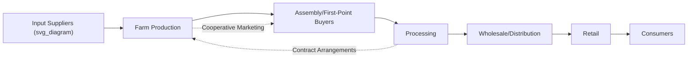

## Agricultural Economics Fundamentals

### Overview

Agricultural economics applies economic theory and quantitative methods to the production, distribution, and consumption of agricultural goods. The field addresses unique characteristics of agriculture that distinguish it from many other economic sectors, including biological production lags, weather dependency, price and yield volatility, and the strategic importance of food for national policy.

### Distinctive Economic Characteristics of Agriculture

**Key Points**

- **Production lag**: Agricultural output cannot be adjusted quickly in response to price signals due to biological growing cycles; farmers commit inputs (seed, land, labor) well before knowing final market prices at harvest.
- **Weather and biological risk**: Yields are subject to variability from weather, pests, and disease in ways less common in most manufacturing sectors.
- **Inelastic demand for staple foods**: Demand for many basic food commodities changes relatively little in response to price changes, since food consumption has a biological floor and ceiling largely independent of price.
- **Perishability**: Many agricultural products degrade quickly, limiting storage options and affecting timing of sale decisions.
- **Land as a fixed, spatially specific input**: Agricultural land cannot be relocated, and its productive characteristics (soil, climate, water access) are largely fixed in the short to medium term.

### Supply and Demand in Agricultural Markets

#### Price Elasticity Concepts

**Key Points**

- **Price elasticity of demand** ($E_d$) measures the responsiveness of quantity demanded to a change in price:

$$E_d = \frac{\%\Delta Q_d}{\%\Delta P}$$

- Staple food commodities (grains, basic dairy) commonly exhibit **inelastic demand** ($|E_d| < 1$), meaning quantity demanded changes proportionally less than price. Higher-value or discretionary food products (specialty foods, out-of-season produce) tend to exhibit relatively more elastic demand, though [Inference] specific elasticity values vary by country, income level, and product category, and should be sourced from current empirical studies for precise figures.
- **Price elasticity of supply** ($E_s$) measures producer responsiveness to price changes; agricultural supply elasticity is often relatively low in the short run (due to the production lag noted above) but higher over longer time horizons as farmers can adjust land allocation, crop choice, and capital investment.

#### Market Equilibrium and Price Volatility

**Key Points**

- Agricultural commodity prices are frequently characterized by pronounced volatility, driven by the combination of inelastic demand and supply shocks (weather events, pest outbreaks, policy changes) that shift the relatively inelastic supply curve.
- This dynamic is formally described in agricultural economics through **cobweb models**, which illustrate how production lags combined with price-based planting decisions can generate cyclical over- and under-production patterns in some commodity markets. [Inference] The applicability and strength of cobweb dynamics vary by specific commodity, market structure, and the degree to which producers rely on futures prices versus current spot prices for planting decisions.

### Production Economics

#### Cost Structures

**Key Points**

- **Fixed costs**: Expenses that do not vary with output level in the short run, such as land ownership costs, major equipment depreciation, and certain insurance premiums.
- **Variable costs**: Expenses that scale with production level, including seed, fertilizer, fuel, and hired labor for planting/harvesting.
- **Total cost, average cost, and marginal cost** relationships guide production decisions: profit-maximizing output theoretically occurs where marginal cost equals marginal revenue, subject to the practical constraints of biological production limits.

$$MC = \frac{\Delta TC}{\Delta Q}$$

#### Economies of Scale in Agriculture

**Key Points**

- Larger farm operations often achieve lower per-unit costs through spreading fixed costs (machinery, infrastructure) over greater output volume, bulk input purchasing power, and specialized labor allocation.
- Economies of scale are not unlimited; agricultural economics research generally identifies scale efficiencies as more significant for certain input categories (machinery, some administrative functions) than for others (land productivity itself, which is less scale-dependent), and diseconomies of scale (management complexity, monitoring costs) can emerge at very large operational sizes. [Inference] The specific scale at which economies of scale plateau or diseconomies emerge varies substantially by commodity type, region, and management structure.

### Risk Management in Agriculture

#### Sources of Agricultural Risk

- **Production risk**: Yield variability from weather, pests, disease.
- **Price risk**: Output price volatility affecting revenue, and input price volatility (fertilizer, fuel) affecting costs.
- **Financial risk**: Debt servicing obligations amid variable income streams.
- **Institutional/policy risk**: Changes in government subsidy programs, trade policy, or regulatory requirements.

#### Risk Management Tools

**Key Points**

- **Crop insurance**: Programs (often government-subsidized in many countries) providing indemnity payments when yields or revenue fall below specified thresholds due to insurable causes.
- **Futures and options contracts**: Financial instruments traded on commodity exchanges (e.g., Chicago Board of Trade, now part of CME Group) allowing farmers to lock in prices for future delivery (**hedging**), transferring price risk to speculators willing to bear it in exchange for potential profit.
- **Diversification**: Spreading risk across multiple crops, livestock enterprises, or income sources to reduce dependence on any single commodity's performance.
- **Forward contracting**: Direct agreements between farmers and buyers to sell a specified quantity at a predetermined price ahead of harvest, reducing price uncertainty outside formal exchange mechanisms.

**Example**

A corn farmer concerned about falling prices before harvest might sell corn futures contracts on a commodity exchange at the current futures price. If the market price at harvest falls below the contracted futures price, the farmer's loss on the physical corn sale is offset by a gain on the futures position, achieving an effective locked-in price regardless of the actual market movement (subject to basis risk, the difference between local cash price and the futures contract price).

### Agricultural Policy and Market Intervention

#### Common Policy Instruments

**Key Points**

- **Price support programs**: Government-guaranteed minimum prices for specific commodities, historically significant in policies such as the U.S. farm bill's commodity programs and the European Union's Common Agricultural Policy (CAP), though specific program structures have evolved substantially over time in both jurisdictions. [Unverified] Current specific program parameters (payment rates, eligibility rules) change with periodic legislative renewal and should be verified against the most current policy documentation for either jurisdiction.
- **Direct payments and income support**: Payments to farmers decoupled (fully or partially) from current production decisions, intended to support farm income while reducing production-distorting incentives compared to price supports tied directly to output.
- **Import tariffs and export subsidies**: Trade policy tools affecting relative competitiveness of domestic versus imported agricultural goods.
- **Supply management systems**: Production quota systems (e.g., historically used in Canadian dairy and poultry sectors) restricting output to maintain higher domestic prices for producers.

#### Market Failures Addressed by Agricultural Policy

- **Public goods**: Agricultural research and extension services often exhibit public-good characteristics (non-excludable, non-rivalrous benefits), providing an economic rationale for public investment given potential underinvestment by private actors alone.
- **Externalities**: Environmental impacts of agricultural production (water pollution from nutrient runoff, greenhouse gas emissions) represent negative externalities not fully reflected in market prices, providing a rationale for regulatory or incentive-based policy intervention (e.g., conservation payment programs, pollution regulations).
- **Information asymmetries**: Food safety and quality attributes not directly observable by consumers at point of purchase provide a rationale for labeling requirements and food safety regulation.

### International Trade in Agricultural Economics

**Key Points**

- **Comparative advantage** theory suggests countries benefit from specializing in agricultural production for which they hold relative efficiency advantages (due to climate, soil, labor cost, or technology) and trading for other goods, though [Inference] real-world agricultural trade patterns are also substantially shaped by historical, political, and strategic food-security considerations beyond pure comparative advantage.
- Agricultural trade is subject to World Trade Organization (WTO) frameworks, including the Agreement on Agriculture, which addresses market access, domestic support, and export subsidy commitments among member countries.
- Exchange rate fluctuations significantly affect agricultural trade competitiveness, as commodity prices are commonly denominated in major currencies (notably the U.S. dollar) in international markets.

### Farm Financial Management

#### Key Financial Statements and Metrics

- **Balance sheet**: Summarizes farm assets (land, equipment, livestock, inventory) against liabilities (debt) to determine net worth/equity.
- **Income statement**: Records revenue and expenses over an accounting period to determine net farm income.
- **Cash flow statement**: Tracks the timing of cash inflows and outflows, critical in agriculture given the seasonal and often irregular timing of both farm revenue (concentrated at harvest/sale) and expenses (concentrated at planting).
- **Debt-to-asset ratio and working capital**: Common solvency and liquidity metrics used to assess farm financial health and borrowing capacity.

#### Capital and Credit in Agriculture

**Key Points**

- Agriculture is typically capital-intensive relative to output value in many production systems, requiring substantial investment in land, machinery, and infrastructure.
- Specialized agricultural lending institutions (e.g., farm credit systems in various countries) exist in many jurisdictions to address the unique seasonal cash flow patterns and collateral characteristics (land, growing crops, livestock) of farm borrowing needs.
- Land value, as the dominant farm asset in most systems, plays a central role in farm balance sheets and borrowing capacity, making agricultural sectors particularly sensitive to land price fluctuations.

### Agricultural Value Chains and Market Structure

**Key Points**

- **Market structure** in agricultural input and output markets ranges from relatively competitive (many small farms selling into commodity markets) to concentrated (a small number of large processors or input suppliers holding significant market power), with implications for price-setting power at different points in the value chain.
- **Vertical integration and contract farming**: Arrangements where processors or retailers establish direct contractual relationships with producers (common in poultry, some fruit/vegetable, and increasingly other sectors), specifying production practices, quality standards, and pricing terms in advance of production.
- **Cooperative structures**: Farmer-owned cooperative marketing and purchasing organizations, historically significant in many agricultural sectors, intended to provide farmers with greater collective bargaining power and shared infrastructure access than individual farmers could achieve independently.

### Land Economics

**Key Points**

- Agricultural land value reflects a combination of current productive capacity (soil quality, water access, climate suitability), location factors (proximity to markets, urban development pressure), and expected future returns, including potential non-agricultural development value in some regions.
- Land tenure arrangements (ownership, cash rent leasing, share-cropping/crop-share leasing) affect the distribution of production risk and returns between landowners and farm operators.
- **Land rent theory**, tracing to classical economists such as David Ricardo, provides a foundational framework for understanding how differences in land quality and location translate into differential land values and rental rates.

### Related Topics

- Commodity futures markets and hedging strategies
- Agricultural policy frameworks (farm bills, Common Agricultural Policy)
- Farm financial management and credit systems
- International agricultural trade and comparative advantage
- Cooperative marketing structures in agriculture
- Land tenure systems and land value economics
- Risk management tools including crop insurance
- Agricultural market structure and vertical integration
- Externalities and environmental policy in agriculture
- Behavioral economics applications in farmer decision-making