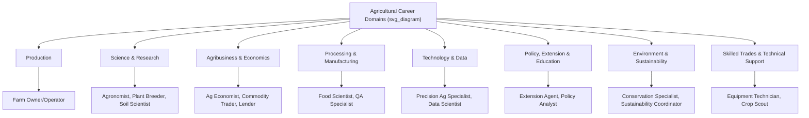

## Career Pathways in Agriculture

### Overview

Agricultural careers span a wide range of disciplines extending well beyond direct farming, encompassing science, engineering, business, policy, technology, and skilled trades. The sector's career landscape reflects the full scope of the food and agricultural system, from production and research through processing, distribution, policy, and emerging technology domains.

### Direct Production Careers

#### Farm Ownership and Operation

**Key Points**

- **Farm owner/operator**: Manages day-to-day agronomic, financial, and operational decisions for crop or livestock production; may operate independently owned land, leased land, or a combination.
- **Farm manager**: Oversees operations on behalf of an owner (individual, family, or corporate entity) without necessarily holding ownership, common on larger operations or absentee-owned farmland.
- Entry pathways include family farm succession, agricultural land leasing programs for beginning farmers, and, in some regions, government-supported beginning farmer loan and land-access programs. [Inference] The relative importance of family inheritance versus independent entry varies substantially by country and region, and current entry-barrier data should be sourced from current agricultural census or extension reporting for specific locales.

#### Specialized Production Roles

- **Livestock production specialist**: Focused roles in dairy herd management, feedlot operations, poultry production, or aquaculture management.
- **Orchard/vineyard manager**: Specialized perennial crop management requiring knowledge of pruning, grafting, and long-term crop planning distinct from annual crop systems.
- **Greenhouse/controlled-environment agriculture manager**: Oversees climate control, hydroponic/aeroponic systems, and pest management within protected cultivation environments.

### Agricultural Science and Research Careers

**Key Points**

- **Agronomist**: Applies crop and soil science to advise on variety selection, fertility management, pest control, and cropping system design; often works for input suppliers, cooperatives, consulting firms, or directly with farm operations.
- **Plant breeder/geneticist**: Develops improved crop varieties through conventional breeding, marker-assisted selection, or biotechnology approaches; typically requires advanced degrees (M.S. or Ph.D.) and works in university, government, or private seed-company research settings.
- **Soil scientist**: Studies soil formation, classification, fertility, and management; roles span academic research, government conservation agencies, and private consulting.
- **Animal scientist**: Focuses on livestock genetics, nutrition, reproduction, and welfare, working in research, extension, or industry settings.
- **Entomologist/plant pathologist**: Specializes in pest insect or disease management research and diagnostics, often supporting integrated pest management program development.
- **Agricultural engineer**: Designs equipment, irrigation systems, structures, and precision agriculture technologies; typically requires an engineering degree with agricultural specialization.

### Agribusiness and Economics Careers

**Key Points**

- **Agricultural economist**: Analyzes markets, policy impacts, and farm financial decision-making; roles span government agencies, universities, commodity organizations, and private financial institutions.
- **Commodity trader/broker**: Facilitates buying and selling of agricultural commodities, often involving futures market activity and price risk management for producers or agribusiness clients.
- **Agricultural lender/farm credit officer**: Provides financing and financial planning services tailored to agricultural borrowers' seasonal cash flow and asset characteristics.
- **Farm business consultant**: Advises on financial planning, succession planning, and operational efficiency for farm enterprises.
- **Supply chain and logistics manager**: Coordinates movement of agricultural commodities and products from production through processing and distribution.

### Food Processing and Manufacturing Careers

**Key Points**

- **Food scientist/food technologist**: Develops food products, ensures food safety compliance, and optimizes processing methods; typically requires a food science degree.
- **Quality assurance/food safety specialist**: Manages compliance with food safety regulations and standards (e.g., HACCP protocols) within processing facilities.
- **Plant operations manager**: Oversees processing facility operations, production scheduling, and staff management.

### Agricultural Technology and Precision Agriculture Careers

**Key Points**

- **Precision agriculture specialist**: Supports implementation of GPS-guided equipment, variable-rate application technology, and data analysis for site-specific crop management.
- **Agricultural data analyst/data scientist**: Analyzes yield, soil, weather, and remote sensing data to inform management recommendations, increasingly using machine learning methods for predictive modeling.
- **Agricultural technology (AgTech) developer/engineer**: Designs software, sensors, drones, or robotics for agricultural applications, often within startup or established agricultural technology companies.
- **Remote sensing/GIS specialist**: Applies satellite and aerial imagery analysis to crop monitoring, yield prediction, and land use assessment.

[Inference] The AgTech career segment is a comparatively recent and rapidly evolving area; specific job titles, required qualifications, and typical career trajectories are less standardized than in longer-established agricultural science fields, and current job market specifics should be verified against current industry sources.

### Policy, Extension, and Education Careers

**Key Points**

- **Extension agent/educator**: Bridges agricultural research institutions and practicing farmers, translating research findings into practical recommendations; commonly affiliated with land-grant universities (in the U.S. context) or equivalent national agricultural extension services elsewhere.
- **Agricultural policy analyst**: Works within government agencies, trade associations, or non-governmental organizations analyzing and shaping agricultural and food policy.
- **Regulatory affairs specialist**: Manages compliance with agricultural regulations spanning pesticide registration, biotechnology approval, food safety, and environmental standards.
- **Agricultural educator (secondary/postsecondary)**: Teaches agricultural science, technology, and business curricula in high schools, community colleges, and universities.
- **International development specialist**: Works on agricultural development projects, often with organizations such as the Food and Agriculture Organization (FAO), national development agencies, or international NGOs, focused on smallholder productivity, food security, and rural livelihoods in developing regions.

### Environmental and Sustainability Careers

**Key Points**

- **Conservation specialist**: Works with farmers to implement soil, water, and habitat conservation practices, often affiliated with government conservation agencies (e.g., USDA NRCS in the U.S.) or conservation NGOs.
- **Sustainability coordinator**: Manages sustainability program implementation and reporting for agribusiness companies or food retailers, including certification compliance and supply chain sustainability initiatives.
- **Climate/carbon program specialist**: An emerging role focused on facilitating farmer participation in carbon credit or ecosystem service payment programs. [Unverified] This role category has grown notably in recent years alongside carbon market development, but specific job market scale and standardization remain in flux and should be checked against current industry reporting.

### Skilled Trades and Technical Support Roles

**Key Points**

- **Agricultural equipment technician/mechanic**: Maintains and repairs increasingly complex, electronically integrated farm machinery, requiring specialized technical training.
- **Irrigation technician**: Installs and maintains irrigation system infrastructure.
- **Crop scout**: Conducts field monitoring for pest, disease, and crop condition assessment, often as an entry-level pathway toward agronomy roles.
- **Veterinary technician (livestock/large animal)**: Supports veterinary care for livestock operations, working under licensed veterinarians.

### Educational and Credential Pathways

**Key Points**

- **Vocational/technical certificate programs**: Often address skilled trade roles (equipment technician, irrigation technician) and some production management pathways.
- **Associate degrees**: Common for technical and para-professional roles (agricultural technician, crop scout, veterinary technician).
- **Bachelor's degrees**: Typical baseline for agronomist, extension agent, food scientist, agricultural business, and many entry-level agribusiness roles; common degree fields include agronomy, animal science, agricultural engineering, agricultural economics, and food science.
- **Graduate degrees (M.S./Ph.D.)**: Generally required for research-intensive roles (plant breeding, academic research positions) and some senior policy or specialized consulting roles.
- **Professional certifications**: Various industry certifications exist depending on specialization, such as Certified Crop Adviser (CCA) credentials in some regions, which can supplement or, in some cases, substitute for specific formal degree requirements depending on employer and role. [Unverified] Specific certification requirements, availability, and recognition vary by country and region, and should be verified against current certifying body information.

### Career Progression Patterns

**Key Points**

- Many agricultural careers follow a progression from field-based or entry-level technical roles (crop scout, farm laborer, technician) toward supervisory, management, or specialized advisory positions with accumulated experience and, in some cases, additional credentials.
- Cross-disciplinary movement is common; for example, individuals with agronomy backgrounds frequently transition into sales/technical support roles with agricultural input companies, or extension/consulting roles.
- Family farm succession represents a distinct career pathway with its own planning considerations (estate planning, gradual transfer of management responsibility) not directly comparable to conventional employment career progression. [Inference] Specific succession patterns and their prevalence vary considerably by region, farm type, and cultural context.

### Industry Sectors Employing Agricultural Professionals

- **Primary production**: Farms, ranches, and agricultural cooperatives.
- **Input supply**: Seed, fertilizer, crop protection, and equipment manufacturing and distribution companies.
- **Processing and food manufacturing**: Grain processors, meatpacking, dairy processing, packaged food manufacturers.
- **Government and public sector**: Ministries/departments of agriculture, extension services, regulatory agencies, and research institutions.
- **Financial services**: Agricultural lending institutions, crop insurance providers, commodity brokerages.
- **Technology sector**: AgTech startups and established technology companies developing agricultural software, hardware, and data services.
- **Nonprofit and international development**: NGOs and multilateral organizations focused on food security, sustainable agriculture, and rural development.

### Related Topics

- Agricultural education systems and land-grant universities
- Certified Crop Adviser and other professional credentialing programs
- Precision agriculture and AgTech industry trends
- Farm succession planning and beginning farmer programs
- Agricultural extension services and knowledge transfer
- International agricultural development careers
- Agribusiness management and supply chain roles
- Environmental and conservation career pathways in agriculture
- Skilled trades training for agricultural equipment and irrigation
- Labor market trends in the agricultural technology sector