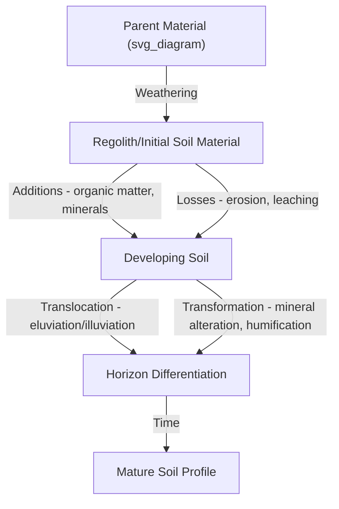
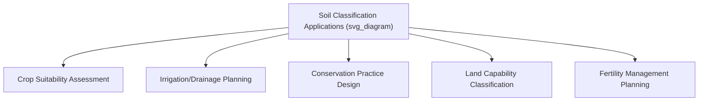

## Soil Formation and Classification

### Overview

Soil formation (pedogenesis) is the process by which parent geological material is transformed into structured soil profiles through the combined action of physical, chemical, and biological weathering processes over time. Soil classification systems organize the resulting diversity of soils into hierarchical categories based on measurable properties, enabling consistent communication, land use planning, and agricultural management decisions across regions.

### Factors of Soil Formation

**Key Points**

Soil formation is commonly described using the CLORPT framework, originally formalized by soil scientist Hans Jenny, identifying five interacting state factors:

$$S = f(cl, o, r, p, t)$$

where $S$ represents soil properties as a function of climate ($cl$), organisms ($o$), relief/topography ($r$), parent material ($p$), and time ($t$).

#### Climate

- Temperature and precipitation govern the rate and type of chemical weathering, organic matter decomposition, and leaching.
- Warm, humid climates generally accelerate chemical weathering and organic matter turnover, while cold or arid climates slow these processes, though specific rates vary by additional local factors. [Inference] Precise weathering rate figures for specific climate zones vary considerably by parent material and should be sourced from region-specific soil survey data rather than generalized broadly.
- Freeze-thaw cycles contribute to physical weathering (frost wedging) in temperate and cold climates.

#### Organisms (Biotic Factors)

- Vegetation type strongly influences organic matter input, nutrient cycling patterns, and soil acidity (e.g., coniferous forest litter tends to produce more acidic surface soils compared to grassland systems).
- Soil fauna (earthworms, arthropods, burrowing mammals) physically mix and aerate soil, influencing structure development.
- Microbial and fungal activity drives organic matter decomposition and nutrient mineralization, and mycorrhizal associations influence soil aggregate stability.
- Human activity is increasingly recognized as a significant "anthropogenic" factor in soil formation and modification, through cultivation, drainage, irrigation, and construction.

#### Relief (Topography)

- Slope angle and landscape position affect water movement, erosion, and deposition patterns.
- Soils on steep slopes tend to be shallower due to erosion, while soils in low-lying or depositional landscape positions tend to be deeper, often with greater organic matter accumulation.
- Aspect (slope orientation relative to sun exposure) influences local microclimate, affecting temperature and moisture regimes at a fine spatial scale.

#### Parent Material

- The geological material from which soil forms (residual bedrock weathering in place, or transported material via glacial, alluvial, aeolian, or colluvial processes) strongly influences initial soil texture, mineralogy, and nutrient content.
- Different parent materials weather at different rates and produce distinct soil chemical characteristics; for example, soils derived from limestone parent material tend toward higher base saturation and neutral-to-alkaline pH compared to soils derived from acidic igneous rock.

#### Time

- Soil development is a slow, ongoing process; distinct horizon development typically requires hundreds to thousands of years, with the specific rate dependent on the interaction of all other four factors.
- Young soils (e.g., recent alluvial deposits or volcanic ash soils) often show minimal horizon differentiation, while old, stable landscapes can develop deeply weathered, highly differentiated profiles.

### Soil-Forming Processes

**Key Points**

- **Weathering**: Physical (mechanical breakdown via freeze-thaw, root growth, abrasion) and chemical (mineral dissolution, hydrolysis, oxidation) breakdown of parent material into progressively finer particles and altered mineral forms.
- **Additions**: Organic matter input from plant/animal residues, atmospheric deposition of dust and nutrients, and, in managed systems, fertilizer or amendment application.
- **Losses**: Erosion (surface soil removal by water or wind), leaching (downward movement of dissolved substances out of the profile), and gaseous losses (e.g., denitrification, volatilization).
- **Translocation**: Movement of materials within the soil profile, including **eluviation** (removal of material from an upper horizon) and **illuviation** (deposition of that material in a lower horizon), notably involving clay particles, iron and aluminum oxides, and organic compounds.
- **Transformation**: In-place chemical and biological alteration of materials, such as the conversion of primary minerals to secondary clay minerals, or organic residues to humus.

### Soil Profile Development and Horizons

**Key Points**

Soil profiles are commonly described using a master horizon nomenclature system:

| Horizon | Description |
| --- | --- |
| O | Organic surface layer, dominated by decomposing plant/animal residue |
| A | Mineral surface horizon with accumulated humified organic matter (topsoil) |
| E | Eluvial horizon, characterized by leaching/loss of clay, iron, and aluminum oxides (not present in all soils) |
| B | Subsoil horizon of illuviation, where translocated clay, iron, aluminum, or other materials accumulate |
| C | Weathered parent material, minimally altered by pedogenic processes |
| R | Unweathered bedrock |

**Example**

A well-developed forest soil in a humid temperate climate might display an O horizon of leaf litter, a dark A horizon rich in organic matter, a lighter-colored E horizon where clays and oxides have leached downward, a B horizon where those materials have accumulated (often reddish or yellowish due to iron oxide concentration), and a C horizon of weathered but recognizable parent rock material above unweathered R horizon bedrock.

### Major Soil Classification Systems

#### USDA Soil Taxonomy

**Key Points**

- Developed and maintained by the United States Department of Agriculture Natural Resources Conservation Service (NRCS), widely used in the U.S. and adapted or referenced internationally.
- Organized in a hierarchical system with six levels of increasing specificity: **Order, Suborder, Great Group, Subgroup, Family, Series**.
- **Twelve soil orders** are recognized at the highest classification level, distinguished primarily by dominant soil-forming processes and diagnostic horizons:

| Order | General Characteristics |
| --- | --- |
| Entisols | Minimal profile development; young or frequently disturbed soils |
| Inceptisols | Weakly developed horizons; early-stage soil development |
| Andisols | Formed from volcanic ash/parent material; distinctive amorphous mineral content |
| Gelisols | Permafrost-affected soils in cold regions |
| Histosols | Organic soils (peat/muck), typically formed in waterlogged conditions |
| Aridisols | Soils of arid regions with limited leaching and often accumulated salts or carbonates |
| Vertisols | High shrink-swell clay content, forming deep cracks upon drying |
| Mollisols | Dark, organic-rich surface horizons, typically formed under grassland vegetation |
| Alfisols | Moderate weathering with clay accumulation (argillic horizon) and relatively high base saturation |
| Ultisols | Highly weathered soils with clay accumulation and low base saturation, common in humid subtropical/tropical regions |
| Spodosols | Acidic soils with distinctive illuviated horizon of organic matter and aluminum/iron oxides, typically under coniferous forest |
| Oxisols | Highly weathered tropical soils dominated by iron/aluminum oxides, with minimal weatherable mineral content remaining |

- Classification relies on **diagnostic horizons** (specific, measurably defined horizon types) and **soil moisture/temperature regimes**, providing an objective, criteria-based approach rather than purely descriptive categorization.

#### World Reference Base for Soil Resources (WRB)

**Key Points**

- Maintained under the auspices of the International Union of Soil Sciences (IUSS) and used as an international reference standard, particularly influential outside the United States.
- Organized around **Reference Soil Groups** (32 groups in recent editions) combined with qualifiers that provide additional descriptive detail, differing structurally from the strict hierarchical levels of USDA Soil Taxonomy. [Unverified] The exact current number of Reference Soil Groups and specific qualifier lists have been revised across WRB edition updates, so the precise current figure should be confirmed against the most recent official WRB publication.
- Designed to facilitate international soil correlation and communication, particularly valuable for global soil mapping and cross-border agricultural and environmental assessment work.

#### Comparison of Classification Approaches

**Key Points**

- USDA Soil Taxonomy uses a strict hierarchical, criteria-based system with quantitative diagnostic horizon definitions and named taxonomic levels analogous in structure to biological taxonomy.
- WRB uses a reference-group-plus-qualifier approach, offering somewhat greater descriptive flexibility for representing soils with mixed or transitional characteristics.
- Many soil orders/groups have rough correspondences between the two systems (e.g., USDA Mollisols correspond broadly to WRB Chernozems/Kastanozems/Phaeozems groups), though [Inference] exact one-to-one equivalency does not always exist due to differing classification criteria, and precise cross-referencing for specific soils should be verified against official correlation tables from both systems.

### Soil Texture Classification

**Key Points**

- Soil texture refers to the relative proportions of sand, silt, and clay particle size fractions, classified using standardized particle size boundaries (varying slightly between systems, e.g., USDA vs. international systems).
- The **USDA soil textural triangle** is the standard reference tool for determining texture class (e.g., loam, sandy clay loam, silty clay) based on percentage sand, silt, and clay content.
- Texture significantly influences water infiltration and retention, aeration, nutrient-holding capacity (cation exchange capacity is generally higher in clay-dominated soils), and workability for tillage.

$$\%Sand + \%Silt + \%Clay = 100\%$$

### Soil Mapping and Survey

**Key Points**

- Soil surveys document the spatial distribution of soil types across a landscape, typically presented as soil maps delineating **soil series** (the most specific classification unit) or map units representing associations of related soils.
- In the United States, the NRCS Web Soil Survey provides publicly accessible digital soil survey data, widely used in agricultural planning, land evaluation, and conservation practice design.
- Soil surveys support practical applications including crop suitability assessment, irrigation and drainage planning, and conservation practice targeting.

### Practical Applications in Agriculture

**Key Points**

- Soil order and series identification informs expectations regarding natural fertility, drainage characteristics, and management needs; for example, Mollisols are generally associated with high natural fertility suited to grain production, while Oxisols and highly weathered Ultisols typically require more intensive fertility management due to inherently lower nutrient reserves and high phosphorus fixation capacity.
- Soil classification informs land capability classification systems, which rate land suitability for various agricultural uses based on limitations such as slope, drainage, and erosion susceptibility.
- Understanding parent material and formation history helps predict specific management challenges, such as anticipated drainage issues in soils formed from lacustrine (lake bed) parent material, or shrink-swell management concerns in Vertisols.

### Related Topics

- Soil texture, structure, and physical properties
- Soil chemistry: pH, cation exchange capacity, and nutrient availability
- Soil organic matter and carbon dynamics
- Soil erosion processes and control practices
- Soil fertility management and nutrient cycling
- Land capability classification and land use planning
- Soil survey methodology and digital soil mapping
- Weathering processes and mineral transformation in soils
- Hydric soils and wetland soil identification
- Regional soil variation and pedoclimatic zones