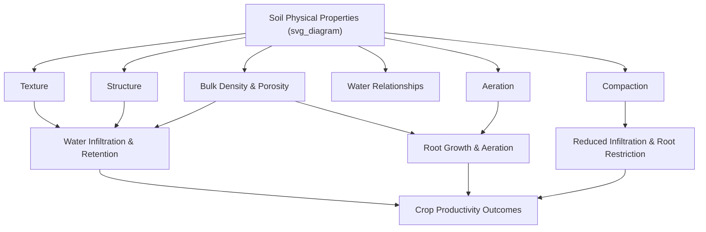

## Soil Physical Properties

### Overview

Soil physical properties describe the arrangement, size, and behavior of solid particles, pore space, water, and air within the soil matrix. These properties fundamentally govern root growth, water movement and storage, aeration, thermal behavior, and workability, making them central to agricultural management decisions regarding tillage, irrigation, drainage, and crop selection.

### Soil Texture

**Key Points**

- Soil texture refers to the relative proportions of sand, silt, and clay particle size fractions in the mineral fraction of soil, based on standardized particle diameter boundaries:

| Particle Class | USDA Diameter Range |
| --- | --- |
| Sand | 0.05–2.0 mm |
| Silt | 0.002–0.05 mm |
| Clay | Less than 0.002 mm |

- Texture is determined through laboratory particle size analysis (commonly the hydrometer or pipette method) and classified using the **USDA soil textural triangle**, which maps percentage sand, silt, and clay to named texture classes (e.g., sandy loam, silty clay loam, clay).
- Texture is considered a relatively stable, intrinsic soil property that changes very slowly over time (through pedogenic processes) and is not readily altered by routine farm management practices, distinguishing it from soil structure, which management can influence more directly.

**Example**

A soil sample testing at 40% sand, 40% silt, and 20% clay would classify as a **loam**, generally considered favorable for agriculture due to a balance of water retention, drainage, and workability characteristics compared to texture classes at the sand-dominated or clay-dominated extremes.

### Soil Structure

**Key Points**

- Soil structure refers to the arrangement of primary soil particles (sand, silt, clay) into aggregates (peds), influenced by organic matter content, biological activity, mineralogy, and management practices, unlike texture, which is largely fixed.
- Common structural types include: **granular** (rounded aggregates, typical of well-aggregated topsoil, often associated with high organic matter and biological activity), **blocky** (angular or subangular aggregates, common in subsoil B horizons), **platy** (horizontally layered, often indicating compaction), **prismatic/columnar** (vertically oriented aggregates, common in some subsoil horizons, particularly in arid/semi-arid or sodic soils), and **structureless** (single-grained, as in loose sands, or massive, as in dense, unaggregated clay).
- Aggregate stability, the capacity of soil aggregates to resist breakdown under mechanical stress or water impact (e.g., raindrop impact), is strongly influenced by organic matter content, microbial and fungal binding agents (e.g., glomalin produced by mycorrhizal fungi), and root activity.
- Tillage practices significantly affect structure; excessive or poorly timed tillage tends to disrupt aggregates and can accelerate organic matter loss, while reduced tillage and organic matter additions generally support improved aggregate stability over time. [Inference] The magnitude and timeline of structural improvement under reduced tillage varies considerably by soil type, climate, and management duration.

### Bulk Density and Porosity

**Key Points**

- **Bulk density** ($\rho_b$) is the mass of dry soil per unit volume, including pore space:

$$\rho_b = \frac{M_{s}}{V_{t}}$$

where $M_s$ is the mass of dry solids and $V_t$ is the total soil volume (solids plus pores).

- Bulk density typically ranges from approximately 1.0–1.6 g/cm³ for most agricultural mineral soils, with lower values generally associated with higher organic matter content and better aggregation, and higher values associated with compaction or naturally dense subsoil layers. [Inference] Specific bulk density values and their interpretation as "limiting" for root growth vary by soil texture, so a given bulk density value should be interpreted relative to texture-specific reference thresholds rather than a single universal number.
- **Porosity** represents the proportion of total soil volume occupied by pore space (air and water combined):

$$Porosity (\%) = \left(1 - \frac{\rho_b}{\rho_p}\right) \times 100$$

where $\rho_p$ is particle density, commonly assumed at approximately 2.65 g/cm³ for typical mineral soils.

- **Pore size distribution** matters as much as total porosity: **macropores** (larger pores, including structural cracks and root/worm channels) facilitate rapid water infiltration and drainage and aeration, while **micropores** (smaller pores within and between aggregates) retain water against gravity, contributing to plant-available water storage.

### Soil Water Relationships

#### Key Water Content Concepts

**Key Points**

- **Saturation**: All pore space filled with water, no air present.
- **Field capacity**: The water content remaining after gravitational drainage has largely ceased (typically measured at a matric potential around -0.033 MPa, or -1/3 bar, though the specific reference tension varies somewhat by soil type and measurement convention).
- **Permanent wilting point**: The soil water content at which plants can no longer extract sufficient water to prevent permanent wilting (conventionally measured at approximately -1.5 MPa, or -15 bar matric potential).
- **Plant-available water**: The difference between field capacity and permanent wilting point, representing the water fraction theoretically accessible to plant roots.

$$AWC = \theta_{FC} - \theta_{PWP}$$

where $AWC$ is available water capacity, $\theta_{FC}$ is volumetric water content at field capacity, and $\theta_{PWP}$ is volumetric water content at permanent wilting point.

- Available water capacity varies substantially by texture: fine-textured soils (clays) generally hold more total water but also retain a larger fraction at tensions beyond plant extraction capability, while coarse-textured soils (sands) hold less total water but release a higher proportion of it within the plant-available range. [Inference] The specific available-water-capacity value for a given field should be determined from site-specific soil survey data or direct measurement rather than assumed from texture class alone, since structure and organic matter also influence actual field values.

#### Water Movement Through Soil

**Key Points**

- **Infiltration** describes the rate at which water enters the soil surface, influenced by surface structure, existing water content, texture, and macropore continuity.
- **Hydraulic conductivity** describes the rate at which water moves through saturated or unsaturated soil, governed by pore size, connectivity, and continuity; sandy soils generally exhibit higher saturated hydraulic conductivity than clay soils due to larger, better-connected pores.
- **Percolation** refers to the downward movement of water through the soil profile below the root zone, relevant to both drainage management and the potential for nutrient/contaminant leaching to groundwater.
- **Capillary action** allows water to move against gravity within fine pores, contributing to upward water movement from moist subsoil toward drier surface layers under certain conditions.

### Soil Aeration

**Key Points**

- Adequate soil aeration (oxygen availability within pore space) is essential for root respiration and aerobic microbial activity; oxygen deficiency (hypoxia) in waterlogged or heavily compacted soils can impair root function and shift microbial communities toward anaerobic processes (e.g., denitrification, methane production).
- Aeration is closely tied to pore size distribution and drainage; well-aggregated soils with abundant macropores generally maintain better aeration under wet conditions compared to compacted or structurally degraded soils.
- Waterlogging tolerance varies substantially by crop species; some crops (e.g., rice) have specific physiological adaptations (aerenchyma tissue) for growth in saturated conditions, while most upland crops experience significant stress or damage under prolonged saturation.

### Soil Compaction

**Key Points**

- Compaction refers to the compression of soil particles, reducing pore space (particularly macropore volume) and increasing bulk density, commonly caused by heavy machinery traffic, particularly under wet soil conditions, and by livestock trampling in some grazing systems.
- Compaction impairs root penetration, water infiltration, and aeration, and can create distinct compacted layers (e.g., "plow pans" or "traffic pans") at specific depths corresponding to repeated equipment pressure zones.
- Management strategies to mitigate compaction include controlled traffic farming (confining equipment traffic to designated lanes), reducing field traffic under wet conditions, deep tillage/subsoiling to physically disrupt compacted layers, and biological approaches using deep-rooted cover crops to create root channels through compacted zones. [Inference] The relative effectiveness of mechanical versus biological decompaction approaches varies by soil type, compaction severity, and climate, and specific outcomes should be evaluated against site conditions.

### Soil Color

**Key Points**

- Soil color, typically described using the standardized **Munsell color system** (hue, value, chroma), provides useful diagnostic information about soil composition and drainage history.
- Dark colors generally indicate higher organic matter content in surface horizons.
- Reddish and yellowish colors typically indicate the presence of oxidized iron compounds, associated with well-drained, aerobic conditions.
- Gray, mottled, or bluish-gray colors (**gleying**) typically indicate poorly drained or seasonally saturated conditions where iron has been chemically reduced, serving as a diagnostic indicator used in hydric soil identification for wetland delineation purposes.

### Soil Temperature

**Key Points**

- Soil temperature affects seed germination rates, root growth, microbial activity, and nutrient mineralization rates, generally increasing with temperature within biologically favorable ranges.
- Soil color, moisture content, and surface residue cover all influence soil temperature; darker, drier, and bare soils generally warm more quickly in spring than lighter-colored, wetter, or heavily residue-covered soils, which has practical implications for planting date decisions, particularly in no-till systems with substantial surface residue.
- Soil temperature varies with depth and time lag relative to air temperature, with deeper soil layers exhibiting more moderated and delayed temperature fluctuations compared to the surface.

### Measurement Methods

**Key Points**

- **Bulk density**: Commonly measured using the core method (extracting a known-volume soil sample) or clod method (coating an irregular clod and measuring water displacement).
- **Texture**: Determined via laboratory particle size analysis (hydrometer or pipette methods) or estimated in the field using hand-texturing techniques (feel method based on soil behavior when moistened and manipulated).
- **Soil moisture**: Measured via gravimetric methods (oven-drying and weighing), or in-field sensor-based methods including time-domain reflectometry (TDR), capacitance probes, and tensiometers (measuring matric potential directly).
- **Infiltration rate**: Commonly measured using single- or double-ring infiltrometers in the field.
- **Compaction/penetration resistance**: Measured using a penetrometer, which quantifies the force required to push a probe into the soil at various depths.

### Practical Management Implications

**Key Points**

- Understanding a field's texture and structural condition informs irrigation scheduling (available water capacity determines how much water can be applied between irrigation events without excessive loss to drainage), tillage system selection, and drainage design needs.
- Compaction assessment (via penetrometer surveys or visual root/soil pit examination) helps target remediation practices (subsoiling, controlled traffic, cover cropping) to specific problem areas rather than applying blanket treatments across a field.
- Soil physical property variability within a single field (due to differing parent material, landscape position, or management history) is a key rationale underlying precision agriculture approaches that apply variable-rate irrigation, tillage, or other inputs based on site-specific soil conditions.

### Related Topics

- Soil water management and irrigation scheduling
- Soil compaction identification and remediation strategies
- Soil structure improvement through organic matter management
- Tillage systems and their effects on soil physical condition
- Precision agriculture and site-specific soil variability management
- Drainage design and wetland/hydric soil identification
- Soil temperature effects on planting decisions
- Cover cropping for soil structure and compaction management
- Soil physical property measurement techniques and field assessment
- Controlled traffic farming systems