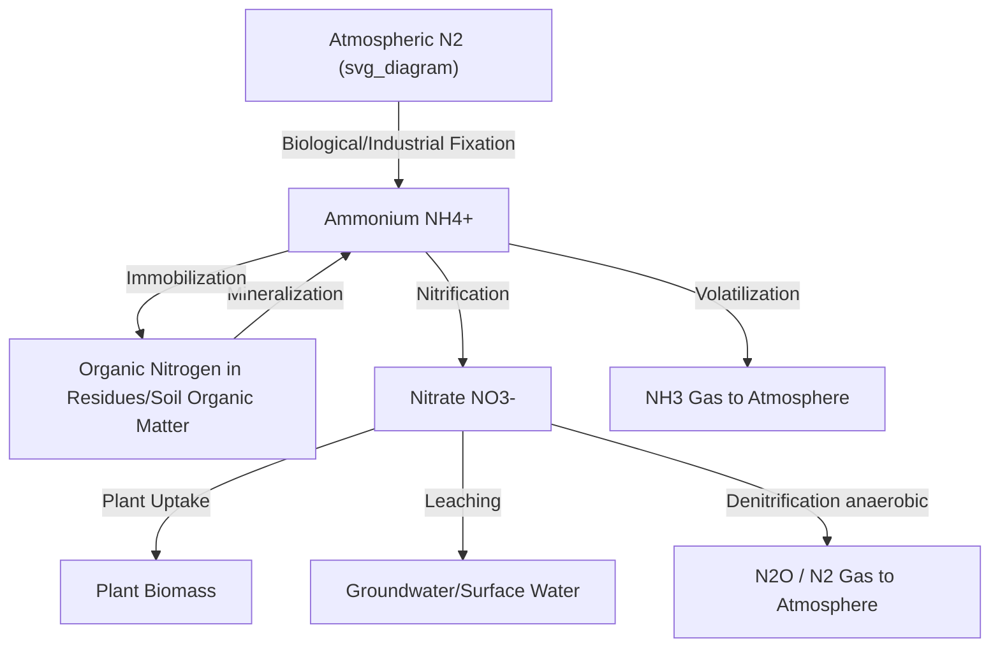
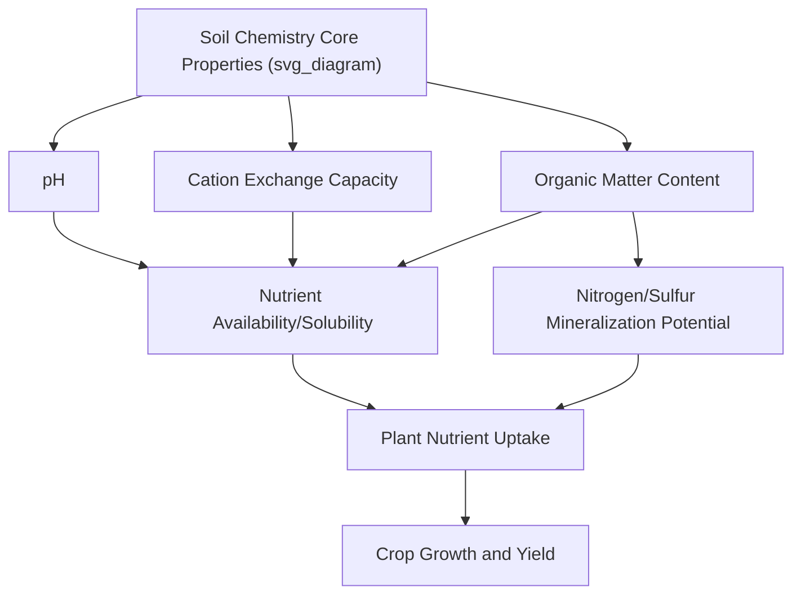

## Soil Chemistry and Nutrient Cycles

### Overview

Soil chemistry governs the availability, transformation, and retention of nutrients essential for plant growth, mediated through mineral surfaces, organic matter, soil solution chemistry, and microbial activity. Understanding these chemical processes and their associated nutrient cycles underpins effective fertility management, environmental protection, and long-term soil productivity.

### Soil pH and Its Agricultural Significance

**Key Points**

- Soil pH measures the concentration of hydrogen ions ($H^+$) in soil solution on a logarithmic scale, with values below 7 indicating acidity, 7 indicating neutrality, and above 7 indicating alkalinity.

$$pH = -\log_{10}[H^+]$$

- pH strongly influences nutrient availability: most macronutrients and micronutrients (with some exceptions, such as molybdenum, which becomes more available at higher pH) exhibit maximum general availability in the roughly neutral to slightly acidic range (approximately pH 6.0–7.0), though optimal ranges vary by specific crop and nutrient.
- At low pH (strongly acidic conditions), aluminum and manganese can become soluble to levels toxic to many crop root systems, while phosphorus availability often declines due to fixation with iron and aluminum oxides.
- At high pH (alkaline conditions), micronutrients such as iron, zinc, and manganese often become less available due to formation of insoluble compounds, and phosphorus availability can decline through calcium-phosphate precipitation.
- **Liming** (applying calcium carbonate or related materials) is the standard practice for raising soil pH in acidic soils, while **elemental sulfur** or acidifying fertilizers are commonly used to lower pH in alkaline soils where reduction is agronomically feasible.

### Cation Exchange Capacity (CEC)

**Key Points**

- CEC quantifies the soil's capacity to hold and exchange positively charged ions (cations) on negatively charged surfaces of clay minerals and organic matter, expressed in centimoles of charge per kilogram of soil (cmol$_c$/kg), historically also expressed as milliequivalents per 100 grams (meq/100g), a numerically equivalent unit.
- Higher CEC generally indicates greater capacity to retain and supply exchangeable nutrient cations (calcium, magnesium, potassium, ammonium) against leaching loss, while also buffering against rapid pH change.
- CEC is strongly influenced by clay content and mineralogy (certain clay types, such as smectites, have substantially higher CEC per unit mass than others, such as kaolinite) and by organic matter content, which contributes significant CEC per unit mass, often exceeding that of most clay minerals.
- **Base saturation** describes the percentage of CEC occupied by base cations (calcium, magnesium, potassium, sodium) versus acidic cations (hydrogen, aluminum); higher base saturation is generally associated with higher soil pH and is a commonly used fertility indicator.

$$Base\ Saturation\ (\%) = \frac{Exchangeable\ Ca + Mg + K + Na}{CEC} \times 100$$

### Essential Plant Nutrients

**Key Points**

Essential plant nutrients are commonly classified by required quantity:

| Category | Nutrients |
| --- | --- |
| Primary macronutrients | Nitrogen (N), Phosphorus (P), Potassium (K) |
| Secondary macronutrients | Calcium (Ca), Magnesium (Mg), Sulfur (S) |
| Micronutrients | Iron (Fe), Manganese (Mn), Zinc (Zn), Copper (Cu), Boron (B), Molybdenum (Mo), Chlorine (Cl), Nickel (Ni) |

Additional elements (e.g., silicon, cobalt, sodium) are considered beneficial for certain plant species or conditions without meeting strict essentiality criteria for all plants. [Inference] The precise essentiality classification of certain beneficial elements is an area of ongoing plant nutrition research and can vary somewhat between sources.

### The Nitrogen Cycle

**Key Points**

- **Nitrogen fixation**: Conversion of atmospheric $N_2$ gas into biologically available forms, occurring through biological fixation (symbiotic rhizobia bacteria in legume root nodules, and free-living/associative fixing bacteria) or industrial fixation (Haber-Bosch process for synthetic fertilizer production).

$$N_2 + 8H^+ + 8e^- + 16ATP \rightarrow 2NH_3 + H_2 + 16ADP + 16P_i$$

(simplified representation of the biological nitrogenase-catalyzed reaction)

- **Mineralization**: Microbial decomposition of organic nitrogen compounds into ammonium ($NH_4^+$).
- **Nitrification**: Microbial (chemoautotrophic bacteria, e.g., *Nitrosomonas* and *Nitrobacter* genera) oxidation of ammonium to nitrite ($NO_2^-$) and then nitrate ($NO_3^-$).
- **Immobilization**: Microbial uptake of inorganic nitrogen forms into microbial biomass, temporarily reducing plant-available nitrogen, particularly notable when high-carbon, low-nitrogen residues (e.g., cereal straw) are incorporated into soil.
- **Denitrification**: Microbial (anaerobic) reduction of nitrate to gaseous forms (nitrous oxide, $N_2O$, and dinitrogen gas, $N_2$), occurring primarily under low-oxygen (waterlogged or compacted) soil conditions, and representing both an agronomic nitrogen loss pathway and a significant source of the potent greenhouse gas nitrous oxide.
- **Leaching**: Downward movement of nitrate (which, unlike ammonium, is not significantly retained by cation exchange sites due to its negative charge) through the soil profile with percolating water, a primary pathway for groundwater nitrate contamination.

### The Phosphorus Cycle

**Key Points**

- Unlike nitrogen, phosphorus has no significant atmospheric gaseous phase relevant to agricultural cycling; the cycle is dominated by mineral weathering, organic matter turnover, and chemical fixation reactions.
- Phosphorus in soil exists in several pools: soil solution phosphorus (directly plant-available, typically present in very low concentrations), labile (readily exchangeable) inorganic phosphorus, organic phosphorus (in soil organic matter and microbial biomass), and mineral/fixed phosphorus (bound to iron, aluminum, or calcium compounds, or present in primary/secondary minerals).
- **Phosphorus fixation**: Phosphate ions readily react with iron and aluminum oxides (particularly significant in acidic soils) or calcium compounds (significant in alkaline/calcareous soils) to form relatively insoluble compounds, substantially limiting the proportion of applied phosphorus fertilizer that remains readily plant-available in a given season.
- Because phosphorus is not highly mobile in most soils (in contrast to nitrate), phosphorus loss to water bodies occurs predominantly through surface runoff and erosion of phosphorus-bound soil particles rather than through leaching, making it a primary target of nutrient management practices aimed at reducing surface water eutrophication risk.
- Global phosphorus fertilizer production relies on mined phosphate rock, a finite resource with geographically concentrated reserves, representing a long-term resource sustainability consideration distinct from nitrogen's atmospheric abundance. [Inference] Specific phosphate reserve depletion timelines are subject to considerable uncertainty and disagreement in the literature depending on assumptions about future demand, extraction technology, and reserve estimates, so specific numeric depletion projections should be treated cautiously.

### The Potassium Cycle

**Key Points**

- Potassium exists in soil in several forms: soil solution potassium (immediately plant-available), exchangeable potassium (held on cation exchange sites, readily available), fixed potassium (trapped within certain clay mineral structures, e.g., illite, less readily available), and structural potassium (within primary minerals such as feldspars and micas, released only slowly through weathering).
- Unlike nitrogen, potassium does not undergo significant transformation between oxidation states or gaseous loss pathways; cycling primarily involves physical/chemical equilibria between these pools plus plant uptake, residue return, and leaching (generally more significant in coarse-textured, low-CEC soils).
- Potassium plays key roles in plant water regulation (stomatal function), enzyme activation, and overall stress tolerance, though it is not incorporated into structural plant compounds in the way nitrogen and phosphorus are.

### The Sulfur Cycle

**Key Points**

- Sulfur cycling involves both atmospheric and soil-based transformations, including mineralization of organic sulfur compounds, oxidation of reduced sulfur forms (e.g., by soil bacteria) to plant-available sulfate ($SO_4^{2-}$), and immobilization/reduction processes analogous in some respects to nitrogen cycling.
- Historically, atmospheric sulfur deposition (from industrial emissions) supplied significant incidental crop sulfur needs in many regions; documented reductions in industrial sulfur emissions in several countries over recent decades have, in some cases, increased the need for deliberate sulfur fertilization to address emerging deficiencies. [Inference] The specific magnitude of this shift and current deficiency prevalence vary considerably by region and should be assessed against current regional soil testing and agronomic data.

### Micronutrient Chemistry

**Key Points**

- Micronutrient availability is strongly pH-dependent for most cationic micronutrients (iron, manganese, zinc, copper), with availability generally decreasing as pH rises above neutral due to formation of insoluble hydroxide or oxide compounds.
- **Molybdenum** behaves oppositely to most other micronutrients, with availability increasing at higher pH, since it exists as an anion (molybdate) whose solubility follows different chemical behavior than the cationic micronutrients.
- **Boron** availability is influenced by both pH and soil moisture; boron deficiency risk increases under both very low and very high pH extremes, and under drought conditions when soil solution boron transport to roots is limited.
- Micronutrient deficiencies are more commonly observed in highly weathered soils (where micronutrient-bearing minerals have been depleted), sandy soils (low retention capacity), organic/peat soils, and soils with pH outside the optimal availability range for the nutrient in question.

### Soil Organic Matter and Nutrient Cycling

**Key Points**

- Soil organic matter (SOM) serves as both a nutrient reservoir (particularly nitrogen, phosphorus, and sulfur held in organic forms) and a source of cation exchange capacity, water retention, and microbial habitat supporting decomposition and mineralization processes.
- The **carbon-to-nitrogen ratio (C:N ratio)** of organic residues significantly affects decomposition dynamics and nitrogen availability: residues with high C:N ratios (e.g., cereal straw, around 80:1) tend to cause temporary nitrogen immobilization as decomposer microorganisms draw on available soil nitrogen to support their own growth, while low C:N residues (e.g., legume residues, often below 20:1) tend to mineralize nitrogen more readily for plant availability.

$$C:N\ ratio = \frac{Mass\ of\ Carbon}{Mass\ of\ Nitrogen}$$

- Humus, the stabilized, biologically resistant fraction of soil organic matter, contributes substantial long-term CEC and nutrient-holding capacity, though it decomposes and turns over much more slowly than fresh organic residues.

### Soil Testing and Nutrient Management

**Key Points**

- Standard soil fertility testing typically measures pH, buffer pH (for lime requirement calculation in acidic soils), extractable phosphorus and potassium, and often secondary/micronutrient status and organic matter content, using regionally calibrated extraction methods (e.g., Mehlich-3, Bray-1, or Olsen methods, chosen based on regional soil chemistry characteristics).
- Nutrient recommendations are typically calibrated against crop-specific yield response research for the relevant region and soil testing methodology, since extraction methods are not universally interchangeable without appropriate calibration or conversion factors. [Inference] Directly comparing soil test values derived from different extraction methods without appropriate calibration or conversion is a common source of misinterpretation and should be avoided.
- The **4R Nutrient Stewardship** framework (right source, right rate, right time, right place) is a widely referenced approach in agronomic and industry guidance for optimizing fertilizer use efficiency while minimizing environmental loss.

### Related Topics

- Soil fertility testing methods and interpretation
- Fertilizer types, formulations, and application strategies
- Nitrogen management and greenhouse gas mitigation
- Phosphorus runoff and water quality protection
- Soil organic matter management and carbon sequestration
- Liming and soil pH management practices
- Micronutrient deficiency diagnosis in crops
- Cation exchange capacity and clay mineralogy
- Precision nutrient management and variable-rate fertilization
- 4R Nutrient Stewardship framework implementation