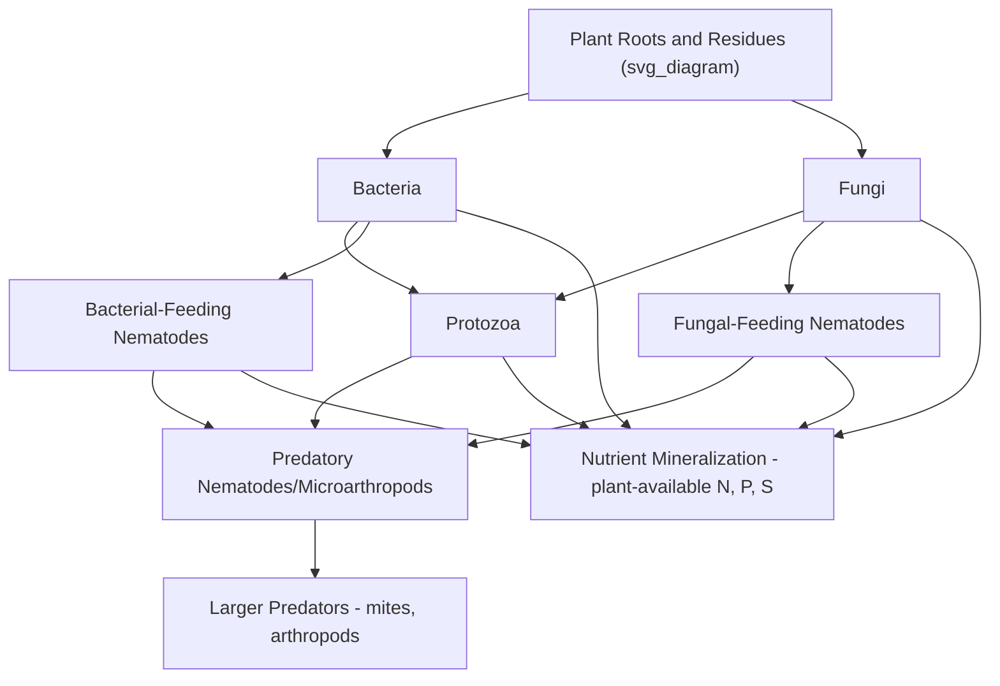
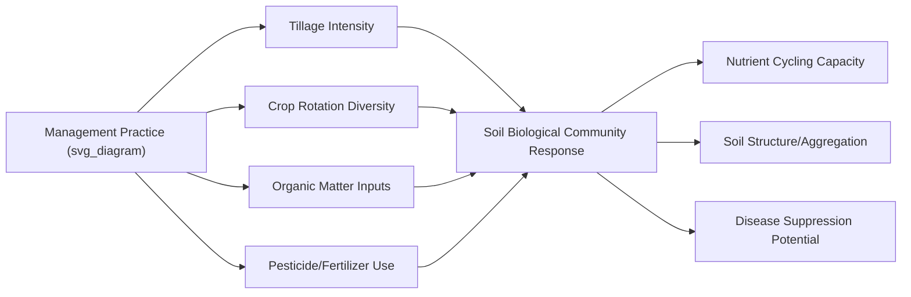

## Soil Biology and Microbial Ecology

### Overview

Soil biology encompasses the diverse community of organisms inhabiting soil, ranging from microscopic bacteria and fungi to soil fauna such as nematodes, arthropods, and earthworms. These organisms collectively drive organic matter decomposition, nutrient cycling, soil structure formation, and pest/disease dynamics, making soil biological activity a fundamental determinant of soil health and agricultural productivity.

### The Soil Food Web

**Key Points**

- The soil food web describes the trophic interactions among soil organisms, beginning with primary producers (plant roots and their exudates) and decomposers (bacteria, fungi) processing organic inputs, extending through successive consumer levels (protozoa, nematodes, microarthropods, and larger predators).
- Energy and nutrients flow through the food web via feeding relationships, with organisms at each level releasing plant-available nutrients (particularly nitrogen) as metabolic byproducts, a process central to nutrient mineralization.
- Greater soil food web complexity and diversity is generally associated in soil ecology research with more resilient nutrient cycling and disease suppression capacity, though the specific relationship strength varies by system and is an active area of ongoing research. [Inference] Precise, generalizable quantitative relationships between food web complexity metrics and specific agronomic outcomes should be treated with appropriate caution, as findings vary across studies and soil types.

### Soil Bacteria

**Key Points**

- Bacteria represent the most numerous and taxonomically diverse group of soil microorganisms, performing a wide range of metabolic functions including organic matter decomposition, nitrogen fixation, nitrification, and denitrification.
- **Nitrogen-fixing bacteria**: Include symbiotic genera such as *Rhizobium* (associated with legume root nodules) and free-living or associative nitrogen fixers such as *Azotobacter* and *Azospirillum*.
- **Nitrifying bacteria**: Chemoautotrophic genera including *Nitrosomonas* (oxidizing ammonium to nitrite) and *Nitrobacter* (oxidizing nitrite to nitrate), central to the nitrogen cycle's nitrification step.
- **Actinomycetes**: A group of filamentous bacteria contributing to organic matter decomposition, notably responsible for the characteristic "earthy" smell of healthy soil (attributed to compounds called geosmins) and playing roles in the decomposition of more resistant organic compounds such as cellulose and lignin.
- **Plant growth-promoting rhizobacteria (PGPR)**: A functional category of bacteria colonizing the root zone (rhizosphere) that can enhance plant growth through mechanisms including nutrient solubilization, phytohormone production, or suppression of plant pathogens.

### Soil Fungi

**Key Points**

- Fungi contribute substantially to organic matter decomposition, particularly of more resistant compounds such as lignin and cellulose in woody or fibrous plant residues, and play a central role in soil aggregate formation through hyphal binding of soil particles.
- **Mycorrhizal fungi** form symbiotic associations with the majority of plant species' root systems, with two major functional types relevant to agriculture:
  - **Arbuscular mycorrhizal fungi (AMF)**: Form internal root associations with a wide range of crop species (including most grain crops, legumes, and many vegetables), extending root nutrient (particularly phosphorus) and water absorption capacity via extensive external hyphal networks, in exchange for plant-derived carbohydrates.
  - **Ectomycorrhizal fungi**: Form external sheath associations primarily with certain tree species (many forestry and some perennial orchard/agroforestry species), less commonly relevant to annual row crop systems.
- **Saprophytic fungi**: Decompose dead organic matter, contributing significantly to nutrient cycling and humus formation.
- **Pathogenic fungi**: A subset of soil fungi cause crop diseases (e.g., *Fusarium*, *Rhizoctonia*, *Pythium* species causing various root rots and wilts), representing an important consideration in crop rotation and soil-borne disease management planning.

**Example**

In a corn-soybean rotation, arbuscular mycorrhizal fungi colonizing corn roots extend a network of fine hyphae into the surrounding soil, substantially increasing the effective root surface area for phosphorus uptake, particularly valuable in soils where phosphorus availability is limited by fixation reactions. The fungi receive photosynthetically-derived carbohydrates from the plant in return, representing a mutualistic exchange relationship.

### Soil Protozoa

**Key Points**

- Single-celled organisms that primarily feed on bacteria, playing a key role in nutrient cycling by releasing excess nitrogen (as ammonium) consumed from bacterial prey that exceeds the protozoa's own metabolic needs, a process sometimes termed the "microbial loop."
- Protozoan grazing on bacteria also influences bacterial community composition and population dynamics within the rhizosphere.

### Nematodes

**Key Points**

- Soil nematodes represent a diverse group functionally classified by feeding behavior: bacterial-feeding, fungal-feeding, plant-parasitic, predatory, and omnivorous types.
- **Beneficial nematodes** (bacterial- and fungal-feeding types) contribute to nutrient mineralization through grazing activity analogous to protozoan grazing.
- **Plant-parasitic nematodes** (e.g., root-knot nematodes, cyst nematodes, lesion nematodes) feed directly on plant root tissue, causing significant crop damage and yield loss in many cropping systems worldwide, representing an important target of crop rotation, resistant variety selection, and, in some systems, nematicide management strategies.
- Nematode community composition and diversity ratios (e.g., ratios of bacterial-feeding to fungal-feeding nematodes) are sometimes used as bioindicators of soil food web condition and disturbance history in soil health assessment research. [Unverified] The practical adoption and standardization of nematode-based soil health indicators in routine commercial soil testing varies and is not yet as widespread as basic chemical soil testing, so current availability should be checked against specific regional testing laboratory offerings.

### Soil Microarthropods

**Key Points**

- Includes mites and springtails (Collembola) among the most numerically abundant soil microarthropod groups, contributing to organic matter fragmentation (increasing surface area available for microbial decomposition) and grazing on fungi and bacteria.
- Generally more sensitive to soil disturbance (tillage) and certain pesticide applications compared to bacteria, making some microarthropod groups useful indicators of soil disturbance history in ecological research contexts.

### Earthworms

**Key Points**

- Earthworms are among the most visible and widely recognized soil fauna, contributing to soil structure through burrowing (creating macropores that enhance water infiltration and aeration) and casting (excreting nutrient-enriched, well-aggregated soil material).
- Functional groups are commonly classified as **epigeic** (surface-dwelling, litter-feeding), **endogeic** (living within upper mineral soil horizons, feeding on soil organic matter), and **anecic** (forming deep vertical burrows, pulling surface residue into lower soil layers, e.g., the well-known genus *Lumbricus*, including the common nightcrawler species).
- Earthworm populations are generally reduced by intensive tillage (both through direct physical disruption and reduced surface residue/food source availability) and can be supported by reduced tillage practices, cover cropping, and organic matter additions. [Inference] Specific earthworm population response magnitudes to given management changes vary by species community present, soil type, and climate, and should not be assumed uniform across all systems.

### Microbial Biomass and Activity Measurement

**Key Points**

- **Microbial biomass carbon/nitrogen**: Laboratory measurements (commonly using chloroform fumigation-extraction methods) quantifying the total carbon or nitrogen contained within living soil microbial cells, used as an indicator of the soil's active microbial pool size.
- **Soil respiration**: Measurement of carbon dioxide release from soil, reflecting overall microbial (and root) metabolic activity; commonly used as a general soil biological activity indicator in both research and some commercial soil health testing frameworks.
- **Enzyme assays**: Measurement of specific soil enzyme activities (e.g., beta-glucosidase, related to carbon cycling; phosphatase, related to phosphorus cycling) provide more targeted indicators of specific nutrient cycling process capacity within the soil microbial community.
- **DNA/molecular sequencing methods**: Increasingly used in both research and, to a growing extent, commercial soil testing contexts to characterize microbial community composition and diversity at a level of detail not achievable through traditional culturing methods (which capture only a small fraction of total soil microbial diversity). [Unverified] The commercial availability, cost, and standardization level of DNA-based soil microbiome testing services continues to evolve rapidly, and current offerings should be verified against current laboratory service providers.

### Management Practices Affecting Soil Biology

**Key Points**

- **Tillage intensity**: Reduced or no-till systems generally support greater fungal biomass, earthworm populations, and overall microbial community stability compared to intensively tilled systems, reflecting reduced physical disturbance and greater surface residue retention. [Inference] The magnitude of these differences and the time required to observe them varies considerably across specific soil types, climates, and transition management practices.
- **Crop diversity and rotation**: Diverse rotations, including cover crops, tend to support more diverse microbial and soil faunal communities compared to continuous monoculture, reflecting varied root exudate chemistry, residue types, and reduced buildup of crop-specific soil-borne pathogens.
- **Organic matter additions**: Compost, manure, and crop residue incorporation provide substrate and habitat supporting microbial and faunal populations, generally increasing overall soil biological activity levels over time.
- **Pesticide and fertilizer use**: Certain pesticides (particularly some fungicides and soil fumigants) can non-selectively reduce beneficial soil fungal and microbial populations alongside target organisms; excessive synthetic nitrogen fertilizer application has been documented in some studies to alter microbial community composition and, in certain contexts, reduce specific beneficial associations such as mycorrhizal colonization rates. [Inference] The specific magnitude and mechanism of fertilizer or pesticide impacts on soil biology vary considerably by product, application rate, and existing soil biological community, and broad generalizations should be applied cautiously to specific products or situations.

### Disease Suppression and Beneficial Microbial Functions

**Key Points**

- **Suppressive soils**: Some soils exhibit natural capacity to limit the establishment or severity of specific soil-borne plant pathogens, generally attributed to competitive and antagonistic interactions from resident beneficial microbial populations (including certain bacteria and fungi producing antimicrobial compounds or competing for resources/infection sites with pathogens).
- **Biological control agents**: Certain soil microorganisms have been developed as commercial biological control products, including specific *Bacillus* and *Trichoderma* species marketed for suppression of particular soil-borne pathogens, though [Unverified] efficacy of specific commercial biological products varies considerably by product, target pathogen, and environmental conditions, and current product-specific performance data should be checked against current manufacturer and independent research sources.
- Maintaining overall soil biological diversity and activity through the management practices noted above is generally considered supportive of natural disease suppression capacity, though this does not eliminate the need for targeted management of specific significant soil-borne disease pressures in a given field.

### Practical Applications in Agricultural Management

**Key Points**

- Soil biological health assessment increasingly supplements traditional chemical soil testing in comprehensive soil health evaluation frameworks, incorporating measures such as microbial biomass, soil respiration, and, in more advanced applications, community composition analysis.
- Understanding mycorrhizal fungal ecology informs management decisions such as minimizing unnecessary tillage and fungicide seed treatments that may reduce colonization potential, and maintaining living root presence (via cover crops) to sustain mycorrhizal fungal populations between cash crop seasons.
- Awareness of soil-borne pathogen and beneficial organism dynamics informs crop rotation planning, particularly regarding rotation length needed to reduce specific pathogen inoculum levels between susceptible host crop plantings.

### Related Topics

- Soil health assessment frameworks and biological indicators
- Mycorrhizal fungi and their role in nutrient uptake
- Nitrogen cycle microbiology and biological nitrogen fixation
- Soil-borne plant pathogens and disease management
- Cover cropping and its effects on soil biological communities
- Tillage systems and impacts on soil organisms
- Compost and organic matter management for soil biology
- Integrated pest management incorporating biological control
- Soil organic matter dynamics and decomposition processes
- Molecular and DNA-based soil microbiome analysis methods