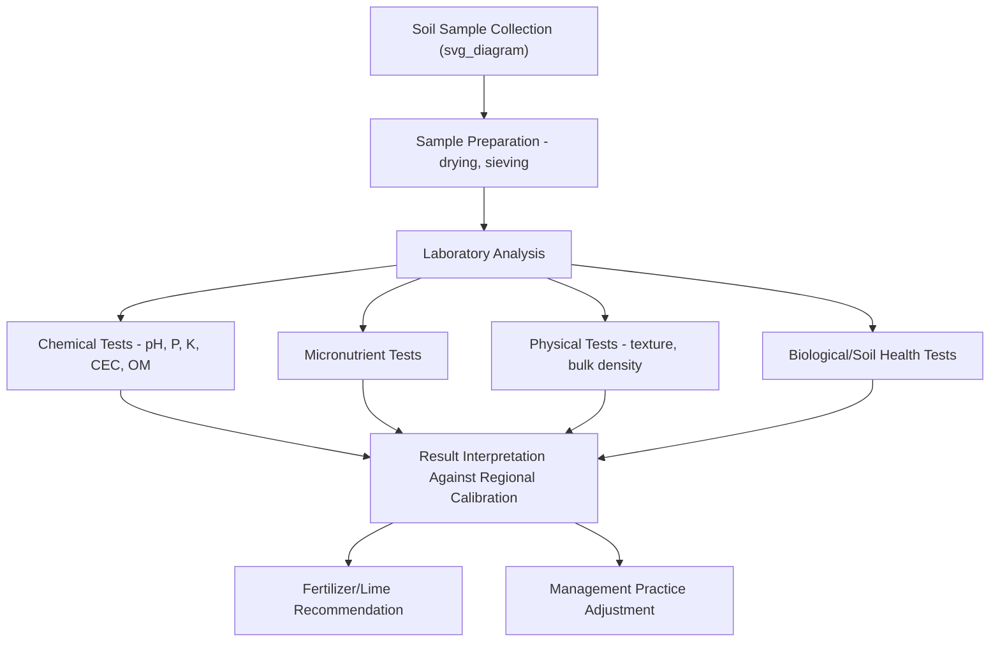

## Soil Testing and Analysis

### Overview

Soil testing and analysis encompasses the systematic collection and laboratory or field evaluation of soil samples to determine chemical, physical, and biological properties relevant to crop management decisions. Effective soil testing programs support fertilizer recommendations, lime requirement calculations, and broader soil health assessment, forming a foundational tool for evidence-based nutrient and soil management.

### Purposes of Soil Testing

**Key Points**

- **Fertility assessment**: Determining current nutrient status (particularly phosphorus, potassium, and secondary/micronutrients) to guide fertilizer application rates.
- **pH and lime requirement determination**: Assessing soil acidity/alkalinity and, where needed, calculating lime application rates to achieve a target pH range for the intended crop.
- **Baseline establishment and monitoring**: Tracking soil property changes over time in response to management practices (e.g., organic matter trends under different tillage systems).
- **Problem diagnosis**: Investigating suspected nutrient deficiencies, toxicities, salinity issues, or other soil-related crop performance problems.
- **Environmental risk assessment**: Identifying situations where excess nutrients (particularly phosphorus) may pose runoff or leaching risk, informing environmentally responsible nutrient management planning.

### Soil Sampling Methodology

#### Sampling Design Approaches

**Key Points**

- **Composite (grid or zone) sampling**: Collecting multiple individual soil cores from a defined area and combining them into a single composite sample for analysis, reducing the cost and effort of analyzing many individual samples while still capturing area-representative average conditions.
- **Grid sampling**: Systematically sampling at regular intervals across a field (e.g., every 2.5 acres or on a specified grid spacing), commonly used to support precision agriculture variable-rate fertilizer application maps.
- **Zone sampling**: Sampling based on delineated management zones defined by factors such as soil type boundaries, yield map patterns, topography, or historical management differences, rather than a uniform grid.
- **Random/representative composite sampling**: A simpler approach combining multiple random cores from a relatively uniform field into a single composite sample, appropriate for smaller or more homogeneous fields where zone or grid-based precision management is not the objective.

#### Sampling Depth and Timing

**Key Points**

- Standard agronomic sampling depth for most row crop fertility testing is commonly the top 6–8 inches (approximately 15–20 cm), corresponding to the primary tillage/root zone for most annual crops, though specific recommended depths vary somewhat by region, crop, and testing purpose.
- Deeper sampling (e.g., 12–24 inches) may be recommended for mobile nutrients such as nitrate-nitrogen, particularly in arid/semi-arid regions where nitrate can accumulate in the subsoil, or for assessing subsoil constraints.
- Sampling timing is generally standardized (e.g., consistently in fall or consistently in spring) for a given field's monitoring program to enable valid year-to-year comparison, since seasonal nutrient fluctuations (particularly for nitrogen) can otherwise confound trend interpretation.
- Sampling should generally avoid periods shortly after fertilizer, lime, or manure application to prevent skewed results reflecting recent amendment rather than baseline soil condition.

**Example**

A grid-sampled 80-acre field divided into 2.5-acre grid cells would require collection of approximately 32 composite samples (each composed of multiple cores taken within its respective cell), providing a spatially resolved dataset suitable for generating a variable-rate lime or fertilizer application map rather than a single field-average recommendation.

### Standard Soil Chemical Tests

**Key Points**

- **Soil pH**: Measured via a soil-water or soil-salt (e.g., calcium chloride) slurry using a pH meter or, less precisely, colorimetric indicator methods.
- **Buffer pH**: A supplementary measurement (using specific buffer solutions, e.g., SMP buffer, Adams-Evans buffer) used specifically to calculate lime requirement in acidic soils, since a single pH reading alone does not indicate the soil's buffering capacity against pH change.
- **Extractable phosphorus**: Commonly measured using regionally calibrated extraction methods such as Mehlich-3, Bray-1, or Olsen (the Olsen method is generally preferred for calcareous/alkaline soils), with results interpreted against region-specific calibration data correlating extractable levels to crop yield response.
- **Extractable potassium, calcium, magnesium**: Typically measured via ammonium acetate or Mehlich-3 extraction, often reported alongside calculated cation exchange capacity and base saturation percentages.
- **Organic matter content**: Commonly estimated via loss-on-ignition or, in some laboratories, via total organic carbon combustion analysis methods, providing an indicator relevant to nitrogen mineralization potential, CEC contribution, and general soil health.
- **Soluble salts/electrical conductivity (EC)**: Measures total dissolved salt concentration in soil, relevant particularly in irrigated arid/semi-arid regions or coastal areas at risk of salinity issues, since excess soluble salts can impair plant water uptake and crop growth.

$$EC_{extract} \propto \text{Total Dissolved Salt Concentration}$$

### Micronutrient and Specialized Testing

**Key Points**

- Micronutrient testing (zinc, manganese, copper, iron, boron) is commonly performed using DTPA (diethylenetriaminepentaacetic acid) extraction methods for cationic micronutrients, with results interpreted against region- and crop-specific sufficiency ranges.
- **Nitrate testing**: Given nitrogen's mobility and dynamic cycling, standard pre-plant or in-season nitrate testing protocols (e.g., the Pre-Sidedress Nitrate Test used in some regions for corn) are used to refine nitrogen fertilizer rate decisions beyond what routine baseline fertility sampling alone provides.
- **Sulfur testing**: Typically measured as extractable sulfate-sulfur, though interpretation can be complicated by sulfur's relatively high spatial and temporal variability within a field.
- **Soil salinity and sodicity assessment**: In addition to EC, sodium adsorption ratio (SAR) calculations are used in relevant regions to assess sodic soil conditions that can impair soil structure and water infiltration.

### Physical Soil Testing

**Key Points**

- **Texture analysis**: Laboratory particle size analysis (hydrometer or pipette methods) or field hand-texturing (feel method) to determine sand/silt/clay proportions and texture classification.
- **Bulk density measurement**: Core or clod sampling methods to assess compaction status and estimate pore space.
- **Infiltration testing**: Single- or double-ring infiltrometer field measurements to assess water entry rate into the soil surface.
- **Penetrometer testing**: Measuring soil resistance to penetration at varying depths, used to identify compacted layers within the profile.

### Soil Health/Biological Testing

**Key Points**

- Comprehensive soil health testing frameworks increasingly supplement traditional chemical fertility testing with biological and additional physical indicators, such as soil respiration (CO2 burst tests), active/permanganate-oxidizable carbon (a labile organic carbon fraction indicator), aggregate stability, and, in more advanced or research-oriented applications, microbial biomass or community composition measures.
- Several standardized soil health scoring frameworks exist (e.g., the Cornell Comprehensive Assessment of Soil Health, and various USDA NRCS-affiliated frameworks), combining multiple indicators into composite soil health scores. [Unverified] Specific framework methodologies, indicator weightings, and regional calibration continue to be refined and vary between different soil health testing programs and providers; current framework details should be verified against the specific provider's current documentation.

### Interpreting Soil Test Results

**Key Points**

- Soil test values are interpreted against region-specific calibration data linking test levels to crop yield response, since a given nutrient concentration may represent adequate, deficient, or excessive status depending on soil type, crop, and regional calibration research; raw numeric values from different extraction methods or regions are not directly interchangeable without appropriate calibration.
- **Sufficiency level approach**: Common interpretation framework identifying threshold nutrient levels above which additional fertilizer application is unlikely to produce economically significant yield response.
- **Build-up and maintenance approach**: An alternative fertility management philosophy targeting specific soil nutrient reserve levels (often higher than strict sufficiency thresholds) intended to buffer against year-to-year variability and support consistent yield potential, though [Inference] the relative agronomic and economic merits of sufficiency versus build-up/maintenance philosophies remain subjects of ongoing debate among agronomists and vary by specific farm financial and risk-management context.
- Recommendations derived from soil test interpretation are typically further adjusted based on target yield goals, crop nutrient removal rates, and, in many current extension and industry frameworks, economic optimization considering current fertilizer and commodity prices.

### Precision Agriculture Integration

**Key Points**

- Grid or zone soil sampling data is commonly integrated with GIS software to generate spatial nutrient and pH maps, forming the basis for variable-rate lime and fertilizer application prescriptions applied through GPS-guided equipment.
- Combining soil test data with other spatial datasets (yield maps, remote sensing imagery, topography) supports more refined management zone delineation than soil testing alone, reflecting the recognition that yield-limiting factors are often multi-causal rather than attributable to soil fertility alone.
- Ongoing developments in sensor-based, in-field or on-the-go soil analysis technologies (e.g., optical or spectral sensors mounted on sampling or application equipment) aim to increase sampling density and reduce laboratory turnaround time, though [Unverified] the accuracy, calibration robustness, and commercial adoption level of specific on-the-go sensing technologies vary and should be evaluated against current independent research and vendor documentation for any specific product under consideration.

### Practical Considerations for Effective Testing Programs

**Key Points**

- Consistency in sampling depth, timing, and methodology from year to year is important for valid trend interpretation, since inconsistent sampling protocols can introduce variability that obscures genuine soil property changes.
- Selecting a soil testing laboratory that uses extraction and interpretation methods calibrated for the relevant region's soil types and cropping systems is important, since interpretation guidelines developed for one region's soils may not transfer accurately to substantially different soil and climate conditions elsewhere.
- Soil testing frequency recommendations commonly range from every 1–4 years depending on cropping intensity, management changes, and specific nutrient monitoring goals, though [Inference] optimal frequency depends on farm-specific factors including field variability, crop rotation, and the specific decisions the testing program is intended to support, and should be determined in consultation with regional agronomic guidance rather than a single universal interval.

### Related Topics

- Soil chemistry and cation exchange capacity fundamentals
- Fertilizer recommendation development and 4R nutrient stewardship
- Precision agriculture and variable-rate application technology
- Soil health assessment frameworks and biological indicators
- Lime requirement calculation and soil pH management
- Nitrogen management and in-season nitrate testing protocols
- GIS applications in soil and nutrient management mapping
- Soil salinity and sodicity assessment in irrigated agriculture
- Remote and proximal soil sensing technologies
- Soil sampling design for research and commercial applications