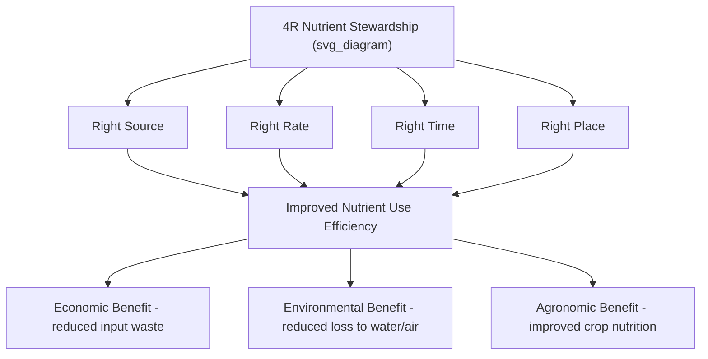
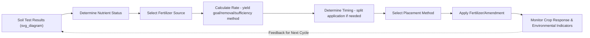

## Soil Fertility Management

### Overview

Soil fertility management encompasses the practices and decision-making frameworks used to maintain or improve soil nutrient supply capacity in support of crop production goals, while balancing economic return, environmental protection, and long-term soil productivity. Effective fertility management integrates soil testing data, crop nutrient requirements, and site-specific conditions to guide amendment decisions.

### Foundational Concepts in Fertility Management

#### Liebig's Law of the Minimum

**Key Points**

- A foundational agronomic principle stating that plant growth is limited by the scarcest resource (nutrient) relative to plant demand, not by the total quantity of resources available.
- Practically, this means that addressing a deficiency in the single most limiting nutrient will produce the greatest yield response, while additional application of already-sufficient nutrients provides diminishing or negligible benefit until the limiting factor is addressed.

**Example**

If a field is severely deficient in phosphorus but has adequate nitrogen and potassium, applying additional nitrogen fertilizer alone is unlikely to substantially increase yield, since phosphorus remains the limiting factor; addressing the phosphorus deficiency first would be expected to produce the more significant yield response.

#### Nutrient Use Efficiency

**Key Points**

- **Nutrient use efficiency (NUE)** describes the proportion of applied nutrient that is taken up and utilized by the crop relative to the total amount applied, commonly expressed for nitrogen as:

$$NUE = \frac{Nutrient\ Uptake\ by\ Crop}{Nutrient\ Applied} \times 100$$

- Nitrogen use efficiency in many cropping systems is commonly reported in agronomic literature as falling well below 100%, with the remainder subject to loss pathways (leaching, denitrification, volatilization) or incorporation into soil organic matter pools, though [Inference] specific NUE figures vary substantially by crop, region, management practice, and measurement methodology, and current crop- and region-specific NUE benchmarks should be sourced from current agronomic research rather than treated as universal constants.
- Improving NUE is a central goal of modern fertility management, both for economic efficiency (reducing wasted input cost) and environmental protection (reducing nutrient loss to water and air).

### Fertilizer Sources and Types

#### Synthetic (Inorganic) Fertilizers

**Key Points**

- **Nitrogen fertilizers**: Include anhydrous ammonia, urea, ammonium nitrate, and urea-ammonium nitrate (UAN) solutions, differing in nitrogen concentration, application method suitability, and volatilization/loss risk profiles.
- **Phosphorus fertilizers**: Commonly derived from processed phosphate rock, including monoammonium phosphate (MAP) and diammonium phosphate (DAP), which also supply nitrogen alongside phosphorus.
- **Potassium fertilizers**: Predominantly potassium chloride (muriate of potash), with potassium sulfate used in situations where chloride sensitivity or additional sulfur supply is desired.
- **Complete/blended fertilizers**: Formulated products combining multiple nutrients in specified ratios (commonly labeled with an N-P-K percentage designation, e.g., 10-10-10), applied to meet balanced crop nutrient needs in a single product.

#### Organic and Alternative Nutrient Sources

**Key Points**

- **Animal manures**: Provide a mix of nitrogen, phosphorus, potassium, and micronutrients along with organic matter contribution; nutrient content and availability vary considerably by animal species, bedding material, storage/handling method, and manure age.
- **Compost**: Stabilized, decomposed organic material providing slower-release nutrients alongside organic matter and soil structural benefits; nutrient concentration is generally lower and more slowly available compared to fresh manure or synthetic fertilizer.
- **Cover crop residues (green manures)**: Nitrogen-fixing legume cover crops contribute biologically fixed nitrogen upon termination and decomposition, while non-legume cover crops contribute organic matter and can scavenge and recycle residual soil nutrients.
- **Biosolids**: Treated municipal wastewater treatment byproducts, used as a nutrient and organic matter source in some regions under regulatory frameworks governing application rates and monitoring requirements. [Unverified] Specific regulatory requirements and restrictions on biosolid application vary considerably by jurisdiction and should be verified against current local regulatory guidance before use.

### Fertilizer Application Timing and Placement

#### Timing Considerations

**Key Points**

- **Nitrogen timing**: Given nitrogen's mobility and susceptibility to loss, split application strategies (applying a portion at planting and additional portions during the growing season aligned with peak crop demand periods) are widely used in many cropping systems to improve synchrony between nutrient availability and plant uptake, generally improving nitrogen use efficiency compared to a single large pre-plant application. [Inference] The specific optimal split timing and proportions vary by crop, regional climate, and soil characteristics, and should be based on regional agronomic guidance rather than a single universal schedule.
- **Phosphorus and potassium timing**: Generally less time-sensitive than nitrogen due to lower mobility and loss risk in most soils, often applied pre-plant or in fall for the following season, though starter fertilizer applications at planting are commonly used to support early-season root development, particularly in cool soil conditions.

#### Placement Methods

**Key Points**

- **Broadcast application**: Uniform surface spreading, suitable for lime, some fertilizers incorporated by subsequent tillage, or pasture/forage top-dressing.
- **Banding**: Concentrated placement in a defined zone near the seed row or root zone, often improving nutrient use efficiency (particularly for phosphorus, given its limited mobility) compared to broadcast application by placing the nutrient closer to developing roots and reducing soil contact area subject to fixation reactions.
- **Injection**: Direct placement of liquid or gaseous fertilizers (e.g., anhydrous ammonia, liquid manure) below the soil surface, reducing volatilization losses compared to surface application.
- **Fertigation**: Delivery of dissolved nutrients through irrigation systems, allowing precise timing and rate control, particularly valuable in drip-irrigated systems for high-value crops.

### The 4R Nutrient Stewardship Framework

**Key Points**

A widely referenced framework in agronomic and industry guidance for optimizing fertilizer management:

| R | Consideration |
| --- | --- |
| Right Source | Selecting fertilizer form/formulation appropriate to soil conditions, crop needs, and application method |
| Right Rate | Matching application quantity to realistic crop demand based on soil testing, yield goals, and nutrient removal |
| Right Time | Aligning application timing with periods of peak crop nutrient uptake to minimize the window for loss |
| Right Place | Positioning nutrients where roots can access them effectively, minimizing loss pathways |

### Determining Fertilizer Rates

**Key Points**

- **Yield goal method**: Estimating fertilizer needs based on the nutrient uptake requirements of a targeted yield level, adjusted for soil test nutrient supply and expected nutrient use efficiency.
- **Soil test sufficiency-based recommendations**: Using calibrated soil test interpretation categories (deficient, low, medium/sufficient, high) to guide application rates, typically recommending higher rates for lower soil test categories and reduced or no additional application when soil test levels already fall in sufficient-to-high ranges.
- **Nutrient removal replacement approach**: Calculating fertilizer application rates based on the quantity of nutrients removed in harvested crop biomass, aiming to maintain long-term soil nutrient reserve levels rather than targeting a specific yield response in the current season alone.
- Economic optimization of fertilizer rate decisions incorporates current fertilizer costs and expected commodity prices, since the economically optimal rate (maximizing profit) is generally somewhat lower than the rate that would maximize yield alone, reflecting diminishing marginal yield response at higher input levels.

$$Profit\ Maximizing\ Rate: \frac{\Delta Revenue}{\Delta Fertilizer\ Cost} = 1$$

### Lime and Soil Amendment Management

**Key Points**

- **Liming materials** (agricultural limestone, dolomitic lime, and others) are applied to raise soil pH in acidic soils, with application rates calculated from soil test buffer pH results and target pH requirements for the intended crop.
- Lime requires time and adequate soil moisture to react and neutralize acidity, and is generally most effectively incorporated into the soil (via tillage) to accelerate reaction, though surface application is also practiced in no-till or pasture systems with a slower expected reaction timeline.
- **Gypsum (calcium sulfate)** is used in some contexts to address calcium or sulfur deficiency, improve soil structure in sodic soils (displacing sodium from exchange sites without significantly altering pH, unlike lime), or address specific subsoil aluminum toxicity concerns in acidic subsoils.

### Balancing Fertility Management with Environmental Stewardship

**Key Points**

- **Nutrient management planning**: Formal, often regulatory-driven or incentive-supported planning processes that document field-specific nutrient application rates, timing, and methods, particularly relevant on farms with significant manure nutrient sources or in watersheds with documented water quality concerns.
- **Buffer strips and setback requirements**: Practices limiting fertilizer or manure application near waterways to reduce runoff-related water quality risk.
- **Cover cropping for nutrient scavenging**: Using cover crops to capture residual soil nitrogen (and other mobile nutrients) that might otherwise be lost to leaching during fallow periods, subsequently releasing that nutrient content upon cover crop termination and decomposition for the following cash crop.
- **Precision/variable-rate application**: Applying fertilizer at spatially variable rates matched to zone-specific soil test results and yield potential, reducing both under-application in high-potential zones and over-application (with associated loss risk) in lower-potential zones.

### Integrated Fertility Management Approaches

**Key Points**

- **Integrated Soil Fertility Management (ISFM)**: A concept, particularly emphasized in sub-Saharan African agricultural development contexts, combining judicious use of mineral fertilizer with organic matter management, improved crop varieties, and locally adapted agronomic practices, recognizing that mineral fertilizer alone often produces limited benefit without adequate organic matter and soil structural conditions to support nutrient retention and crop response.
- Combining organic and synthetic nutrient sources is increasingly recognized in agronomic literature as often providing complementary benefits: synthetic fertilizers supply readily available nutrients matched to immediate crop demand, while organic amendments contribute longer-term soil organic matter, structure, and biological activity benefits not provided by synthetic fertilizer alone. [Inference] The specific optimal balance between organic and synthetic sources depends heavily on farm-specific resource availability, soil condition, and economic factors, and cannot be generalized as a single universal ratio.

### Common Fertility Management Challenges

**Key Points**

- **Balancing short-term yield goals with long-term soil health**: Fertility strategies focused narrowly on maximizing immediate yield response can, in some cases, neglect longer-term soil organic matter and structural considerations best addressed through complementary practices beyond fertilizer application alone.
- **Regional and field variability**: Nutrient recommendations calibrated for one region or soil type may not transfer directly to different conditions, underscoring the importance of locally calibrated soil testing and agronomic guidance.
- **Input cost volatility**: Fertilizer prices, particularly nitrogen (tied to natural gas costs via the Haber-Bosch production process) and phosphorus (tied to global phosphate rock markets), are subject to significant price volatility, affecting the economic calculus of fertility management decisions from season to season.
- **Regulatory compliance**: Nutrient management regulations, particularly concerning manure application and proximity to water bodies, vary by jurisdiction and require ongoing attention to current local requirements. [Unverified] Specific regulatory thresholds and requirements should be verified against current local and regional regulatory sources given the variability and periodic updates across jurisdictions.

### Related Topics

- Soil testing methodology and result interpretation
- Nitrogen, phosphorus, and potassium cycling in soil
- 4R Nutrient Stewardship implementation strategies
- Cover cropping for nutrient management and soil health
- Precision agriculture and variable-rate fertilizer application
- Manure management and nutrient management planning
- Soil pH management and liming practices
- Integrated Soil Fertility Management in smallholder systems
- Environmental impacts of fertilizer use and mitigation strategies
- Fertilizer economics and input cost management