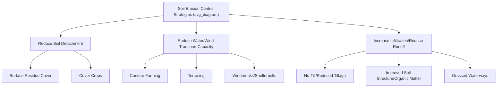

## Soil Erosion and Conservation

### Overview

Soil erosion is the process by which topsoil is detached and transported by water, wind, or tillage forces, resulting in the loss of the soil's most fertile and biologically active layer. Soil conservation encompasses the practices and management strategies designed to minimize erosion rates and protect long-term soil productivity, representing one of the oldest and most persistent challenges in agricultural land management.

### Types of Soil Erosion

#### Water Erosion

**Key Points**

- **Sheet erosion**: Relatively uniform removal of a thin layer of surface soil across a broad area, often difficult to detect visually until significant cumulative loss has occurred.
- **Rill erosion**: Formation of small, visible channels as concentrated water flow begins to incise the soil surface, typically correctable through normal tillage but indicative of developing erosion risk.
- **Gully erosion**: Advanced channel formation too large to be removed by normal tillage operations, representing severe, often difficult-to-reverse soil loss and requiring dedicated remediation structures.
- **Streambank erosion**: Lateral erosion of stream and riverbank soil, often exacerbated by removal of stabilizing riparian vegetation.

#### Wind Erosion

**Key Points**

- Predominantly affects arid, semi-arid, and sandy-textured soil regions with limited vegetative cover, particularly during dry, windy conditions.
- Wind erosion mechanisms include **saltation** (particle bouncing along the surface), **suspension** (fine particle lofting into the air, capable of long-distance transport), and **surface creep** (rolling of larger particles along the ground).
- Historically significant wind erosion events, such as the 1930s Dust Bowl in the United States Great Plains, are well-documented examples illustrating the combined role of drought, inappropriate tillage practices, and insufficient vegetative cover in producing severe wind erosion outcomes.

#### Tillage Erosion

**Key Points**

- Soil movement caused by the mechanical action of tillage implements, generally moving soil downslope over repeated tillage passes on sloped land, resulting in progressive soil thinning on upper slope positions and accumulation in lower landscape positions over time.
- Distinct from water and wind erosion in that it does not remove soil from the field entirely but redistributes it within the field, though the net effect on upper-slope productivity can be similarly significant over long management timeframes.

### Factors Influencing Erosion Rates

**Key Points**

The **Universal Soil Loss Equation (USLE)**, and its revised successor RUSLE (Revised Universal Soil Loss Equation), represent widely used empirical models for estimating water erosion, expressed as:

$$A = R \times K \times LS \times C \times P$$

where:

- $A$ = estimated average annual soil loss
- $R$ = rainfall/runoff erosivity factor
- $K$ = soil erodibility factor
- $LS$ = slope length and steepness factor
- $C$ = cover/cropping management factor
- $P$ = support practice factor (e.g., contouring, terracing)

[Inference] While USLE/RUSLE remains widely referenced and used in conservation planning, more recent process-based erosion models have also been developed for specific applications, and the appropriate model choice depends on the specific assessment context, scale, and available input data.

### Consequences of Soil Erosion

**Key Points**

- **On-site impacts**: Loss of the most nutrient- and organic-matter-rich topsoil layer, reduced water-holding capacity, decreased rooting depth, and progressive decline in long-term productivity potential.
- **Off-site impacts**: Sedimentation of waterways and reservoirs, transport of soil-bound nutrients (particularly phosphorus) and agrochemicals into water bodies contributing to water quality degradation and eutrophication, and air quality impacts from wind-eroded particulate matter.
- Erosion-related productivity decline is often gradual and may not be immediately apparent within a single growing season, but cumulative soil loss over years to decades can substantially reduce a field's long-term yield potential, particularly where topsoil depth was already limited. [Inference] The specific rate and threshold at which cumulative erosion produces measurable yield decline varies considerably by soil type, original topsoil depth, and subsoil characteristics, making generalized timelines difficult to state precisely.

### Conservation Tillage Practices

**Key Points**

- **No-till**: Planting directly into the residue of the previous crop without primary tillage, maximizing surface residue cover and minimizing soil disturbance, generally producing the greatest erosion reduction among tillage-based conservation approaches.
- **Reduced/minimum tillage**: Intermediate tillage intensity retaining significant surface residue cover compared to conventional intensive tillage, while still allowing some mechanical seedbed preparation.
- **Strip-till**: Tilling only a narrow strip where the seed will be planted, leaving the majority of the field surface undisturbed and residue-covered between rows.
- Surface residue cover is a key erosion control mechanism across these systems, as residue intercepts raindrop impact energy (reducing soil particle detachment) and slows surface water flow velocity (reducing transport capacity and allowing greater infiltration).

### Structural and Land-Shaping Conservation Practices

**Key Points**

- **Contour farming**: Conducting tillage and planting operations along the contour lines of a slope rather than up-and-down slope, creating small ridges that slow water flow and reduce sheet/rill erosion on moderate slopes.
- **Terracing**: Constructing level or gently graded platforms on sloped land, substantially reducing effective slope length and steepness, historically significant in regions such as the Andes, Southeast Asia, and Mediterranean hillside agriculture, and still employed in appropriate modern contexts for steep-slope cultivation.
- **Grassed waterways**: Vegetated channels designed to safely convey concentrated runoff water across a field without initiating gully erosion, directing flow to a stable outlet.
- **Diversion structures and grade stabilization structures**: Engineered features designed to intercept and redirect concentrated water flow or stabilize actively eroding gully heads.

### Vegetative Conservation Practices

**Key Points**

- **Cover cropping**: Non-cash crops planted during fallow periods providing continuous vegetative soil cover and root system presence, substantially reducing erosion risk during periods when the primary cash crop would otherwise leave soil bare.
- **Windbreaks/shelterbelts**: Rows of trees or shrubs planted to reduce wind velocity across adjacent cropland, mitigating wind erosion risk, with benefits extending a distance downwind roughly proportional to windbreak height.
- **Buffer strips and filter strips**: Permanent vegetation established along field edges or waterways, intercepting sediment and associated nutrients/agrochemicals in runoff before it reaches water bodies.
- **Perennial vegetation integration**: Incorporating perennial forages, agroforestry components, or permanent pasture into a landscape or rotation reduces erosion risk compared to continuous annual row crop production, reflecting the more continuous ground cover and root system presence perennial vegetation provides.

### Soil Conservation Planning and Assessment Tools

**Key Points**

- **Conservation planning**: Systematic field- or farm-level assessment of erosion risk (often utilizing USLE/RUSLE or similar modeling tools) combined with practice selection to achieve acceptable soil loss tolerance ("T value") targets specific to the soil type in question.
- **Soil loss tolerance (T value)**: A soil-specific threshold representing the estimated maximum annual soil loss rate that can occur while still maintaining long-term soil productivity, used as a benchmark against which modeled or estimated actual erosion rates are compared in conservation planning.
- Government conservation agencies (e.g., USDA Natural Resources Conservation Service in the United States) provide technical assistance and, in many cases, cost-share or incentive payment programs supporting adoption of conservation practices, reflecting the broader public interest in reducing off-site erosion impacts alongside on-farm productivity benefits. [Unverified] Specific current program names, funding levels, and eligibility criteria change periodically with policy updates and should be verified against current program documentation for the relevant jurisdiction.

### Policy and Regulatory Context

**Key Points**

- Various countries have implemented conservation compliance requirements linking eligibility for certain agricultural support programs to adoption of erosion control practices on highly erodible land, reflecting a policy approach using program incentives to encourage conservation adoption. [Unverified] Specific conservation compliance program structures and requirements vary by country and are subject to periodic legislative revision, so current specific requirements should be verified against current national agricultural policy sources.
- Watershed-level and water quality-focused regulatory frameworks in some regions have increasingly incorporated agricultural erosion and nutrient runoff considerations, reflecting growing policy attention to off-site water quality impacts of soil erosion beyond purely on-farm productivity concerns.

### Practical Implementation Considerations

**Key Points**

- Effective erosion control typically involves combining multiple complementary practices (e.g., reduced tillage plus cover cropping plus contour farming) rather than relying on a single practice alone, since different practices address different components of the erosion process (detachment, transport, and deposition/infiltration).
- Erosion control practice selection should be informed by site-specific factors including slope, soil type, climate (rainfall intensity patterns or wind exposure), and existing cropping system, since the relative effectiveness and appropriate design of specific practices (e.g., terrace spacing, windbreak orientation) depends on these local conditions.
- Transition to conservation tillage systems may involve an adjustment period with potential changes in weed management approach, planting equipment requirements, and, in some cases, short-term yield variability before full system benefits are realized. [Inference] The specific transition experience varies considerably by starting soil condition, climate, and crop, and should not be assumed uniformly smooth or immediately beneficial across all situations.

### Related Topics

- Soil physical properties and structure management
- Cover cropping systems and species selection
- Conservation tillage system design and equipment considerations
- Watershed management and water quality protection
- Soil organic matter management for erosion resistance
- USLE/RUSLE modeling and conservation planning tools
- Government conservation programs and cost-share incentives
- Agroforestry and windbreak system design
- Riparian buffer establishment and management
- Historical case studies in soil conservation (e.g., the Dust Bowl)