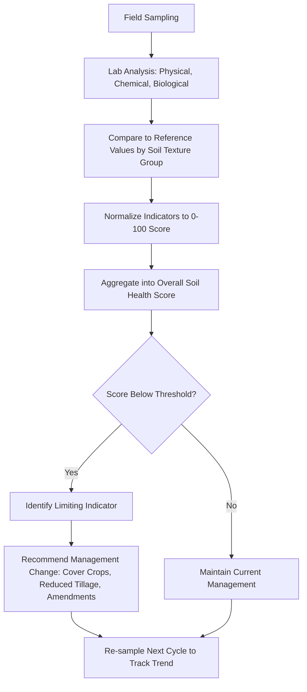

## Soil Health Assessment

### Definition and Scope

Soil health assessment is the process of evaluating a soil's continued capacity to function as a living ecosystem that sustains plants, animals, and humans — encompassing physical, chemical, and biological properties rather than fertility alone. This distinguishes it from traditional soil testing, which historically emphasized nutrient status (chemical properties) for fertilizer recommendations.

Soil health (used interchangeably with "soil quality" in most literature) integrates three domains:

- **Physical**: structure, texture, aggregate stability, bulk density, infiltration
- **Chemical**: pH, nutrient availability, cation exchange capacity (CEC), salinity
- **Biological**: microbial biomass, enzyme activity, organic matter, soil fauna

### Why Soil Health Matters

**Key Points**

- Healthy soils regulate water (infiltration, storage, filtration), cycle nutrients, suppress pests and pathogens, and sequester carbon
- Degraded soil structure and biology are major drivers of yield stagnation, erosion, and increased input dependency
- Soil health assessment underpins regenerative agriculture, conservation programs, and carbon credit verification schemes
- Unlike a one-time fertility test, soil health assessment is meant to be tracked longitudinally to detect trends from management practices (tillage, cover cropping, rotation, amendments)

### Core Indicators Assessed

#### Physical Indicators

| Indicator | What It Reveals | Typical Method |
| --- | --- | --- |
| Soil texture | Sand/silt/clay ratio, inherent water/nutrient holding capacity | Hydrometer, feel method |
| Bulk density | Compaction, root penetration resistance | Core sampling |
| Aggregate stability | Resistance to erosion, structural integrity | Wet sieving, slake test |
| Infiltration rate | Water entry speed, runoff risk | Single-ring infiltrometer |
| Penetration resistance | Compaction layers | Penetrometer |

#### Chemical Indicators

- Soil pH (acidity/alkalinity, controls nutrient availability)
- Electrical conductivity (EC) — salinity status
- Extractable macronutrients: nitrogen (N), phosphorus (P), potassium (K)
- Extractable micronutrients: zinc, manganese, iron, boron
- Cation exchange capacity (CEC) — nutrient retention capacity
- Base saturation (Ca, Mg, K, Na proportions on exchange sites)

#### Biological Indicators

- Soil organic matter (SOM) / soil organic carbon (SOC)
- Active carbon (permanganate-oxidizable carbon, POXC) — labile carbon fraction reflecting recent biological activity
- Soil respiration (CO₂ burst test) — microbial activity proxy
- Potentially mineralizable nitrogen (PMN)
- Microbial biomass carbon and nitrogen
- Earthworm counts and macrofauna presence
- Root health / disease pressure (bioassays)

**[Inference]** The relative weighting of biological vs. chemical vs. physical indicators in a given assessment framework often reflects the priorities of the institution that developed it (e.g., conservation-focused frameworks weight biology more heavily than conventional agronomic labs).

### Standardized Assessment Frameworks

#### Cornell Soil Health Assessment (CASH)

Developed by Cornell University, CASH is one of the most widely adopted comprehensive frameworks. It scores soils against 3 physical, 2 biological (or more, depending on version), and standard chemical indicators, converting raw lab values into normalized 0–100 scores based on percentile ranking against a reference soil database (organized by texture group), then aggregates them into an overall soil health score.

#### USDA-NRCS Soil Health Assessment

The USDA Natural Resources Conservation Service promotes a framework built around four core soil health principles used to guide management and assessment:

- Minimize soil disturbance
- Maximize soil cover
- Maximize biodiversity
- Maximize presence of living roots

NRCS uses tools like the **Soil Health Assessment and Plan (SHAP)** and simplified in-field tests (infiltration rings, slake tests, penetrometers) alongside lab analysis.

#### Haney Soil Health Test

Developed by Dr. Rick Haney (USDA-ARS), this test emphasizes biological activity and nutrient cycling potential rather than static nutrient pools. It combines water-extractable organic carbon and nitrogen, CO₂ respiration (1-day flush), and a Solvita test to compute a **Soil Health Calculation (SHC)** score, intended to better reflect nutrient availability from biological mineralization — potentially reducing over-application of synthetic fertilizer.

**[Unverified]** Some agronomists dispute whether Haney test scores reliably predict actual nitrogen credits under all soil and climate conditions; this remains debated in agronomic literature and should be validated regionally before being used to reduce fertilizer rates.

### In-Field Rapid Assessment Techniques

These low-cost, low-equipment tests are commonly taught for quick, on-farm soil health screening:

**Example**

- **Slake test**: Place air-dried soil aggregates in a wire basket submerged in water; observe how quickly aggregates disintegrate. Rapid slaking indicates weak aggregate stability (low organic matter, poor structure); aggregates that hold together indicate good structural integrity.
- **Infiltration test**: Insert a ring into the soil surface, pour a known volume of water, and time how long it takes to infiltrate. Faster infiltration generally indicates better structure and pore continuity.
- **Spade/shovel test**: Dig a shovel-width, spade-depth block of soil and visually assess root architecture, earthworm presence, compaction layers, mottling (drainage issues), and aggregate shape.
- **Solvita CO₂ burst test**: Rewet dried soil and measure CO₂ respired using a color-changing gel paddle, providing a rapid biological activity index.

### Sampling Protocol

Reliable assessment depends heavily on correct sampling methodology:

1. **Timing**: Sample at a consistent time of year (commonly early spring or fall) to reduce seasonal variability in biological indicators
2. **Depth**: Typically 0–15 cm (0–6 in) for biological/health indicators; deeper cores (0–30 cm) may be added for compaction or nutrient leaching studies
3. **Pattern**: Composite sampling — collect 15–20 subsamples in a zigzag or grid pattern across a management zone and combine into one representative sample
4. **Avoid anomalies**: Exclude field edges, old fence lines, manure piles, and wet spots unless specifically studying them
5. **Handling**: Keep samples cool and ship promptly for biological assays (respiration, PMN), since microbial activity continues post-sampling and can bias results if delayed

**[Inference]** Because biological indicators are more sensitive to short-term moisture and temperature fluctuations than chemical indicators, most protocols recommend biological sampling be repeated at the same calendar window each year for valid trend comparison.

### Data Interpretation Workflow

### Management Interventions Linked to Assessment Results

| Limiting Indicator | Common Intervention |
| --- | --- |
| Low aggregate stability | Reduce tillage intensity, add cover crops |
| Low soil organic matter | Compost/manure amendment, residue retention |
| High bulk density/compaction | Controlled traffic, deep-rooted cover crops, subsoiling |
| Low microbial activity | Diversify rotations, reduce fallow periods |
| Low infiltration | Increase surface residue, reduce compaction |
| Nutrient imbalance | Targeted fertilization, lime/gypsum application |

### Soil Organic Carbon and Carbon Sequestration Context

Soil organic carbon (SOC) has become a central soil health metric due to its dual role in fertility and climate mitigation. Assessment protocols increasingly track SOC stocks (accounting for bulk density and sampling depth, not just concentration) to support carbon credit programs and climate-smart agriculture initiatives.

$$SOC_{stock} = SOC_{\%} \times BD \times D \times 100$$

Where $SOC_{\%}$ is organic carbon concentration (mass fraction), $BD$ is bulk density (g/cm³), and $D$ is sampling depth (cm); the constant converts units to Mg C/ha.

**[Unverified]** Measured SOC changes over short time frames (1–3 years) can be within the margin of measurement error given natural spatial variability; most agronomic and carbon-market guidance recommends multi-year trends rather than single-year comparisons to draw reliable conclusions.

### Emerging and Digital Tools

- **Soil health apps and portable sensors**: NIR (near-infrared) spectroscopy handheld devices are increasingly used for rapid, in-field estimation of SOM, moisture, and texture, though calibration against wet-chemistry lab results is typically still recommended for accuracy.
- **Remote sensing / satellite indices**: NDVI and other vegetation indices are used as indirect proxies for soil productivity and variability across fields, informing where to target physical sampling.
- **DNA-based soil biology testing**: Metagenomic/qPCR-based services (e.g., commercial soil microbiome panels) are emerging to quantify microbial community composition and functional gene markers (e.g., nitrogen-cycling genes) beyond simple biomass measures.

**[Speculation]** Given current trends, broader integration of low-cost NIR sensors with satellite-derived field zoning may reduce reliance on dense grid soil sampling over the next decade, though wet-chemistry lab validation is likely to remain the accuracy benchmark for the foreseeable future.

### Limitations and Common Pitfalls

**Key Points**

- Regional reference databases (used for percentile scoring in frameworks like CASH) may not represent all soil types globally, limiting direct applicability outside the regions they were built from
- Biological indicators are highly sensitive to recent rainfall, temperature, and sampling timing, which can obscure real management-driven trends if sampling isn't standardized
- A single-year snapshot cannot reliably distinguish management effects from natural weather-driven variability — multi-year monitoring is necessary
- Overreliance on any single indicator (e.g., SOM alone) can miss critical limitations like compaction or salinity

### Related Topics

- Soil organic matter and carbon cycling
- Soil microbiome and rhizosphere biology
- Cover cropping strategies for soil structure
- Tillage systems and soil compaction management
- Nutrient cycling and mineralization
- Soil texture and classification (USDA soil taxonomy)
- Precision agriculture and soil sensor technologies
- Soil erosion assessment and control
- Cation exchange capacity and base saturation
- Climate-smart agriculture and soil carbon credits