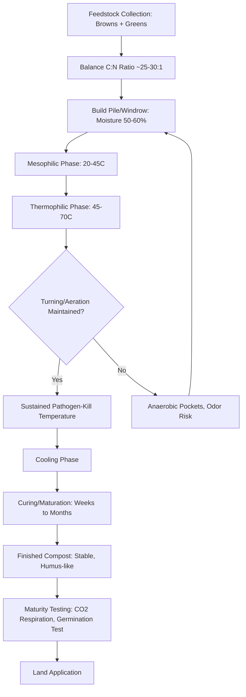

## Composting and Organic Matter Management

### Definition and Scope

Composting is the controlled, aerobic biological decomposition of organic materials into a stable, humus-like product (compost) through the activity of microorganisms, fungi, and macrofauna. Organic matter management is the broader agronomic practice of maintaining and building soil organic matter (SOM) through inputs like compost, manure, crop residues, and cover crops to sustain soil structure, fertility, and biological activity over time.

### Why Organic Matter Management Matters

**Key Points**

- Soil organic matter influences water-holding capacity, aggregate stability, nutrient cycling, cation exchange capacity (CEC), and microbial habitat
- Compost application recycles nutrients, reduces landfill/waste burden, and can suppress certain soilborne pathogens
- Building SOM is a slow process (often measured in decades under field conditions) — losses from tillage or erosion occur far faster than gains from amendments
- Organic matter management is central to regenerative, organic, and conservation agriculture systems

### The Composting Process: Biological Stages

Composting proceeds through distinct temperature-driven microbial phases:

| Stage | Temperature Range | Dominant Organisms | Duration |
| --- | --- | --- | --- |
| Mesophilic (initial) | 20–45°C | Mesophilic bacteria, fungi | Days |
| Thermophilic | 45–70°C | Thermophilic bacteria, actinomycetes | Days to weeks |
| Cooling | 45°C down to ambient | Mesophilic organisms return | Weeks |
| Curing/maturation | Ambient | Fungi, actinomycetes, macrofauna (worms, arthropods) | Months |

The thermophilic phase is agronomically important because sustained high temperatures (typically above 55°C for a defined duration, per regulatory standards such as those referenced by the US EPA and various national composting guidelines) are what destroy weed seeds and most plant/human pathogens.

**[Inference]** Exact pathogen-kill temperature/time thresholds vary by regulatory jurisdiction and pathogen type; producers targeting food-safety-compliant compost should verify current local regulatory requirements rather than relying on a single universal figure.

### Key Inputs and the Carbon:Nitrogen (C:N) Ratio

Composting requires balancing carbon-rich ("brown") and nitrogen-rich ("green") materials. Microbial decomposers use carbon as an energy source and nitrogen for protein synthesis, and an imbalanced ratio slows decomposition or causes odor/nitrogen loss.

**Example**

| Material | Approximate C:N Ratio | Category |
| --- | --- | --- |
| Sawdust | 400:1 | Brown (carbon) |
| Straw | 80:1 | Brown |
| Dry leaves | 60:1 | Brown |
| Corn stalks | 60:1 | Brown |
| Grass clippings | 20:1 | Green (nitrogen) |
| Vegetable scraps | 15:1 | Green |
| Poultry manure | 10:1 | Green |
| Legume residues | 15–20:1 | Green |

The target initial C:N ratio for efficient composting is generally cited as approximately 25–30:1 by mass, calculated as:

$$\frac{C_{total}}{N_{total}} = \frac{\sum (m_i \times C_i)}{\sum (m_i \times N_i)}$$

Where $m_i$ is the mass of material $i$, and $C_i$, $N_i$ are its fractional carbon and nitrogen content.

**[Inference]** A ratio much higher than ~30:1 slows decomposition (nitrogen becomes limiting for microbial growth), while a ratio much lower than ~25:1 tends to cause nitrogen loss as ammonia gas and associated odor — these are widely cited guideline values but optimal ratios can vary somewhat with material particle size and moisture.

### Composting Methods

#### Windrow Composting

Long, elongated piles are formed and periodically turned mechanically or by hand to maintain aeration and even decomposition. This is the most common method for large-scale agricultural and municipal composting due to relatively low infrastructure cost.

#### Aerated Static Pile (ASP)

Piles are built over a network of perforated pipes connected to blowers that force air through the material, avoiding the need for physical turning. This method is common in facilities processing biosolids or higher-volume operations where mechanical turning is impractical.

#### In-Vessel Composting

Composting occurs within enclosed containers, drums, or tunnels with controlled aeration, moisture, and sometimes temperature monitoring. This offers the fastest processing times and best odor/leachate control, at higher capital cost — often used where space is limited or strict environmental controls are required.

#### Vermicomposting

Composting using earthworms (commonly *Eisenia fetida*, the red wiggler) to process organic material into worm castings, a nutrient-dense, biologically active soil amendment. This method operates at ambient (mesophilic) temperatures rather than through a thermophilic phase, so it is not suitable for materials requiring pathogen-kill heat treatment (e.g., raw manure intended for food-safety compliance) unless pre-composted first.

#### On-Farm/Static Pile (Passive) Composting

Simple, unturned piles relying on passive aeration; slower and less uniform, but low-cost and common in smallholder and backyard contexts.

### Process Parameters and Monitoring

**Key Points**

- **Moisture content**: Ideal range is generally cited around 50–60% by weight — a squeezed handful should feel like a wrung-out sponge; too dry slows microbial activity, too wet causes anaerobic conditions and odor
- **Aeration**: Oxygen levels above roughly 5% within the pile are generally needed to sustain aerobic decomposition; turning frequency or forced aeration design controls this
- **Particle size**: Smaller particles increase surface area for microbial colonization and speed decomposition, but excessively fine material can reduce porosity and airflow
- **pH**: Naturally fluctuates during the process (often dipping acidic early, then rising to neutral/slightly alkaline) and generally does not require active management in well-balanced piles
- **Temperature monitoring**: Regular probing (daily to several times weekly during active phases) is standard practice to track the thermophilic phase and verify pathogen-kill duration

### Composting Process Flow

### Compost Maturity Testing

Applying immature compost can immobilize soil nitrogen or introduce phytotoxic compounds. Common maturity indicators include:

- **Temperature stability**: Pile temperature approaching ambient and remaining stable
- **C:N ratio of finished product**: Typically reduced to roughly 15–20:1 or lower
- **Germination/bioassay test**: Seedling growth in compost extract compared to a control; poor germination or root stunting indicates immaturity or residual phytotoxins
- **Odor and color**: Mature compost has an earthy smell and dark brown/black color, without ammonia or sulfurous odor
- **Solvita-type CO₂ and NH₃ test kits**: Colorimetric indicators used for rapid on-site maturity screening

### Organic Matter Management Beyond Compost

#### Cover Cropping

Growing non-cash crops (e.g., legumes, cereal rye, clover, vetch) between cash crop cycles to add biomass, fix nitrogen (in the case of legumes), protect soil from erosion, and feed soil biology through root exudates.

#### Crop Residue Retention

Leaving stalks, stubble, and other harvest residues on the field surface rather than removing or burning them, contributing to SOM accumulation and surface protection against erosion.

#### Reduced/No-Till Systems

Minimizing soil disturbance preserves fungal networks and existing aggregate structure, slowing the oxidative loss of organic matter that occurs when soil is inverted and exposed to air.

#### Manure and Biosolids Application

Direct application of raw or composted animal manures and treated municipal biosolids as organic amendments; requires attention to nutrient loading (particularly phosphorus buildup) and pathogen safety intervals before harvest.

### Application Rates and Nutrient Considerations

Compost and manure application rates are typically calculated based on the crop's nitrogen or phosphorus requirement, since organic amendments release nutrients gradually via mineralization rather than immediately as with synthetic fertilizer.

$$N_{available} = N_{total} \times MR$$

Where $MR$ is the first-year mineralization rate (the fraction of total nitrogen expected to become plant-available in the application year), which varies by material type, moisture, and soil temperature.

**[Inference]** Because mineralization rates depend on compost feedstock, curing degree, and local soil/climate conditions, published mineralization rate estimates should be treated as starting reference points rather than precise universal constants; regional extension guidance or lab-based mineralization testing is generally recommended for accurate nutrient budgeting.

### Common Problems and Troubleshooting

| Symptom | Likely Cause | Remedy |
| --- | --- | --- |
| Foul, ammonia-like odor | Too much nitrogen, anaerobic conditions | Add carbon-rich material, turn pile |
| Pile not heating up | Too dry, insufficient nitrogen, pile too small | Add water, add greens, increase pile mass |
| Pile too wet, slimy | Excess moisture, poor drainage | Add dry bulking material, improve drainage |
| Pests/rodents attracted | Exposed food scraps, meat/dairy inclusion | Bury scraps, avoid meat/dairy/oil in feedstock |
| Slow decomposition | Large particle size, low nitrogen, cold weather | Shred material, add greens, insulate pile |

### Environmental and Regulatory Considerations

**Key Points**

- Many jurisdictions regulate large-scale composting operations for leachate control, odor management, and pathogen-kill verification, particularly when compost will be used on food crops
- Composting is widely promoted as a landfill-diversion and methane-mitigation strategy, since aerobic decomposition produces primarily CO₂ rather than the methane generated by anaerobic landfill decomposition
- Certified organic production systems typically have specific standards (e.g., under USDA National Organic Program rules in the US) governing raw manure application intervals relative to harvest

**[Unverified]** Specific regulatory thresholds (time-temperature requirements, application setback distances, permitted feedstocks) vary significantly by country and region; producers should confirm current requirements with their local regulatory authority rather than assuming a single global standard.

### Related Topics

- Soil organic carbon and carbon sequestration
- Cover cropping strategies and species selection
- Nutrient management planning and mineralization
- Vermiculture and vermicompost production
- Manure management and nutrient loading regulations
- No-till and conservation tillage systems
- Soil microbiome and decomposer ecology
- Integrated soil fertility management
- Anaerobic digestion and biogas systems
- Soil health assessment indicators