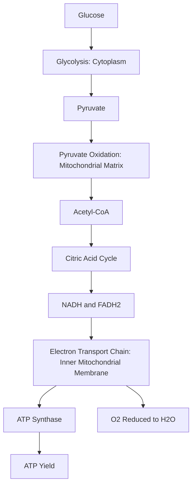

## Photosynthesis and Respiration


### Definition and Scope

Photosynthesis and respiration are the two central metabolic processes governing plant energy economy. Photosynthesis converts light energy into chemical energy (carbohydrates), while respiration breaks down those carbohydrates to release usable energy (ATP) for growth, maintenance, and reproduction. The balance between the two processes determines net plant productivity and is fundamental to crop yield potential, agronomic management, and postharvest physiology.

### Photosynthesis: Overview

Photosynthesis occurs in chloroplasts and converts carbon dioxide and water into glucose and oxygen, using light energy captured by chlorophyll and accessory pigments.

$$6CO_2 + 6H_2O + \text{light energy} \rightarrow C_6H_{12}O_6 + 6O_2$$

The process occurs in two coupled stages: the light-dependent reactions and the light-independent reactions (Calvin cycle).

### Light-Dependent Reactions

Occurring in the thylakoid membranes, these reactions capture light energy and convert it into chemical energy carriers:

**Key Points**

- Chlorophyll *a* and *b*, along with accessory pigments (carotenoids), absorb light primarily in the blue and red wavelengths, reflecting green light (giving leaves their color)
- Light energy excites electrons in Photosystem II, which are passed along an electron transport chain to Photosystem I
- Water molecules are split (photolysis) to replace electrons lost from Photosystem II, releasing oxygen as a byproduct
- The electron transport chain generates a proton gradient across the thylakoid membrane, driving ATP synthesis via ATP synthase (chemiosmosis)
- NADP⁺ is reduced to NADPH, which along with ATP, powers the subsequent Calvin cycle

### The Calvin Cycle (Light-Independent Reactions)

Occurring in the chloroplast stroma, the Calvin cycle uses ATP and NADPH from the light reactions to fix atmospheric CO₂ into organic carbon compounds:

1. **Carbon fixation**: CO₂ is attached to ribulose-1,5-bisphosphate (RuBP) by the enzyme RuBisCO, forming an unstable 6-carbon intermediate that splits into two molecules of 3-phosphoglycerate (3-PGA)
2. **Reduction**: 3-PGA is phosphorylated and reduced (using ATP and NADPH) to glyceraldehyde-3-phosphate (G3P)
3. **Regeneration**: Most G3P is recycled to regenerate RuBP, while a fraction is exported to synthesize glucose, sucrose, starch, and other compounds

**[Inference]** Because RuBisCO is generally considered the most abundant protein on Earth and its catalytic turnover rate is comparatively slow, it is often cited as a major rate-limiting factor in carbon fixation, which is part of the agronomic and biotechnological interest in improving RuBisCO efficiency or specificity for crop yield gains.

### Photosynthetic Pathways: C3, C4, and CAM

Plants have evolved distinct biochemical strategies for carbon fixation, with significant implications for crop selection and management under different climates:

| Pathway | CO₂ Fixation Mechanism | Photorespiration | Water Use Efficiency | Examples |
| --- | --- | --- | --- | --- |
| C3 | Direct fixation via RuBisCO | High under hot/dry conditions | Lower | Wheat, rice, soybean, most trees |
| C4 | CO₂ concentrated via PEP carboxylase before RuBisCO (spatially separated, Kranz anatomy) | Minimized | Higher | Corn, sugarcane, sorghum |
| CAM | CO₂ fixed at night, stored as malate, released to RuBisCO during day | Minimized | Highest | Pineapple, agave, cacti |

**Example**

```mermaid
flowchart TD
    A[C4 Photosynthesis Pathway (svg_diagram)] --> B[Mesophyll Cell: CO2 + PEP]
    B --> C[Oxaloacetate then Malate]
    C --> D[Transport to Bundle Sheath Cell]
    D --> E[CO2 Released: Concentrated Locally]
    E --> F[RuBisCO Fixation via Calvin Cycle]
    F --> G[Minimal Photorespiration]
```

#### Photorespiration

When RuBisCO binds O₂ instead of CO₂ (favored under high temperature, high light, and low internal CO₂ conditions such as during stomatal closure in water stress), it initiates photorespiration — a process that consumes energy and releases previously fixed CO₂ without producing usable sugar, effectively reducing net photosynthetic efficiency in C3 plants. C4 and CAM pathways evolved mechanisms that concentrate CO₂ around RuBisCO, substantially suppressing this inefficiency.

### Factors Affecting Photosynthetic Rate

**Key Points**

- **Light intensity**: Photosynthetic rate increases with light intensity up to a saturation point, beyond which further increases yield no additional gain (and excessive light can cause photoinhibition/damage)
- **CO₂ concentration**: Rate generally increases with CO₂ availability up to a saturation point, particularly relevant to C3 crops and greenhouse CO₂ enrichment practices
- **Temperature**: Enzymatic reactions (including RuBisCO activity) have optimal temperature ranges; rates decline outside species-specific optimal windows
- **Water availability**: Water stress triggers stomatal closure to conserve water, which simultaneously restricts CO₂ entry and reduces photosynthetic rate
- **Stomatal conductance**: The degree of stomatal opening directly regulates the tradeoff between CO₂ uptake and water loss (transpiration)

### Cellular Respiration: Overview

Respiration occurs in all living plant cells (unlike photosynthesis, which is restricted to photosynthetic tissue) and breaks down carbohydrates to release chemical energy as ATP, used for growth, nutrient uptake, and cellular maintenance.

$$C_6H_{12}O_6 + 6O_2 \rightarrow 6CO_2 + 6H_2O + \text{ATP energy}$$

### Stages of Aerobic Respiration

1. **Glycolysis**: Occurs in the cytoplasm; glucose is split into two molecules of pyruvate, yielding a small net gain of ATP and NADH
2. **Pyruvate oxidation and the Citric Acid (Krebs) Cycle**: Occurs in the mitochondrial matrix; pyruvate is further oxidized, releasing CO₂ and generating NADH and FADH₂ (electron carriers)
3. **Oxidative phosphorylation (electron transport chain)**: Occurs across the inner mitochondrial membrane; NADH and FADH₂ donate electrons to an electron transport chain, driving a proton gradient that powers ATP synthase, producing the majority of the ATP yield, with oxygen serving as the final electron acceptor (forming water)

**[Inference]** Commonly cited theoretical maximum yields (often around 36–38 ATP per glucose molecule) represent idealized estimates; actual measured ATP yield per glucose molecule varies with shuttle mechanisms and cellular conditions, so real-world efficiency is typically somewhat lower than the theoretical maximum.

### Respiration Process Flow



### Anaerobic Respiration (Fermentation)

Under low-oxygen conditions (e.g., waterlogged/flooded soils affecting roots), plant cells can shift to fermentation to regenerate NAD⁺ and sustain limited ATP production via glycolysis alone:

- **Alcoholic fermentation**: Pyruvate converted to ethanol and CO₂
- **Lactic acid fermentation**: Pyruvate converted directly to lactic acid

Fermentation yields far less ATP than aerobic respiration and is generally a short-term survival mechanism; prolonged anaerobic conditions in root zones (e.g., waterlogging) commonly cause root damage and plant stress due to insufficient sustained energy production.

### The Photosynthesis-Respiration Balance

**Key Points**

- **Gross photosynthesis** is the total carbon fixed; **net photosynthesis** (or net primary productivity) is gross photosynthesis minus respiratory losses
- **Light compensation point**: The light intensity at which gross photosynthesis exactly equals respiration, resulting in zero net carbon gain
- Respiration continues at all times (day and night), while photosynthesis only occurs during light availability, making net daily carbon balance a function of both processes across the diurnal cycle
- Higher night temperatures can increase respiratory carbon loss without a corresponding photosynthetic gain, which is a recognized concern in some crop yield and climate-stress studies

$$NPP = GPP - R$$

Where $NPP$ is net primary productivity, $GPP$ is gross primary productivity (total photosynthesis), and $R$ is respiratory carbon loss.

### Agricultural Applications and Management Implications

**Key Points**

- **Canopy management** (plant spacing, pruning, row orientation) is optimized to maximize light interception and minimize self-shading, directly targeting photosynthetic efficiency
- **CO₂ enrichment** in greenhouse production can increase photosynthetic rates in C3 crops, since ambient atmospheric CO₂ is often below the saturation point for these species
- **Irrigation scheduling** balances the stomatal conductance tradeoff, aiming to sustain CO₂ uptake for photosynthesis while managing water stress and transpirational water loss
- **Postharvest storage** (cold storage, controlled atmosphere) slows respiration rates in harvested produce, extending shelf life by reducing the rate of stored carbohydrate breakdown
- **Crop pathway selection** (C3 vs. C4 vs. CAM) informs species suitability for arid, hot, or high-light environments based on relative water-use efficiency

**[Unverified]** The magnitude of yield benefit from elevated atmospheric or greenhouse CO₂ enrichment varies considerably by species, nutrient availability, and other co-limiting factors; specific percentage yield gains reported in various studies should not be generalized across all crops or growing conditions without site-specific validation.

### Related Topics

- Plant water relations and stomatal regulation
- C4 and CAM photosynthetic anatomy (Kranz anatomy)
- Postharvest physiology and controlled atmosphere storage
- Greenhouse CO₂ enrichment systems
- Plant stress physiology (drought, heat, flooding)
- Crop canopy architecture and light interception
- Carbon partitioning and sink-source relationships
- Chlorophyll fluorescence and photosynthetic efficiency measurement
- Plant nutrient uptake and metabolic energy demand
- Climate change impacts on crop photosynthesis and respiration