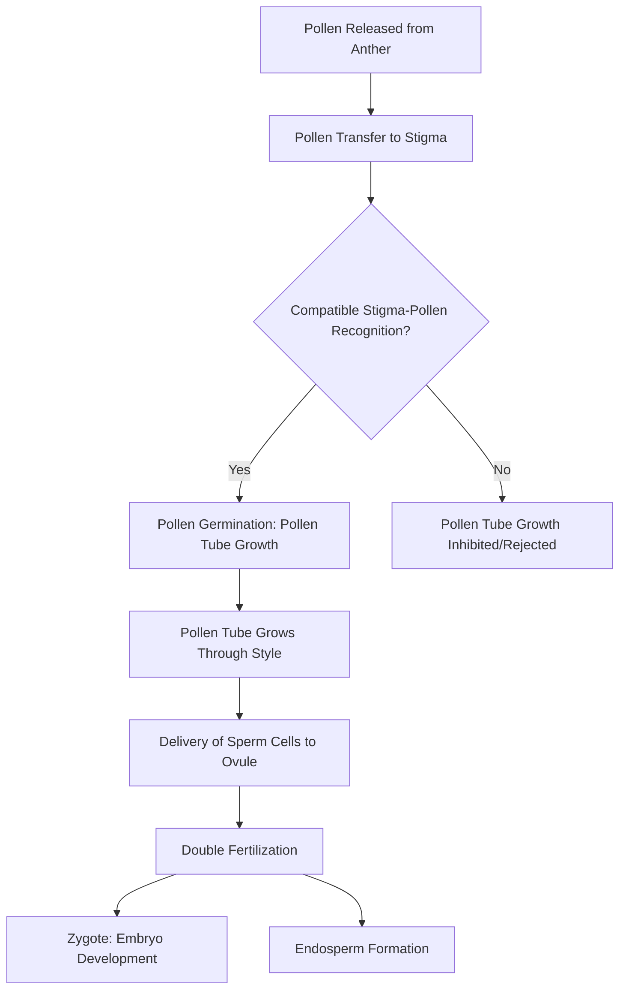

## Plant Reproduction and Pollination

### Definition and Scope

Plant reproduction encompasses the mechanisms by which plants produce offspring, broadly divided into sexual reproduction (involving gamete fusion and genetic recombination) and asexual/vegetative reproduction (producing genetically identical clones). Pollination — the transfer of pollen from anther to stigma — is the essential first step enabling sexual reproduction in flowering plants (angiosperms) and is fundamental to fruit set, seed production, and crop breeding.

### Sexual Reproduction: Floral Structures Involved

Sexual reproduction in angiosperms occurs within flowers, using the reproductive whorls introduced in plant anatomy: the androecium (stamens, producing pollen) and gynoecium (pistil, containing ovules).

**Key Points**

- **Stamen**: Filament (stalk) supporting the anther, where pollen grains (containing male gametes) develop via meiosis
- **Pistil/carpel**: Composed of the stigma (receptive surface for pollen), style (connecting tube), and ovary (containing one or more ovules, each containing an egg cell)
- **Perfect flowers** contain both stamens and pistils; **imperfect flowers** contain only one
- **Monoecious** plants bear separate male and female flowers on the same individual (e.g., corn, cucumber); **dioecious** plants bear male and female flowers on entirely separate individuals (e.g., asparagus, hemp, kiwifruit)

### The Pollination Process

Pollination is the physical transfer of pollen from anther to a receptive stigma, which must occur before fertilization can take place.

#### Self-Pollination vs. Cross-Pollination

- **Self-pollination**: Pollen transferred within the same flower or between flowers of the same individual plant; common in species such as wheat, rice, soybean, and tomato, often associated with floral structures that promote self-fertilization (e.g., cleistogamy or close anther-stigma proximity)
- **Cross-pollination**: Pollen transferred between flowers of genetically distinct individuals; promotes genetic diversity and is required in obligate outcrossing species, and is enforced in some species through mechanisms such as self-incompatibility (biochemical rejection of genetically similar pollen) or dioecy

**[Inference]** Because self-pollinating crops naturally produce more genetically uniform (homozygous) populations over successive generations, they have historically been more straightforward to breed as stable varieties using pedigree or bulk breeding methods, whereas cross-pollinating species generally require different breeding strategies (e.g., hybrid or population breeding) to manage their inherent genetic heterogeneity.

### Pollination Vectors

| Vector Type | Term | Mechanism | Examples |
| --- | --- | --- | --- |
| Wind | Anemophily | Light, abundant pollen dispersed by air currents | Corn, wheat, rice, most grasses |
| Insects | Entomophily | Pollen transported on bodies of visiting insects | Most fruit trees, cucurbits, canola |
| Bees specifically | Melittophily | Specialized bee-mediated transfer | Almonds, blueberries, many vegetable seed crops |
| Birds | Ornithophily | Nectar-feeding birds carry pollen | Some tropical/ornamental species (limited in major row crops) |
| Water | Hydrophily | Pollen dispersed through water | Some aquatic species (e.g., *Vallisneria*) |
| Self/mechanical | Autogamy | Pollen transfer within the same flower, sometimes aided by wind/vibration | Wheat, soybean, tomato (partial) |

**Key Points**

- Wind-pollinated (anemophilous) species typically produce large quantities of small, lightweight, dry pollen, and generally lack showy petals or strong scent since pollinator attraction is not required
- Insect-pollinated (entomophilous) species typically invest in floral rewards (nectar, showy petals, scent) and produce comparatively less pollen, since transfer efficiency per grain is higher than with wind dispersal

### Managed Pollination in Agriculture

Many commercial crops depend on managed pollinator populations to achieve adequate fruit/seed set:

- **Honeybee (*Apis mellifera*) hive rental**: Widely used for pollination-dependent crops such as almonds, apples, and various cucurbits, where colonies are transported to bloom sites during flowering
- **Native and alternative pollinators**: Bumblebees, mason bees, and other native bee species are used or encouraged in specific crops (e.g., bumblebees for greenhouse tomato pollination, where buzz pollination is required)
- **Buzz pollination (sonication)**: Some species (e.g., tomato, blueberry, eggplant) have anthers that release pollen most effectively through vibration, a behavior performed by certain bee species (notably bumblebees) but not honeybees

**[Unverified]** Reported dependency levels of specific crops on managed pollinators (i.e., what percentage of yield is attributable to insect pollination versus self- or wind-pollination) vary across studies and crop varieties; specific percentage figures should be treated as approximate rather than universally fixed values.

### Fertilization: Double Fertilization in Angiosperms

Angiosperms undergo a distinctive process called double fertilization, unique among seed plants:

1. The pollen tube delivers two sperm cells into the embryo sac within the ovule
2. One sperm cell fuses with the egg cell, forming a diploid zygote (develops into the embryo)
3. The second sperm cell fuses with two polar nuclei in the central cell, forming a triploid endosperm (develops into the nutrient-storage tissue supporting embryo growth)

$$\text{Sperm}_1 + \text{Egg} \rightarrow \text{Zygote (2n)}$$

$$\text{Sperm}_2 + \text{Polar Nuclei}_{(2)} \rightarrow \text{Endosperm (3n)}$$

### Factors Affecting Pollination and Fertilization Success

**Key Points**

- **Temperature extremes**: Excessive heat or cold during flowering can reduce pollen viability, impair pollen tube growth, or cause flower/fruit abortion
- **Water stress**: Drought conditions during flowering can reduce pollen viability and increase flower/fruit drop in many species
- **Timing synchrony**: Successful cross-pollination requires temporal overlap between pollen release (anthesis) and stigma receptivity, both within and potentially between compatible varieties for crops requiring pollinizer trees/plants
- **Pollinator activity conditions**: Insect pollinator activity is influenced by weather (temperature, wind, rain), which can limit pollination windows during unfavorable conditions
- **Self-incompatibility systems**: Some species require cross-pollination from a genetically compatible, often specifically chosen, pollinizer variety (e.g., many apple and sweet cherry cultivars) to achieve adequate fruit set

### Asexual (Vegetative) Reproduction

Many agricultural crops are propagated asexually to preserve specific genetic traits that would not breed true from seed, or to accelerate propagation:

| Method | Description | Examples |
| --- | --- | --- |
| Cuttings | Rooting a severed plant part (stem, leaf, root) | Grapes, roses, many ornamentals |
| Grafting | Joining scion (desired variety) to rootstock | Fruit trees (apple, citrus), grapevines |
| Tubers | Underground storage stems capable of sprouting new plants | Potato |
| Rhizomes | Horizontal underground stems producing new shoots | Ginger, turmeric, many grasses |
| Runners/stolons | Above-ground horizontal stems producing new plantlets | Strawberry |
| Tissue culture (micropropagation) | Lab-based propagation from small tissue samples under sterile conditions | Banana, orchids, virus-free seed potato production |
| Bulbs/corms | Underground storage structures containing a complete miniature plant | Onion, garlic, tulip |

**[Inference]** Because asexual propagation produces genetically identical clones, it is generally the preferred method for perpetuating specific desirable traits in perennial fruit and ornamental crops that would otherwise segregate into variable offspring if propagated from seed; this is a key reason grafted fruit tree varieties are propagated clonally rather than grown from seed.

### Seed Formation and Development

Following fertilization, the ovule develops into a seed and the ovary typically develops into surrounding fruit tissue (covered further under fruit/seed morphology). Key seed development stages include:

- **Embryogenesis**: Zygote divides and differentiates into embryonic structures (radicle, plumule, cotyledon(s))
- **Endosperm development**: Nutrient reserve tissue accumulates starch, protein, or oil depending on species
- **Seed maturation and desiccation**: Seed dries down and enters a metabolically quiescent state, often accompanied by the acquisition of desiccation tolerance and, in many species, a dormancy mechanism

### Agricultural and Breeding Applications

**Key Points**

- **Hybrid seed production**: Exploits controlled cross-pollination (often using male-sterile lines or manual emasculation) to produce F1 hybrid seed exhibiting hybrid vigor (heterosis)
- **Pollinator habitat management**: Practices such as maintaining flowering field margins and reducing pesticide exposure during bloom are used to support pollinator populations for pollination-dependent crops
- **Controlled pollination in plant breeding**: Manual crossing (emasculation and hand-pollination) is used to create specific genetic combinations for cultivar development
- **Isolation distances**: Seed production fields for cross-pollinating species often require minimum isolation distances from other varieties/related species to prevent unwanted genetic contamination

### Related Topics

- Plant anatomy and floral morphology
- Hybrid seed production and heterosis
- Pollinator conservation and habitat management
- Plant breeding and selection methods
- Seed dormancy and germination physiology
- Fruit set physiology and abiotic stress
- Grafting techniques and rootstock selection
- Tissue culture and micropropagation
- Self-incompatibility systems in crop breeding
- Plant growth and development stages