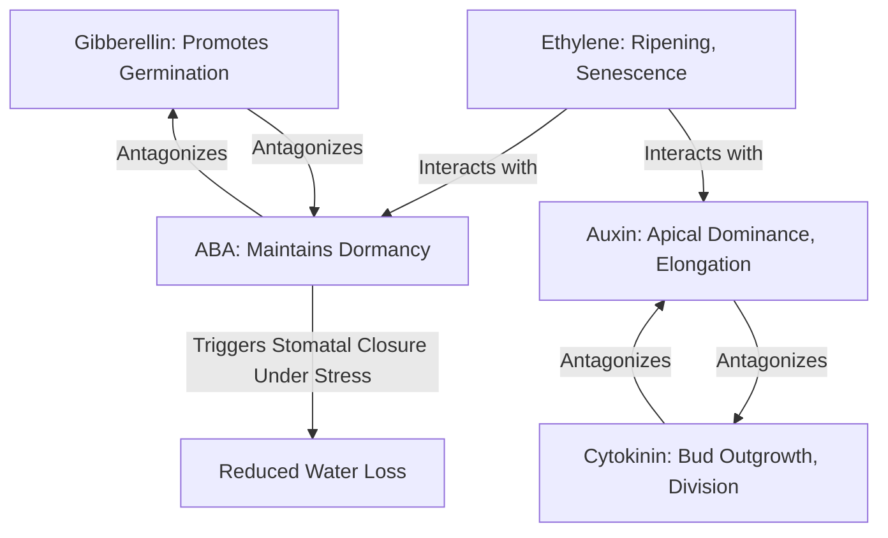

## Plant Hormones and Growth Regulators

### Definition and Scope

Plant hormones (phytohormones) are naturally occurring organic compounds that regulate plant growth, development, and stress responses at very low concentrations, typically acting as chemical messengers that coordinate cellular activity across the plant. Plant growth regulators (PGRs) is a broader term encompassing both naturally occurring hormones and synthetic compounds applied externally to elicit similar physiological effects, widely used in commercial agriculture and horticulture to manage crop growth, yield, and quality.

### Major Classes of Plant Hormones

**Key Points**

- Five classically recognized major hormone classes are auxins, gibberellins, cytokinins, abscisic acid (ABA), and ethylene
- Additional compounds increasingly recognized as hormones or hormone-like signaling molecules include brassinosteroids, jasmonates, salicylic acid, and strigolactones
- Hormones typically act at very low concentrations and often interact with one another (synergistically or antagonistically) rather than acting in isolation, making plant hormonal regulation a complex, interconnected signaling network rather than a set of independent pathways

### Auxins

Auxins (the primary natural form being indole-3-acetic acid, IAA) are among the most studied plant hormones, primarily synthesized in actively growing tissues such as shoot apical meristems and young leaves.

**Key Points**

- **Cell elongation**: Promotes elongation growth, particularly in stems, via a mechanism involving loosening of the cell wall structure
- **Apical dominance**: High auxin concentration from the shoot apex suppresses growth of lateral (axillary) buds; removing the apical bud (pruning) typically releases lateral buds from this suppression
- **Root initiation**: Promotes adventitious and lateral root formation, a property exploited commercially in rooting hormone products for cuttings
- **Tropisms**: Mediates phototropism (growth toward light) and gravitropism (growth response to gravity) through asymmetric auxin distribution
- **Polar transport**: Auxin moves in a directional (polar), cell-to-cell manner via specific efflux carrier proteins, distinguishing its transport from most other hormones

**Example**

Synthetic auxin analogs are widely used as herbicides; compounds such as 2,4-D and dicamba mimic natural auxin but, at the concentrations applied, cause uncontrolled, disorganized growth in susceptible broadleaf (dicot) species, leading to plant death — a key reason auxin-based herbicides are commonly used for selective broadleaf weed control in grass-family crops.

### Gibberellins (GAs)

Gibberellins are a large family of related compounds (numbered GA1, GA3, GA4, etc., reflecting the many distinct gibberellin molecules identified) involved primarily in stem elongation and developmental transitions.

**Key Points**

- **Stem elongation**: Promotes internode elongation; gibberellin-deficient mutants typically display dwarf phenotypes, and this pathway has been historically significant in crop breeding
- **Seed germination**: Stimulates the breakdown of stored reserves in germinating seeds (e.g., inducing amylase enzyme production in cereal grains to mobilize starch reserves)
- **Bolting and flowering**: In many species, promotes the transition from vegetative rosette growth to elongated flowering stems (bolting)
- **Fruit development**: Can promote fruit set and, in some applications, seedlessness

**[Inference]** The historically significant "Green Revolution" semi-dwarf wheat and rice varieties are commonly understood to owe their reduced height, in part, to mutations affecting gibberellin biosynthesis or signaling sensitivity, which redirected plant resources from stem growth toward grain production and improved lodging resistance; specific genetic mechanisms vary between the wheat and rice cases studied.

### Cytokinins

Cytokinins are primarily synthesized in root tips and are transported upward via the xylem, generally acting in coordination with (and often in balance against) auxin.

**Key Points**

- **Cell division**: Primary role in promoting cytokinesis (cell division), working alongside auxin to regulate the auxin:cytokinin ratio, which influences whether cultured plant tissue develops roots or shoots (a principle applied in tissue culture propagation)
- **Delay of senescence**: Can delay leaf yellowing and senescence, and is associated with nutrient mobilization toward treated tissue
- **Shoot initiation**: Promotes lateral bud outgrowth, generally counteracting auxin's apical dominance effect
- **Source-sink relationships**: Influences nutrient partitioning, often directing resources toward tissues with elevated cytokinin levels

### Abscisic Acid (ABA)

Often described as a primary "stress hormone," ABA levels typically rise sharply under water deficit and other abiotic stress conditions.

**Key Points**

- **Stomatal closure**: A central and well-characterized role, triggering guard cell ion efflux and turgor loss to close stomata under water stress, reducing transpirational water loss
- **Seed dormancy**: Maintains seed dormancy, generally acting in opposition to gibberellin's role in promoting germination; the balance between ABA and GA is a widely cited regulatory mechanism governing the germination/dormancy decision
- **General stress response**: Involved in coordinating broader physiological responses to drought, cold, and salinity stress

### Ethylene

Unlike the other classical hormones, ethylene is a simple gaseous hydrocarbon, which gives it distinctive properties in terms of diffusion and application.

**Key Points**

- **Fruit ripening**: A central regulator of ripening in climacteric fruits (fruits that exhibit a ripening-associated respiration burst, e.g., banana, tomato, apple), triggering associated biochemical changes such as chlorophyll breakdown, softening, and sugar accumulation
- **Senescence and abscission**: Promotes leaf, flower, and fruit abscission (detachment), as well as general tissue senescence
- **Stress response**: Production increases in response to mechanical stress, wounding, flooding, and pathogen attack (sometimes termed "stress ethylene")
- **Triple response**: A classic diagnostic seedling growth pattern (shortened/thickened stem, exaggerated apical hook, altered growth orientation) used experimentally to identify ethylene response mutants

**Key Points**

- Climacteric fruits continue ripening after harvest and can be harvested at a less mature stage for storage/transport, then ripened using controlled ethylene exposure
- Non-climacteric fruits (e.g., citrus, grape, strawberry) do not exhibit this ripening-associated respiration burst and generally do not continue to ripen significantly after harvest

### Hormone Interaction Overview

**[Inference]** The interactions depicted above (e.g., auxin-cytokinin antagonism, gibberellin-ABA antagonism) represent broadly established, well-documented regulatory relationships, but the precise quantitative balance and downstream molecular interactions can vary by species, tissue type, and developmental context, so these should be understood as general regulatory principles rather than fixed universal ratios.

### Additional Signaling Compounds

| Compound | Primary Roles |
| --- | --- |
| Brassinosteroids | Cell elongation/division, stress tolerance, vascular differentiation |
| Jasmonates | Defense response to herbivory/pathogens, senescence, some developmental roles |
| Salicylic acid | Systemic acquired resistance (pathogen defense signaling) |
| Strigolactones | Shoot branching suppression, root architecture, interaction with mycorrhizal fungi |

### Commercial Plant Growth Regulators (PGRs) in Agriculture

**Key Points**

- **Growth retardants** (e.g., paclobutrazol, chlormequat): Inhibit gibberellin biosynthesis, used to reduce stem elongation and lodging risk in cereals, or to control size in ornamental production
- **Synthetic auxins as herbicides**: As noted above, compounds like 2,4-D and dicamba exploit auxin overstimulation for selective weed control
- **Ethylene-releasing compounds** (e.g., ethephon): Applied to promote uniform fruit ripening, abscission (e.g., for mechanical harvest aid), or other ethylene-mediated responses
- **Gibberellin applications**: Used commercially to increase fruit size or induce seedlessness in some fruit crops (e.g., seedless grape production), and to break dormancy in some seed and bulb crops
- **Cytokinin applications**: Used in tissue culture propagation protocols and, in some cases, to delay senescence in cut flowers or harvested produce

### Practical Diagnostic and Management Applications

**Key Points**

- Unusual growth patterns (excessive elongation, poor branching, abnormal fruit set, premature senescence) often prompt investigation of hormonal balance disruption, whether from genetic, environmental, or chemical (e.g., herbicide drift) causes
- Auxin-based herbicide drift injury on sensitive broadleaf crops is a common diagnostic scenario, typically presenting as leaf cupping, twisting, and distorted new growth
- Postharvest handling protocols for climacteric fruits often deliberately manage ethylene exposure (either promoting it for ripening or actively removing it via scrubbers/ventilation to extend storage life, depending on the desired outcome)

**[Unverified]** Specific commercial PGR application rates, timing windows, and efficacy outcomes are highly product-, crop-, and regionally-specific, governed by product labeling and regional regulatory approval; general hormonal mechanisms described here should not be used as a substitute for consulting current product labels and regional agronomic guidance before field application.

### Related Topics

- Plant growth and development stages
- Seed germination and dormancy physiology
- Postharvest physiology and fruit ripening management
- Herbicide mode of action and selectivity
- Tissue culture and micropropagation techniques
- Plant stress physiology (drought, pathogen, mechanical)
- Apical dominance and canopy/pruning management
- Water relations and stomatal regulation
- Crop lodging resistance and stem strength management
- Plant defense signaling (jasmonates, salicylic acid)