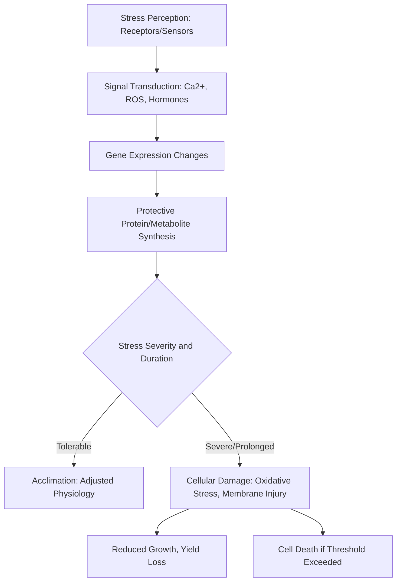

## Environmental Stress Physiology

### Definition and Scope

Environmental stress physiology is the study of how plants perceive, respond to, and tolerate abiotic (non-living) and biotic (living organism-related) stresses that disrupt normal growth and metabolism. Understanding these mechanisms underpins crop variety selection, stress-tolerant breeding programs, and field management strategies aimed at minimizing yield loss under adverse conditions.

### Classification of Plant Stress

**Key Points**

- **Abiotic stress**: Stress from non-living environmental factors, including drought, flooding, temperature extremes (heat/cold), salinity, nutrient deficiency/toxicity, and mechanical stress
- **Biotic stress**: Stress from living organisms, including pathogens (fungi, bacteria, viruses), herbivory/pests, and competition (e.g., weeds)
- Stresses frequently co-occur and interact (e.g., drought often accompanies heat stress, and stressed plants are frequently more susceptible to pathogen attack), making field stress diagnosis inherently multifactorial
- Stress responses are broadly divided into **avoidance** mechanisms (minimizing exposure to the stress) and **tolerance** mechanisms (functioning despite the stress being present)

### General Stress Response Framework

Most plant stress responses follow a broadly conserved sequence, regardless of the specific stress type:

**Key Points**

- **Stress perception**: Specific receptors detect physical or chemical changes (e.g., osmotic changes, temperature shifts, membrane fluidity changes)
- **Signal transduction**: Secondary messengers, notably calcium ion (Ca²⁺) influx and reactive oxygen species (ROS) production, relay the stress signal, along with hormonal changes (particularly abscisic acid, ABA, for many abiotic stresses)
- **Reactive oxygen species (ROS)**: Compounds such as superoxide and hydrogen peroxide are produced as byproducts of stress and, at low levels, can function as signaling molecules, but at high levels cause oxidative damage to membranes, proteins, and DNA
- **Acclimation vs. damage**: Whether a plant successfully acclimates or suffers lasting damage generally depends on stress severity, duration, developmental stage at exposure, and the plant's genetic tolerance capacity

### Drought Stress

Drought stress arises from insufficient water availability relative to plant demand, triggering the water relations responses described in prior topics (stomatal closure, osmotic adjustment) alongside broader metabolic adjustments.

**Key Points**

- **Osmotic adjustment**: Accumulation of compatible solutes (e.g., proline, glycine betaine, soluble sugars) lowers cellular osmotic potential, helping maintain turgor and water uptake under mild to moderate stress
- **ROS management**: Drought-induced stomatal closure reduces CO₂ availability for photosynthesis, which can lead to excess light energy being diverted to ROS-generating pathways, making antioxidant defense systems (enzymes like superoxide dismutase, catalase) important for damage limitation
- **Developmental timing sensitivity**: Drought stress during flowering and early grain/fruit fill is generally considered most damaging to final yield compared to stress during purely vegetative stages, consistent with the critical period concept introduced under plant growth stages

### Heat Stress

Elevated temperatures beyond a species' optimal range disrupt protein structure, membrane integrity, and enzymatic function.

**Key Points**

- **Protein denaturation and heat shock proteins (HSPs)**: Heat stress triggers rapid synthesis of heat shock proteins, which function as molecular chaperones helping to stabilize and refold stress-damaged proteins
- **Membrane fluidity disruption**: Elevated temperature increases membrane fluidity beyond functional limits, potentially compromising cellular compartmentalization and ion balance
- **Reproductive sensitivity**: Pollen viability and fertilization are often particularly heat-sensitive processes, making heat stress during flowering a significant yield-limiting factor in many crops
- **Photosynthetic impacts**: High temperature can impair photosystem II function and reduce RuBisCO activation efficiency, contributing to reduced net photosynthesis

**[Inference]** Because reproductive tissues (particularly pollen development and viability) are commonly reported as more heat-sensitive than vegetative tissue across many crop species, heat stress timed near flowering is often considered agronomically more consequential than equivalent heat stress during vegetative growth, though the precise critical temperature thresholds and sensitivity windows are species- and even cultivar-specific.

### Cold and Chilling Stress

Cold stress is generally divided into chilling stress (temperatures above freezing but below the optimal range, roughly 0–15°C depending on species) and freezing stress (temperatures below 0°C, involving ice formation).

**Key Points**

- **Chilling injury**: Common in tropical/subtropical-origin crops (e.g., tomato, banana, many tropical fruits) exposed to low but non-freezing temperatures, involving membrane lipid phase transitions that disrupt normal membrane function without ice formation
- **Freezing injury**: Ice crystal formation, particularly extracellular ice formation drawing water out of cells, causes cellular dehydration and mechanical membrane damage
- **Cold acclimation**: Many temperate-origin species can increase freezing tolerance through gradual exposure to progressively cooler, non-freezing temperatures, involving changes in membrane lipid composition and compatible solute accumulation
- **Vernalization distinction**: Vernalization (cold-induced flowering competency, covered under growth stages) is a distinct developmental process from cold stress tolerance, though both involve cold temperature perception

### Salinity Stress

Excess soluble salts in the soil solution impose two overlapping stress components on plants:

- **Osmotic stress component**: High soil solution salt concentration reduces soil water potential, making water physiologically harder for roots to extract (functionally similar to drought stress, even when soil water content is adequate)
- **Ionic toxicity component**: Excessive uptake and accumulation of specific ions (commonly sodium, Na⁺, and chloride, Cl⁻) disrupts cellular ion balance, enzyme function, and can cause direct tissue damage, particularly in leaf tissue where ions accumulate over time

**Key Points**

- **Ion exclusion mechanisms**: Some species/genotypes restrict sodium uptake at the root or limit translocation to shoots, a trait targeted in salt-tolerance breeding
- **Ion compartmentalization**: Sequestering excess ions into cell vacuoles, away from metabolically sensitive cytoplasmic processes, is a recognized tolerance mechanism in some halophytic and salt-tolerant species
- **Salinity tolerance classification**: Crop species vary substantially in salt tolerance (from highly sensitive species like most beans to more tolerant species like barley and certain forage grasses), informing crop selection for saline-affected soils

### Flooding and Waterlogging Stress

As introduced under water relations, excess soil water creates root-zone hypoxia (low oxygen) or anoxia (absent oxygen), restricting aerobic respiration in root tissue.

**Key Points**

- **Anaerobic fermentation shift**: Roots may shift toward fermentative metabolism, which is energetically far less efficient than aerobic respiration and can lead to root tissue damage under prolonged conditions
- **Aerenchyma formation**: Some species (notably rice) develop or possess specialized air-channel tissue (aerenchyma) that facilitates oxygen diffusion from shoots to submerged roots
- **Ethylene accumulation**: Flooding can trap ethylene gas near root tissue (since gas diffusion is slower in water than air), and elevated ethylene is involved in several flooding-response adaptations, including aerenchyma formation in some species

### Mechanical and Wind Stress

**Key Points**

- **Thigmomorphogenesis**: Mechanical stimulation (wind, touch, contact) can trigger altered growth patterns, commonly reduced height and increased stem diameter/strength, thought to represent an adaptive response to mechanical loading
- **Lodging**: Structural failure (stem buckling or root system failure) under wind or heavy rain load, particularly significant in cereal crops with tall, top-heavy canopies; addressed agronomically through variety selection (e.g., semi-dwarf genetics), plant growth regulators, and appropriate nitrogen management (excess nitrogen can increase lodging risk in some cereal systems)

### Biotic Stress: General Plant Defense Mechanisms

**Key Points**

- **Constitutive defenses**: Pre-formed structural (e.g., cuticle thickness, trichomes, cell wall composition) and chemical (e.g., pre-formed antimicrobial compounds) barriers present regardless of attack
- **Induced defenses**: Responses triggered specifically upon pathogen or herbivore attack, including production of pathogenesis-related (PR) proteins, phytoalexins (antimicrobial compounds synthesized de novo), and reinforcement of cell walls at infection sites
- **Systemic acquired resistance (SAR)**: A whole-plant, long-lasting resistance response triggered following a localized infection, generally mediated by salicylic acid signaling, that primes the plant for a faster, stronger response to subsequent pathogen attack
- **Jasmonate-mediated defense**: Generally associated with responses to herbivory and necrotrophic pathogens, often functioning in a partially antagonistic relationship with salicylic acid-mediated defense pathways

### Cross-Stress Interactions and Combined Stress

**Key Points**

- Multiple simultaneous stresses (e.g., combined drought and heat) frequently produce physiological responses and yield impacts that differ from either stress applied individually, sometimes described in the literature as requiring distinct acclimation responses rather than a simple additive combination of single-stress responses
- Stress-weakened plants are often more susceptible to secondary biotic stress (e.g., drought-stressed plants may show increased susceptibility to certain pathogens or pest damage), complicating field diagnosis and management

**[Unverified]** The specific physiological and molecular basis of combined-stress responses is an active area of ongoing plant science research; the extent to which combined-stress tolerance can be reliably predicted from single-stress tolerance traits varies by species and stress combination, and should not be assumed uniform without direct evidence for the specific crop and stress combination in question.

### Agricultural Management Implications

**Key Points**

- **Stress-tolerant variety selection**: Breeding and variety selection programs increasingly target multiple stress tolerance traits (drought, heat, salinity) given the frequency of combined field stress conditions
- **Irrigation and drainage management**: Directly addresses drought and waterlogging stress risk through water supply timing and soil drainage infrastructure
- **Planting date and timing adjustments**: Timing planting to avoid predictable periods of high stress risk (e.g., avoiding flowering coincidence with historically hot periods) is a common agronomic risk-management strategy
- **Soil salinity management**: Practices such as leaching irrigation, drainage improvement, and salt-tolerant crop rotation address salinity-affected soils
- **Integrated pest and disease management**: Addresses biotic stress through a combination of resistant varieties, cultural practices, biological control, and, where necessary, chemical control

### Related Topics

- Water relations and drought physiology
- Plant hormones and growth regulators (ABA, ethylene, jasmonates)
- Soil health assessment (salinity, drainage indicators)
- Integrated pest and disease management
- Plant breeding for abiotic stress tolerance
- Photosynthesis and respiration under stress conditions
- Reactive oxygen species and antioxidant systems
- Crop lodging and mechanical stress management
- Irrigation scheduling and salinity leaching management
- Plant growth and development critical stage sensitivity