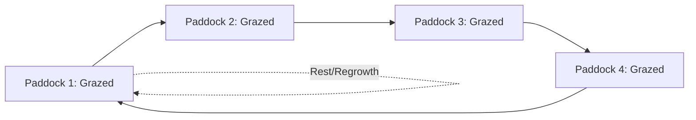

## Forage Crop Production

### Definition and Scope

Forage crop production encompasses the cultivation and management of plants grown primarily to be consumed by livestock, either through direct grazing or after harvest as hay, silage, or other preserved feed forms. Forage crops span both grasses (Poaceae) and legumes (Fabaceae), and forage system management integrates plant physiology, soil fertility, and livestock nutritional requirements into a combined production framework.

### Classification of Forage Crops

**Key Points**

- **Grasses**: Include both cool-season species (e.g., tall fescue, orchardgrass, timothy, ryegrass) and warm-season species (e.g., bermudagrass, switchgrass, sorghum-sudangrass hybrids), distinguished by their photosynthetic pathway (C3 vs. C4, as covered under photosynthesis) and associated temperature growth optima
- **Legumes**: Include alfalfa, clovers (red, white, crimson), and birdsfoot trefoil, valued for higher protein content and nitrogen-fixing capacity relative to grasses
- **Annual vs. perennial forages**: Annual forages (e.g., sorghum-sudangrass, annual ryegrass, forage brassicas) are established each year and typically provide concentrated seasonal production; perennial forages (e.g., alfalfa, most established pasture grasses) persist across multiple growing seasons

### Cool-Season vs. Warm-Season Forage Grasses

| Characteristic | Cool-Season (C3) | Warm-Season (C4) |
| --- | --- | --- |
| Optimal growth temperature | Generally 15–25°C range | Generally 25–35°C range |
| Growth pattern | Peak growth in spring and fall | Peak growth in summer |
| Water use efficiency | Generally lower | Generally higher |
| Examples | Tall fescue, orchardgrass, timothy | Bermudagrass, bahiagrass, switchgrass |

**[Inference]** Because cool-season and warm-season grasses have complementary seasonal growth patterns, some forage systems intentionally combine species from both groups to help extend the overall grazing/production season and reduce the severity of the "summer slump" commonly observed in cool-season-only pastures during peak summer heat.

### Forage Utilization Methods

#### Grazing (Pasture Systems)

Livestock directly consume standing forage in the field, requiring management of grazing pressure, timing, and pasture rest periods to maintain long-term stand productivity.

**Key Points**

- **Continuous grazing**: Livestock have unrestricted access to a pasture area for an extended period; generally simpler to manage but can lead to uneven grazing pressure and selective overgrazing of preferred species/areas if not carefully monitored
- **Rotational grazing**: Livestock are moved between subdivided pasture paddocks on a planned schedule, allowing grazed areas a defined rest/regrowth period; commonly associated with more even utilization and, in many systems, improved long-term pasture productivity and persistence compared to continuous grazing, though outcomes depend on stocking rate and rotation management execution
- **Grazing height/residual management**: Maintaining an appropriate minimum residual plant height after grazing (rather than grazing to ground level) is generally recommended to preserve adequate leaf area for regrowth and protect the plant's carbohydrate reserve and root system

#### Hay Production

Forage is cut, dried (cured) in the field to a safe storage moisture level, and typically baled for storage and later feeding.

**Key Points**

- **Cutting stage timing**: Balances forage yield (which generally increases with plant maturity) against nutritional quality (which generally declines with advancing maturity due to increasing fiber content and declining protein/digestibility), making cutting timing a central quality-yield tradeoff decision
- **Curing/drying**: Field-drying to an appropriate moisture threshold (commonly cited around 15–20% moisture for conventional dry hay, varying somewhat by bale type and storage conditions) is necessary to prevent mold development and, in more severe cases, spontaneous heating and combustion risk in stored hay
- **Weather risk**: Hay production is particularly weather-dependent, since rain damage during the field-curing period can substantially reduce nutritional quality through nutrient leaching and increased leaf loss

#### Silage Production

Forage is harvested at a higher moisture content than hay and preserved through anaerobic fermentation rather than drying.

**Key Points**

- **Fermentation process**: Under anaerobic conditions (achieved through proper packing and sealing, e.g., in a silo, bunker, or wrapped bale), naturally occurring lactic acid bacteria ferment plant sugars, producing organic acids that lower pH and preserve the forage
- **Moisture management**: Target moisture content at harvest is important for proper fermentation; excessively wet material can produce undesirable fermentation (e.g., clostridial/butyric fermentation with poor feed quality and odor), while excessively dry material can be difficult to adequately pack and exclude oxygen
- **Storage structures**: Common systems include upright silos, bunker/trench silos, and individually wrapped or tubed bales (baleage), each with different management and capital considerations

**[Inference]** Because proper silage fermentation depends on excluding oxygen to favor lactic acid bacteria over less desirable microorganisms, packing density and effective sealing are generally considered as agronomically critical to final silage quality as the initial harvest moisture and maturity decisions, rather than secondary logistical details.

### Alfalfa Production: A Key Perennial Forage Legume

**Key Points**

- Alfalfa is widely valued for high protein content, good digestibility, and nitrogen-fixing capacity via rhizobial symbiosis (as covered under legume production), often serving as a primary high-quality forage/hay crop in many temperate production regions
- Stand persistence is influenced by cutting frequency and timing relative to the plant's root carbohydrate reserve cycle; cutting too frequently or too late in the fall (interfering with the plant's pre-winter carbohydrate storage period) can weaken stands and reduce long-term persistence
- Alfalfa autotoxicity (a documented phenomenon where established alfalfa stands can inhibit germination/establishment of new alfalfa seedlings in the same field) is a recognized consideration affecting reseeding and rotation decisions

### Establishment Considerations

**Key Points**

- **Seedbed preparation**: Forage seeds, particularly small-seeded legumes and grasses, generally require a firm, fine seedbed and shallow planting depth for successful establishment, differing from the seedbed requirements of larger-seeded row crops
- **Companion/nurse cropping**: Establishing perennial forages alongside a companion annual crop (a traditional practice in some systems) can provide some early erosion protection and weed suppression, though it introduces competition considerations that must be managed relative to the establishing perennial stand
- **Inoculation**: Legume forage seed generally requires appropriate rhizobial inoculation (as covered under legume and oilseed production) for effective nitrogen fixation, particularly important in fields without recent history of that specific legume species

### Forage Quality Assessment

**Key Points**

- **Crude protein (CP)**: A standard forage quality metric estimating protein content, generally declining as the plant matures
- **Fiber measures (NDF, ADF)**: Neutral detergent fiber and acid detergent fiber are standard laboratory measures used to estimate forage digestibility and expected voluntary intake by livestock, generally increasing with plant maturity
- **Relative Feed Value (RFV) and similar indices**: Composite indices combining fiber measures into a single comparative quality score, commonly used in hay marketing and ration formulation contexts
- Forage testing (laboratory analysis of harvested hay or silage samples) is widely recommended to support accurate livestock ration balancing, since visual assessment alone is generally an unreliable predictor of precise nutritional quality

### Pasture and Hay Field Fertility Management

**Key Points**

- Grass-legume mixed stands can reduce overall nitrogen fertilizer requirements relative to pure grass stands, due to the nitrogen contribution from the legume component, though maintaining an adequate legume proportion within the stand over time requires ongoing management attention
- Potassium and phosphorus removal in harvested hay can be substantial (since the entire aboveground forage is removed rather than just grain, as in cereal production), making periodic soil testing and nutrient replacement particularly relevant in intensively hayed fields
- Soil pH management (liming as needed) is particularly emphasized for legume forages such as alfalfa, which are generally considered more sensitive to acidic soil conditions than many grass species

### Common Forage Pest and Disease Considerations

| Category | Examples | Management Notes |
| --- | --- | --- |
| Insect pests | Alfalfa weevil, armyworms, grasshoppers | Scouting-based IPM thresholds, cutting timing can sometimes serve as a management tool |
| Fungal diseases | Various leaf spot diseases, crown/root rots | Variety resistance, appropriate cutting management, drainage |
| Stand persistence issues | Winterkill, traffic/wheel damage, disease complex decline | Variety selection, appropriate cutting/grazing management, timely stand renovation |

### Related Topics

- Photosynthesis and respiration (C3/C4 pathway differences)
- Legume and oilseed production (nitrogen fixation)
- Soil pH management and liming
- Plant nutrition and mineral uptake (K and P removal)
- Integrated pest and disease management
- Environmental stress physiology (winterkill, drought)
- Livestock nutrition and ration formulation
- Field crop production principles
- Water relations and drought tolerance in forages
- Postharvest handling: hay curing and silage fermentation