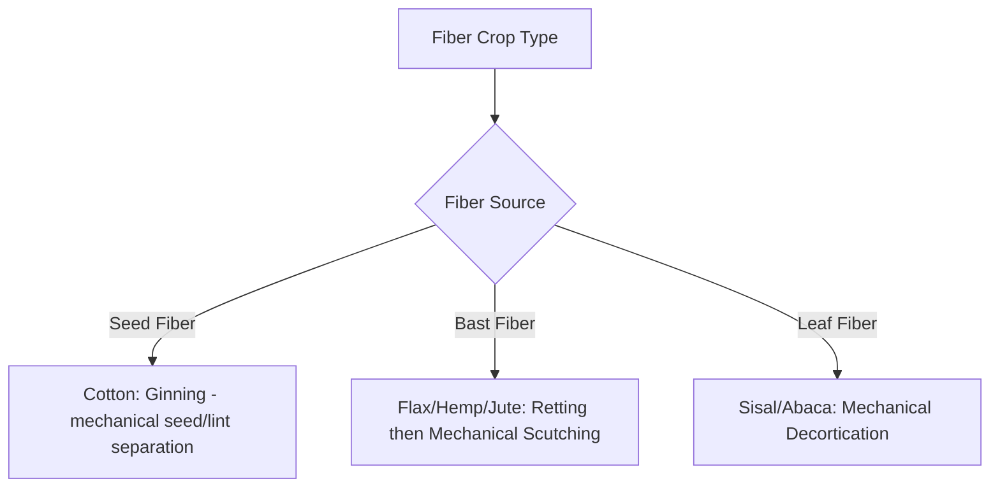

## Fiber Crop Production


### Definition and Scope

Fiber crop production encompasses the cultivation of plants grown primarily for their fibrous plant material used in textiles, cordage, paper, and industrial applications. Fiber crops are botanically diverse, with usable fiber derived from different plant structures depending on species — seed hairs, stem (bast) fibers, or leaf fibers — which directly shapes cultivation, harvest, and fiber extraction (processing) methods.

### Classification by Fiber Source

**Key Points**

- **Seed fiber crops**: Fiber develops as hairs attached to the seed itself (e.g., cotton)
- **Bast fiber crops**: Fiber is derived from the phloem/inner bark tissue of the stem, requiring a retting (controlled decomposition) process to separate fiber from surrounding stem tissue (e.g., flax, hemp, jute, kenaf)
- **Leaf fiber crops**: Fiber is extracted from leaf tissue, typically requiring mechanical scraping/decortication to separate fiber strands from surrounding leaf material (e.g., sisal, abaca)

| Crop | Fiber Type | Botanical Family | Primary Fiber Use |
| --- | --- | --- | --- |
| Cotton | Seed fiber | Malvaceae | Textiles |
| Flax | Bast fiber | Linaceae | Textiles (linen), specialty paper |
| Hemp | Bast fiber | Cannabaceae | Textiles, cordage, industrial |
| Jute | Bast fiber | Malvaceae | Sacking, cordage, burlap |
| Kenaf | Bast fiber | Malvaceae | Cordage, specialty paper, composites |
| Sisal | Leaf fiber | Asparagaceae | Cordage, rope |

### Cotton Production

#### Growth Characteristics

Cotton is cultivated as an annual crop despite being botanically a perennial shrub in its native form, with an indeterminate growth habit involving continuous production of fruiting structures over an extended reproductive period.

**Key Points**

- **Squares and bolls**: Flower buds ("squares") develop into flowers, which after fertilization develop into bolls — the seed pod structure containing developing seeds surrounded by fiber (lint)
- **Fiber (lint) development**: Cotton fiber develops from individual epidermal cells on the seed coat, which elongate dramatically and later undergo secondary cell wall thickening (largely cellulose deposition), determining final fiber length and strength characteristics
- **Extended fruiting period**: Because flowering and boll set continue over several weeks to months, a cotton plant typically carries bolls at multiple developmental stages simultaneously, complicating both crop stress-response interpretation and harvest timing decisions

```mermaid
flowchart LR
    A[Square: Flower Bud (svg_diagram)] --> B[Flower/Bloom]
    B --> C[Boll Set]
    C --> D[Fiber Elongation Phase]
    D --> E[Secondary Wall Thickening]
    E --> F[Boll Maturation and Opening]
    F --> G[Harvest: Lint and Seed]
```

#### Key Management Practices

- **Plant growth regulation**: Given cotton's indeterminate growth habit, plant growth regulators (e.g., mepiquat chloride, a compound affecting gibberellin-related growth pathways as introduced under plant hormones) are commonly used to manage vegetative growth and promote a more favorable balance toward reproductive development
- **Defoliation**: Prior to mechanical harvest, chemical defoliants are commonly applied to remove leaves, facilitating cleaner mechanical harvest and reducing potential lint contamination from leaf trash
- **Boll opening and harvest timing**: Harvest timing balances maximizing the proportion of bolls that have opened (are mature and ready) against weather-related fiber quality degradation risk (e.g., rain exposure to open bolls can cause staining and quality loss) if harvest is delayed too long

#### Fiber Quality Parameters

**Key Points**

- **Fiber length (staple length)**: A primary quality determinant, generally affecting spinning performance and price; longer staple fibers are typically associated with premium markets
- **Fiber strength and micronaire (fineness/maturity measure)**: Additional standard grading parameters affecting textile processing suitability and price
- **Color grade**: Reflects fiber whiteness/brightness, affected by weather exposure and field conditions prior to harvest

### Flax Production

Flax (*Linum usitatissimum*) is grown in two distinct forms depending on end use: fiber flax (grown for bast fiber, used to produce linen textiles) and oilseed flax/linseed (grown primarily for seed oil), with different variety selection and management priorities between the two.

**Key Points**

- **Fiber flax cultivation**: Generally grown at high plant density to encourage tall, unbranched stem growth (favorable for long fiber extraction), in contrast to oilseed flax, which is typically grown at lower density to encourage branching and seed yield
- **Harvest timing for fiber**: Fiber flax is typically harvested (traditionally by pulling rather than cutting, to preserve maximum fiber length including the root-adjacent stem base) at a stage balancing fiber quality development against increasing stem lignification that occurs with advancing maturity
- **Retting**: A controlled decomposition process (traditionally field/dew retting, where cut or pulled stalks are left in the field for microbial action to partially decompose non-fiber tissue, or water retting, where stalks are submerged) that separates the bast fiber bundles from surrounding stem tissue

### Hemp Production

**Key Points**

- Industrial hemp (*Cannabis sativa*, cultivated varieties selected for low psychoactive compound content, distinguishing it from cannabis varieties grown for other purposes) can be grown for bast fiber, seed (oilseed/food use), or specialized cannabinoid content, with different variety selection and management approaches depending on the intended primary product
- Fiber-type hemp is typically grown at high density to encourage tall, minimally branched stalks favorable for fiber extraction, similar in principle to fiber flax cultivation strategy
- **[Unverified]** Regulatory frameworks governing industrial hemp cultivation (including permitted cannabinoid content thresholds and licensing requirements) vary significantly by country and jurisdiction and have been subject to relatively frequent change in various regions; current local regulatory requirements should be verified directly with relevant authorities rather than assumed from general industry information.

### Jute and Kenaf Production

**Key Points**

- Jute is historically significant as a major source of natural sacking and cordage fiber, particularly associated with production in South Asian growing regions with warm, humid climate conditions and generally requiring substantial water availability during the growing season
- Kenaf is agronomically similar to jute in requiring bast fiber retting processing, but is noted in agricultural literature for comparatively fast growth and biomass accumulation, contributing to interest in kenaf for specialty paper pulp and industrial fiber composite applications as an alternative fiber source
- Both crops share the general bast fiber processing sequence: harvest, retting (microbial separation of fiber from surrounding tissue), and mechanical fiber extraction/cleaning

### Sisal and Leaf Fiber Crops

**Key Points**

- Sisal is derived from a perennial, rosette-forming plant (unlike the annual bast and seed fiber crops discussed above), with mature leaves harvested periodically over the plant's productive lifespan rather than through a single annual harvest event
- Fiber extraction from sisal and similar leaf fiber crops (e.g., abaca) generally requires mechanical decortication — scraping away the surrounding pulpy leaf tissue to isolate the long fiber strands — rather than the microbial retting process used for bast fibers
- Sisal is often noted for relative drought tolerance and adaptability to marginal, semi-arid growing conditions compared to many other fiber crop options

### Comparative Fiber Extraction Processes



### Agronomic and Environmental Considerations

**Key Points**

- Fiber crop water and nutrient requirements vary substantially by species and are generally managed according to principles established for the crop's plant family and growth habit (e.g., cotton fertility programs draw on broader dicot/Malvaceae crop management principles, while flax/hemp bast fiber crops emphasize even stand establishment for uniform stem development)
- Crop rotation is used with fiber crops as with other row crops to manage disease/pest carryover risk, particularly relevant for cotton given its susceptibility to various soilborne diseases and specific insect pests within intensive cotton production regions
- Interest in fiber crops (particularly hemp, flax, and kenaf) for industrial and sustainable material applications has been noted in agricultural literature as an area of ongoing market development, though the extent and pace of market growth for these applications is subject to considerable regional and economic variability.

### Related Topics

- Plant hormones and growth regulators (cotton growth management)
- Field crop production principles
- Postharvest handling and fiber processing
- Plant anatomy: bast fiber and secondary cell wall formation
- Crop rotation planning and disease management
- Legume and oilseed production (dual-use crops like cotton)
- Integrated pest management in cotton production
- Industrial and specialty crop market development
- Water relations and drought tolerance (sisal, kenaf)
- Environmental stress physiology in extended fruiting crops