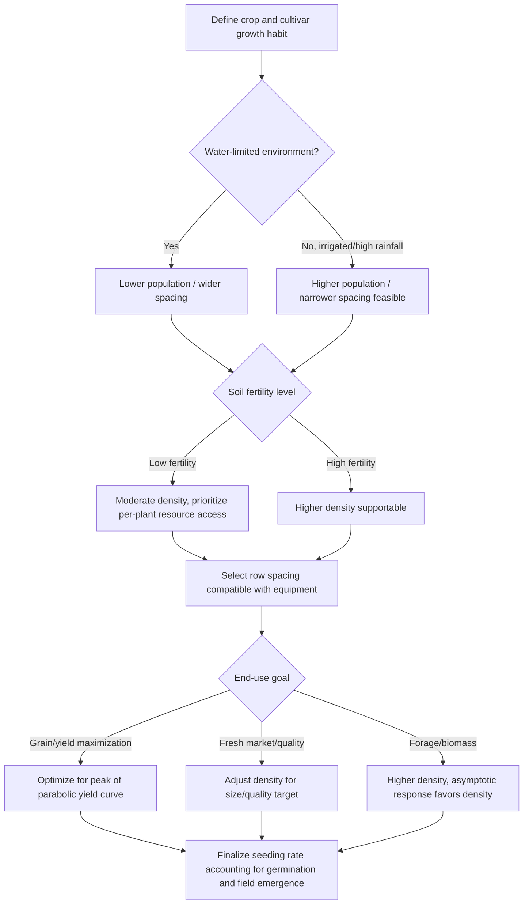

## Planting Density and Spacing Decisions

### Overview

Planting density (population per unit area) and spacing configuration (row width, in-row spacing, and geometric arrangement) are foundational agronomic decisions that determine light interception, water and nutrient competition, canopy architecture, and ultimately yield and quality. These decisions are crop-specific, environment-specific, and management-specific, requiring integration of plant physiology, resource availability, and economic objectives.

### Core Concepts and Terminology

**Plant Population**

The number of individual plants established per unit land area, typically expressed as plants per hectare (plants/ha) or plants per acre. Distinguished from seeding rate, which accounts for expected germination and field emergence losses.

$$\text{Seeding Rate} = \frac{\text{Desired Plant Population}}{\text{Germination \%} \times \text{Field Emergence \%}}$$

**Row Spacing**

The distance between adjacent crop rows, measured center to center, usually in centimeters or inches.

**In-Row Spacing (Plant Spacing)**

The distance between individual plants within the same row.

**Planting Geometry / Arrangement**

The spatial pattern of plants, which may be:

- Rectangular (unequal row and in-row spacing)
- Square (equal row and in-row spacing)
- Equidistant/triangular (hexagonal arrangement maximizing area equidistance)
- Paired-row or twin-row (two closely spaced rows alternating with wider gaps)

**Plant-to-Plant Area**

$$\text{Area per Plant (cm}^2\text{)} = \text{Row Spacing} \times \text{In-Row Spacing}$$

### Physiological and Agronomic Principles

**Light Interception and Canopy Closure**

Yield potential is closely tied to how quickly and completely a crop canopy intercepts photosynthetically active radiation (PAR). Higher densities and narrower row spacing accelerate canopy closure, reducing light loss to bare soil and suppressing weed competition. However, beyond an optimal threshold, self-shading reduces lower-canopy photosynthesis and increases lodging risk.

**Interplant Competition**

As density increases, competition intensifies for:

- Light (etiolation, reduced tillering/branching)
- Water (increased transpirational demand per unit area)
- Nutrients (particularly nitrogen, phosphorus, potassium)
- Root zone volume

This is described by the **law of constant final yield** and **self-thinning principles**, where total biomass per unit area plateaus at high densities while per-plant biomass declines.

**Yield-Density Relationships**

Two classical models describe crop response to density:

1. **Asymptotic (saturating) response** — typical of indeterminate or vegetative-yield crops (e.g., forages, leafy vegetables), where yield per area rises and plateaus.

$$Y = \frac{P}{a + bP}$$

2. **Parabolic (optimum) response** — typical of grain and fruit crops (e.g., maize, wheat), where yield per area rises, peaks, then declines due to intense competition.

$$Y = P(a + bP)^{-1} \text{ or } Y = aP - bP^2$$

Where $Y$ = yield per unit area, $P$ = plant population, and $a, b$ are empirically derived crop- and environment-specific coefficients (Bleasdale-Nelder and Holliday models).

### Illustration: Yield Response Curves to Plant Density (svg_diagram)

<svg xmlns="http://www.w3.org/2000/svg" viewBox="0 0 700 420">
<text x="350" y="25" text-anchor="middle" font-size="16" font-weight="bold" fill="#1a1a1a">Yield Response Curves to Plant Density (svg_diagram)</text>
<line x1="70" y1="360" x2="650" y2="360" stroke="#333" stroke-width="2" />
<line x1="70" y1="360" x2="70" y2="50" stroke="#333" stroke-width="2" />

<text x="360" y="395" text-anchor="middle" font-size="13" fill="#333">Plant Population (plants/ha)</text>

<text x="30" y="200" text-anchor="middle" font-size="13" fill="#333" transform="rotate(-90 30 200)">Yield per Unit Area</text>

<path d="M 90 340 Q 250 100 400 90 Q 500 120 630 220" stroke="#2e7d32" stroke-width="3" fill="none" />
<text x="500" y="150" font-size="12" fill="#2e7d32" font-weight="bold">Parabolic (grain/fruit crops)</text>
<path d="M 90 340 Q 250 150 400 110 Q 500 100 630 95" stroke="#1565c0" stroke-width="3" fill="none" />
<text x="450" y="80" font-size="12" fill="#1565c0" font-weight="bold">Asymptotic (forage/leafy crops)</text>
<line x1="400" y1="360" x2="400" y2="90" stroke="#999" stroke-dasharray="4,4" />
<text x="405" y="375" font-size="11" fill="#666">Optimum density</text>
<circle cx="400" cy="90" r="5" fill="#2e7d32" />
</svg>

### Factors Influencing Density and Spacing Decisions

**Crop-Specific Factors**

- Growth habit: determinate vs. indeterminate
- Branching/tillering capacity
- Canopy architecture (leaf angle, height)
- Harvest index and source-sink dynamics
- Root system depth and lateral spread

**Environmental Factors**

- Water availability (rainfed vs. irrigated) — lower densities are often favored under moisture-limited conditions to reduce competition
- Soil fertility — higher fertility can support higher densities
- Solar radiation and day length
- Temperature and growing season length
- Soil type and drainage

**Management Factors**

- Equipment compatibility (planter row units, cultivators, harvesters)
- Herbicide program and weed pressure
- Irrigation system type (furrow, drip, pivot)
- Intended end use (grain, silage, fresh market, processing)
- Mechanization level (hand-planted vs. precision planters)

**Economic Factors**

- Seed cost per unit area
- Expected price premium for quality vs. quantity
- Labor costs for thinning/transplanting
- Risk tolerance (higher density can buffer against poor stands but raises input cost)

### Density and Spacing Recommendations by Crop Category

**Cereals (e.g., Maize)**

- Typical row spacing: 60–90 cm (76 cm/30 in. common in the US Corn Belt; narrower rows of 38–50 cm increasingly used for higher-yield environments)
- Typical population: 65,000–90,000 plants/ha for grain maize; higher for silage
- Narrow-row systems improve early canopy closure and light interception, particularly in high-yield-potential environments [Inference: benefit magnitude is environment- and hybrid-dependent]

**Small Grains (e.g., Wheat, Rice)**

- Wheat: drilled at 15–20 cm row spacing; seeding rates of 100–160 kg/ha depending on tillering capacity and sowing date
- Rice (transplanted): typical spacing 20 cm × 15 cm to 20 cm × 20 cm; direct-seeded rice uses higher effective densities

**Legumes (e.g., Soybean, Common Bean)**

- Soybean: row spacing ranges from 19–76 cm; narrow rows (<38 cm) often increase yield in shorter-season environments due to faster canopy closure
- Populations: 250,000–450,000 plants/ha depending on row spacing and maturity group

**Root and Tuber Crops (e.g., Potato, Cassava)**

- Potato: row spacing 75–90 cm, in-row spacing 20–30 cm depending on desired tuber size
- Cassava: typically 1 m × 1 m spacing (10,000 plants/ha) for adequate tuber bulking

**Vegetables (e.g., Tomato, Cabbage)**

- Highly variable by cultivar (determinate/indeterminate) and training system
- Tomato (staked/trellised): 30–45 cm in-row, 90–120 cm between rows
- Cabbage: 45–60 cm × 30–45 cm depending on head size target

**Fruit Trees and Perennials**

- Governed by rootstock vigor, training system, and orchard system (high-density, meadow orchard, traditional)
- High-density apple systems: 1–2 m × 3–4 m (1,250–3,300 trees/ha) vs. traditional 6 m × 6 m (~278 trees/ha)

### Planting Geometry Patterns

**Equidistant/Square Planting**

Minimizes intraspecific competition by maximizing the distance between nearest neighbors for a given area, often improving yield uniformity in root crops and vegetables.

**Rectangular Planting**

Common in mechanized row crops; allows inter-row cultivation and machinery passage while achieving desired population through in-row spacing adjustment.

**Paired/Twin-Row Systems**

Two rows spaced narrowly (e.g., 20 cm apart) alternating with a wider inter-pair gap (e.g., 76 cm), used in maize and cotton to improve light interception while retaining compatibility with standard equipment. [Inference: yield benefit varies by hybrid, moisture regime, and region; results in research trials have been mixed]

**Skip-Row Planting**

Alternating planted and unplanted (fallow) row pairs, used in semi-arid dryland cropping (e.g., sorghum, cotton) to concentrate soil moisture reserves for the planted rows.

### Diagram: Decision Framework for Density and Spacing

### Consequences of Suboptimal Decisions

**Density Too Low**

- Incomplete canopy closure, greater weed pressure
- Excessive branching/tillering diverting resources from reproductive growth
- Lower yield per unit area despite higher yield per plant
- Increased soil water evaporation from exposed soil surface

**Density Too High**

- Excessive interplant competition, reduced per-plant yield components (fewer grains, smaller fruit, thinner stems)
- Increased lodging risk due to elongated internodes and weaker stalks (shade avoidance response)
- Elevated disease pressure from reduced airflow and higher humidity within canopy
- Higher seed cost without proportional yield gain
- Increased barrenness or abortion of reproductive structures under resource stress

### Practical Example: Adjusting Maize Population for Environment

A producer in a semi-arid region with limited irrigation is deciding between 55,000 and 80,000 plants/ha for a maize hybrid.

**Analysis Steps:**

1. Assess available water: historical rainfall plus irrigation capacity determines the water budget per plant.
2. Estimate water use per plant at each density; higher density increases the risk of moisture deficit during grain fill.
3. Consult hybrid-specific density response data (if available) or use regional agronomic trial data for similar hybrids and soil types.
4. Select 55,000 plants/ha to reduce competition risk and stabilize yield under moisture uncertainty, accepting a lower yield ceiling in exchange for reduced downside risk.
5. Adjust seeding rate upward (e.g., +8–10%) to compensate for expected field emergence losses, calculated using the seeding rate formula above.

**Key Points**

- Density decisions balance yield ceiling potential against risk of resource-limited yield collapse.
- Environment-specific data (soil moisture-holding capacity, historical rainfall) should guide the decision more than blanket regional averages.
- Final seeding rate must always be adjusted from target population using expected emergence percentage.

### Precision Agriculture and Variable-Rate Seeding

Modern planters equipped with variable-rate seeding (VRS) technology allow density to be adjusted in real time based on:

- Soil productivity zones derived from yield maps, soil electrical conductivity (EC), or management zone delineation
- Topographic position (e.g., lower density on eroded hilltops, higher density in fertile lowlands)
- Historical yield stability data

This approach recognizes that optimal density is not uniform across a field and seeks to match population to site-specific yield potential, improving both yield and input-use efficiency. [Inference: economic return on VRS technology is field- and scale-dependent and requires sufficient within-field variability to justify investment]

### Measuring and Verifying Stand Establishment

**Stand Count Procedure**

1. Select representative sampling locations across the field (avoiding field edges).
2. Measure a fixed row length corresponding to $\frac{1}{1000}$ acre or a standard metric unit based on row spacing.
3. Count emerged, healthy plants within that length.
4. Convert to plants per unit area and compare against target population.

$$\text{Plants/ha} = \frac{\text{Plants Counted}}{\text{Row Length Sampled (m)} \times \text{Row Spacing (m)}} \times 10{,}000$$

**Uniformity Assessment**

Beyond total count, spacing uniformity (variance in gap distances between plants) affects yield, since erratic spacing creates localized zones of both over- and under-competition. Standard deviation of in-row plant spacing is often used as a stand quality metric in row crops like maize.

### Conclusion

Planting density and spacing decisions integrate crop physiology, environmental constraints, equipment logistics, and economic risk management. There is no universally optimal density; rather, the correct decision emerges from matching population and geometry to the specific yield-response behavior of the crop, the resource environment, and the intended production outcome. Continuous refinement through stand assessment, yield mapping, and emerging precision technologies allows these decisions to become increasingly site-specific over time.

**Related Topics**

- Seed quality, germination testing, and vigor assessment
- Row crop cultivation equipment and planter calibration
- Weed-crop competition and integrated weed management
- Canopy architecture and light interception modeling
- Lodging resistance and stalk strength in cereals
- Variable-rate technology and precision agriculture systems
- Water use efficiency and deficit irrigation strategies
- Yield component analysis (plants/area, ears/plant, kernels/ear, kernel weight)
- Orchard training systems and high-density fruit production
- Skip-row and dryland cropping systems