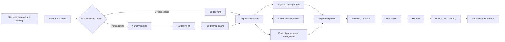

## Vegetable Crop Production

### Overview

Vegetable crop production encompasses the cultivation of herbaceous plants grown for edible roots, stems, leaves, flowers, fruits, or seeds, typically consumed fresh or minimally processed. Unlike agronomic grain crops, vegetable production is characterized by high input intensity, short crop cycles, high market value per unit area, sensitivity to quality standards, and diverse cultivation systems ranging from open-field to protected cultivation.

### Classification of Vegetable Crops

**By Plant Part Consumed**

- **Leafy vegetables**: lettuce, spinach, cabbage, kale
- **Root vegetables**: carrot, radish, beet, turnip
- **Tuber vegetables**: potato, sweet potato
- **Bulb vegetables**: onion, garlic, leek
- **Fruit vegetables**: tomato, pepper, eggplant, cucumber, squash
- **Flower vegetables**: broccoli, cauliflower, artichoke
- **Seed/pod vegetables (legumes)**: pea, bean, okra
- **Stem vegetables**: asparagus, celery, kohlrabi

**By Botanical Family**

- Solanaceae (tomato, pepper, eggplant, potato)
- Brassicaceae (cabbage, broccoli, cauliflower, radish)
- Cucurbitaceae (cucumber, squash, melon, pumpkin)
- Fabaceae (pea, bean)
- Amaryllidaceae/Alliaceae (onion, garlic, leek)
- Apiaceae (carrot, celery, parsley)
- Asteraceae (lettuce, artichoke)

**By Climatic Adaptation**

- **Cool-season crops**: tolerate light frost, optimal growth 15–20°C (e.g., cabbage, lettuce, pea, carrot)
- **Warm-season crops**: frost-sensitive, optimal growth 20–30°C (e.g., tomato, pepper, cucumber, squash)

### Production Systems

**Open-Field Production**

Direct exposure to ambient environmental conditions; lower capital investment but higher exposure to weather variability, pest pressure, and yield risk.

**Protected Cultivation**

- **Greenhouses**: climate-controlled structures enabling year-round production, higher yields per unit area, and premium quality; substantial capital and energy investment
- **High tunnels/polytunnels**: passively ventilated structures extending the growing season without full climate control
- **Row covers and mulches**: localized microclimate modification for frost protection, pest exclusion, or soil temperature/moisture management

**Soilless/Hydroponic Systems**

Nutrient solution culture in substrates (rockwool, coco coir, perlite) or nutrient film technique (NFT), enabling precise nutrient control and reduced soil-borne disease pressure; common for high-value crops like tomato, lettuce, and cucumber in controlled environment agriculture.

### Crop Establishment Methods

**Direct Seeding**

Seeds sown directly into the final production field. Suited to crops with rapid establishment or those sensitive to transplant shock (carrot, radish, bean, sweet corn, cucurbits in some systems).

**Transplanting**

Seedlings raised in nurseries/plug trays under controlled conditions, then transplanted to the field. Advantages include:

- More uniform stand establishment
- Reduced field time (shorter exposure to field pest/weather risk)
- More efficient seed use for high-value or slow-germinating crops
- Better weed competition head-start

Common for tomato, pepper, eggplant, cabbage, lettuce, and onion.

**Seedling/Nursery Management**

- Media selection (well-drained, disease-free substrate)
- Hardening off (gradual acclimatization to field conditions before transplanting)
- Optimal transplant age varies by crop (e.g., tomato: 4–6 weeks; cabbage: 4–5 weeks)

### Diagram: Vegetable Crop Production Cycle

### Site Selection and Soil Requirements

**Key Soil Criteria**

- Well-drained soils with good structure; most vegetables are sensitive to waterlogging
- Optimal pH range typically 6.0–6.8, though crop-specific tolerances vary (e.g., potato tolerates more acidic soils, ~5.0–6.0)
- High organic matter content improves water retention and nutrient availability
- Adequate depth for root development, particularly critical for root and tuber crops

**Site Factors**

- Sunlight exposure (minimum 6 hours direct sunlight for most fruit vegetables)
- Air drainage (avoiding frost pockets in low-lying areas)
- Proximity to water source for irrigation
- Crop rotation history (avoiding same-family repetition to reduce soil-borne disease and pest carryover)

### Nutrient Management

Vegetables generally have high nutrient demand due to rapid growth rates and high-value yield expectations.

**Macronutrient Considerations**

- **Nitrogen (N)**: critical for vegetative growth; leafy vegetables have particularly high N demand; excess N can delay maturity or reduce fruit set in fruiting vegetables
- **Phosphorus (P)**: essential for root establishment and flowering; especially important at transplanting/establishment stage
- **Potassium (K)**: influences fruit quality, disease resistance, and postharvest shelf life; fruiting vegetables have high K demand during fruit development

**Fertilization Strategies**

- Soil testing prior to planting to establish baseline nutrient status
- Split applications of nitrogen to match crop uptake curve and reduce leaching losses
- Fertigation (nutrient delivery through irrigation systems) for precise, timed nutrient supply, especially in drip-irrigated and protected cultivation systems
- Organic amendments (compost, manure) for soil health and slow-release nutrition

### Irrigation Management

**Irrigation Methods**

- **Furrow irrigation**: gravity-fed, lower capital cost, less efficient water use
- **Sprinkler irrigation**: overhead application, suitable for larger areas, but can increase foliar disease risk
- **Drip irrigation**: targeted root-zone delivery, high water use efficiency, compatible with fertigation, widely used in high-value vegetable production

**Water Requirements**

Vegetable crops generally have shallow to moderate root systems and are highly sensitive to water stress, particularly during:

- Germination/establishment
- Flowering and fruit set (critical period for yield determination)
- Fruit/root/bulb bulking stages

Deficit irrigation during non-critical stages can be used to manage water resources without substantial yield penalty, though this requires crop-specific knowledge of critical growth stages. [Inference: the degree of tolerable deficit is highly crop- and cultivar-specific and requires local validation]

### Weed Management

**Approaches**

- **Cultural**: crop rotation, cover cropping, mulching (plastic or organic mulch suppresses weed emergence and conserves soil moisture)
- **Mechanical**: inter-row cultivation, hand weeding (still common in high-value vegetable systems due to herbicide phytotoxicity risk on sensitive crops)
- **Chemical**: pre-emergent and post-emergent herbicides, though vegetable crops often have narrower herbicide options than grain crops due to crop sensitivity and residue tolerance concerns
- **Stale seedbed technique**: allowing weed flush germination prior to planting, then eliminating weeds before crop establishment

### Pest and Disease Management

**Integrated Pest Management (IPM) Principles**

- Regular scouting and pest identification
- Economic threshold-based intervention rather than calendar-based spraying
- Cultural controls: crop rotation, resistant varieties, sanitation
- Biological controls: beneficial insects, biopesticides
- Chemical controls: used judiciously, with attention to pre-harvest intervals (PHI) and residue limits given the fresh-consumption nature of most vegetables

**Common Vegetable Disease Categories**

- Fungal: damping-off, powdery mildew, downy mildew, early/late blight
- Bacterial: bacterial wilt, soft rot
- Viral: mosaic viruses, often vector-transmitted (aphids, whiteflies)
- Soil-borne: Fusarium and Verticillium wilts, nematodes

**Common Pest Categories**

- Sucking pests: aphids, whiteflies, thrips (also virus vectors)
- Chewing pests: caterpillars, beetles
- Soil pests: cutworms, nematodes, wireworms

### Crop-Specific Production Notes

**Tomato (Solanum lycopersicum)**

- Determinate vs. indeterminate growth habit determines staking/pruning needs and harvest pattern (single flush vs. continuous)
- Common training systems: staking, trellising, caging
- Sensitive to blossom end rot (calcium-related physiological disorder linked to water stress/uptake, not solely soil calcium deficiency)

**Cabbage/Cole Crops (Brassica oleracea)**

- Cool-season preference; bolting risk under heat stress or premature cold exposure (vernalization-triggered)
- Head firmness and size targets driven by cultivar and spacing

**Cucurbits (Cucumber, Squash, Melon)**

- Monoecious or dioecious flowering patterns affecting pollination requirements
- Pollinator dependency (often insect-pollinated); pollination management critical for fruit set and shape

**Onion/Allium Crops**

- Bulbing is triggered by photoperiod (day-length sensitive cultivars: short-day, intermediate-day, long-day types) and temperature
- Cultivar selection must match latitude/day-length conditions of production region

**Leafy Vegetables (Lettuce, Spinach)**

- Rapid crop cycle (30–60 days), enabling multiple successive plantings per season
- High sensitivity to bolting under heat/long-day conditions
- Postharvest quality highly perishable, requiring rapid cooling after harvest

### Harvest Considerations

**Maturity Indices**

Vary by crop and market target:

- Physiological maturity (e.g., seed crops)
- Horticultural/commercial maturity (typical for most fresh-market vegetables — based on size, color, firmness, or days after planting/flowering)
- Color change (tomato, pepper)
- Size threshold (cucumber, zucchini, carrot)
- Firmness/compactness (cabbage head, broccoli floret tightness)

**Harvest Methods**

- Hand harvesting: predominant for fresh-market vegetables requiring selective, non-damaging picking
- Mechanical harvesting: used for processing-destined crops (e.g., processing tomato, green beans) where uniform, once-over harvest is acceptable

### Postharvest Handling

**Key Postharvest Priorities**

- Rapid removal of field heat (hydrocooling, forced-air cooling, or ice) to slow respiration and senescence
- Sorting and grading by size, quality, and defect presence
- Appropriate storage temperature and relative humidity (crop-specific; e.g., leafy greens typically 0–2°C, tomatoes 10–13°C to avoid chilling injury)
- Packaging to reduce mechanical damage and moisture loss during transport

**Chilling Injury Risk**

Certain vegetables (tomato, cucumber, pepper, eggplant — mostly warm-season/tropical origin crops) are susceptible to chilling injury if stored below their critical temperature threshold, resulting in pitting, discoloration, or accelerated decay upon return to warmer conditions.

### Illustration: Vegetable Classification by Edible Plant Part (svg_diagram)

<svg xmlns="http://www.w3.org/2000/svg" viewBox="0 0 700 380">
<text x="350" y="25" text-anchor="middle" font-size="16" font-weight="bold" fill="#1a1a1a">Vegetable Classification by Edible Plant Part (svg_diagram)</text>
<rect x="30" y="60" width="120" height="60" rx="8" fill="#c8e6c9" stroke="#2e7d32" />
<text x="90" y="85" text-anchor="middle" font-size="12" font-weight="bold">Leaf</text>
<text x="90" y="102" text-anchor="middle" font-size="10">Lettuce, Spinach</text>
<rect x="170" y="60" width="120" height="60" rx="8" fill="#d7ccc8" stroke="#5d4037" />
<text x="230" y="85" text-anchor="middle" font-size="12" font-weight="bold">Root</text>
<text x="230" y="102" text-anchor="middle" font-size="10">Carrot, Beet</text>
<rect x="310" y="60" width="120" height="60" rx="8" fill="#ffe0b2" stroke="#ef6c00" />
<text x="370" y="85" text-anchor="middle" font-size="12" font-weight="bold">Tuber</text>
<text x="370" y="102" text-anchor="middle" font-size="10">Potato</text>
<rect x="450" y="60" width="120" height="60" rx="8" fill="#fff9c4" stroke="#f9a825" />
<text x="510" y="85" text-anchor="middle" font-size="12" font-weight="bold">Bulb</text>
<text x="510" y="102" text-anchor="middle" font-size="10">Onion, Garlic</text>
<rect x="100" y="160" width="120" height="60" rx="8" fill="#ffccbc" stroke="#d84315" />
<text x="160" y="185" text-anchor="middle" font-size="12" font-weight="bold">Fruit</text>
<text x="160" y="202" text-anchor="middle" font-size="10">Tomato, Pepper</text>
<rect x="240" y="160" width="120" height="60" rx="8" fill="#f8bbd0" stroke="#ad1457" />
<text x="300" y="185" text-anchor="middle" font-size="12" font-weight="bold">Flower</text>
<text x="300" y="202" text-anchor="middle" font-size="10">Broccoli, Cauliflower</text>
<rect x="380" y="160" width="120" height="60" rx="8" fill="#b3e5fc" stroke="#0277bd" />
<text x="440" y="185" text-anchor="middle" font-size="12" font-weight="bold">Seed/Pod</text>
<text x="440" y="202" text-anchor="middle" font-size="10">Pea, Bean</text>
<rect x="240" y="260" width="120" height="60" rx="8" fill="#dcedc8" stroke="#558b2f" />
<text x="300" y="285" text-anchor="middle" font-size="12" font-weight="bold">Stem</text>
<text x="300" y="302" text-anchor="middle" font-size="10">Asparagus, Celery</text>
</svg>

### Practical Example: Planning a Small-Scale Diversified Vegetable Farm

**Scenario**: A grower has 1 hectare and wants to supply a local fresh-market channel with continuous vegetable availability.

1. **Crop selection**: Choose a mix of leafy greens (fast cycle, frequent succession), fruiting vegetables (tomato, pepper — higher value, longer season), and root crops (carrot, radish) to diversify risk and harvest timing.
2. **Succession planning**: Stagger plantings of lettuce/spinach every 2 weeks to maintain continuous supply given the crop's 30–45 day cycle.
3. **Rotation design**: Group crops by family and rotate planting location season to season to reduce soil-borne disease buildup (e.g., avoid planting Solanaceae in the same bed in consecutive seasons).
4. **Infrastructure investment**: Install drip irrigation for water-use efficiency and fertigation capability across all beds.
5. **Protected structure**: Allocate a portion of the area to a high tunnel for early-season tomato and pepper transplanting, extending the marketable season beyond open-field timing.

**Key Points**

- Diversification spreads market and production risk across crops with different cycles and value.
- Succession planting is essential for perishable, short-cycle crops to avoid market gluts and gaps.
- Family-based rotation is a low-cost disease and pest management strategy.

### Emerging Trends in Vegetable Production

- **Controlled Environment Agriculture (CEA)**: vertical farming and fully climate-controlled indoor production for leafy greens and herbs, using LED lighting and hydroponic/aeroponic systems to maximize yield per unit area independent of outdoor climate
- **Precision agriculture tools**: sensor-based irrigation scheduling, soil moisture monitoring, and variable-rate fertigation in high-value vegetable operations
- **Grafting**: use of disease-resistant rootstocks (particularly in Solanaceae and Cucurbitaceae) to manage soil-borne pathogens without soil fumigation
- **Biodegradable mulches**: reducing plastic waste while retaining weed suppression and moisture conservation benefits [Inference: performance parity with conventional plastic mulch varies by product and climate]

### Conclusion

Vegetable crop production is a high-intensity, high-value branch of horticulture requiring precise integration of site selection, establishment method, nutrient and water management, pest/disease control, and postharvest handling. Because vegetables are predominantly consumed fresh, quality standards, timing, and perishability considerations weigh more heavily than in many agronomic crop systems, driving continued adoption of protected cultivation, precision technologies, and intensive management practices.

**Related Topics**

- Greenhouse and protected cultivation design
- Hydroponic and soilless growing systems
- Integrated Pest Management (IPM) strategies
- Postharvest physiology and cold chain management
- Seed and transplant production nurseries
- Crop rotation and soil health management
- Grafting techniques in vegetable crops
- Controlled Environment Agriculture (CEA) and vertical farming
- Irrigation scheduling and fertigation systems
- Vegetable variety selection and breeding objectives