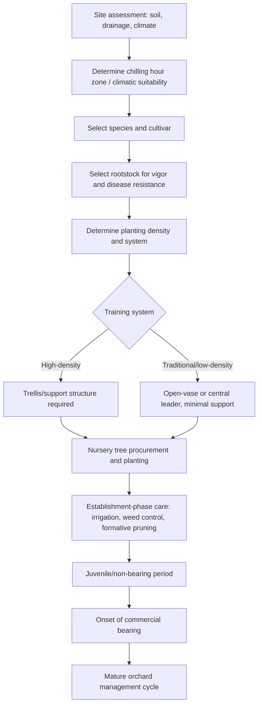

## Fruit and Orchard Management

### Overview

Fruit and orchard management encompasses the establishment, cultivation, and maintenance of perennial fruit-bearing trees, shrubs, and vines from planting through mature productive life. Unlike annual vegetable or agronomic crops, orchard systems involve multi-decade production horizons, requiring long-term planning for site selection, rootstock-scion combinations, training systems, and sustained soil and canopy management.

### Classification of Fruit Crops

**By Growth Habit**

- **Deciduous tree fruits**: apple, pear, peach, plum, cherry (temperate climate, chilling requirement for dormancy break)
- **Evergreen tree fruits**: citrus, mango, avocado (subtropical/tropical, no true dormancy)
- **Vine fruits**: grape, kiwifruit, passion fruit
- **Bush/cane fruits (small fruits)**: blueberry, raspberry, blackberry, currant
- **Palm fruits**: date palm, coconut

**By Climatic Zone**

- **Temperate fruits**: require winter chilling for dormancy release (apple, pear, cherry, most stone fruits)
- **Subtropical fruits**: tolerate light frost, moderate chilling needs (citrus, olive, loquat)
- **Tropical fruits**: no chilling requirement, frost-sensitive (mango, banana, papaya, avocado)

### Site Selection and Orchard Establishment

**Site Selection Criteria**

- Soil depth and drainage: most tree fruits require well-drained soils to depths of 1–1.5 m to avoid root asphyxiation
- Air drainage: sloped sites reduce frost pocket formation, critical for early-flowering species vulnerable to spring frost damage
- Soil pH: generally 6.0–6.5 for most tree fruits, though blueberries require acidic soils (pH 4.5–5.5)
- Water source availability for irrigation establishment and ongoing production
- Chilling hour accumulation matching cultivar dormancy requirements (for temperate species)

**Land Preparation**

- Deep ripping/subsoiling to break compaction layers before planting
- Soil testing and pre-plant amendment (lime for pH correction, organic matter incorporation)
- Drainage system installation where water table or soil texture presents risk

### Rootstock and Scion Selection

**Role of Rootstocks**

Rootstocks govern tree vigor, size control, precocity (early bearing), disease/pest resistance, and soil adaptability, while the scion (grafted upper portion) determines fruit characteristics.

**Vigor Classification (example: apple rootstocks)**

- Dwarfing (e.g., M9, M26): smaller trees, early bearing, require support structures, suited to high-density systems
- Semi-dwarfing (e.g., M7, MM106): moderate vigor, moderate density
- Vigorous/standard (e.g., seedling rootstocks): large trees, later bearing, lower density, longer productive lifespan

**Rootstock Selection Considerations**

- Soil type compatibility (drought tolerance, waterlogging tolerance)
- Disease resistance (e.g., resistance to soil-borne pathogens, phylloxera in grapevines, Phytophthora in citrus/stone fruits)
- Desired tree size and orchard density
- Anchorage and support requirements

### Diagram: Orchard Establishment Decision Flow

### Planting Systems and Density

**Traditional/Low-Density Systems**

Wide spacing (e.g., 6 m × 6 m for apple on vigorous rootstock, ~278 trees/ha), longer time to full production, lower establishment cost per tree but delayed return on investment.

**High-Density Systems**

Narrow spacing enabled by dwarfing rootstocks (e.g., 1–2 m × 3–4 m for apple, 1,250–3,300+ trees/ha), earlier bearing, higher early yields per hectare, but requiring trellis/support infrastructure and higher establishment cost.

**Meadow Orchard Systems**

Extremely high density with minimal pruning, mechanized management, and shorter productive lifespan per tree cycle, used in some intensive stone fruit and apple production regions. [Inference: adoption and economic viability are region- and market-specific]

### Training and Pruning Systems

**Common Training Systems**

- **Central leader**: single dominant trunk with tiered scaffold branches, common in apple and pear
- **Open vase/open center**: no central leader, allowing light penetration to interior canopy, common in peach, plum, and some citrus
- **Espalier/trellis-trained**: branches trained flat along wires, used in high-density and space-constrained systems
- **Cordon training**: used extensively in grapevine systems (e.g., vertical shoot positioning, Guyot system)

**Pruning Objectives**

- Establish and maintain tree structure/framework
- Optimize light penetration and air circulation within the canopy
- Balance vegetative growth and reproductive (fruiting) growth
- Remove diseased, damaged, or crossing branches
- Renew fruiting wood (particularly important in species that fruit on specific wood age, e.g., one-year-old wood in peach)

**Pruning Timing**

- Dormant-season pruning: most common for deciduous fruits, performed during winter dormancy to minimize disease entry risk and allow full assessment of tree structure
- Summer pruning: used for vigor control, canopy light management, and in high-density systems to manage shoot growth

### Flowering, Pollination, and Fruit Set

**Pollination Requirements**

- **Self-fertile species**: capable of fruit set with their own pollen (e.g., most peach and citrus cultivars)
- **Self-incompatible species**: require cross-pollination from a compatible cultivar (e.g., most apple and sweet cherry cultivars), necessitating pollinizer tree inclusion in orchard design
- **Pollinator dependency**: many tree fruits rely on insect pollinators (particularly honeybees), requiring hive placement management during bloom

**Fruit Set Management**

- Frost protection during bloom (critical vulnerability period for temperate fruits): methods include wind machines, overhead sprinkler (ice formation insulation), orchard heaters
- Chemical or hand thinning to manage crop load, improve fruit size, and reduce biennial bearing tendency
- Growth regulator applications for fruit set enhancement or thinning in some systems

### Nutrient Management

**General Principles**

- Perennial nutrient cycling differs from annual crops: trees store reserves in woody tissue and roots, influencing subsequent season's growth and flowering
- Leaf tissue analysis is a standard diagnostic tool for assessing orchard nutrient status, often more reliable than soil testing alone for established trees
- Nitrogen timing is critical: excessive late-season N can delay dormancy and increase cold injury risk; adequate early-season N supports vegetative and fruit growth

**Key Nutrients**

- **Nitrogen**: vegetative growth, leaf development
- **Potassium**: fruit size, quality, and sugar accumulation
- **Calcium**: cell wall structure, critical for fruit storage quality (deficiency linked to disorders like bitter pit in apple)
- **Boron**: pollen tube growth and fruit set
- **Zinc**: shoot growth, especially in citrus (deficiency causes rosetting)

### Irrigation Management

**Water Requirements**

Vary substantially by species, climate, and rootstock, with critical sensitivity periods including:

- Bloom and fruit set
- Cell division stage (early fruit development, determining final fruit size potential)
- Fruit sizing/bulking stage

**Irrigation Methods**

- Drip/micro-irrigation: precise root-zone delivery, water-efficient, compatible with fertigation, standard in modern high-density orchards
- Micro-sprinkler: covers larger wetted area, sometimes used for frost protection in addition to irrigation
- Deficit irrigation strategies (e.g., regulated deficit irrigation, RDI) applied at specific non-critical growth stages in some species to control vigor and improve fruit quality without significant yield penalty [Inference: RDI protocols are species- and cultivar-specific and require calibrated local validation]

### Pest and Disease Management

**Integrated Pest Management (IPM) in Orchards**

- Monitoring via pheromone traps, degree-day models for pest emergence timing, and regular scouting
- Cultural controls: sanitation (removal of mummified fruit, fallen leaves harboring pathogens), pruning for airflow
- Biological controls: conservation of natural enemies, use of mating disruption for key pests (e.g., codling moth in apple)
- Chemical controls: timed applications based on pest phenology models, with attention to pre-harvest intervals and resistance management (rotation of modes of action)

**Common Orchard Disease Categories**

- Fungal: apple scab, brown rot (stone fruits), powdery mildew, fire blight (bacterial, but often grouped in orchard disease management programs)
- Viral: various graft-transmissible viruses affecting vigor and yield
- Soil-borne: crown gall, Phytophthora root/crown rot, replant disease

### Crop Load Management and Biennial Bearing

**Thinning**

Removal of excess flowers or young fruit to:

- Improve remaining fruit size and quality
- Reduce limb breakage risk from overcropping
- Mitigate biennial (alternate) bearing tendency, where a heavy crop year depletes carbohydrate reserves needed for the following year's flower bud initiation

**Methods**

- Hand thinning: labor-intensive but precise, common in high-value fresh-market fruit
- Chemical thinning: growth regulator or caustic agent application timed to specific fruit developmental windows
- Mechanical thinning: used in some high-density systems for efficiency

### Illustration: Orchard Training System Comparison (svg_diagram)

<svg xmlns="http://www.w3.org/2000/svg" viewBox="0 0 700 340">
<text x="350" y="25" text-anchor="middle" font-size="16" font-weight="bold" fill="#1a1a1a">Orchard Training System Comparison (svg_diagram)</text>

<text x="120" y="55" text-anchor="middle" font-size="13" font-weight="bold">Central Leader</text>

<line x1="120" y1="70" x2="120" y2="230" stroke="`#5d4037`" stroke-width="6" />

<line x1="120" y1="110" x2="70" y2="90" stroke="`#2e7d32`" stroke-width="4" />

<line x1="120" y1="110" x2="170" y2="90" stroke="`#2e7d32`" stroke-width="4" />

<line x1="120" y1="150" x2="60" y2="135" stroke="`#2e7d32`" stroke-width="4" />

<line x1="120" y1="150" x2="180" y2="135" stroke="`#2e7d32`" stroke-width="4" />

<line x1="120" y1="190" x2="70" y2="175" stroke="`#2e7d32`" stroke-width="4" />

<line x1="120" y1="190" x2="170" y2="175" stroke="`#2e7d32`" stroke-width="4" />

<text x="120" y="250" text-anchor="middle" font-size="10">Apple, pear</text>

<text x="350" y="55" text-anchor="middle" font-size="13" font-weight="bold">Open Vase</text>

<line x1="350" y1="230" x2="350" y2="160" stroke="`#5d4037`" stroke-width="6" />

<line x1="350" y1="160" x2="300" y2="80" stroke="`#2e7d32`" stroke-width="5" />

<line x1="350" y1="160" x2="400" y2="80" stroke="`#2e7d32`" stroke-width="5" />

<line x1="350" y1="160" x2="350" y2="70" stroke="`#2e7d32`" stroke-width="5" />

<line x1="300" y1="80" x2="270" y2="60" stroke="`#2e7d32`" stroke-width="3" />

<line x1="400" y1="80" x2="430" y2="60" stroke="`#2e7d32`" stroke-width="3" />

<text x="350" y="250" text-anchor="middle" font-size="10">Peach, plum</text>

<text x="580" y="55" text-anchor="middle" font-size="13" font-weight="bold">Trellis/Espalier</text>

<line x1="530" y1="70" x2="530" y2="230" stroke="#888" stroke-width="2" />

<line x1="630" y1="70" x2="630" y2="230" stroke="#888" stroke-width="2" />

<line x1="530" y1="100" x2="630" y2="100" stroke="#888" stroke-width="2" />

<line x1="530" y1="150" x2="630" y2="150" stroke="#888" stroke-width="2" />

<line x1="530" y1="200" x2="630" y2="200" stroke="#888" stroke-width="2" />

<line x1="580" y1="70" x2="580" y2="220" stroke="`#5d4037`" stroke-width="4" />

<line x1="580" y1="100" x2="530" y2="100" stroke="`#2e7d32`" stroke-width="3" />

<line x1="580" y1="100" x2="630" y2="100" stroke="`#2e7d32`" stroke-width="3" />

<line x1="580" y1="150" x2="530" y2="150" stroke="`#2e7d32`" stroke-width="3" />

<line x1="580" y1="150" x2="630" y2="150" stroke="`#2e7d32`" stroke-width="3" />

<text x="580" y="250" text-anchor="middle" font-size="10">High-density apple</text>

</svg>

### Harvest and Postharvest Management

**Maturity Determination**

- Visual indices: color break, skin color development
- Firmness testing (penetrometer readings), particularly for stone fruit and pome fruit
- Soluble solids content (Brix measurement via refractometer) as a sugar/maturity indicator
- Starch-iodine test (apple) to assess starch-to-sugar conversion progress
- Days from full bloom (accumulated heat units) as a predictive maturity tool

**Harvest Methods**

- Hand harvesting: standard for fresh-market fruit requiring selective picking and careful handling to avoid bruising
- Mechanical harvesting: used for processing-destined fruit (e.g., processing tomato for sauce, some processing peach/cherry varieties, wine grapes) tolerant of handling impact

**Postharvest Handling**

- Rapid cooling (forced-air cooling, hydrocooling) to slow respiration rate and extend storage life
- Controlled atmosphere (CA) storage: modified oxygen/CO2 levels to extend storage duration for apples and pears, sometimes for many months
- Grading and sorting by size, color, and defect presence
- Careful handling protocols to minimize bruising, given the high susceptibility of fresh fruit to mechanical damage

### Practical Example: Establishing a High-Density Apple Orchard

**Scenario**: A grower is establishing a new apple orchard targeting early production and high yield per hectare.

1. **Rootstock selection**: Choose a dwarfing rootstock (e.g., M9-type) for early bearing and compact tree size suited to intensive management.
2. **Planting density**: Plant at approximately 1.2 m × 3.5 m spacing (~2,380 trees/ha), requiring trellis support due to limited root anchorage of dwarfing rootstocks.
3. **Training system**: Adopt a slender spindle or tall spindle training system, using a central leader with minimal permanent scaffold branches to maximize early light interception and fruiting wall formation.
4. **Pollinizer planning**: Interplant a compatible pollinizer cultivar or ensure nearby pollen source, since most commercial apple cultivars are self-incompatible.
5. **Establishment care**: Install drip irrigation for consistent water delivery during the critical establishment period; apply formative pruning in the first two dormant seasons to establish the desired canopy architecture.
6. **Crop load management**: Delay full cropping in years 1–2 to prioritize vegetative establishment; begin structured thinning programs once commercial bearing begins to prevent biennial bearing and support fruit size targets.

**Key Points**

- High-density systems trade higher establishment cost and infrastructure investment for earlier and higher early-year returns.
- Rootstock choice is the single most influential decision shaping orchard density, support requirements, and bearing precocity.
- Formative pruning in the juvenile phase determines long-term canopy efficiency and light distribution.

### Long-Term Orchard Considerations

**Replant Disease**

Soil sickness resulting from replanting the same species (particularly pome and stone fruit) on previously orcharded ground, attributed to cumulative soil pathogen buildup and allelopathic residue effects; managed through soil fumigation, extended fallow periods, or use of resistant/tolerant rootstocks.

**Orchard Renewal and Removal**

Economic orchard lifespan is determined by the point at which declining yield, quality, or increasing disease/pest pressure no longer justifies input costs relative to establishing a new, often higher-density and improved-genetics planting.

**Climate Adaptation**

Selection of cultivars matched to projected chilling hour accumulation and frost risk is an increasingly important long-term planning consideration in regions experiencing shifting climatic patterns. [Inference: specific chilling hour trend projections are region-dependent and require local climatological data]

### Conclusion

Fruit and orchard management requires a fundamentally different planning horizon than annual cropping systems, integrating rootstock-scion selection, training system design, and decades-long soil and canopy stewardship. Success depends on aligning site conditions, genetic material, and management intensity with the intended production system, while managing the unique perennial challenges of biennial bearing, long establishment periods, and cumulative soil health considerations.

**Related Topics**

- Rootstock breeding and selection programs
- Frost protection methods in orchard systems
- Controlled atmosphere storage technology
- Grafting and nursery propagation techniques
- Integrated Pest Management in perennial cropping systems
- Pollination ecology and managed pollinator services
- Viticulture-specific training systems (Guyot, VSP, cordon)
- Precision orchard technologies (yield mapping, canopy sensing)
- Soil health and replant disease management
- Fruit quality assessment and grading standards