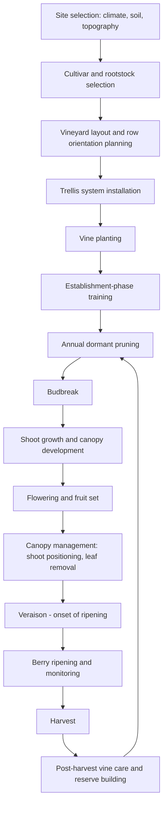

## Viticulture Fundamentals

### Overview

Viticulture is the science and practice of grapevine (*Vitis* spp.) cultivation, encompassing site selection, vine training, canopy management, and vineyard operations aimed at producing grapes for table consumption, raisins, or wine production. Grapevines are perennial, deciduous, climbing vines requiring structural training and long-term site and canopy management distinct from most other horticultural crops.

### Grapevine Biology and Species

**Major Species**

- ***Vitis vinifera***: the primary species used in wine and table grape production globally, valued for fruit quality but generally more susceptible to phylloxera and certain fungal diseases
- ***Vitis labrusca***: North American native species, used for juice grapes and some table grapes, generally more cold-hardy and disease-resistant
- ***Vitis riparia*** and other American species: primarily used as rootstock sources for phylloxera resistance

**Vine Structure**

- **Trunk**: permanent woody structure connecting root system to canopy
- **Cordons/arms**: permanent horizontal extensions from the trunk (in cordon-trained systems)
- **Spurs and canes**: one-year-old wood retained at pruning, bearing the current season's fruiting shoots
- **Shoots**: current-season vegetative growth arising from buds, bearing leaves, tendrils, and fruit clusters

### Site Selection (Terroir Considerations)

**Climate**

- Grapevines require a defined dormancy period (winter chilling) for temperate cultivation, though some tropical viticulture exists in double-cropping systems
- Growing degree days (GDD) and heat summation indices (e.g., Winkler regions in California, classifying climate zones by cumulative heat units) guide cultivar-climate matching
- Frost risk during budbreak and flowering is a critical site consideration, similar to other temperate perennial fruit crops

**Soil**

- Well-drained soils are essential; grapevines are highly sensitive to waterlogging
- Moderate to low fertility soils are often preferred for wine grape production, as excessive vigor can reduce fruit quality (though table grape production may tolerate higher fertility for larger berry/cluster size)
- Soil depth influences root system development and drought resilience

**Topography**

- Slope aspect affects solar radiation interception and air drainage (reducing frost pocket risk)
- Elevation influences temperature moderation in warm climates

### Diagram: Vineyard Establishment and Annual Cycle

### Rootstock Selection

**Purpose of Grafting**

Most commercial *Vitis vinifera* plantings are grafted onto resistant rootstocks primarily to manage phylloxera (a root-feeding insect pest that devastated European vineyards in the 19th century) and soil-borne pathogens such as nematodes.

**Rootstock Selection Criteria**

- Phylloxera resistance (derived from American *Vitis* species genetics)
- Nematode resistance
- Drought or waterlogging tolerance matched to site soil conditions
- Vigor conferred to the scion (some rootstocks are vigor-inducing, others vigor-limiting)
- Soil pH and lime tolerance (particularly relevant in calcareous soils)

### Trellis Systems and Training

**Common Training Systems**

- **Vertical Shoot Positioning (VSP)**: shoots trained upward between catch wires, creating a narrow, vertical fruiting wall; widely used in cool-climate and quality-focused wine production for good light exposure and airflow
- **Guyot system (single or double)**: cane-pruned system retaining one or two fruiting canes per vine, tied horizontally along a wire, common in many European wine regions
- **Cordon training (spur-pruned)**: permanent horizontal cordons with short spurs retained at pruning, common in warmer climates and mechanized systems
- **Sprawl/California sprawl**: minimal shoot positioning, shoots allowed to grow more freely; lower labor input but less controlled canopy microclimate
- **Geneva Double Curtain and other divided canopy systems**: used to increase canopy surface area and light exposure in vigorous vine situations

**Trellis Components**

- End posts and line posts providing structural support
- Wire systems: fruiting wire (supporting cordons/canes) and catch wires (supporting upward shoot positioning)

### Pruning

**Purpose**

- Regulates crop load and vine balance between vegetative growth and fruit production
- Maintains the chosen training system structure
- Renews fruiting wood for consistent yield and quality year to year

**Pruning Types**

- **Cane pruning**: retaining one or more long one-year-old canes (containing multiple buds) per vine, typical of Guyot-style systems
- **Spur pruning**: retaining short spurs (2–3 buds each) along a permanent cordon, typical of cordon-trained systems

**Bud Load Management**

The number of buds retained at pruning directly influences the following season's shoot number, cluster number, and ultimately yield and canopy density; bud load must be balanced against vine vigor and rootstock/site capacity to avoid overcropping or excessive vegetative growth.

### Canopy Management

**Objectives**

- Optimize sunlight exposure to fruiting zone (influences sugar accumulation, color development, and flavor compound synthesis in wine grapes)
- Improve airflow to reduce fungal disease pressure (particularly botrytis bunch rot and powdery mildew)
- Balance leaf area to fruit ratio for optimal ripening capacity

**Canopy Management Practices**

- **Shoot thinning**: removing excess shoots early in the season to reduce canopy density and improve light penetration
- **Shoot positioning**: training shoots into the trellis wire system to maintain canopy architecture
- **Leaf removal (leaf pulling)**: removing basal leaves around fruit clusters, typically post-fruit set, to improve cluster light exposure and airflow, though excessive leaf removal in hot climates risks sunburn damage to fruit
- **Hedging/topping**: trimming shoot tips to control excessive vegetative growth and canopy shading
- **Crop thinning (cluster thinning)**: removing excess fruit clusters to balance yield with vine capacity, particularly important for quality-focused wine grape production

### Vine Nutrient and Water Management

**Nutrient Considerations**

- Wine grape production generally favors moderate rather than maximal fertility, since excessive vigor (particularly nitrogen-driven) can reduce fruit quality and increase disease pressure through dense canopies
- Potassium influences berry ripening and juice/must composition
- Petiole or leaf blade tissue analysis at bloom or veraison is a standard diagnostic tool for vineyard nutrient status assessment

**Irrigation Management**

- **Regulated Deficit Irrigation (RDI)**: a widely used strategy in wine grape production, applying controlled water stress during specific growth stages (often post-fruit set) to moderate vegetative vigor and can influence berry composition; timing and severity are cultivar- and region-specific [Inference: precise RDI protocols require local viticultural research validation]
- Dryland (non-irrigated) viticulture remains standard in many traditional wine regions with sufficient natural rainfall distribution
- Drip irrigation is the predominant method where irrigation is used, allowing precise deficit management

### Grapevine Phenology

**Key Phenological Stages**

1. **Budbreak**: emergence of shoots from dormant buds in spring
2. **Flowering**: typically 6–8 weeks after budbreak; critical period for fruit set, sensitive to weather conditions (cold, rain, wind can reduce set)
3. **Fruit set**: berries begin development following successful pollination
4. **Veraison**: onset of ripening, marked by color change (in red cultivars) and softening; berries begin accumulating sugar and losing acidity
5. **Harvest maturity**: determined by sugar (Brix), acidity (titratable acidity), and pH targets specific to the intended product (wine style, table grape market)

### Illustration: Grapevine Annual Phenological Cycle (svg_diagram)

<svg xmlns="http://www.w3.org/2000/svg" viewBox="0 0 700 300">
<text x="350" y="25" text-anchor="middle" font-size="16" font-weight="bold" fill="#1a1a1a">Grapevine Annual Phenological Cycle (svg_diagram)</text>
<line x1="50" y1="150" x2="650" y2="150" stroke="#333" stroke-width="2" />
<circle cx="90" cy="150" r="8" fill="#8d6e63" />
<text x="90" y="180" text-anchor="middle" font-size="10">Dormancy</text>
<text x="90" y="195" text-anchor="middle" font-size="10">(pruning)</text>
<circle cx="210" cy="150" r="8" fill="#66bb6a" />
<text x="210" y="180" text-anchor="middle" font-size="10">Budbreak</text>
<circle cx="330" cy="150" r="8" fill="#43a047" />
<text x="330" y="120" text-anchor="middle" font-size="10">Shoot growth</text>
<circle cx="410" cy="150" r="8" fill="#fdd835" />
<text x="410" y="180" text-anchor="middle" font-size="10">Flowering /</text>
<text x="410" y="195" text-anchor="middle" font-size="10">fruit set</text>
<circle cx="490" cy="150" r="8" fill="#7e57c2" />
<text x="490" y="120" text-anchor="middle" font-size="10">Veraison</text>
<circle cx="580" cy="150" r="8" fill="#c62828" />
<text x="580" y="180" text-anchor="middle" font-size="10">Harvest</text>
<circle cx="630" cy="150" r="8" fill="#8d6e63" />
<text x="630" y="120" text-anchor="middle" font-size="10">Post-harvest /</text>
<text x="630" y="135" text-anchor="middle" font-size="10">reserve storage</text>
</svg>

### Pest and Disease Management

**Major Grapevine Pests**

- **Phylloxera**: root-feeding aphid-like insect, managed primarily through resistant rootstock use rather than chemical control
- **Grape berry moth and other Lepidoptera**: managed through IPM approaches including pheromone-based monitoring and mating disruption
- **Nematodes**: soil-borne, managed through resistant rootstocks and soil management

**Major Grapevine Diseases**

- **Powdery mildew** (*Erysiphe necator*): fungal disease favored by warm, dry conditions with high humidity; major concern in most viticultural regions, requiring regular fungicide programs or resistant cultivar use
- **Downy mildew** (*Plasmopara viticola*): fungal disease favored by wet, humid conditions
- **Botrytis bunch rot** (*Botrytis cinerea*): affects ripening clusters, particularly problematic in tight-clustered cultivars and humid harvest conditions; canopy management (leaf removal for airflow) is a key cultural control
- **Trunk diseases** (e.g., Eutypa dieback, Botryosphaeria canker): fungal pathogens infecting pruning wounds, causing long-term vine decline; managed through pruning wound protection and sanitation

### Harvest Decisions

**Maturity Assessment**

- **Brix (sugar content)**: measured via refractometer, correlating with potential alcohol in wine production
- **Titratable acidity (TA)** and **pH**: balance with sugar content to determine harvest timing for desired wine style or table grape eating quality
- **Phenolic/tannin maturity**: particularly relevant for red wine grape production, assessed through seed and skin tannin evaluation alongside sugar/acid parameters
- **Flavor/aromatic compound development**: sensory evaluation increasingly used alongside chemical analysis, especially in premium wine grape production

**Harvest Methods**

- **Hand harvesting**: allows selective picking, cluster sorting, and is generally preferred for premium wine and fresh table grape production
- **Mechanical harvesting**: shaker-based systems used for efficiency in larger-scale or bulk wine grape production, though can introduce more material other than grapes (MOG) and requires cultivars/training systems compatible with mechanical removal

### Practical Example: Establishing a Cool-Climate Wine Vineyard

**Scenario**: A grower is establishing a new vineyard in a cool-climate region targeting quality white wine production.

1. **Site assessment**: Select a site with good air drainage on a gentle slope to reduce spring frost risk during budbreak, with well-drained, moderate-fertility soil to avoid excessive vine vigor.
2. **Cultivar and rootstock selection**: Choose a cultivar suited to the region's heat summation (GDD) and select a rootstock providing phylloxera resistance appropriate to local soil type and pest pressure.
3. **Training system**: Adopt Vertical Shoot Positioning (VSP) to maximize light exposure and airflow in a cool, potentially humid climate, reducing fungal disease pressure while supporting even ripening.
4. **Row orientation**: Orient rows to optimize sunlight exposure and airflow given the specific site's aspect and prevailing wind patterns.
5. **Canopy management program**: Implement shoot thinning and post-fruit-set leaf removal around the fruiting zone to improve light exposure and reduce botrytis risk, particularly important given cool-climate humidity concerns.
6. **Crop load management**: Apply cluster thinning if needed to ensure the vine's leaf area can adequately ripen the retained crop within the region's shorter growing season.

**Key Points**

- Cool-climate viticulture prioritizes canopy management practices that maximize light exposure and airflow to compensate for lower ambient heat and higher disease pressure risk.
- Site selection for frost avoidance is especially critical in marginal or cool-climate growing regions.
- Bud load and crop load decisions must account for the region's heat accumulation capacity to ensure full ripening within the growing season.

### Conclusion

Viticulture integrates site-specific climatic and soil assessment, rootstock and cultivar matching, and season-long canopy and crop load management to balance vine vigor against fruit quality objectives. Unlike many horticultural crops where maximizing vegetative growth benefits yield, quality-focused viticulture, particularly for wine grapes, frequently requires deliberately moderating vine vigor and canopy density to achieve optimal fruit composition, making canopy management and site selection central pillars of the discipline.

**Related Topics**

- Wine chemistry and fermentation science
- Table grape versus wine grape production systems
- Phylloxera history and rootstock breeding
- Trellis system design and vineyard mechanization
- Regulated Deficit Irrigation (RDI) protocols
- Grapevine trunk disease management
- Terroir concept and regional appellation systems
- Precision viticulture (remote sensing, canopy vigor mapping)
- Raisin production systems
- Sustainable and organic viticulture practices