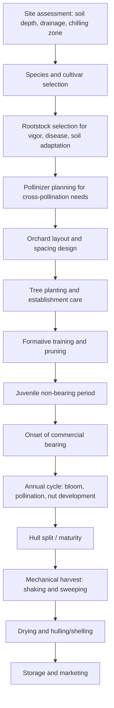

## Nut Crop Production

### Overview

Nut crop production involves the cultivation of perennial trees producing edible, typically hard-shelled seeds valued for their oil content, protein, and shelf-stability. Nut crops share many management principles with other tree fruit and orchard systems (long establishment periods, rootstock-scion relationships, perennial canopy management) while presenting distinct characteristics related to pollination biology, harvest mechanization, and postharvest drying/curing requirements.

### Classification of Major Nut Crops

**True Botanical Nuts**

Nuts in the strict botanical sense, where the edible portion is a hard-shelled fruit that does not split open to release the seed:

- Chestnut (*Castanea* spp.)
- Hazelnut/filbert (*Corylus* spp.)

**Drupes (Nuts in Common Usage)**

Botanically classified as drupes, where the "nut" is the pit/seed enclosed within a fleshy or fibrous outer hull that is typically removed before marketing:

- Almond (*Prunus dulcis*)
- Walnut (*Juglans regia* — English/Persian walnut; *Juglans nigra* — black walnut)
- Pecan (*Carya illinoinensis*)
- Pistachio (*Pistacia vera*) — technically a drupe with a hard endocarp shell
- Macadamia (*Macadamia integrifolia*, *M. tetraphylla*)
- Cashew (*Anacardium occidentale*) — nut develops externally on the cashew apple

**Climatic Adaptation Groups**

- **Temperate nuts**: require winter chilling for dormancy break (almond, walnut, pecan, hazelnut, chestnut, pistachio)
- **Subtropical/tropical nuts**: minimal or no chilling requirement, frost-sensitive (macadamia, cashew)

### Site Selection and Establishment

**Soil Requirements**

- Deep, well-drained soils are critical, as most nut trees develop extensive root systems and are highly sensitive to waterlogging and root asphyxiation
- Pecan and walnut in particular require deep soil profiles (often 1.5–2+ m) to support their large mature size and root system
- Pistachio and some almond rootstocks show relatively better tolerance to saline or boron-affected soils compared to other tree fruit species [Inference: relative tolerance rankings depend on specific rootstock and cultivar combinations]

**Climatic Requirements**

- Chilling hour accumulation must match cultivar dormancy requirements for temperate species
- Frost risk during bloom is a major site consideration, particularly critical for almond (which blooms very early in temperate regions) and pistachio
- Heat accumulation during the growing season affects nut fill and kernel development, particularly relevant for pistachio and pecan

### Diagram: Nut Orchard Establishment and Production Cycle

### Rootstock Selection

**Purpose**

As with other tree fruit crops, rootstocks in nut production influence vigor, disease resistance, soil adaptability, and in some cases graft compatibility issues specific to certain species combinations.

**Examples**

- **Almond**: often grown on peach, almond, or peach-almond hybrid rootstocks depending on soil type (peach rootstocks favor lighter, well-drained soils; almond seedling rootstocks favor calcareous or drier soils)
- **Pistachio**: commonly grafted onto *Pistacia* species rootstocks (e.g., UCB-1 hybrid) selected for vigor, disease resistance (notably Verticillium wilt tolerance), and soil adaptability
- **Pecan**: typically grown on seedling pecan rootstocks, given the species' large size and the practical challenges of dwarfing rootstock development
- **Walnut**: commonly grafted onto *Juglans* rootstocks (e.g., Paradox hybrid rootstocks in some regions) selected for vigor and disease/nematode resistance

### Pollination Requirements

Pollination biology is a particularly critical factor in nut crop orchard design, more so than in many other tree fruit systems, due to widespread self-incompatibility or the need for distinct male/female flowering synchronization.

**Almond**

Predominantly self-incompatible (with exceptions in some newer self-fertile cultivars), requiring interplanting of compatible pollinizer cultivars and reliance on insect pollination (typically managed honeybee colonies), with bloom timing synchronization between main cultivar and pollinizer critical for adequate cross-pollination.

**Pistachio**

Dioecious species (separate male and female trees); orchard design must include a sufficient ratio of male pollinizer trees (typically around 1 male to 8–10 female trees, though ratios vary by cultivar and orchard design) with synchronized bloom timing; pollination is primarily wind-mediated rather than insect-mediated.

**Walnut**

Monoecious with often poor timing overlap between male flower (catkin) and female flower receptivity within the same cultivar (dichogamy), necessitating pollinizer cultivar selection to ensure adequate cross-pollination timing; pollination is wind-mediated.

**Pecan**

Also monoecious with pronounced dichogamy, classified into "Type I" (protandrous, male flowers shed pollen before female flowers are receptive) and "Type II" (protogynous, female flowers receptive before male pollen shed) cultivars, requiring complementary cultivar pairing for effective cross-pollination; wind-mediated.

**Hazelnut**

Wind-pollinated with distinct male catkins and female flowers, often blooming in winter; most cultivars are self-incompatible, requiring compatible pollinizer selection.

### Orchard Design and Spacing

Nut trees, particularly walnut, pecan, and macadamia, tend to develop very large mature canopies, requiring wide spacing (often 8–12+ m between trees in mature standard orchard designs) compared to typical tree fruit spacing. Some modern high-density almond and pistachio systems use narrower spacing with planned tree removal (temporary "filler" trees) as canopies mature and require more space, though this approach requires careful long-term planning. [Inference: filler tree removal timing is orchard- and vigor-specific and requires ongoing canopy monitoring]

### Nutrient Management

**General Considerations**

- Nut trees generally show high demand for potassium during nut fill, given the role of potassium in photosynthate transport to developing kernels
- Nitrogen management balances vegetative growth with reproductive/nut-fill demand; timing relative to phenological stage (post-bloom, nut fill, post-harvest) is important for both current-year yield and next season's flower bud development
- Boron and zinc deficiencies are documented concerns in several nut species affecting pollen viability and shoot growth respectively
- Leaf tissue analysis remains the standard diagnostic approach for assessing orchard nutrient status in mature nut orchards, similar to other tree fruit crops

### Irrigation Management

**Water Demand**

Nut crops, particularly almond and pistachio grown in Mediterranean-type climates, have substantial seasonal water requirements concentrated during the growing season, with critical sensitivity periods including nut fill/kernel development stages.

**Irrigation Methods**

- Micro-sprinkler and drip irrigation are standard in modern intensive nut orchard systems, allowing precise water and fertigation management
- Flood/furrow irrigation remains in use in some traditional or water-abundant production regions but is less water-use-efficient

**Deficit Irrigation Strategies**

Regulated deficit irrigation applied during specific non-critical growth stages is used in some nut crop systems (notably pistachio and almond) to manage water resources, though timing must avoid critical kernel-fill periods to prevent significant yield or quality loss. [Inference: specific deficit irrigation protocols are cultivar- and region-dependent]

### Pest and Disease Management

**Key Pest Categories**

- **Navel orangeworm** (a major pest in almond and pistachio production in some regions): larvae damage nuts directly and vector fungal contamination; managed through sanitation (removal of mummy nuts), mating disruption, and timed insecticide applications
- **Codling moth**: significant pest in walnut production
- **Aphids and mites**: common across most nut species, managed through IPM approaches including biological control conservation

**Key Disease Categories**

- **Aflatoxin-producing fungi** (*Aspergillus* spp.): a significant food safety concern in several nut crops (particularly almond, pistachio, and peanut in some contexts), requiring integrated management of insect damage (which creates fungal entry points), proper drying, and storage moisture control
- **Botryosphaeria and other canker diseases**: affect wood health and yield in various nut species
- **Verticillium wilt**: significant concern in pistachio, managed partly through resistant rootstock selection
- **Walnut blight** (bacterial): affects developing nuts and shoots in walnut production

### Harvest Methods

**Mechanical Shake-and-Sweep Harvesting**

The dominant harvest method for most commercial nut crops (almond, walnut, pistachio, pecan), involving:

1. Mechanical trunk or limb shakers dislodging mature nuts from the tree
2. Nuts falling to the orchard floor (often onto a prepared, firm, weed-free surface)
3. Mechanical sweeping into windrows
4. Mechanical pickup and transport to processing facilities

**Maturity Indicators**

- **Hull split**: in almond and pistachio, the outer hull splits open at maturity, signaling harvest readiness
- **Shuck split**: in pecan, the outer shuck splits to reveal the shell at maturity
- Timing is critical, as delayed harvest after hull/shuck split increases exposure to pest damage, fungal contamination, and weather-related quality loss

### Illustration: Nut Crop Pollination Systems Comparison (svg_diagram)

<svg xmlns="http://www.w3.org/2000/svg" viewBox="0 0 700 320">
<text x="350" y="25" text-anchor="middle" font-size="16" font-weight="bold" fill="#1a1a1a">Nut Crop Pollination Systems Comparison (svg_diagram)</text>
<rect x="30" y="60" width="150" height="90" rx="8" fill="#fff3e0" stroke="#ef6c00" />
<text x="105" y="85" text-anchor="middle" font-size="12" font-weight="bold">Almond</text>
<text x="105" y="105" text-anchor="middle" font-size="10">Self-incompatible</text>
<text x="105" y="120" text-anchor="middle" font-size="10">Insect-pollinated</text>
<text x="105" y="135" text-anchor="middle" font-size="10">Needs pollinizer cultivar</text>
<rect x="200" y="60" width="150" height="90" rx="8" fill="#e1f5fe" stroke="#0277bd" />
<text x="275" y="85" text-anchor="middle" font-size="12" font-weight="bold">Pistachio</text>
<text x="275" y="105" text-anchor="middle" font-size="10">Dioecious</text>
<text x="275" y="120" text-anchor="middle" font-size="10">Wind-pollinated</text>
<text x="275" y="135" text-anchor="middle" font-size="10">~1 male : 8-10 female</text>
<rect x="370" y="60" width="150" height="90" rx="8" fill="#f1f8e9" stroke="#558b2f" />
<text x="445" y="85" text-anchor="middle" font-size="12" font-weight="bold">Walnut</text>
<text x="445" y="105" text-anchor="middle" font-size="10">Monoecious, dichogamous</text>
<text x="445" y="120" text-anchor="middle" font-size="10">Wind-pollinated</text>
<text x="445" y="135" text-anchor="middle" font-size="10">Needs timing-matched pollinizer</text>
<rect x="540" y="60" width="150" height="90" rx="8" fill="#fce4ec" stroke="#ad1457" />
<text x="615" y="85" text-anchor="middle" font-size="12" font-weight="bold">Pecan</text>
<text x="615" y="105" text-anchor="middle" font-size="10">Monoecious, dichogamous</text>
<text x="615" y="120" text-anchor="middle" font-size="10">Wind-pollinated</text>
<text x="615" y="135" text-anchor="middle" font-size="10">Type I / Type II pairing</text>

<text x="350" y="200" text-anchor="middle" font-size="11" fill="#555">Pollination strategy design is a primary orchard planning consideration for nut crops</text>

</svg>

### Postharvest Handling

**Drying**

Critical postharvest step to reduce moisture content to safe storage levels (typically below 6–8% moisture depending on species) and prevent mold development and aflatoxin risk. Methods include:

- Field drying on the orchard floor (weather-dependent, risk of quality loss from rain exposure)
- Forced-air mechanical drying in dedicated drying facilities, offering more control and reduced weather risk

**Hulling and Shelling**

- Hulling: removal of the outer hull/husk (almond, pistachio) or shuck (pecan)
- Shelling: removal of the hard shell to access the kernel, performed either immediately post-harvest or later depending on storage and market strategy (in-shell vs. shelled product markets)

**Storage**

- Low-moisture, cool, and low-humidity storage conditions are essential to prevent rancidity (from oil oxidation, given the high oil content of most nuts) and fungal contamination
- Controlled atmosphere or refrigerated storage may be used for extended storage periods, particularly for high-value or long-term inventory

### Practical Example: Establishing an Almond Orchard with Pollinizer Planning

**Scenario**: A grower is establishing a new almond orchard and must design for adequate cross-pollination.

1. **Cultivar selection**: Choose a primary commercial cultivar based on market demand, then identify compatible pollinizer cultivars with overlapping bloom timing and demonstrated cross-compatibility.
2. **Orchard layout**: Design planting rows to interplant pollinizer cultivars at a ratio ensuring adequate pollen availability within bee foraging range of every tree (commonly alternating rows or blocks depending on orchard design conventions).
3. **Pollinator management**: Plan for managed honeybee hive placement during bloom, at stocking densities appropriate to orchard size and bloom density, since almond pollination is heavily insect-dependent.
4. **Frost risk mitigation**: Given almond's early bloom timing in temperate regions, select a site with good air drainage and consider frost protection measures (wind machines, irrigation-based methods) for the vulnerable bloom period.
5. **Rootstock matching**: Select rootstock appropriate to soil type (e.g., peach rootstock for well-drained sandy soils, or peach-almond hybrid for a broader adaptability range).

**Key Points**

- Pollinizer planning is a foundational orchard design decision in almond production, not an afterthought, since incompatible or poorly timed pollinizer selection can substantially reduce yield potential regardless of other management inputs.
- Early bloom timing makes almond orchard site selection particularly sensitive to frost risk considerations.
- Rootstock-soil matching affects long-term orchard vigor, longevity, and susceptibility to soil-borne stresses.

### Food Safety and Quality Considerations

Nut crops face specific food safety management requirements distinct from many other horticultural products, primarily due to:

- **Aflatoxin risk**: requiring integrated management across field (insect damage reduction), harvest (timely collection), and postharvest (rapid drying, moisture control) stages
- **Rancidity risk**: driven by the high lipid content of most nuts, requiring appropriate storage temperature and humidity control to preserve shelf life and quality
- **Allergen management**: tree nuts are among the major recognized food allergens, requiring careful supply chain segregation and labeling practices in processing and packaging operations

### Conclusion

Nut crop production combines core perennial orchard management principles with distinct challenges in pollination system design, mechanized harvest logistics, and postharvest drying/storage requirements driven by food safety and product stability concerns. Successful nut orchard management requires early and careful planning around pollination biology, given that many nut species exhibit self-incompatibility, dioecy, or dichogamy that mandate deliberate orchard design rather than single-cultivar planting.

**Related Topics**

- Pollination biology and managed pollinator services
- Mechanical harvest technology for tree crops
- Aflatoxin risk management and food safety protocols in nut processing
- Rootstock breeding for nut crop disease resistance
- Postharvest drying and controlled storage systems
- Orchard floor management for mechanical harvest systems
- Nut crop nutrient management and tissue testing
- Global nut crop markets and processing standards
- Integrated Pest Management in nut orchards
- Climate adaptation and chilling requirement research in nut crops